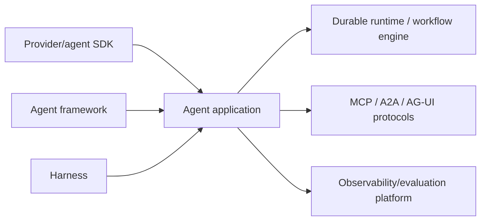

# Technology Index

**Ecosystem check:** 2026-08-31  
**Important:** An entry means the technology is relevant enough to research, not that this repository recommends it.

## Agent SDKs, frameworks, and harnesses

| Technology | Actual category | Current primary source | Research state |
|---|---|---|---|
| OpenAI Agents SDK | Agent SDK and runner for Python/TypeScript | [Official developer docs](https://developers.openai.com/api/docs/guides/agents-sdk/) | [Research-backed production guide](../frameworks/openai-agents-sdk.md); verify exact language release |
| Claude Agent SDK | General agent harness derived from Claude Code infrastructure | [Official Agent SDK docs](https://code.claude.com/docs/en/agent-sdk/overview) | [Research-backed production guide](../frameworks/claude-agent-sdk-and-managed-agents.md); subprocess/session semantics version-specific |
| Claude Managed Agents | Provider-managed stateful harness and sandbox runtime | [Official overview](https://platform.claude.com/docs/en/managed-agents/overview) | [Research-backed boundary guide](../frameworks/claude-agent-sdk-and-managed-agents.md); beta and retention-sensitive |
| Google Agent Development Kit (ADK) | Multi-language agent framework and orchestration toolkit | [ADK docs](https://adk.dev/) | [Research-backed production guide](../frameworks/google-adk.md); pin language and workflow version |
| LangChain agents | Higher-level agent framework | [LangChain docs](https://docs.langchain.com/oss/python/langchain/agents) | [Research-backed shared production guide](../frameworks/langchain-langgraph-and-deep-agents.md); built on LangGraph |
| LangGraph | Low-level stateful orchestration runtime | [LangGraph overview](https://docs.langchain.com/oss/python/langgraph/overview) | [Research-backed shared production guide](../frameworks/langchain-langgraph-and-deep-agents.md); replay and deployment mode are version-specific |
| Deep Agents | Agent harness on LangChain/LangGraph | [Deep Agents overview](https://docs.langchain.com/oss/python/deepagents/overview) | [Research-backed shared production guide](../frameworks/langchain-langgraph-and-deep-agents.md); require backend/sandbox enforcement |
| Microsoft Agent Framework | Successor framework combining AutoGen and Semantic Kernel directions | [Agent Framework docs](https://learn.microsoft.com/en-us/agent-framework/) | [Research-backed production guide](../frameworks/microsoft-agent-framework.md); package maturity varies |
| AutoGen | Maintenance-mode predecessor multi-agent framework | [Official repository](https://github.com/microsoft/autogen) | [Research-backed migration guide](../frameworks/autogen-and-semantic-kernel-migration.md); new users directed to MAF |
| Semantic Kernel agents | Predecessor/provider agent abstractions within Semantic Kernel | [Current migration guide](https://learn.microsoft.com/en-us/agent-framework/migration-guide/from-semantic-kernel/) | [Research-backed migration guide](../frameworks/autogen-and-semantic-kernel-migration.md); retain non-agent assets selectively |
| CrewAI | Python role/task Crews plus event-driven Flows | [CrewAI docs](https://docs.crewai.com/) | [Research-backed production guide](../frameworks/crewai.md); conversational surface experimental |
| Pydantic AI | Typed Python agent framework with validation and durable integrations | [Pydantic AI docs](https://ai.pydantic.dev/) | [Research-backed production guide](../frameworks/pydantic-ai.md); pin fixed V2/adapters and test durable integration |
| LlamaIndex agents/workflows | Data-centric agent and event-driven workflow framework | [LlamaIndex docs](https://developers.llamaindex.ai/) | [Research-backed shared production guide](../frameworks/llamaindex-and-llamaagents.md) |
| LlamaAgents | Workflow server/client, deployment, and pluggable durability stack | [Official repository](https://github.com/run-llama/llama-agents) | [Research-backed shared production guide](../frameworks/llamaindex-and-llamaagents.md); new deployment stack |
| LlamaDeploy | Deprecated predecessor deployment project | [Official repository](https://github.com/run-llama/llama_deploy) | Deprecated; migrate to LlamaAgents |
| Vercel AI SDK | TypeScript multi-provider AI SDK with agent-loop primitives | [AI SDK agent docs](https://ai-sdk.dev/docs/agents) | [Research-backed production guide](../frameworks/vercel-ai-sdk.md); WorkflowAgent beta at snapshot |
| Mastra | TypeScript agent/workflow/server platform | [Mastra docs](https://mastra.ai/docs) | [Research-backed production guide](../frameworks/mastra.md); engine/network maturity varies |
| Strands Agents | Python/TypeScript model-driven agent SDK with hooks/plugins | [Strands docs](https://strandsagents.com/docs/) | [Research-backed production guide](../frameworks/strands-agents.md); verify language/multi-agent parity |
| DeepSeek Harness | Plugin-oriented workspace-agent harness on Cordis | [Official developer preview](https://www.deepseek.com/harness/en/) | [Research-backed preview/safety guide](../frameworks/deepseek-harness.md); not production-ready per official statement |

## Runtime and durable execution systems

| Technology | Category | Primary source | Research state |
|---|---|---|---|
| Temporal | Event-history durable workflow engine/platform | [Temporal docs](https://docs.temporal.io/) | [Research-backed agent workflow guide](../frameworks/temporal-for-agent-workflows.md) |
| Restate | Journaled durable services, objects, and workflows | [Restate docs](https://docs.restate.dev/) | [Research-backed agent workflow guide](../frameworks/restate-for-agent-workflows.md) |
| DBOS | Library-oriented Postgres-backed durable workflows and queues | [DBOS docs](https://docs.dbos.dev/) | [Research-backed agent workflow guide](../frameworks/dbos-for-agent-workflows.md) |
| Prefect | Python flow/task orchestration platform | [Prefect docs](https://docs.prefect.io/) | [Research-backed agent workflow guide](../frameworks/prefect-for-agent-workflows.md) |
| Dapr Workflow | Actor/state-store-backed distributed workflow runtime | [Dapr docs](https://docs.dapr.io/developing-applications/building-blocks/workflow/) | [Research-backed agent workflow guide](../frameworks/dapr-workflow-for-agent-workflows.md) |
| LangGraph persistence/runtime | Agent-specific checkpoint and graph runtime | [Persistence docs](https://docs.langchain.com/oss/python/langgraph/persistence) | Core semantics sampled |

## Production infrastructure and service mechanisms

| Technology or mechanism | Category | Primary source | Research state |
|---|---|---|---|
| Kubernetes HPA | Workload autoscaling controller | [HPA documentation](https://kubernetes.io/docs/concepts/workloads/autoscaling/horizontal-pod-autoscale/) | Research-backed operational guidance; queue/custom metric policy remains workload-specific |
| OpenAI Batch and Flex | Provider asynchronous/lower-priority capacity classes | [Batch](https://developers.openai.com/api/docs/guides/batch), [Flex](https://developers.openai.com/api/docs/guides/flex-processing) | Current mechanics sampled; pricing/model support is volatile |
| Anthropic Message Batches and service tiers | Provider asynchronous and differentiated capacity classes | [Batch](https://platform.claude.com/docs/en/build-with-claude/batch-processing), [service tiers](https://platform.claude.com/docs/en/api/service-tiers) | Current mechanics sampled; pricing/availability is volatile |
| Google Vertex AI provisioned throughput | Reserved model-serving capacity | [Throughput quota](https://docs.cloud.google.com/vertex-ai/generative-ai/docs/resources/throughput-quota) | Capacity semantics sampled; region/model behavior is volatile |
| RouteLLM | Research/open-source weak-to-strong model router | [Repository](https://github.com/lm-sys/RouteLLM), [ICLR paper](https://proceedings.iclr.cc/paper_files/paper/2025/file/5503a7c69d48a2f86fc00b3dc09de686-Paper-Conference.pdf) | Research evidence only; requires local labels, drift controls, and route evals |
| Official MCP Registry | Public MCP server/package metadata registry | [Registry overview](https://modelcontextprotocol.io/registry/about) | Preview; metadata source, not a security certification or direct host dependency |
| Anthropic Tool Search | Provider-hosted deferred tool discovery | [Official docs](https://platform.claude.com/docs/en/agents-and-tools/tool-use/tool-search-tool) | Mechanics sampled; numeric scale/token claims are vendor/workload-specific |
| OpenAI deferred/BYOT tool search | Provider-hosted or application-provided deferred tool discovery | [Current official model guidance](https://developers.openai.com/api/docs/guides/latest-model) | Current product surface; pin supported model/API and recheck frequently |

## Protocols and interface standards

| Technology | Boundary | Primary source | Research state |
|---|---|---|---|
| MCP | Agent/model application to tools and data | [Specification](https://modelcontextprotocol.io/specification/) | Research-backed guide; baseline 2026-07-28 |
| A2A | Independent remote agent to agent | [Specification 1.0.0](https://github.com/a2aproject/A2A/blob/main/docs/specification.md) | Research-backed guide; baseline 1.0.0 |
| AG-UI | Agent backend to user-facing application | [Specification/docs](https://docs.ag-ui.com/) | Research-backed architecture/security guide; pin capability profile |
| OpenTelemetry GenAI conventions | Telemetry vocabulary | [GenAI semantic conventions](https://github.com/open-telemetry/semantic-conventions-genai) | Agent spans researched; conventions remain Development, so use an application-owned schema |

## Category warning

These layers can coexist. Comparing MCP directly with LangGraph, or an Agents SDK directly with Temporal, answers the wrong question.
