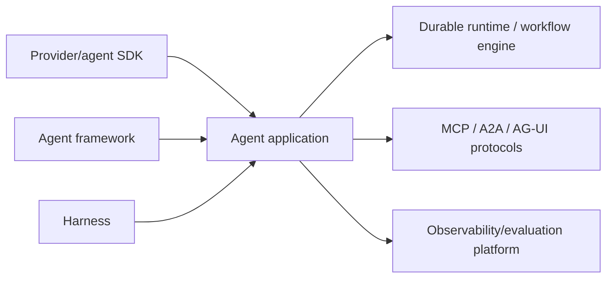

# Technology Index

**Ecosystem check:** 2026-08-31  
**Important:** An entry means the technology is relevant enough to research, not that this repository recommends it.

## Agent SDKs, frameworks, and harnesses

| Technology | Actual category | Current primary source | Research state |
|---|---|---|---|
| OpenAI Agents SDK | Agent SDK and runner for Python/TypeScript | [Official developer docs](https://developers.openai.com/api/docs/guides/agents-sdk/) | [Deep production playbook](../frameworks/openai-agents-sdk/README.md) plus [ecosystem overview](../frameworks/openai-agents-sdk.md); verify exact language release and parity |
| Claude Agent SDK | General agent harness derived from Claude Code infrastructure | [Official Agent SDK docs](https://code.claude.com/docs/en/agent-sdk/overview) | [Deep ecosystem guide](../frameworks/claude-agent-sdk/README.md) plus [overview](../frameworks/claude-agent-sdk-and-managed-agents.md); subprocess/session semantics are version-specific |
| Claude Managed Agents | Provider-managed stateful harness and sandbox runtime | [Official overview](https://platform.claude.com/docs/en/managed-agents/overview) | [Deep managed-boundary guidance](../frameworks/claude-agent-sdk/managed-agents-boundary-and-operations.md); beta, sandbox, event, and retention contracts are version-sensitive |
| Google Agent Development Kit (ADK) | Multi-language agent framework and orchestration toolkit | [ADK docs](https://adk.dev/) | [Deep production playbook](../frameworks/google-adk/README.md) plus [ecosystem overview](../frameworks/google-adk.md); pin language, major line, session service, and deployment surface |
| LangChain agents | Higher-level agent framework | [LangChain docs](https://docs.langchain.com/oss/python/langchain/agents) | [Research-backed shared production guide](../frameworks/langchain-langgraph-and-deep-agents.md); built on LangGraph |
| LangGraph | Low-level stateful orchestration runtime | [LangGraph overview](https://docs.langchain.com/oss/python/langgraph/overview) | [Deep production playbook](../frameworks/langgraph/README.md) plus [ecosystem overview](../frameworks/langchain-langgraph-and-deep-agents.md); replay and deployment mode are version-specific |
| Deep Agents | Agent harness on LangChain/LangGraph | [Deep Agents overview](https://docs.langchain.com/oss/python/deepagents/overview) | [Research-backed shared production guide](../frameworks/langchain-langgraph-and-deep-agents.md); require backend/sandbox enforcement |
| Microsoft Agent Framework | Successor framework combining AutoGen and Semantic Kernel directions | [Agent Framework docs](https://learn.microsoft.com/en-us/agent-framework/) and [official Python/.NET repository](https://github.com/microsoft/agent-framework) | [Deep production playbook](../frameworks/microsoft-agent-framework/README.md) plus [ecosystem overview](../frameworks/microsoft-agent-framework.md); Python `1.16.x`, .NET `1.19.x`, and separate Go public preview have package/feature-specific maturity |
| AutoGen | Maintenance-mode predecessor multi-agent framework | [Official repository](https://github.com/microsoft/autogen) | [Retained-production engineering guide](../frameworks/autogen/README.md) plus [migration guide](../frameworks/autogen-and-semantic-kernel-migration.md); new users are directed to MAF |
| Semantic Kernel | Retained kernel, connector, plugin, filter, data, and transitional agent/process ecosystem | [Official repository and lifecycle notice](https://github.com/microsoft/semantic-kernel) | [Deep retained-ecosystem guide](../frameworks/semantic-kernel/README.md) plus [MAF migration guide](../frameworks/autogen-and-semantic-kernel-migration.md); core assets remain useful while agent/process maturity and .NET/Python/Java parity vary |
| CrewAI | Python role/task Crews plus event-driven Flows | [CrewAI `1.15.18` source and versioned docs](https://github.com/crewAIInc/crewAI/tree/1.15.18) | [Deep production engineering playbook](../frameworks/crewai/README.md) plus [ecosystem overview](../frameworks/crewai.md); conversational Flows are stable at `1.15.18`, while durability/effect guarantees remain application-owned |
| Pydantic AI | Typed Python agent framework with validation and durable integrations | [Pydantic AI docs](https://ai.pydantic.dev/) | [Deep production playbook](../frameworks/pydantic-ai/README.md) plus [ecosystem overview](../frameworks/pydantic-ai.md); pin fixed V2/adapters and test durable integration |
| LlamaIndex agents/workflows | Data-centric agent and event-driven workflow framework | [LlamaIndex docs](https://developers.llamaindex.ai/) and [source snapshot](https://github.com/run-llama/llama_index/tree/f87a57b) | [Deep engineering guide](../frameworks/llamaindex-llamaagents/README.md) plus [ecosystem overview](../frameworks/llamaindex-and-llamaagents.md); pin the independently versioned core, workflows, and integrations |
| LlamaAgents | Workflow server/client, deployment, and pluggable durability stack | [Source snapshot](https://github.com/run-llama/llama-agents/tree/94f17c9) | [Deep server, client, executor, DBOS, deployment, and migration guidance](../frameworks/llamaindex-llamaagents/README.md); pre-1.0 surfaces and managed beta require a pinned compatibility profile |
| LlamaDeploy | Deprecated predecessor deployment project | [Official repository](https://github.com/run-llama/llama_deploy) | Deprecated; migrate to LlamaAgents |
| Vercel AI SDK | TypeScript multi-provider AI SDK with agent-loop primitives | [AI SDK agent docs](https://ai-sdk.dev/docs/agents) | [Deep engineering guide](../frameworks/vercel-ai-sdk/README.md) plus [ecosystem overview](../frameworks/vercel-ai-sdk.md); WorkflowAgent/Workflow maturity is version-specific |
| Mastra | TypeScript agent/workflow/server platform | [Mastra docs](https://mastra.ai/docs) and [pinned source snapshot](https://github.com/mastra-ai/mastra/tree/8c88706dc2dc4e4a01d78abe358b6c8cab14d2ad) | [Deep production engineering guide](../frameworks/mastra/README.md) plus [ecosystem overview](../frameworks/mastra.md); baseline `@mastra/core@1.63.2`, with feature/adapter maturity tracked separately |
| Strands Agents | Python/TypeScript model-driven agent SDK with hooks/plugins | [Strands docs](https://strandsagents.com/docs/) | [Deep production engineering guide](../frameworks/strands-agents/README.md) plus [ecosystem overview](../frameworks/strands-agents.md); verify language/multi-agent parity |
| DeepSeek Harness | Plugin-oriented workspace-agent harness on Cordis | [Official developer preview](https://www.deepseek.com/harness/en/) and [source snapshot](https://github.com/deepseek-ai/deepseek-harness/tree/0a53fb55bea101816fa226bb964ae2bed71c343b) | [Deep production-minded preview guide](../frameworks/deepseek-harness/README.md) plus [safety overview](../frameworks/deepseek-harness.md); `0.1.2-alpha.2`, not production-ready or security-audited per official notice |

## Runtime and durable execution systems

| Technology | Category | Primary source | Research state |
|---|---|---|---|
| Temporal | Event-history durable workflow engine/platform | [Temporal docs](https://docs.temporal.io/) | [Research-backed agent workflow guide](../frameworks/temporal-for-agent-workflows.md) |
| Restate | Journaled durable services, objects, and workflows | [Restate docs](https://docs.restate.dev/) | [Research-backed agent workflow guide](../frameworks/restate-for-agent-workflows.md) |
| DBOS | Library-oriented Postgres-backed durable workflows and queues | [DBOS docs](https://docs.dbos.dev/) | [Research-backed agent workflow guide](../frameworks/dbos-for-agent-workflows.md) |
| Prefect | Python flow/task orchestration platform | [Prefect docs](https://docs.prefect.io/) | [Research-backed agent workflow guide](../frameworks/prefect-for-agent-workflows.md) |
| Dapr Workflow | Actor/state-store-backed distributed workflow runtime | [Dapr docs](https://docs.dapr.io/developing-applications/building-blocks/workflow/) | [Research-backed agent workflow guide](../frameworks/dapr-workflow-for-agent-workflows.md) |
| LangGraph persistence/runtime | Agent-specific checkpoint and graph runtime | [Persistence docs](https://docs.langchain.com/oss/python/langgraph/persistence) | [Deep persistence, replay, effects, and Agent Server guidance](../frameworks/langgraph/README.md) |

## Runtime language profiles

| Technology | Production concern | Primary source | Research state |
|---|---|---|---|
| CPython 3.14 | `asyncio` ownership, cancellation, blocking/CPU isolation, runtime validation, workers, packaging, and telemetry | [Python 3.14.7](https://www.python.org/downloads/release/python-3147/) | [Deep production playbook](../languages/python/README.md) plus [overview](../languages/python-agent-runtimes.md); refresh at 3.15 GA or free-threading phase change |
| Go 1.27 | Goroutine/context ownership, bounded concurrency, HTTP/process lifecycle, JSON validation, effects/durable workers, container resources, profiling, testing, and module integrity | [Go 1.27 release notes](https://go.dev/doc/go1.27) | [Deep Go engineering playbook](../languages/go/README.md) plus [overview](../languages/go-agent-runtimes.md); refresh at Go 1.28 or a relevant runtime/SDK guarantee change |
| TypeScript 7.0 | Erased static types, runtime schemas, module/build contracts, provider adapters, packages, artifacts, and cross-target compatibility | [TypeScript 7.0 announcement](https://devblogs.microsoft.com/typescript/announcing-typescript-7-0/) | [Deep TypeScript engineering playbook](../languages/typescript/README.md) plus [Node.js runtime guide](../languages/typescript-node-agent-runtimes.md); pin the 7.0 CLI and any 6.0 compiler-API compatibility lane separately |
| Node.js 24 LTS | Event-loop and libuv ownership, abort propagation, Undici, workers/processes, streams, queues, memory, permission boundaries, diagnostics, and lifecycle | [Node.js release status](https://nodejs.org/en/about/previous-releases) | [Deep Node.js runtime playbook](../languages/nodejs/README.md) plus [overview](../languages/typescript-node-agent-runtimes.md); Node 26.8.1 is Current at snapshot |
| JDK 25 LTS | Virtual threads, preview structured concurrency, interruption, HTTP/streams, process isolation, memory/GC, JFR/JMX/OTel, and deployment | [Oracle Java 25 concurrency guide](https://docs.oracle.com/en/java/javase/25/core/concurrency.html) | [Deep JVM production playbook](../languages/jvm/README.md); structured concurrency remains preview and must not leak into a stable public contract without policy |
| Kotlin 2.3.20 / kotlinx.coroutines 1.11.0 | Coroutine ownership, cancellation, Flow/backpressure, Java bridges, serialization, tests, and JVM deployment | [Kotlin 2.3.20](https://kotlinlang.org/docs/whatsnew2320.html) and [coroutines releases](https://github.com/Kotlin/kotlinx.coroutines/releases) | [Deep JVM production playbook](../languages/jvm/README.md); pin and test the separately versioned compiler/plugin/library matrix |
| .NET 10 LTS / C# 14 | Task/scope ownership, cancellation, channels, HTTP pooling/resilience, process boundaries, strict JSON, effects, durable workers, resource admission, telemetry, NuGet, and deployment | [.NET support policy](https://dotnet.microsoft.com/en-us/platform/support/policy/dotnet-core) and [C# 14](https://learn.microsoft.com/en-us/dotnet/csharp/whats-new/csharp-14) | [Deep C#/.NET production playbook](../languages/csharp-dotnet/README.md); baseline patch 10.0.11, while SDK/framework feature maturity is tracked separately |
| Rust 1.98 / Tokio 1.53 | Owned task trees, cancellation safety, streaming/backpressure, schemas, durable and SDK maturity, process/Wasm isolation, resources, and supply chain | [Rust releases](https://blog.rust-lang.org/releases/latest/), [Tokio documentation](https://docs.rs/tokio/latest/tokio/) | [Deep research-backed production playbook](../languages/rust/README.md); verify preview/beta ecosystem surfaces separately |

## Production infrastructure and service mechanisms

| Technology or mechanism | Category | Primary source | Research state |
|---|---|---|---|
| Kubernetes HPA | Workload autoscaling controller | [HPA documentation](https://kubernetes.io/docs/concepts/workloads/autoscaling/horizontal-pod-autoscale/) | Research-backed operational guidance; queue/custom metric policy remains workload-specific |
| OpenAI Batch and Flex | Provider asynchronous/lower-priority capacity classes | [Batch](https://developers.openai.com/api/docs/guides/batch), [Flex](https://developers.openai.com/api/docs/guides/flex-processing) | Current mechanics sampled; pricing/model support is volatile |
| Anthropic Message Batches and service tiers | Provider asynchronous and differentiated capacity classes | [Batch](https://platform.claude.com/docs/en/build-with-claude/batch-processing), [service tiers](https://platform.claude.com/docs/en/api/service-tiers) | Current mechanics sampled; pricing/availability is volatile |
| Google Vertex AI provisioned throughput | Reserved model-serving capacity | [Throughput quota](https://docs.cloud.google.com/vertex-ai/generative-ai/docs/resources/throughput-quota) | Capacity semantics sampled; region/model behavior is volatile |
| RouteLLM | Research/open-source weak-to-strong model router | [Repository](https://github.com/lm-sys/RouteLLM), [ICLR paper](https://proceedings.iclr.cc/paper_files/paper/2025/file/5503a7c69d48a2f86fc00b3dc09de686-Paper-Conference.pdf) | Research evidence only; requires local labels, drift controls, and route evals |
| Official MCP Registry | Public MCP server/package metadata registry | [Registry overview](https://modelcontextprotocol.io/registry/about) | Preview; metadata source, not a security certification or direct host dependency |
| Anthropic Tool Search | Provider-hosted deferred tool discovery | [Official docs](https://platform.claude.com/docs/en/agents-and-tools/tool-use/tool-search-tool) | Mechanics sampled; numeric scale/token claims are vendor/workload-specific |
| OpenAI deferred/BYOT tool search | Provider-hosted or application-provided deferred tool discovery | [Current official model guidance](https://developers.openai.com/api/docs/guides/latest-model) | Current product surface; pin supported model/API and recheck frequently |

## Protocols and interface standards

| Technology | Boundary | Primary source | Research state |
|---|---|---|---|
| MCP | Agent/model application to tools and data | [Specification](https://modelcontextprotocol.io/specification/) | Research-backed guide; baseline 2026-07-28 |
| A2A | Independent remote agent to agent | [Specification 1.0.0](https://github.com/a2aproject/A2A/blob/main/docs/specification.md) | Research-backed guide; baseline 1.0.0 |
| AG-UI | Agent backend to user-facing application | [Specification/docs](https://docs.ag-ui.com/) | Research-backed architecture/security guide; pin capability profile |
| OpenTelemetry GenAI conventions | Telemetry vocabulary | [GenAI semantic conventions](https://github.com/open-telemetry/semantic-conventions-genai) | Agent spans researched; conventions remain Development, so use an application-owned schema |

## Category warning

These layers can coexist. Comparing MCP directly with LangGraph, or an Agents SDK directly with Temporal, answers the wrong question.
