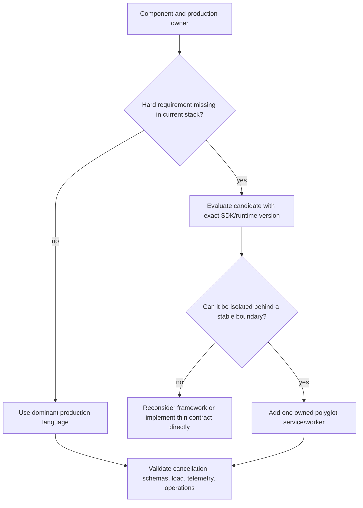
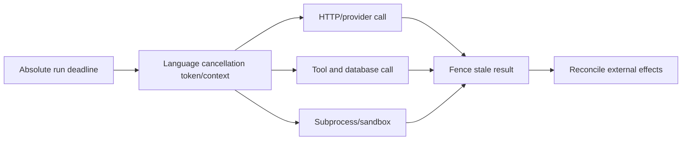

# Choosing an Agent Runtime Language

> **Status:** Research-backed decision guide  
> **Last researched:** 2026-08-30  
> **Scope:** Selecting languages for agent APIs, controllers, gateways, workers, tools, sandboxes, and evaluation systems.  
> **Evidence:** [Runtime language selection research packet](../research/packets/runtime-language-selection.md)  
> **Section index:** [Language and runtime guides](README.md)

Default to the language your production team already operates unless a required SDK, workflow, native dependency, isolation boundary, or measured workload property justifies a split. Agent quality rarely improves because orchestration syntax changed; reliability can decline sharply when cancellation and on-call ownership become unfamiliar.

## Start from the component

Different components can legitimately choose differently:

| Component | Dominant criteria |
|---|---|
| Interactive API/event stream | existing web stack, stream/backpressure support, first-progress latency, connection observability |
| Run controller/workflow worker | durable-runtime SDK, deterministic replay constraints, cancellation/versioning, state/error types |
| Model/tool gateway | high concurrent I/O, deadlines, quotas, protocol conformance, low overhead, telemetry |
| Domain tool adapter | domain-service ownership, auth/business rules, generated API/schema support |
| Browser/code sandbox manager | process/container/OS APIs, isolation libraries, cleanup and signal semantics |
| Evaluation/data pipeline | dataset/ML/statistics libraries, reproducibility, batch and artifact ecosystem |
| Local/edge agent | footprint, startup, native packaging, device APIs, offline support |

## Hard-gate matrix

Score pass/fail before preferences:

- [ ] Required provider feature and exact model/tool surface are supported.
- [ ] Agent framework or direct API path supports needed approvals, streaming, traces, and continuation.
- [ ] Durable workflow/queue SDK exists and supports replay/versioning semantics.
- [ ] MCP/A2A/AG-UI version and required capabilities have tested implementations.
- [ ] Deadlines and cancellation reach HTTP, tools, subprocesses, and workers.
- [ ] Runtime schema validation supports the chosen wire dialect/subset.
- [ ] Security/sandbox/native dependencies have maintained packages.
- [ ] Traces, metrics, logs, profiling, and crash diagnostics meet operations needs.
- [ ] Runtime and critical libraries have acceptable support/patch policies.
- [ ] The owning team can review, deploy, debug, and be on call.

An unsupported framework feature can sometimes be a small adapter. Missing cancellation, replay, sandbox, or operations competence is rarely small.

## Runtime profiles

| Runtime | Strong default when | Watch closely |
|---|---|---|
| Python | Research/data/evaluation and agent SDK breadth dominate; team knows async/process boundaries | Sync calls in event loop, swallowed cancellation, runtime validation, dependency churn, CPU isolation |
| TypeScript/Node.js | Product is web/event-driven; one team owns UI and backend; current SDK/MCP support fits | Runtime type validation, event-loop blocking, browser/server trust separation, package supply chain |
| Go | Gateway/scheduler/tool server needs high concurrent I/O, explicit context propagation, simple deployment | Agent-framework gaps, goroutine/channel leaks, schema ergonomics, less ML-native tooling |
| Java | JVM estate, mature middleware/security/telemetry, high I/O concurrency, Google ADK fit | Feature parity, footprint, blocking-library behavior; structured concurrency is preview in Java 25 |
| Kotlin | JVM/coroutine or Android ecosystem and current ADK support fit | Smaller agent-specific ecosystem and uneven library/telemetry maturity |
| C#/.NET | Microsoft estate and Agent Framework/integration stack dominate | Cross-provider feature differences, cooperative cancellation coverage, platform assumptions |
| Rust | Native/high-assurance gateway, parser, sandbox helper, or constrained footprint justifies cost | Smaller provider/harness ecosystem; cancellation safety and async cleanup; beta MCP/OTel at snapshot |
| Ruby/PHP | Existing domain product owns the workflow and official base SDK/protocol support suffices | Current agent-harness, durable, concurrency, and observability depth for the exact workload |

Do not translate “strong fit” into a repository-wide mandate. Python can own evaluation while a Go gateway and Java domain tools remain authoritative.

## Cancellation review by runtime

- **Python:** Use structured task groups/timeouts and re-raise `CancelledError`; isolate blocking and CPU work. Detached tasks need explicit ownership and shutdown.
- **Node.js:** Compose and propagate `AbortSignal`; confirm each library honors it. Move CPU/blocking native work off the event loop and terminate/await workers deliberately.
- **Go:** Pass `context.Context` per operation, not as long-lived struct state; select on cancellation in channel pipelines and prove goroutines exit.
- **Java:** Propagate interruption/deadline through clients. Virtual threads make blocking I/O scalable but do not limit concurrency or speed CPU work; structured concurrency is preview in Java 25.
- **.NET:** Pass the same `CancellationToken` through the call tree and distinguish acknowledged cancellation from successful completion. Libraries may continue until cooperative checks.
- **Rust:** Treat every `await` as a possible final instruction. Design cancellation-safe state transitions and explicit async shutdown; track/join child tasks instead of dropping handles.

No runtime token cancels an already committed external effect. Use attempt fencing, idempotency, receipts, and reconciliation.

## Schema and type boundary

Static types make authors safer, not payloads trustworthy. At every model/tool/protocol/queue boundary:

1. pin schema dialect and contract version;
2. validate at runtime in both directions;
3. test absent versus null versus default;
4. constrain numeric range, unit, enum, identifier, and unknown fields;
5. use cross-language golden and adversarial fixtures;
6. include semantic/domain and authorization validation after shape validation.

Generated schemas need review. Python annotations, TypeScript types, Go tags, Java/.NET reflection, Kotlin serializers, and Rust derives expose different subsets and defaults. Do not assume round-trip equivalence.

## Ecosystem snapshot, not a guarantee

| Surface | Current checked position on 2026-08-30 |
|---|---|
| OpenAI Agents SDK | Python and TypeScript; some 2026 sandbox/harness capabilities launched Python-first |
| Claude Agent SDK | Python and TypeScript |
| Anthropic base API clients | Python, TypeScript, C#, Go, Java, PHP, Ruby |
| Google ADK | Python, TypeScript, Go, Java, Kotlin; feature versions/parity vary |
| MCP 2026-07-28 | TypeScript, Python, Go, C# reported Tier 1; Rust revision support beta at release |
| OpenTelemetry | Stable trace/metric SDKs in major runtimes; logs/profiles and Rust/Kotlin maturity vary |

Check the exact capability, not only the language logo. A base HTTP client does not imply agent runner, approval, MCP, sandbox, or durable-workflow parity.

## When to split languages

Use a polyglot boundary only when it creates clear value:

- a required first-party capability exists in one language only;
- native browser/OS/ML/security dependency is materially better;
- gateway throughput/footprint or sandbox isolation is measured and important;
- an existing domain service must retain business authorization/effects;
- independent deployment and blast-radius ownership are desirable.

Cross through a versioned API/protocol, durable activity, or queue. Propagate `run_id`, tenant/principal, release, deadline, cancellation, idempotency/effect ID, trace context, and data policy. Define retry ownership and ambiguous-effect behavior.

Do not split because a tutorial used Python or a benchmark favored Go. Each language boundary adds deployment, schemas, auth, tracing, retries, patching, local setup, and on-call ownership.

## Evidence-based selection exercise

Evaluate one real vertical slice in each serious candidate:

1. stream an interactive run and reconnect;
2. perform parallel read tools with deadline/cancellation;
3. execute an approval-gated write with idempotency and reconciliation;
4. checkpoint/resume through the intended workflow runtime;
5. validate cross-language request/result fixtures;
6. inject provider timeout, malformed result, blocked call, shutdown, and duplicate delivery;
7. inspect traces, goroutine/task/thread dumps, memory, and profiles;
8. load-test expected concurrency and sandbox/process churn;
9. run dependency/security/update and container/startup checks;
10. have the owning team diagnose a staged incident from telemetry alone.

Score total ownership cost and verified behavior. Lines of code and “hello agent” time are weak production predictors.

## Decision table

| Situation | Default |
|---|---|
| Existing production service already owns the domain | Stay in its language; add a thin model/tool boundary |
| Greenfield general agent API with fastest ecosystem access | Python or TypeScript, decided by team/web/data needs and exact SDK parity |
| High-throughput stateless gateway or MCP/tool server | Go, Java, .NET, Rust, or existing performant stack after load and operations evidence |
| Enterprise JVM or Microsoft platform | Java/Kotlin or C# respectively unless a missing mandatory feature forces an isolated worker |
| ML-heavy evaluation/research pipeline | Python, usually off the critical serving path |
| Native sandbox/security component | Rust/Go/C++-adjacent solution where assurance/OS integration justifies specialized ownership |
| One required Python-only harness in a non-Python estate | Isolated Python worker behind durable typed boundary, not a wholesale rewrite |

## Readiness checklist

- [ ] Selection is per component and names a production owner.
- [ ] Exact SDK/framework/protocol feature parity is verified and versioned.
- [ ] Deadlines and cancellation work end-to-end under failure injection.
- [ ] CPU/blocking work cannot starve I/O scheduling.
- [ ] Wire contracts validate at runtime with cross-language fixtures.
- [ ] Durable replay/version rules are compatible with the language SDK.
- [ ] Telemetry and runtime diagnostics support incident reconstruction.
- [ ] Dependency, LTS, packaging, startup, and security-patch burden are measured.
- [ ] Polyglot boundaries carry identity, policy, deadline, effect, and trace context.
- [ ] The chosen team can operate the result, not merely prototype it.

## Related guides

- [Rust agent engineering](rust/README.md)
- [Go agent engineering](go/README.md)
- [Go agent runtimes in production](go-agent-runtimes.md)
- [Python agent runtimes in production](python-agent-runtimes.md)
- [TypeScript and Node.js agent runtimes in production](typescript-node-agent-runtimes.md)
- [Go vs Python vs TypeScript/Node.js](../comparisons/go-vs-python-vs-typescript-node-agent-runtimes.md)
- [Python vs TypeScript/Node.js](../comparisons/python-vs-typescript-node-agent-runtimes.md)
- [Custom loop vs framework vs workflow engine](../comparisons/custom-loop-vs-framework-vs-workflow-engine.md)
- [Run controls](../runtime/run-controls.md)
- [Durable execution](../runtime/durable-execution.md)
- [Tool contracts](../tools/tool-contracts.md)
- [Observability and tracing](../evaluation/observability-and-tracing.md)

## Selected sources

- [OpenAI Agents SDK evolution](https://openai.com/index/the-next-evolution-of-the-agents-sdk/)
- [Anthropic SDK overview](https://platform.claude.com/docs/en/cli-sdks-libraries/overview)
- [Google ADK installation](https://adk.dev/get-started/installation/)
- [MCP SDK tiering](https://modelcontextprotocol.io/community/sdk-tiers)
- [OpenTelemetry language status](https://opentelemetry.io/docs/languages/)
- [Python asyncio cancellation](https://docs.python.org/3/library/asyncio-task.html)
- [Go context](https://go.dev/blog/context)
- [Java virtual threads](https://docs.oracle.com/en/java/javase/25/core/virtual-threads.html)
- [.NET task cancellation](https://learn.microsoft.com/en-us/dotnet/standard/parallel-programming/task-cancellation)
- [Rust async cancellation](https://rust-lang.github.io/async-book/part-guide/more-async-await.html)
