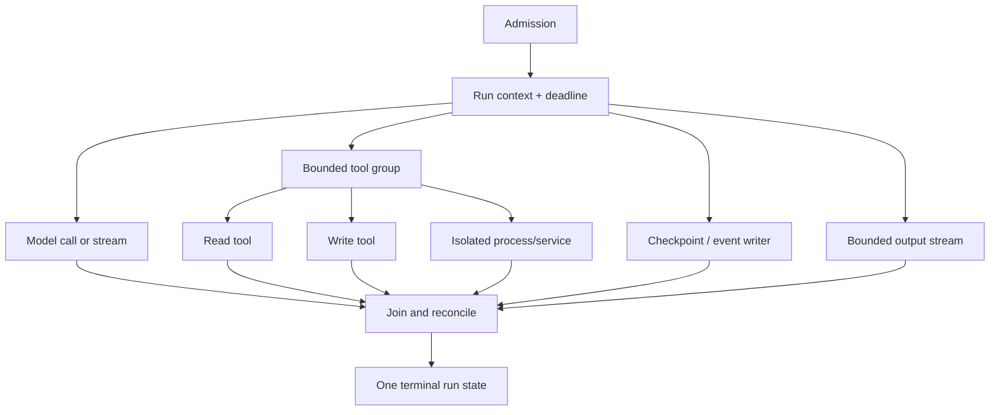
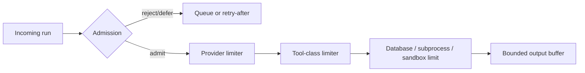

# Go Agent Runtimes in Production

> **Status:** Research-backed production guide  
> **Last researched:** 2026-08-31  
> **Current baseline:** Go 1.27.0 stable  
> **Evidence:** [Go agent runtime research packet](../research/packets/go-agent-runtimes.md)  
> **Decision companion:** [Go vs Python vs TypeScript/Node.js](../comparisons/go-vs-python-vs-typescript-node-agent-runtimes.md)

> Continue into the [14-guide Go agent-engineering playbook](go/README.md) for service ownership, contexts, backpressure, streams, process isolation, schemas, effects, durable workers, resources, diagnostics, testing, supply chain, deployment, and framework maturity.

Go is an excellent agent service and worker runtime when the team already operates Go or the component benefits from explicit concurrency, a compact deployment unit, strong HTTP/process primitives, and mature runtime diagnostics. The production challenge is not starting goroutines. It is owning their lifetime, bounding every resource, validating every external value, and separating ordinary process recovery from durable execution.

## Choose Go when the whole fit is strong

Lean Go when:

- a Go team owns the service and its on-call rotation;
- the component is an API gateway, model proxy, tool service, queue worker, MCP client/server, or durable activity;
- high concurrent I/O and predictable container deployment matter;
- required provider and framework features exist in the exact Go SDK versions;
- evaluation/data work can remain outside the serving hot path where appropriate.

Do not choose Go solely because goroutines are cheap, static binaries are convenient, or Go has static types. Goroutines can leak, binaries can retain enormous prompts, and Go structs do not validate hostile model or tool payloads.

## The production mental model

Treat each run as an owned tree:



The owner must answer:

- Which context cancels this work?
- Which goroutine waits for it?
- Which side closes each channel or pipe?
- Which limit protects its external dependency?
- Can a late result still mutate run state?
- If an effect committed but the response was lost, how is it reconciled?
- What survives a process crash?

If the answer is “the goroutine will finish eventually,” the design is incomplete.

## Pin the runtime and compatibility profile

Go 1.27 is the current stable release at this research snapshot. It adds generally available `encoding/json/v2`, a `goroutineleak` pprof profile, and an in-memory `httptest` server suitable for `testing/synctest`.

Pin and record:

- the `go` and `toolchain` directives;
- module versions and replacements;
- target OS, architecture, libc/cgo, and FIPS requirements;
- agent/provider/MCP/durable SDK versions;
- build flags and generated-code versions;
- container CPU and memory policy;
- whether `encoding/json` v1 or v2 defines each wire boundary.

Go's compatibility promise reduces language churn. It does not promise that provider schemas, generated SDKs, agent frameworks, MCP revisions, durable engines, or private dependencies remain compatible.

## Structure goroutine ownership

Use ordinary synchronous calls until concurrency provides a measured benefit. When related work must run concurrently, use an owning group and derived context.

```go
g, groupCtx := errgroup.WithContext(runCtx)
g.SetLimit(maxParallelTools)

results := make([]ToolResult, len(calls))
for i, call := range calls {
    i, call := i, call
    g.Go(func() error {
        result, err := executeTool(groupCtx, call)
        if err != nil {
            return fmt.Errorf("tool %s: %w", call.Name, err)
        }
        results[i] = result
        return nil
    })
}

if err := g.Wait(); err != nil {
    return nil, err
}
```

This works because each goroutine writes a distinct result slot and the group joins before the slice is read. It does not solve all limits:

- `SetLimit` bounds only active functions in that group;
- a blocked `g.Go` call applies backpressure to its caller, which must be acceptable;
- the first returned error cancels the group context, but tools must observe it;
- provider, database, tenant, subprocess, and memory limits remain separate;
- every group function must return on every error and cancellation path.

Use `TryGo` when overload should reject, defer, or enqueue instead of blocking admission. Use a worker pool only when workers need long-lived state or independent queue ownership; otherwise a bounded group is simpler.

Avoid fire-and-forget work. If a background task must outlive the request, hand it to a process-owned supervisor or durable queue with its own identity, deadline, retry policy, and shutdown drain.

## Propagate cancellation all the way down

`context.Context` should be the first parameter of request-scoped functions:

```go
func (s *Service) Run(ctx context.Context, req RunRequest) (RunResult, error)
```

Derive child deadlines from the parent instead of replacing it:

```go
modelCtx, cancel := context.WithTimeoutCause(
    runCtx,
    modelTimeout,
    ErrModelDeadline,
)
defer cancel()
```

Propagate that context to:

- outbound HTTP and provider SDK calls;
- tool and database calls;
- channel sends/receives that may block;
- queue lease extension and acknowledgement;
- subprocess execution;
- checkpoint and telemetry flushes where their ownership permits.

Every potentially blocking channel operation should have a cancellation path:

```go
select {
case events <- event:
    return nil
case <-ctx.Done():
    return context.Cause(ctx)
}
```

Cancellation is not rollback. Once cancellation wins, fence all later results from advancing the run. Preserve an effect receipt if it is needed to determine whether a write committed.

### Detached cleanup

`context.WithoutCancel` removes the parent's deadline and cancellation. Use it only for short, separately bounded work with process-level ownership, such as recording a terminal audit event:

```go
auditCtx, cancel := context.WithTimeout(
    context.WithoutCancel(runCtx),
    auditTimeout,
)
defer cancel()
```

Never detach a model call or write merely to avoid handling cancellation.

## Build a deadline hierarchy

One global timeout is too blunt. Define:

| Scope | Purpose |
|---|---|
| Admission wait | Bound queue and semaphore wait before work starts |
| Run | Bound the user-visible or background objective |
| Turn/model | Bound provider latency and streaming silence |
| Tool | Bound one operation by risk and dependency |
| Connection/header/body | Distinguish transport phases where the client exposes them |
| Durable activity | Bound one replay-safe external step |
| Shutdown drain | Bound cleanup before forced termination |

The child deadline must not exceed the remaining parent budget. Emit the deadline source and cancellation cause in telemetry. A context timeout across a retrying SDK usually covers the whole request including retries; verify whether the SDK also has a per-attempt timeout.

## Bound every scarce resource

A production service commonly needs independent bounds for:

- admitted interactive and background runs;
- active model requests by provider/model/tenant;
- tool calls by trust and resource class;
- database and cache connections;
- outbound connections per host;
- subprocesses and sandbox slots;
- durable activities and queue leases;
- buffered events and bytes;
- prompt, retrieval, and tool-result bytes;
- telemetry export queues.

Do not use one global semaphore for unrelated resources. A slow browser tool should not necessarily prevent a cheap metadata lookup; a tenant should not consume every global slot.



Record queue wait separately from execution latency. Apply fairness where one tenant or long run can monopolize slots.

## Make streaming and backpressure explicit

Channels coordinate goroutines; they do not automatically create a safe stream.

For each stream, define:

- event type and schema version;
- maximum queued event count and total bytes;
- whether token deltas coalesce;
- send behavior when the buffer is full;
- client-disconnect policy;
- who closes provider and downstream streams;
- how a reconnect resumes;
- which terminal event is guaranteed.

A finite channel capacity bounds elements, not bytes. Avoid putting unbounded strings or byte slices in a “bounded” channel.

The producer closes its output channel. Consumers do not close a channel they did not create. When several producers feed one channel, use a single owning closer after the producer group joins.

Use `io.Pipe` for synchronous streaming between a writer and reader only when both ends have error and cancellation closure. A goroutine blocked on a pipe write will not finish until the reader consumes or a side closes.

## Reuse and constrain HTTP clients

Create long-lived clients per policy profile, not per request:

```go
transport := &http.Transport{
    MaxIdleConns:          200,
    MaxIdleConnsPerHost:   50,
    MaxConnsPerHost:       100,
    IdleConnTimeout:       90 * time.Second,
    ResponseHeaderTimeout: 30 * time.Second,
}

client := &http.Client{
    Transport: transport,
}
```

The numbers are workload inputs, not defaults to copy. Size them with provider quotas, admitted concurrency, stream duration, file descriptors, and upstream behavior.

Rules:

- create requests with the run/tool context;
- close every successful response body;
- read to EOF when safe and useful for HTTP/1.x reuse;
- cap body bytes before buffering or decoding;
- avoid unlimited drain of an unwanted body;
- close streams promptly on cancellation;
- set redirect, proxy, TLS, and certificate policy deliberately;
- separate clients when trust, credentials, egress, or retry policy differs.

An SDK may bring its own transport and retries. Inspect it instead of wrapping it blindly. Multiple retry layers can turn two retries into many attempts and exceed the run deadline or duplicate an effect.

## Classify errors before retrying

Wrap errors with operation context while preserving identity:

```go
return fmt.Errorf("execute tool %q: %w", call.Name, err)
```

Use `errors.Is` and `errors.As` for stable classification. Do not branch on error strings.

A practical taxonomy:

| Class | Default handling |
|---|---|
| Invalid input/schema | Terminal; return structured correction |
| Unauthorized/forbidden/policy | Terminal and audited |
| Context canceled | Terminal for this owner; drain/fence children |
| Deadline exceeded | Retry only if remaining budget and semantics allow |
| Rate limit/transient provider | Bounded backoff with one retry owner |
| Dependency unavailable | Retry or circuit-break by policy |
| Ambiguous external effect | Reconcile by operation/effect ID before retry |
| Internal invariant/corruption | Fail closed, capture evidence, restart if needed |

For writes, assign an idempotency/effect ID before the first attempt. Store request hash, attempt, target, receipt, and reconciliation state. “The HTTP call returned an error” does not prove the write did not commit.

## Treat Go types as one validation layer

Decode untrusted data with byte limits and strict options. Go 1.27 `encoding/json/v2` improves defaults but still ignores unknown members unless configured otherwise.

At every external boundary:

1. cap bytes and nesting/collection sizes;
2. decode with duplicate-name, UTF-8, number, case, and unknown-member policy;
3. validate required fields and domain constraints;
4. verify cross-field invariants;
5. authorize the principal for the exact resource and effect;
6. normalize only after validation;
7. persist a versioned wire representation.

Model-generated tool arguments require the same handling as an internet request. Tool results, MCP content, queue messages, and durable snapshots are also untrusted.

Keep these concepts separate:

- Go domain type;
- JSON wire type;
- provider structured-output schema;
- MCP input/output schema;
- durable state/event version.

Generate one from another only when you have tests for semantic loss, defaults, nullability, unknown fields, numeric ranges, and the provider's schema subset.

## Execute commands and code outside the agent process

`os/exec` does not start a shell by default. Keep arguments separate:

```go
cmd := exec.CommandContext(ctx, executable, args...)
cmd.Dir = allowedWorkspace
cmd.Env = minimalEnv
```

Before execution:

- map a validated operation to an allowlisted executable;
- canonicalize and authorize paths;
- reject arbitrary environment inheritance;
- supply short-lived credentials only when needed;
- bound input, stdout, stderr, CPU, memory, processes, files, and wall time;
- define process-tree termination for the target OS;
- isolate hostile work in a container/VM/sandbox under a separate identity.

Drain `StdoutPipe` and `StderrPipe` concurrently before calling `Wait`. Bound their output. Do not feed `Cmd.String()` to a shell; it is a debugging representation, not an escaping API.

Model-generated code is hostile until proven otherwise. Go's type system and compiled artifact do not create an in-process sandbox.

## Choose the framework by category and maturity

| Need | Go options | Decision note |
|---|---|---|
| Direct provider API / custom loop | Official provider Go SDKs such as `openai-go` | Smallest surface when the loop is simple; you own tools, state, approval, tracing, and recovery. |
| Provider-led agent framework | Google ADK Go 2.0 GA | Verify exact provider, session, workflow, HITL, artifact, deployment, and parity requirements. |
| Cross-provider AI app framework | Genkit Go 1.x | Stable flows/tools/RAG core; higher-level Agents API was Beta at the snapshot. |
| Microsoft ecosystem | Agent Framework for Go | Public preview; missing checked features make it an evaluation track rather than a default stable dependency. |
| MCP client/server | Official MCP Go SDK | Tier 1, but pin protocol/SDK versions and test auth, cancellation, transport, schema, and conformance. |

OpenAI's official Go package is a base API library. The official OpenAI Agents SDK is available for Python and TypeScript, not Go. Do not report base client support as agent-framework parity.

Frameworks do not replace production controls. Confirm:

- cancellation propagation and late-result fencing;
- tool input/result validation and authorization hooks;
- session concurrency and storage semantics;
- streaming backpressure;
- approval persistence and resume behavior;
- retry ownership and idempotency;
- telemetry and context propagation;
- shutdown and version migration;
- security advisory and release policy.

## Add durability only when the workload needs it

Use an ordinary service plus database/queue when runs are short, effects are limited, and restart-from-checkpoint is sufficient. Use a durable workflow runtime when long waits, human approval, crash recovery, signals, timers, or multi-step effects require it.

Go has serious options:

- Temporal Go SDK;
- Restate Go SDK;
- DBOS Go;
- Dapr Workflow Go SDK.

The common rule is to keep nondeterministic model calls and external effects in activities, steps, or durable calls defined by the engine. Workflow/orchestration code must follow that engine's replay rules.

Before selecting:

- model the exact failure and replay semantics;
- set activity timeouts, heartbeats, retries, and cancellation;
- assign idempotency/effect IDs;
- define workflow and payload versioning;
- constrain history/checkpoint growth and retention;
- encrypt/redact sensitive payloads;
- test worker loss, response loss, duplicate delivery, and upgrade;
- document repair, terminate, retry, and rollback procedures.

A durable runtime can ensure its journal or step is replayed consistently. It cannot guarantee an arbitrary external system applied a write exactly once.

## Control memory and CPU in containers

Go 1.25+ can derive `GOMAXPROCS` from a Linux container CPU limit and update it when the limit changes, unless manual settings disable that behavior. Observe throttling and tail latency; CPU requests without limits are a different constraint.

Set `GOMEMLIMIT` below the container limit when the environment is controlled. Official guidance suggests 5–10% headroom as a starting point, but cgo, subprocesses, memory mappings, telemetry, and OS buffers can require more.

Measure:

- heap and total RSS at idle and per active run;
- prompt/retrieval/tool-result retention;
- live goroutines and stack growth;
- allocation and GC CPU;
- connection and stream buffers;
- subprocess/cgo memory;
- p95/p99 latency during CPU throttling and GC;
- OOM behavior at the admission limit.

Admission should account for the largest credible run, not average heap use.

## Shut down in ownership order

Use `signal.NotifyContext` to derive the process shutdown signal, and call its stop function when done.

A safe sequence:

1. receive shutdown and stop new admission;
2. mark readiness false and stop queue polling/lease acquisition;
3. call `http.Server.Shutdown` with a bounded drain context;
4. cancel process-owned background groups;
5. checkpoint, abandon, or hand off resumable runs according to policy;
6. wait for owned goroutines, workers, and subprocesses;
7. flush telemetry with a separate bounded context;
8. close transports, databases, queues, and files;
9. exit before the supervisor's hard deadline.

`Server.Shutdown` closes listeners and idle connections and waits for active connections to become idle. It does not automatically close hijacked connections such as some WebSockets; register and close those explicitly.

Test a second termination signal or expired drain deadline. Forced shutdown must not leave leases, approvals, or effects in an unknowable state.

## Observe runtime health and agent behavior together

OpenTelemetry Go traces and metrics are Stable; logs are Beta at this snapshot. Propagate trace context through supported HTTP/RPC instrumentation and explicitly across queues, MCP metadata, subprocess messages, and durable payloads.

Record agent dimensions with bounded cardinality:

- run, turn, tool, effect, and workflow/activity identifiers;
- tenant/principal policy class;
- model/provider and release;
- deadline/cancellation cause;
- retry owner and attempt;
- queue/pool wait;
- input/output/tool bytes and tokens;
- terminal state and reconciliation status.

Also observe Go runtime health:

- goroutine count and runnable/blocked behavior;
- heap, allocation rate, GC CPU, memory limit, and RSS;
- mutex and block contention;
- connection-pool occupancy and wait;
- semaphore/queue occupancy;
- subprocess and sandbox slots;
- stream buffered events/bytes;
- cancellation-to-cleanup latency.

Expose pprof only on an authenticated, network-restricted diagnostic endpoint. Profiles and traces may contain sensitive paths, arguments, labels, or payload-derived data.

## Test concurrency and time deliberately

Use:

- table-driven unit tests for schemas, error classes, and effect reconciliation;
- `httptest` and fake transports for provider faults;
- `testing/synctest` for deadlines, retries, quiescence, and cleanup;
- `go test -race` on concurrent unit and integration paths;
- fuzz tests for decoders, tool schemas, event state machines, and redaction;
- replay/upgrade tests for durable workflows;
- load tests with real connection pools and slow consumers;
- chaos tests for process loss, network stalls, response loss, and shutdown.

The race detector finds only races exercised at runtime and can cost roughly 5–10x memory and 2–20x execution time. It belongs in targeted CI and realistic test runs, not necessarily every fast unit-test invocation.

Go 1.27's `goroutineleak` profile detects a class of permanently blocked goroutines. It is valuable after cancellation and shutdown tests but is not proof that no leak exists.

## Secure the build and dependency path

Commit `go.mod` and `go.sum`. Run:

- `go mod verify`;
- `govulncheck ./...`;
- normal tests and race-enabled concurrency tests;
- static analysis appropriate to the project;
- SBOM and license generation;
- reproducible release build and provenance/signing checks.

Document every `replace`, private proxy, checksum-database exception, generated source, `go:generate` command, cgo dependency, and external build tool. Private-module settings change what the public proxy and checksum database see and verify; configure them intentionally.

Vulnerability scanning does not inspect prompt injection, tool authorization, unsafe sandbox policy, or novel dependency compromise. It is one control.

## Common failure patterns

| Failure | Why it happens | Better design |
|---|---|---|
| Goroutine per item with no limit | Goroutines are perceived as free | Bound admission and the actual downstream resource. |
| Request returns while children run | Bare goroutines have no owner | Join a group or hand off to a process/durable owner. |
| Timeout but tool keeps writing | Consumer ignores context or effect already committed | Propagate context, fence late result, reconcile by effect ID. |
| Stream memory grows | Channel bounds event count but not bytes, or producer ignores slow consumer | Byte budget, coalescing, cancellation-aware sends, disconnect policy. |
| Provider sockets churn | Client/transport created per request or bodies not closed | Reuse policy-specific clients and close/drain appropriately. |
| Retries explode | SDK, HTTP wrapper, queue, and workflow all retry | Assign one owner by error/effect class and bound total attempts. |
| “Typed” payload causes unsafe effect | Struct decode was treated as authorization | Strict runtime/domain validation followed by effect-boundary authorization. |
| Shell/process escape | Model data enters command string or inherited environment | Allowlisted executable/args in an isolated resource-limited boundary. |
| OOM despite `GOMEMLIMIT` | External/cgo/subprocess memory and burst working set excluded | Leave measured headroom and gate concurrent large runs. |
| Durable replay repeats model/effect | Nondeterminism placed in workflow code | Put it in activities/durable steps with receipts and version rules. |
| Shutdown hangs | Channel/pipe/library call ignores cancellation | Ownership tree, cancellation-aware blocking operations, bounded escalation. |

## Production test matrix

| Scenario | Required assertion |
|---|---|
| Cancel during model stream | Body closes, goroutines join, connection/resource counts return to baseline |
| Cancel during parallel tools | No new state transition after terminal cancellation; effects reconcile |
| Provider pool exhaustion | Admission remains bounded and queue wait is visible |
| Slow event consumer | Buffered bytes remain capped; coalescing/drop/cancel policy is deterministic |
| Subprocess timeout | Descendant processes and resources terminate on every target OS |
| Lost write response | Effect ID finds committed result or permits safe retry |
| Worker/process crash | Queue/durable owner resumes without duplicate effect |
| Runtime/framework upgrade | Golden schemas, cancellation, state, stream, and replay tests pass |
| Graceful shutdown | Readiness drops, admission stops, owned work drains or hands off before hard deadline |
| Memory spike | Service sheds load before OOM and retains incident evidence |

## Release gate

- [ ] Go toolchain, modules, SDKs, generators, and build image are pinned.
- [ ] Every goroutine, channel, pipe, stream, and subprocess has one owner.
- [ ] Admission, providers, tools, tenants, pools, buffers, and sandboxes are independently bounded.
- [ ] Context cancellation reaches every cooperative layer and late results are fenced.
- [ ] External effects have stable IDs, receipts, and ambiguous-outcome reconciliation.
- [ ] HTTP clients/transports are reused, bounded, and close response bodies.
- [ ] Tool arguments/results and every external payload pass strict runtime and semantic validation.
- [ ] Commands use allowlisted executable/arguments inside an OS-level containment boundary.
- [ ] Framework, MCP, and durable features are verified against exact pinned versions.
- [ ] Memory/CPU/container limits pass realistic concurrent long-context load.
- [ ] Runtime plus agent telemetry reconstructs cancellation, retry, effect, and recovery.
- [ ] Race, synctest, fuzz, load, crash, and shutdown scenarios pass.
- [ ] Module integrity, vulnerability, SBOM, provenance, and rollback controls pass.

## Related guides

- [Choosing an agent runtime language](choosing-an-agent-runtime-language.md)
- [Go vs Python vs TypeScript/Node.js](../comparisons/go-vs-python-vs-typescript-node-agent-runtimes.md)
- [Python agent runtimes](python-agent-runtimes.md)
- [TypeScript and Node.js agent runtimes](typescript-node-agent-runtimes.md)
- [Run controls](../runtime/run-controls.md)
- [Queues, scheduling, and backpressure](../operations/queues-scheduling-and-backpressure.md)
- [Durable execution](../runtime/durable-execution.md)
- [Permissions, sandboxing, and secrets](../security/permissions-sandboxing-and-secrets.md)
- [Observability and tracing](../evaluation/observability-and-tracing.md)

## Selected sources

- [Go 1.27 release notes](https://go.dev/doc/go1.27)
- [Go context](https://pkg.go.dev/context)
- [Go pipelines and cancellation](https://go.dev/blog/pipelines)
- [errgroup](https://pkg.go.dev/golang.org/x/sync/errgroup)
- [weighted semaphore](https://pkg.go.dev/golang.org/x/sync/semaphore)
- [net/http](https://pkg.go.dev/net/http@go1.27.0)
- [os/exec](https://pkg.go.dev/os/exec@go1.27.0)
- [encoding/json/v2 migration](https://go.dev/doc/jsonv2-migration)
- [Go garbage collector guide](https://go.dev/doc/gc-guide)
- [container-aware GOMAXPROCS](https://go.dev/blog/container-aware-gomaxprocs)
- [Go diagnostics](https://go.dev/doc/diagnostics)
- [Go race detector](https://go.dev/doc/articles/race_detector)
- [testing/synctest](https://go.dev/blog/testing-time)
- [Go modules](https://go.dev/ref/mod)
- [Go security and govulncheck](https://go.dev/doc/security/)
- [OpenTelemetry Go](https://opentelemetry.io/docs/languages/go/)
- [OpenAI Go API library](https://github.com/openai/openai-go)
- [Google ADK Go](https://adk.dev/get-started/go/)
- [Genkit Go](https://genkit.dev/docs/go/overview/)
- [Microsoft Agent Framework Go](https://learn.microsoft.com/en-us/agent-framework/get-started/)
- [Official MCP Go SDK](https://github.com/modelcontextprotocol/go-sdk)
- [Temporal Go SDK](https://github.com/temporalio/sdk-go)
- [Restate Go durable steps](https://docs.restate.dev/develop/go/durable-steps)
- [DBOS Go workflows](https://docs.dbos.dev/golang/tutorials/workflow-tutorial)
- [Dapr Go SDK](https://docs.dapr.io/developing-applications/sdks/go/go-client/)
