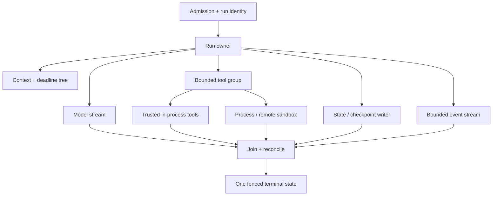

# Go Agent Engineering

> **Status:** Deep production playbook  
> **Last researched:** 2026-08-31  
> **Runtime baseline:** Go 1.27.0  
> **Evidence:** [Go agent-engineering deep-dive packet](../../research/packets/go-agent-engineering-deep-dive.md)  
> **Scope:** The runtime, protocol, tool, persistence, and operating consequences of building serious agents in Go

Go is a strong runtime for agent gateways, tool servers, MCP clients and servers, queue workers, durable activities, and API services. Its advantages are practical: inexpensive concurrency, a capable standard library, compact deployment, strong diagnostics, and an ecosystem that increasingly includes first-party agent and protocol SDKs.

Those advantages do not make an agent safe by default. Goroutines need owners. Context cancellation is not rollback. A buffered channel is not a memory budget. `exec.CommandContext` does not create a sandbox or necessarily kill descendants. Go structs do not validate hostile model output. A restarted process does not resume an in-memory run.

The production unit is an owned run tree:

Every child needs an owner, cancellation behavior, join policy, concurrency and byte budget, observability identity, and rule for late results. Work that must survive a crash additionally needs a durable record and replay-safe effect boundary.

## Choose a guide by the failure you are preventing

| Concern | Guide |
|---|---|
| Service boundaries, run state, goroutine ownership, supervisors | [Service architecture and goroutine ownership](service-architecture-and-goroutine-ownership.md) |
| Context propagation, cancellation causes, deadline hierarchy, local shutdown | [Context, deadlines, and shutdown](context-deadlines-and-shutdown.md) |
| Channel ownership, byte bounds, overload, fairness, concurrency limits | [Channels, backpressure, and concurrency limits](channels-backpressure-and-concurrency-limits.md) |
| HTTP clients/servers, SSE, WebSocket, MCP streams, disconnects | [HTTP and stream lifecycle](http-and-stream-lifecycle.md) |
| Tool authority, process execution, filesystem safety, sandbox boundaries | [Tools, processes, and sandboxing](tools-processes-and-sandboxing.md) |
| JSON v2, JSON Schema, strict decoding, provider structured output | [Schemas, serialization, and structured output](schemas-serialization-and-structured-output.md) |
| Error identity, retry ownership, backoff, idempotency, ambiguous effects | [Typed errors, retries, and idempotency](typed-errors-retries-and-idempotency.md) |
| Queue leases, run state, outbox, Temporal, Restate, DBOS, Dapr | [Queues, state, and durable workers](queues-state-and-durable-workers.md) |
| Heap/RSS, `GOMEMLIMIT`, `GOMAXPROCS`, admission by working set | [Memory, GC, and container resources](memory-gc-and-container-resources.md) |
| Runtime metrics, pprof, trace, OpenTelemetry, incident evidence | [Observability, profiling, and debugging](observability-profiling-and-debugging.md) |
| Race detector, `synctest`, fuzzing, leak tests, integration and load | [Testing concurrent agent services](testing-races-fake-time-and-load.md) |
| Modules, checksums, private dependencies, vulnerability scanning, artifacts | [Modules, supply chain, and builds](modules-supply-chain-and-builds.md) |
| Readiness, rollout, drain order, WebSocket shutdown, autoscaling | [Deployment, scaling, and graceful shutdown](deployment-scaling-and-graceful-shutdown.md) |
| ADK, Genkit, Microsoft Agent Framework, OpenAI, MCP, build-or-buy | [Framework ecosystem and anti-patterns](framework-ecosystem-and-anti-patterns.md) |

## Baseline production rules

1. Make the process supervisor, run owner, and child goroutine owners visible in code.
2. Start concurrency only where it improves latency or isolates ownership; join or supervise every goroutine.
3. Propagate one context tree and assign separate admission, run, model, tool, stream-idle, and shutdown budgets.
4. Bound counts and bytes independently. Protect providers, tenants, tool classes, subprocesses, and output queues with separate limits.
5. Reuse HTTP clients and define response-body, redirect, proxy, TLS, streaming-idle, and disconnect policy.
6. Decode external JSON into narrow boundary types, validate domain rules, authorize the action, then execute it.
7. Give every externally mutating operation a stable effect ID before its first attempt and reconcile ambiguous outcomes.
8. Keep model calls and external effects outside deterministic replay code; use durable activities or recorded steps.
9. Treat in-process tools as fully trusted. Put hostile code behind an OS, container, VM, Wasm, or remote isolation boundary.
10. Measure heap, RSS, goroutines, scheduler delay, queue wait, active permits, stream bytes, and provider/tool outcomes under failure.
11. Test cancellation, slow consumers, lost responses, duplicate delivery, shutdown, replay, race, and memory spikes—not only happy-path prompts.
12. Pin the Go toolchain and modules, verify provenance, scan reachable vulnerabilities, and keep release inputs reproducible.

## Runtime and ecosystem snapshot

At this research date:

- Go 1.27 makes `encoding/json/v2` generally available, adds the GA `goroutineleak` profile, and adds an in-memory `httptest.NewTestServer` suitable for `testing/synctest`.
- `testing/synctest` has been GA since Go 1.25; it provides fake time and quiescence inside an isolated bubble.
- Go's Linux `GOMAXPROCS` default is container CPU-limit aware when the application has not overridden it.
- Google ADK Go 2.0 is GA and requires Go 1.25 or later.
- Genkit Go 1.x core is stable, while its higher-level Agents API is Beta and imported from experimental packages.
- Microsoft Agent Framework for Go is public preview and has documented feature gaps relative to .NET.
- The official MCP Go SDK is Tier 1 and supports the 2026-07-28 specification; version negotiation and transport semantics still require compatibility tests.
- OpenAI provides an official Go API helper, currently documented as Beta. The official OpenAI Agents SDK list contains Python and TypeScript, not Go.
- Temporal, Restate, DBOS, and Dapr provide distinct Go durable-execution options. None turns arbitrary remote effects into exactly-once effects.

Treat every maturity label as applying to an exact surface and version. A stable Go runtime does not make a preview framework stable, and a GA framework does not make every provider plugin or transport GA.

## Canonical guides to reuse

These documents own language-neutral policy; the Go area focuses on Go-specific mechanics:

- [Agent loop](../../foundations/agent-loop.md)
- [Run controls](../../runtime/run-controls.md)
- [Execution boundaries](../../runtime/execution-boundaries.md)
- [Durable execution](../../runtime/durable-execution.md)
- [Agent state and event contracts](../../runtime/agent-state-and-event-contracts.md)
- [Tool contracts](../../tools/tool-contracts.md)
- [Queues, scheduling, and backpressure](../../operations/queues-scheduling-and-backpressure.md)
- [Idempotency and side effects](../../reliability/idempotency-and-side-effects.md)
- [Observability and tracing](../../evaluation/observability-and-tracing.md)
- [Permissions, sandboxing, and secrets](../../security/permissions-sandboxing-and-secrets.md)

## Refresh triggers

Re-research this area when:

- Go changes JSON v2 compatibility, runtime memory/CPU defaults, pprof, trace, `synctest`, `net/http`, or `os/exec` behavior;
- an agent, provider, MCP, or durable SDK crosses a major version or maturity boundary;
- the MCP protocol changes transport, cancellation, authorization, or negotiation semantics;
- a Go security advisory affects the toolchain, `os.Root`, `net/http`, crypto, archive handling, or a documented dependency;
- production profiles show a different dominant resource than the assumptions in these guides.

## Selected primary sources

- [Go 1.27 release notes](https://go.dev/doc/go1.27)
- [Go context package](https://pkg.go.dev/context@go1.27.0)
- [Go diagnostics](https://go.dev/doc/diagnostics)
- [Go garbage collector guide](https://go.dev/doc/gc-guide)
- [Official MCP Go SDK](https://github.com/modelcontextprotocol/go-sdk)
- [Google ADK Go quickstart](https://adk.dev/get-started/go/)
- [Genkit Go overview](https://genkit.dev/docs/go/overview/)
- [Microsoft Agent Framework for Go](https://github.com/microsoft/agent-framework-go)
- [OpenAI SDKs and CLI](https://developers.openai.com/api/docs/libraries)
