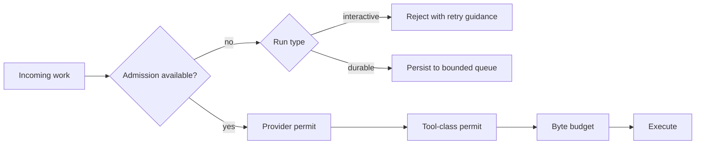

# Go Channels, Backpressure, and Concurrency Limits

> **Last researched:** 2026-08-31  
> **Use with:** [Queues, scheduling, and backpressure](../../operations/queues-scheduling-and-backpressure.md)

Channels coordinate goroutines. They do not automatically bound memory, distribute work fairly, protect external quotas, or define overload behavior. Production agent services need explicit ownership and separate limits for counts, bytes, rates, and tenants.

## Define a contract for every channel

For each channel, document:

- the value type and maximum payload size;
- who creates it and which sender closes it;
- how many producers and consumers exist;
- whether ordering matters;
- what happens when the buffer is full;
- how senders/receivers observe cancellation;
- how the owner waits for all senders before closing;
- whether values may be dropped, coalesced, retried, or persisted.

The sender that owns production closes the channel. Receivers should not close a channel they did not create. With multiple producers, a separate owner closes the output only after the producer group joins.

```go
func merge(ctx context.Context, inputs ...<-chan Event) <-chan Event {
	out := make(chan Event, 16)
	var wg sync.WaitGroup
	wg.Add(len(inputs))
	for _, input := range inputs {
		input := input
		go func() {
			defer wg.Done()
			for event := range input {
				select {
				case out <- event:
				case <-ctx.Done():
					return
				}
			}
		}()
	}
	go func() {
		wg.Wait()
		close(out)
	}()
	return out
}
```

The caller still owns cancellation and must consume or abandon the output correctly. In production code, put these goroutines under a visible owner rather than hiding them in an untracked helper.

## Bound bytes, not only elements

`make(chan Event, 100)` bounds 100 values. It says nothing about whether each event is 50 bytes or 50 MiB. Agent streams contain token deltas, tool outputs, retrieved documents, images, and error detail with radically different sizes.

Use layered controls:

| Boundary | Useful limits |
|---|---|
| Request decode | Body bytes, fields/items, nesting, decompressed bytes |
| Prompt construction | Tokens and source bytes per run/tenant |
| Tool result | Per-result bytes and total retained result bytes |
| Event queue | Element count plus owned byte budget |
| Persistence | Event/checkpoint size and history length |
| HTTP stream | Pending events/bytes and write/idle deadline |

A byte permit should be acquired before the payload becomes resident where possible and released when the consumer no longer retains it. If payload sizes are highly variable, a weighted semaphore or explicit byte ledger is more informative than a channel capacity.

## Choose overload behavior deliberately



Possible full-buffer policies:

| Policy | Appropriate for | Risk |
|---|---|---|
| Block producer | Lossless bounded pipeline with responsive consumer | Backpressure can hold scarce upstream permits |
| Reject admission | Interactive overload before work starts | Caller must retry safely |
| Persist/defer | Background work that may wait | Queue growth and lease semantics |
| Drop/coalesce | Telemetry or replaceable token/progress updates | Must never drop terminal state or effect receipts |
| Disconnect slow consumer | Live stream with reconnect by run ID | Requires durable or queryable run state |

Do not drop tool results, authorization decisions, effect receipts, or terminal events to preserve a cosmetic stream.

## Use separate resource limiters

A single global worker pool creates accidental coupling. Common independent limits include:

- admitted runs globally and per tenant;
- active requests per model/provider and rate/token quota;
- tool calls by read/write/risk/resource class;
- database connections and transactions;
- subprocess and sandbox slots;
- outbound connections per host;
- durable workflow/activity concurrency;
- buffered events and bytes;
- telemetry export queues.

Acquire permits in a documented order to avoid deadlocks. Avoid holding an outer/global permit while waiting indefinitely for a scarce inner permit. Record admission wait and each resource wait separately.

## `errgroup`, semaphore, and worker-pool trade-offs

| Primitive | Use when | Important behavior |
|---|---|---|
| `errgroup` + `SetLimit` | Finite related subtasks with shared cancellation | `Go` blocks at the limit; first error cancels derived context |
| `errgroup.TryGo` | Overload should be rejected/deferred | Caller decides when no slot exists |
| Weighted semaphore | Tasks consume different resource units | Weights must correspond to measured cost |
| Token channel | Simple identical permit class | Easy, but usually lacks fairness and diagnostics |
| Long-lived worker pool | Workers own reusable state or a queue | Lifecycle, queue, poison work, and resize become your responsibility |
| Durable queue | Work must survive process failure | Needs leases, retries, idempotency, DLQ/repair, and retention |

Do not create a worker pool merely to avoid goroutines. A bounded group is simpler for per-run fan-out. A pool is justified when it owns long-lived clients, expensive isolated workers, or queue consumption.

## Protect fairness and avoid head-of-line blocking

Global FIFO can let one tenant or one class of long tool calls monopolize capacity. Options include:

- per-tenant admission caps plus a global cap;
- separate queues/limiters for interactive and batch work;
- partitioned durable queues keyed by tenant or resource;
- deficit/weighted scheduling where workloads differ materially;
- maximum per-run parallel tool calls;
- age and deadline-aware rejection rather than starting stale work.

Do not let a high-level “parallel tools” setting bypass provider, database, process, or tenant limits.

## Streaming backpressure rules

For token and event streams:

- prefer semantic events over raw provider chunks;
- coalesce replaceable text deltas before they enter a slow queue;
- cap total pending bytes;
- keep terminal/error events on a reliable path;
- stop provider reads if downstream policy says the run cancels;
- otherwise decouple user delivery from durable run execution;
- release model/tool permits only after the stream/body is closed and cleanup completes.

`io.Pipe` is synchronous: writes block until reads consume them. Both ends need a cancellation/error closure path. Never assume closing only the writer unblocks every goroutine.

## Failure-injection checklist

- [ ] Fill each limiter independently and verify the intended rejection/queue behavior.
- [ ] Make one tenant saturate its allocation and verify others progress.
- [ ] Send maximum-sized values through every “bounded” channel and measure RSS.
- [ ] Stop a stream consumer and prove pending bytes remain capped.
- [ ] Cancel while producers are blocked on send and prove all owners join.
- [ ] Fail one `errgroup` child and prove siblings observe cancellation.
- [ ] Make a tool ignore context and verify the outer isolation/timeout response.
- [ ] Confirm terminal state and effect receipts cannot be dropped or coalesced.
- [ ] Measure queue/admission wait separately from execution latency.

## Selected primary sources

- [Go pipelines and cancellation](https://go.dev/blog/pipelines)
- [`errgroup`](https://pkg.go.dev/golang.org/x/sync/errgroup)
- [`semaphore`](https://pkg.go.dev/golang.org/x/sync/semaphore)
- [Go memory model](https://go.dev/ref/mem)

