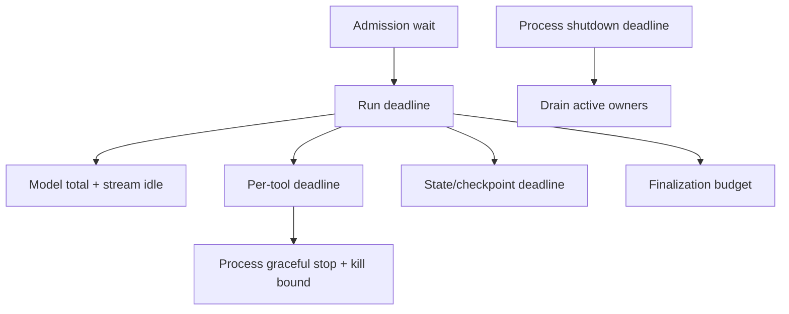

# Go Context, Deadlines, and Shutdown

> **Last researched:** 2026-08-31  
> **Use with:** [Service architecture](service-architecture-and-goroutine-ownership.md) and [deployment shutdown](deployment-scaling-and-graceful-shutdown.md)

`context.Context` communicates lifetime; it is not a transaction, durable cancellation record, parameter bag, or cleanup supervisor. A correct agent service propagates one context tree, records meaningful cancellation causes, and separately defines what happens to effects and durable state.

## Pass context across every blocking boundary

The standard shape is:

```go
func (s *Service) Execute(ctx context.Context, req Request) (Result, error)
```

Context should be the first parameter and should not be stored in a struct. Propagate it to:

- model/provider calls and stream reads;
- outbound HTTP requests;
- database and queue operations;
- tool calls and subprocess execution;
- blocking channel sends and receives;
- semaphore acquisition;
- durable activity heartbeat/cancellation APIs;
- checkpoint and telemetry flushes when their ownership permits.

Always call a returned cancel function; doing so releases parent references and timers. `go vet` checks many lost-cancel paths.

## Build a deadline hierarchy

One run timeout cannot express where time was spent or which recovery is safe.



| Budget | What it bounds |
|---|---|
| Admission | Queue/semaphore wait before expensive work starts |
| Run | User-visible or background objective |
| Model attempt | Provider request including the chosen retry layer |
| Stream idle | Silence between meaningful events, not only total duration |
| Tool | One operation, sized by risk and dependency |
| State/effect receipt | Persistence needed for correctness |
| Finalization | Terminal state and audit record |
| Process shutdown | Total drain before forced exit |

A child deadline must not exceed the parent remainder. Reject work that cannot reasonably finish within the remaining budget instead of starting it and timing out during commit.

## Preserve cancellation causes

```go
var ErrModelBudget = errors.New("model deadline exhausted")

modelCtx, cancel := context.WithTimeoutCause(
	runCtx,
	modelTimeout,
	ErrModelBudget,
)
defer cancel()
```

Use `context.Cause(ctx)` for diagnostic classification. `ctx.Err()` remains `context.Canceled` or `context.DeadlineExceeded`; the cause explains why. Causes should be stable, non-secret values suitable for metrics and logs.

The first cancellation in a context ancestry wins. Do not assume a child can overwrite an already recorded parent cause.

## Make blocking operations cancellable

```go
select {
case events <- event:
	return nil
case <-ctx.Done():
	return context.Cause(ctx)
}
```

Audit both sides of channel operations, semaphore acquisition, stream reads, and retry sleeps. A goroutine blocked on a plain send, `io.Pipe` write, or library call that ignores context will prevent its owner from joining.

Cancellation races with completion. After cancellation wins:

- stop accepting new child work;
- close or cancel transports that can unblock I/O;
- join children within the owner's budget;
- ignore or fence late results;
- persist any effect receipt needed to determine whether a write committed;
- record one terminal outcome.

Cancellation is not rollback. A remote service may commit before the response is lost, a subprocess may leave descendants, and a database operation may complete after the caller stops waiting.

## Use `WithoutCancel` only after transferring ownership

`context.WithoutCancel(parent)` removes deadline, cancellation, `Err`, and cause while preserving values. It does not create a supervisor or timeout. A safe detached cleanup establishes a new, bounded owner:

```go
cleanupCtx, cancel := context.WithTimeout(
	context.WithoutCancel(runCtx),
	2*time.Second,
)
defer cancel()

return audit.WriteTerminal(cleanupCtx, record)
```

Use this only for short cleanup whose process-level owner is explicit. Do not detach model calls, write tools, or queue acknowledgements merely to make them complete after the user cancels.

`context.AfterFunc` starts a function in its own goroutine after cancellation. Treat it as concurrent work: make the function idempotent, handle races with the returned stop function, and avoid using it as the only correctness mechanism.

## Separate request cancellation from durable cancellation

An HTTP request context ends when the client disconnects or the handler returns. The product policy must decide whether that means:

| Run type | Typical policy |
|---|---|
| Interactive, no durable job | Cancel the run and fence late results |
| Interactive backed by durable job | Detach delivery, not execution; client can reconnect by run ID |
| Background/durable | Request only submits or observes; durable cancellation is a persisted command |

A durable cancellation request must be stored, delivered to the current lease/attempt, and enforced at safe boundaries. It must coexist with already committed effects and retries after worker crashes.

## Define local process shutdown order

Use `signal.NotifyContext` for the process root context, but do not let root cancellation instantly tear down every dependency. Shutdown usually needs ordered phases:

1. mark not ready and stop admission;
2. stop HTTP listeners or new queue leases;
3. signal active run and connection owners;
4. let essential receipts/checkpoints complete within a separate drain context;
5. close long-lived upgraded connections explicitly;
6. flush bounded telemetry;
7. force-close remaining work when the shutdown deadline expires.

`http.Server.Shutdown` stops listeners, closes idle connections, and waits for active connections. It does not close or wait for hijacked connections such as WebSockets. The process must not return from `main` before the shutdown goroutine finishes.

Be careful with root context cancellation: if the shutdown context is derived from the already-cancelled root, it is cancelled immediately. Create a bounded cleanup context from `context.Background()` or a deliberately detached process context.

## Shutdown skeleton

```go
rootCtx, stop := signal.NotifyContext(
	context.Background(),
	os.Interrupt,
	syscall.SIGTERM,
)
defer stop()

// Start supervised servers and workers here.
<-rootCtx.Done()

app.StopAdmission()
drainCtx, cancel := context.WithTimeout(context.Background(), 25*time.Second)
defer cancel()

err := errors.Join(
	app.HTTPServer.Shutdown(drainCtx),
	app.Workers.Drain(drainCtx),
	app.Streams.CloseAndWait(drainCtx),
)
```

Do not copy the timeout blindly. It must fit the deployment platform's termination grace period with margin for signal delivery and forced cleanup.

## Common context failures

| Failure | Consequence | Fix |
|---|---|---|
| `context.Background()` in request path | Work escapes cancellation and trace propagation | Propagate parent context |
| One timeout for every dependency | Poor diagnosis; slow tool consumes whole run | Layer budgets and record source |
| Retry sleep uses `time.Sleep` | Cancellation waits for backoff | Timer/select on `ctx.Done()` |
| Cleanup context derived from cancelled run | Cleanup never starts | New bounded cleanup owner |
| Treat deadline as proof of no commit | Duplicate external effects | Reconcile by effect ID |
| Return handler while stream goroutine writes | Use-after-handler and leaks | Handler owns and joins stream writer |
| Store context in run record | Non-serializable, process-local lifetime | Store deadline/intent fields separately |

## Verification checklist

- [ ] Every blocking path accepts or observes context.
- [ ] Every derived context's cancel function is called.
- [ ] Admission, run, model, tool, stream-idle, and shutdown budgets are distinct.
- [ ] Telemetry records the cancellation source/cause without secrets.
- [ ] Late results are fenced after cancellation.
- [ ] Ambiguous effects are reconciled rather than assumed absent.
- [ ] Detached cleanup has a separate owner and timeout.
- [ ] WebSockets, hijacked connections, and durable workers have explicit shutdown paths.
- [ ] The shutdown deadline fits inside platform termination grace.

## Selected primary sources

- [Go context package](https://pkg.go.dev/context@go1.27.0)
- [Go pipelines and cancellation](https://go.dev/blog/pipelines)
- [`os/signal.NotifyContext`](https://pkg.go.dev/os/signal#NotifyContext)
- [`http.Server.Shutdown`](https://pkg.go.dev/net/http@go1.27.0#Server.Shutdown)

