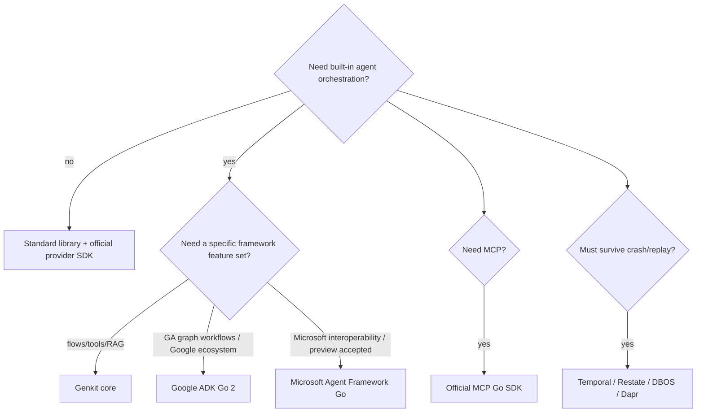
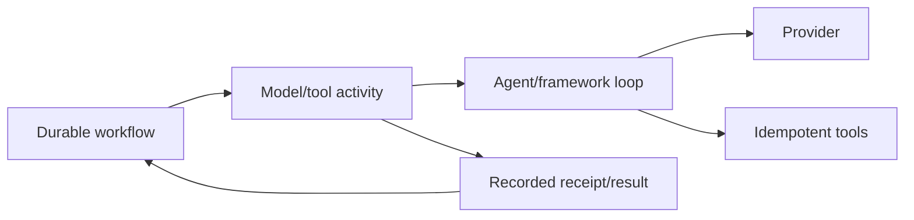

# Go Agent Framework Ecosystem and Anti-Patterns

> **Last researched:** 2026-08-31  
> **Baseline:** Exact maturity claims below are a dated snapshot, not permanent rankings

Choose a Go agent framework only after the service's ownership, state, effect, transport, durability, and operating requirements are clear. A framework can reduce provider/tool-loop plumbing. It cannot supply product authorization, idempotency for arbitrary effects, a process sandbox, memory budgets, or operational ownership by itself.

## Start with the smallest layer that solves the problem

A direct provider client plus domain-owned loop is often best for a small tool-calling service. Add a framework when its session/workflow/tool/provider/observability features remove more complexity than its lifecycle and upgrade surface introduce.

## Current surface-by-surface snapshot

| Surface | Snapshot | Production interpretation |
|---|---|---|
| Go | 1.27 stable | Runtime baseline; pin supported patch releases |
| Google ADK Go | 2.0 GA, Go 1.25+ | Serious Go framework candidate; verify exact provider/session/artifact/deployment behavior |
| Genkit Go core | 1.x stable | Strong for flows, models, tools, RAG, structured output, dev tooling |
| Genkit Agents API | Beta, experimental packages | Evaluate behind an adapter; expect minor-release breaking changes |
| Microsoft Agent Framework Go | Public preview | Evaluate when its interop/workflow features matter; accept documented gaps and change risk |
| Official MCP Go SDK | Tier 1; current protocol support | Prefer over hand-rolled JSON-RPC/transport; still pin/test negotiation, auth, cancellation, schemas |
| OpenAI Go API helper | Official, documented as Beta | Direct Responses/API integration; not the OpenAI Agents SDK |
| OpenAI Agents SDK | Official Python and TypeScript listings | No first-party Go Agents SDK in the checked official list |
| Temporal Go SDK | Mature durable runtime | Workflow determinism, Activities, histories, versioning, worker ops |
| Restate Go SDK | Durable services/workflows/steps | Journaled primitives; use its deterministic concurrency model |
| DBOS Go | Durable workflows/steps/queues | Database-backed replay and durable concurrency; validate version/serialization semantics |
| Dapr Workflow Go | Go SDK + Dapr runtime | Durable orchestration plus sidecar/control-plane/state-store operations |

Do not turn this table into a universal ranking. The exact release, provider plugin, transport, deployment target, and team capability determine risk.

## Google ADK Go 2.0

ADK Go 2.0 reached GA on 2026-06-30 and requires Go 1.25 or later. It adds graph-based workflows, parallel/loop patterns, dynamic workflows, agent execution modes, and human-in-the-loop tool confirmation.

Evaluate:

- event-stream ownership and cancellation (`iter.Seq2`-style surfaces);
- session and artifact store consistency/retention;
- graph/loop termination and concurrency bounds;
- provider feature parity and fallback behavior;
- tool confirmation binding to exact arguments/effect ID;
- telemetry export/cardinality and error classification;
- deployment/runtime components and upgrade path from 1.x;
- how framework retries interact with provider/durable-runtime retries.

GA is not proof that every plugin, sample, or deployment integration is equally mature.

## Genkit Go

Genkit Go 1.0 declared a stable 1.x compatibility line for its core framework. It provides typed flows, multiple model providers, tools, structured output, RAG, multimodal support, telemetry, CLI, and Developer UI.

The higher-level Full-stack Agents API is Beta and available from experimental packages. Its Go surface also differs from other language clients. Use stable flows/`Generate` when the application should own API shape, persistence, orchestration, and frontend protocol. Adopt the Agents API only when its session/streaming/interrupt/background behavior is valuable enough to accept Beta evolution.

Do not let local Developer UI success stand in for production persistence, authorization, failure injection, and capacity tests.

## Microsoft Agent Framework for Go

The Go implementation is public preview and evolves outside the main .NET/Python repository. It covers core agents, sessions, tools, middleware, workflows, checkpointing, observability, A2A, AG-UI, MCP, and skills, but the project's own comparison documents gaps.

At this snapshot, documented gaps include broader .NET integrations and product hosting, evaluation, RAG, declarative agents/workflows, and a durable equivalent. Go has first-class sequential/concurrent/group-chat helpers, while handoff and some declarative surfaces are not first-class.

Use preview status as a release/ownership constraint:

- isolate the framework behind domain interfaces;
- pin versions and record feature gaps;
- maintain contract/golden tests for messages, tools, checkpoints, and streams;
- plan payload/session migrations and rollback;
- do not describe checkpoint/restart support as durable execution without verifying crash/replay guarantees.

## Provider SDK is not agent SDK

OpenAI's official documentation lists an official Go API helper (`openai-go/v3`) and labels it Beta. The same official page lists Agents SDK packages for TypeScript and Python. A Go service can call Responses, streaming, function tools, structured output, and MCP through APIs/SDK primitives, but the application owns the loop, state, handoffs, guardrails, tracing, and sandbox orchestration unless another Go framework supplies them.

Apply the same distinction to every vendor:

| Claim | Verify separately |
|---|---|
| Official API SDK | Authentication, endpoints, streaming, retries, generated types |
| Agent framework | Loop, sessions, tools, handoffs, guardrails, tracing |
| Durable runtime | Crash recovery, replay, timers/signals, versioning |
| Hosted agent product | Service-side state/tools/operations, data policy, limits |

## Official MCP Go SDK

The Go SDK is an official Tier 1 SDK and supports the 2026-07-28 protocol line. Prefer it over implementing negotiation, JSON-RPC, Streamable HTTP, OAuth, schemas, and cancellation from scratch.

Still test:

- protocol negotiation with every supported old/new peer;
- 2026-07-28 stateless requirement and per-request metadata;
- stream-close cancellation and the SDK's propagation option;
- DNS-rebinding/localhost protection and host/origin policy;
- OAuth token storage/refresh and audience/resource validation;
- maximum message/body/event sizes and schema behavior;
- backwards compatibility with older session/resume semantics;
- graceful shutdown and long subscription ownership.

MCP tool annotations are hints, not authorization. A Tier 1 SDK does not sandbox tool implementations.

## Durable SDKs are complementary

Agent frameworks and durable engines solve different problems. A common architecture uses a framework/provider client inside a durable Activity/step:

Keep nondeterministic model calls and effects out of deterministic workflow code. Bound a loop inside an activity or split significant model/effect steps so retries, histories, and operator repair are understandable.

## Framework adoption scorecard

Require evidence for:

- exact release/maturity and compatibility promise;
- supported Go/toolchain versions;
- provider endpoints, streaming, structured-output and tool parity;
- context propagation, cancellation, deadlines, retry ownership;
- goroutine/connection ownership and graceful shutdown;
- session/checkpoint schema and migration/retention;
- authorization and human-approval binding;
- observability semantics and cardinality/privacy;
- durable-runtime integration and determinism boundary;
- dependency graph, security process, advisories, licenses;
- load/memory behavior and failure-injection results;
- exit strategy: domain types and adapters that avoid persisted framework internals.

## Go agent anti-patterns

| Anti-pattern | Why it fails | Better choice |
|---|---|---|
| “Goroutines are cheap, spawn all tools” | Downstream quotas and memory dominate | Per-run and per-resource bounds |
| Framework checkpoint called durable | May not survive/replay all failures/effects | Verify guarantees or use durable engine |
| `map[string]any` tool inputs | Weak validation and versioning | Narrow structs + schema + domain validation |
| SDK retries plus middleware plus workflow retries | Attempt explosion and duplicates | One retry owner, effective-attempt test |
| Provider object persisted as run state | Upgrade/replay coupling | Versioned domain events/receipts |
| In-process “sandbox tool” | Same process authority | OS/container/Wasm/remote isolation |
| MCP server means safe tools | Protocol is not authorization/isolation | Enforce per-call policy and boundary |
| Multi-agent by default | More latency, cost, state, failure paths | Single bounded loop until decomposition is proven |
| Cross-provider abstraction before need | Lowest-common-denominator API and hidden behavior | Narrow domain gateway for actual variants |
| Web handler owns long background run | Disconnect/process crash loses owner | Durable job/run identity and reconnect |

## Selected primary sources

- [Google ADK Go 2.0](https://adk.dev/2.0/)
- [Google ADK Go quickstart](https://adk.dev/get-started/go/)
- [Genkit Go 1.0 announcement](https://genkit.dev/blog/announcing-genkit-go-1-0/)
- [Genkit Full-stack Agents](https://genkit.dev/docs/go/agents/overview/)
- [Microsoft Agent Framework for Go](https://github.com/microsoft/agent-framework-go)
- [Microsoft .NET/Go feature comparison](https://github.com/microsoft/agent-framework-go/blob/main/docs/dotnet-go-sdk-feature-comparison.md)
- [OpenAI SDKs and CLI](https://developers.openai.com/api/docs/libraries)
- [MCP 2026-07-28 release](https://blog.modelcontextprotocol.io/posts/2026-07-28/)
- [Official MCP Go SDK releases](https://github.com/modelcontextprotocol/go-sdk/releases)

