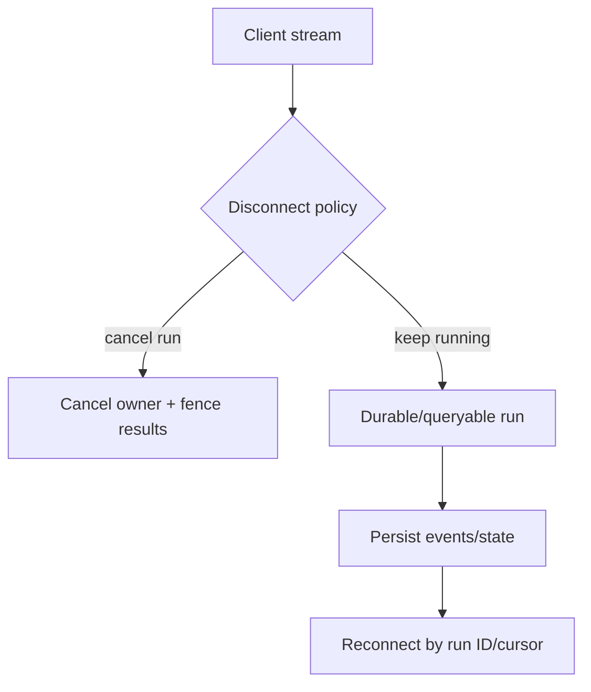

# Go HTTP and Stream Lifecycle

> **Last researched:** 2026-08-31  
> **Baseline:** `net/http` in Go 1.27, MCP specification 2026-07-28

An agent HTTP request often owns several nested streams: client connection, model response body, provider events, tool progress, and an SSE or WebSocket response. Production correctness requires closing each layer, bounding every buffer and silence interval, and deciding whether a client disconnect cancels the run or only its delivery.

## Reuse clients by policy profile

Create long-lived clients and transports. A client per request forfeits connection reuse and makes connection limits difficult to reason about.

```go
transport := &http.Transport{
	MaxIdleConns:          200,
	MaxIdleConnsPerHost:   50,
	MaxConnsPerHost:       100,
	IdleConnTimeout:       90 * time.Second,
	ResponseHeaderTimeout: 30 * time.Second,
}

client := &http.Client{Transport: transport}
```

These numbers are examples, not defaults to copy. Size them from admitted concurrency, long-stream count, provider quotas, file descriptors, HTTP version, and observed latency.

Use separate clients when credentials, egress, proxy, TLS roots, redirect policy, retry semantics, or trust differ. Provider SDKs may own their clients and retries; inspect their options before wrapping them.

## Define the full outbound request budget

`http.Client.Timeout` covers the entire exchange, including redirects and reading the response body. Long streams often need a run/attempt context plus separate phase and idle policies instead of one small total timeout.

Consider:

- admission and provider permit wait;
- DNS/connect/TLS handshake;
- response headers/time-to-first-byte;
- maximum response body or event size;
- maximum decompressed bytes;
- maximum silence between meaningful stream events;
- total model/tool attempt budget;
- cleanup and connection return.

Create requests with `http.NewRequestWithContext`. On every successful response:

- close `resp.Body` on all paths;
- cap bytes before buffering or decoding;
- read to EOF only when safe and useful for reuse;
- do not drain an attacker-controlled unlimited body;
- preserve status, request ID, and bounded error detail;
- stop reading promptly on cancellation.

If a retrying SDK uses the same context for all attempts, the context deadline may bound the whole retry sequence. Verify rather than assuming per-attempt semantics.

## Harden the server boundary

Set explicit server limits appropriate to the endpoint:

```go
srv := &http.Server{
	Addr:              ":8080",
	Handler:           handler,
	ReadHeaderTimeout: 5 * time.Second,
	IdleTimeout:       60 * time.Second,
	MaxHeaderBytes:    1 << 20,
}
```

`WriteTimeout` can conflict with long-lived streams if applied as a single absolute deadline. For streaming handlers, use `http.NewResponseController` to set or refresh write deadlines when supported and define a maximum idle gap. A `ResponseController` cannot be used after `ServeHTTP` returns.

Limit request bodies with `http.MaxBytesReader` before decode. Limit decoded arrays, strings, nesting, attachments, and decompression separately. Authenticate and authorize before allocating a large prompt or starting provider work.

## Treat SSE as a protocol, not repeated `fmt.Fprintf`

For each SSE endpoint, define:

- event names and versioned payload schema;
- heartbeat/comment interval through intermediaries;
- event and pending-byte limits;
- flush failure handling;
- terminal event semantics;
- reconnect and replay behavior;
- client disconnect policy;
- proxy buffering/timeouts and cache headers.

The handler must remain the owner of response writes and should not return while a child goroutine continues using `ResponseWriter`.

```go
func stream(w http.ResponseWriter, r *http.Request, events <-chan Event) error {
	w.Header().Set("Content-Type", "text/event-stream")
	w.Header().Set("Cache-Control", "no-cache")
	rc := http.NewResponseController(w)

	for {
		select {
		case <-r.Context().Done():
			return context.Cause(r.Context())
		case event, ok := <-events:
			if !ok {
				return nil
			}
			if err := writeBoundedSSE(w, event); err != nil {
				return err
			}
			if err := rc.Flush(); err != nil {
				return err
			}
		}
	}
}
```

Do not use an unbounded replay slice. If reconnect matters, persist a bounded, versioned event log or expose current run state and a continuation cursor.

## WebSocket ownership

A WebSocket usually needs one read owner and one write owner, a bounded outbound queue, read limit, ping/pong or application heartbeat, close handshake, and explicit shutdown registration.

Define:

- maximum frame/message and decompressed size;
- allowed message types and schema;
- idle/read/write deadlines;
- whether context cancellation closes reads;
- one writer or library-supported concurrent-write rule;
- slow-client policy;
- normal and abnormal close codes;
- authentication refresh and authorization lifetime;
- ownership of connection close and goroutine join.

`http.Server.Shutdown` does not close or wait for hijacked connections, including many WebSocket implementations. Track them in a connection registry/supervisor, signal protocol-specific close, wait within the drain budget, then force close.

## MCP Streamable HTTP is versioned behavior

For MCP 2026-07-28:

- each client message is a new HTTP POST to one MCP endpoint;
- a request response is either one JSON object or an SSE stream scoped to that request;
- protocol metadata appears per request and selected values are mirrored in headers;
- protocol-level sessions and the standalone GET stream were removed;
- closing the response SSE stream is the transport cancellation signal;
- stream resumability and `Last-Event-ID` do not apply to this revision;
- the old HTTP+SSE transport is deprecated.

The official Go SDK supports negotiation with older revisions. Pin its version and test exact behavior. At the current snapshot, 2026-07-28 Streamable HTTP requires stateless mode in the Go SDK, and request-cancellation propagation is an explicit option in the corresponding release line. Do not infer cancellation or session behavior from an older MCP tutorial.

MCP transport security still requires:

- authentication and per-tool authorization;
- origin/host validation and DNS-rebinding defense for local servers;
- body/header consistency checks;
- egress and tool authority controls;
- strict schema and size limits;
- request/run correlation without secrets.

## Separate delivery from execution



If execution continues after disconnect, it must already have a non-request owner. Copying the request context with `WithoutCancel` is not sufficient. Persist the run, transfer it to a durable worker or process supervisor, and give the client a stable retrieval identity.

## Stream failure matrix

| Failure | Required response |
|---|---|
| Provider body never produces an event | Stream-idle deadline; close body; classify timeout |
| Client stops reading | Bound pending bytes; cancel delivery or disconnect |
| Flush/write fails | Stop writing; trigger documented disconnect policy |
| Run succeeds after client disconnect | Persist terminal state; do not write to dead handler |
| Proxy buffers SSE | Configure/test proxy; heartbeat alone may not disable buffering |
| Server shutdown with WebSockets | Protocol close, join, then force close |
| MCP peer uses older revision | Negotiate or return precise unsupported-version error |
| Error body is huge | Cap retained bytes and record truncation |

## Verification checklist

- [ ] Clients and transports are reused and have per-policy isolation.
- [ ] Every response body and stream is closed on success, error, and cancellation.
- [ ] Header, body, decoded-value, decompressed, and pending-stream bytes are bounded.
- [ ] Streaming has first-byte, idle, and total budgets where appropriate.
- [ ] SSE and WebSocket writes have a single visible owner.
- [ ] Slow consumers cannot retain unbounded memory or scarce provider permits.
- [ ] Disconnect semantics are tested for both cancel-on-disconnect and durable continuation.
- [ ] WebSockets/upgraded connections are included in process shutdown.
- [ ] MCP compatibility tests cover the exact negotiated revisions and cancellation behavior.

## Selected primary sources

- [`net/http` Go 1.27](https://pkg.go.dev/net/http@go1.27.0)
- [`http.ResponseController`](https://pkg.go.dev/net/http@go1.27.0#ResponseController)
- [MCP 2026-07-28 Streamable HTTP](https://modelcontextprotocol.io/specification/2026-07-28/basic/transports)
- [Official MCP Go SDK protocol guide](https://github.com/modelcontextprotocol/go-sdk/blob/main/docs/protocol.md)
- [Official MCP Go SDK releases](https://github.com/modelcontextprotocol/go-sdk/releases)

