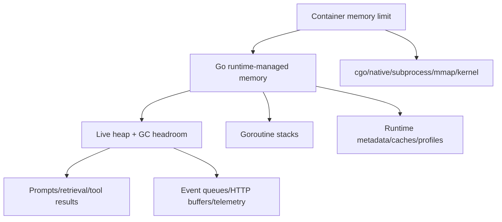

# Go Memory, GC, and Container Resources

> **Last researched:** 2026-08-31  
> **Baseline:** Go 1.27 runtime; container-aware `GOMAXPROCS`

Agent services are often I/O-bound until they are not. Long prompts, retrieval batches, decoded JSON, tool output, event buffers, stream fan-out, telemetry, and subprocesses can turn concurrent I/O into an abrupt RSS spike. Capacity must be based on peak working set per admitted run, not goroutine count or steady-state heap alone.

## Account for the whole process



The Go runtime memory limit covers memory the runtime manages. It excludes important sources such as cgo-managed memory and memory of child processes. Container RSS includes more than heap; VSS is often misleading because the runtime reserves large virtual address ranges.

Measure:

- container working set/RSS and OOM events;
- Go runtime memory classes;
- live heap, allocation rate, GC CPU, pause and assist time;
- goroutine count/states and stack bytes;
- prompt, retrieval, tool-result, queue, and stream bytes;
- cgo/native and subprocess memory;
- connection pools and file descriptors;
- telemetry/exporter queues.

## Use `GOMEMLIMIT` as a guardrail

`GOMEMLIMIT` or `debug.SetMemoryLimit` sets a soft limit on runtime-managed memory. The runtime can exceed it to avoid GC thrashing, and the limit is not a container hard cap.

Official guidance suggests leaving roughly 5–10% headroom in a controlled container for memory the runtime does not manage. Agent workloads often need more because subprocesses, cgo libraries, mapped models/files, sidecars, and bursty buffers may dominate. Establish headroom empirically.

Do not set the memory limit equal to the cgroup limit. Under an unrealistically low limit, the runtime may spend large CPU on GC and still exceed the target. Alert on GC CPU/assist, allocation rate, and RSS—not only whether the configured limit was crossed.

`GOGC` controls the heap growth trade-off relative to live heap. A higher value can reduce GC CPU at the cost of memory; a lower value can reduce heap growth at the cost of more GC. Tune only after profiles show GC is material.

## Understand container-aware `GOMAXPROCS`

Since Go 1.25, on Linux, the default `GOMAXPROCS` considers the cgroup CPU bandwidth limit and updates when the limit changes, provided the application has not set `GOMAXPROCS` manually. CPU requests without limits are not used.

This improves the common case where a small container runs on a high-core host and would otherwise trigger cgroup throttling and tail-latency spikes. It does not remove capacity work:

- a CPU limit is a throughput budget; `GOMAXPROCS` is an integer parallelism limit;
- fractional limits are rounded according to runtime policy;
- bursty workloads may prefer different trade-offs;
- manual environment/code overrides disable automatic behavior;
- provider/tool concurrency is not controlled by `GOMAXPROCS`;
- CPU requests without limits still need observation.

Record current `/sched/gomaxprocs:threads`, cgroup throttling, runnable goroutines, scheduler latency, and request tail latency during load tests.

## Admit by working set, not cheap goroutines

A goroutine begins with a small stack, but the work it owns may retain megabytes. Estimate peak per-run memory:

```text
peak run bytes ≈ input + prompt copies + retrieval + decoded provider output
               + tool results + event buffers + serialization scratch
               + per-run telemetry/state + safety factor
```

Then constrain concurrent runs against the remaining process budget. Use separate admission for workload classes: a text-only lookup and a repository-analysis tool have different memory/CPU profiles.

Avoid duplicate ownership:

- stream large artifacts instead of repeated `[]byte` copies;
- store large tool output once and pass references;
- do not retain full provider event histories and final assembled output unless required;
- clear long-lived map/cache references and bound cache entries/bytes;
- avoid substring/slice retention of a huge backing buffer when a small copy should outlive it;
- cap telemetry attributes and error bodies.

Pooling can reduce allocation but may retain peak-sized buffers forever and complicate security erasure. Pool only measured hot paths; cap or discard oversized buffers before returning them to the pool.

## Distinguish memory profiles

| Evidence | Question |
|---|---|
| Heap `inuse_space` | What live sampled heap is retained now? |
| Heap `alloc_space` | What allocation churn has occurred? |
| `runtime/metrics` memory classes | How runtime-managed memory is distributed |
| Goroutine profile | Which goroutines/stacks remain and where they block |
| `goroutineleak` profile | Which permanently blocked goroutines are unreachable from potential unblockers |
| Container RSS/working set | What physical memory the platform sees |
| Native/subprocess metrics | What Go heap profiles cannot attribute |

Go 1.27's GA `goroutineleak` profile detects a useful class of permanently blocked goroutines using reachability. It cannot detect all leaks, including cases where the synchronization object remains reachable from globals or runnable goroutines. Use it alongside lifecycle tests and ordinary goroutine profiles.

## Container failure patterns

| Symptom | Likely evidence to collect | Common cause |
|---|---|---|
| OOM with small Go heap | RSS, cgo, subprocesses, mmap, decompression | Non-runtime memory or child tools |
| High CPU, heap near limit | GC CPU/assist, allocation profile | Limit too low or allocation churn |
| Latency spikes every cgroup period | CPU throttling, runnable/scheduler metrics | `GOMAXPROCS`/CPU quota mismatch or CPU burst |
| RSS grows after traffic falls | in-use heap, caches, idle conns, scavenger metrics | Retention, pooling, fragmentation, unreleased native memory |
| Goroutines grow with streams | goroutine/leak/block profiles | Missing disconnect/cancellation/close path |
| “Bounded” channel causes OOM | pending element sizes/bytes | Count bound without byte bound |

## Load-test scenarios

- Maximum prompt/tool-result size at maximum admitted concurrency.
- Slow downstream stream consumers while provider streams stay active.
- Cancellation storms during large decode and tool execution.
- High-cardinality tenant traffic that fills caches and metrics.
- Subprocesses at maximum allowed memory and output.
- Provider retry storm that retains multiple bodies/requests.
- GC limit at proposed production headroom with CPU throttling.
- Rolling shutdown while buffers, exporters, and durable workers drain.

Measure peak, not only averages. Verify the process rejects/degrades before the kernel OOM killer decides for it.

## Production checklist

- [ ] Capacity uses measured peak working set per workload class.
- [ ] Counts and bytes are bounded for prompts, results, channels, streams, and caches.
- [ ] `GOMEMLIMIT` leaves measured headroom below the container limit.
- [ ] cgo, subprocess, mmap, sidecar, and kernel memory are included in the budget.
- [ ] Manual `GOMAXPROCS` overrides are intentional and tested.
- [ ] Runtime metrics, RSS, cgroup throttling/OOM, and allocation profiles are correlated.
- [ ] Pools discard oversized buffers and caches have byte-based eviction.
- [ ] `goroutineleak`, goroutine, heap, allocation, block, and trace evidence is captured under fault load.
- [ ] Admission rejects before memory exhaustion.

## Selected primary sources

- [Go garbage collector guide](https://go.dev/doc/gc-guide)
- [Container-aware `GOMAXPROCS`](https://go.dev/blog/container-aware-gomaxprocs)
- [`runtime/metrics`](https://pkg.go.dev/runtime/metrics@go1.27.0)
- [Go 1.27 goroutine leak profile](https://go.dev/doc/go1.27#goroutine-leak-profile)
- [Go diagnostics](https://go.dev/doc/diagnostics)

