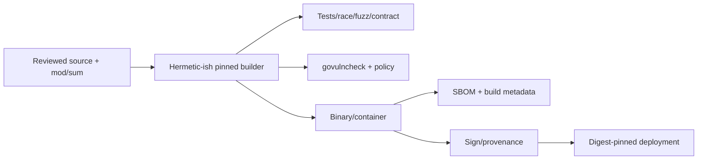

# Go Modules, Supply Chain, and Builds

> **Last researched:** 2026-08-31  
> **Baseline:** Go 1.27 module/toolchain behavior

Go's module checksum system and integrated vulnerability tooling provide a strong foundation. They do not review dependency maintainers, prevent malicious new code, secure build scripts/generators, validate container configuration, or prove artifact provenance by themselves.

## Pin the complete build profile

Record and review:

- `go` and `toolchain` directives;
- all module versions, `replace`, `exclude`, and retract-related decisions;
- `GOOS`, `GOARCH`, cgo, libc, race/FIPS requirements, and build tags;
- generated source and the generator/tool versions;
- linker/build flags and embedded version metadata;
- base/build image digests;
- private proxy/checksum policy;
- framework/provider/MCP/durable SDK versions;
- JSON wire semantics and schema generator version.

Commit `go.mod` and `go.sum`. Use `go mod tidy` as a reviewed change, not an automatic unexplained rewrite in release CI.

## Understand what `go.sum` proves

The Go command hashes downloaded module `.mod` and `.zip` content. If a hash is absent locally, public modules are normally checked against the checksum database's transparent log before adding a `go.sum` entry. This provides global consistency for the bits associated with a module version.

It does not prove:

- that the dependency is trustworthy or vulnerability-free;
- that a maintainer account was not compromised before publication;
- that your program reaches only safe behavior;
- that code run by tests/generators/build tooling is benign;
- that a locally replaced module matches a reviewed upstream version.

`go mod verify` checks cached module content against recorded hashes. It does not replace a clean, controlled build environment or artifact provenance.

## Private modules change the trust path

`GOPRIVATE`, `GONOPROXY`, and `GONOSUMDB` control proxy/checksum behavior. When a module is private or checksum verification is disabled, previously unseen hashes may be accepted without the public checksum database's verification.

Prefer a controlled private proxy with authentication, retention, policy, and audit. Avoid global `GOSUMDB=off` or `GOINSECURE`. Ensure private module paths are configured so they are not leaked to public proxies/checksum services.

Go toolchains can be selected/downloaded according to toolchain rules and proxy settings. If reproducibility requires an exact compiler, pin and provision it in the build environment rather than relying on an unreviewed automatic upgrade.

## Review executable supply-chain surfaces

Some ordinary dependency operations do not execute dependency code, but your development/build pipeline may:

- `go test` compiles/runs test code;
- `go generate` runs arbitrary declared commands;
- code generators and schema tools execute with CI credentials;
- cgo invokes C toolchains and links native dependencies;
- build scripts, Makefiles, container steps, and package-manager hooks execute;
- linters/static analyzers parse and sometimes load packages;
- agent-driven builds may themselves choose commands/dependencies.

Do not run untrusted repository tests, generators, or builds on privileged CI workers with production credentials. Sandbox builds and PR jobs, restrict network and secrets, and separate trusted release workflows.

## Use vulnerability information correctly

`govulncheck` uses the Go vulnerability database and call-graph information to highlight known vulnerabilities in functions/methods your program may reach, reducing noise compared with version-only scanners.

It cannot find:

- unknown vulnerabilities;
- malicious dependencies without an advisory;
- model/tool authorization flaws;
- unsafe subprocess/network policy;
- vulnerabilities only visible in deployment configuration;
- every reflection/plugin/dynamic reachability case.

Run source and binary scans where appropriate, track tool/database freshness, and combine results with dependency review, SBOM, secret scanning, static analysis, fuzzing, race testing, and runtime hardening.

## Keep the dependency graph small and legible

Agent frameworks can pull provider clients, telemetry exporters, cloud SDKs, parsers, and native libraries. Before adopting one:

- inspect direct and transitive module count and licenses;
- identify cgo/native/platform-specific code;
- review maintainers, release/signing policy, security process, and compatibility promises;
- verify exact provider and transport features;
- check whether optional integrations can remain out of the binary;
- test the upgrade/rollback path and data compatibility.

Use the standard library or a narrow official SDK when it meets the requirement. Do not build a generic abstraction solely to make swapping every provider theoretically possible; isolate the domain boundary that actually varies.

## Reproducible release pipeline

Recommended release evidence:

- source revision and dirty-state policy;
- `go version -m`/build info where applicable;
- module graph and `go.sum`;
- SBOM including OS/native packages;
- toolchain/build image digest;
- test and vulnerability scan results;
- artifact digest, signature, and provenance attestation;
- deployment configuration/version and rollback target.

Use multi-stage images or minimal base images, but do not assume a static binary means no runtime assets, CA roots, timezone data, dynamic libc, or cgo dependencies. Verify DNS/TLS/locale/timezone and FIPS requirements in the actual image.

## Upgrade policy

Treat upgrades as compatibility experiments:

1. read Go/module/framework/provider release notes and advisories;
2. update one coherent layer where possible;
3. inspect `go.mod`, `go.sum`, module graph, generated code, and binary size;
4. run JSON/schema golden tests, provider/MCP contracts, durable replay, race, fuzz, and fault load;
5. compare profiles, RSS, GC, latency, attempts, and telemetry;
6. canary with observable rollback;
7. retain older workflow code/payload readers as long as durable histories require them.

Go's compatibility promise applies to Go programs within its documented scope. It does not promise provider schema, generated SDK, MCP revision, framework, plugin, private module, or durable-history compatibility.

## Build and supply-chain checklist

- [ ] `go.mod`, `go.sum`, toolchain, build tags, images, and generators are pinned/reviewed.
- [ ] `replace`/`exclude`, private proxy, checksum, and insecure-download settings are audited.
- [ ] `go mod verify` and `govulncheck` run in controlled CI.
- [ ] Untrusted tests/generators/builds do not receive release or production credentials.
- [ ] cgo/native dependencies and platform requirements appear in SBOM and scans.
- [ ] Release artifacts carry build metadata, digest, signature/provenance, and rollback mapping.
- [ ] Runtime image behavior is tested on every target OS/architecture.
- [ ] Framework/provider/MCP/durable upgrades run contract and replay suites.
- [ ] Vulnerability scanning is treated as one control, not proof of safety.

## Selected primary sources

- [Go modules reference](https://go.dev/ref/mod)
- [Go toolchains](https://go.dev/doc/toolchain)
- [Go security and `govulncheck`](https://go.dev/doc/security/)
- [Go security best practices](https://go.dev/doc/security/best-practices)
- [Go release history and policy](https://go.dev/doc/devel/release)

