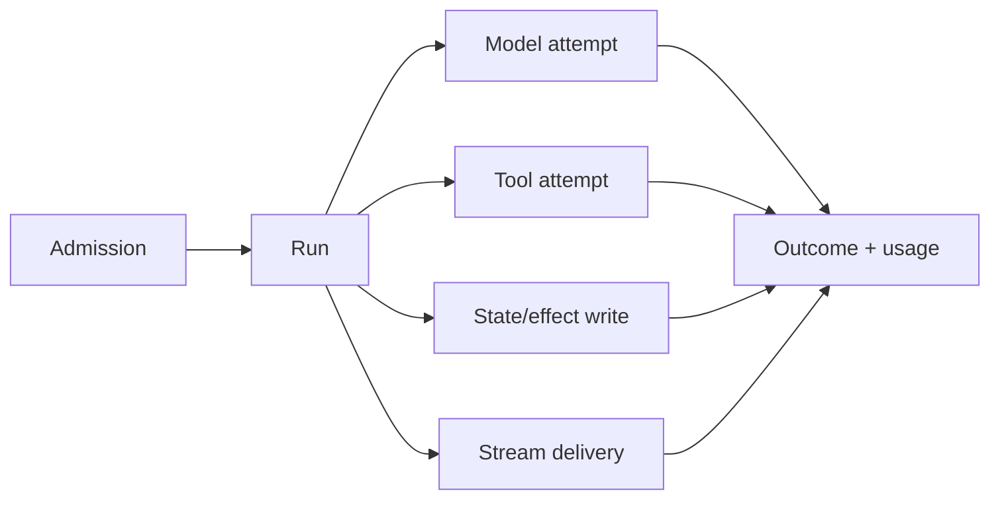

# Go Observability, Profiling, and Debugging

> **Last researched:** 2026-08-31  
> **Baseline:** Go 1.27 runtime diagnostics; OpenTelemetry Go traces/metrics stable and logs Beta

Distributed traces explain a run across services. Go runtime profiles explain where one process spends CPU, memory, and wait time. Execution traces explain scheduler and GC behavior. Production diagnosis needs all three, linked by stable run/effect identities and collected without leaking prompts or secrets.

## Instrument the agent lifecycle

Useful spans/events include:

- admission/queue wait and limiter class;
- run/turn identity and state transition;
- provider/model attempt, first event, stream idle, usage, finish class;
- tool validation, authorization, wait, execution, and effect receipt;
- durable workflow/activity/step identity and replay attempt;
- client stream connection, pending bytes, disconnect, and terminal delivery;
- retry attempt, backoff, deadline source, cancellation cause;
- shutdown phase and remaining active owners.

Keep high-cardinality identities in traces/logs, not metric labels. Metrics should use bounded dimensions such as operation, provider, model family, tool class, outcome class, tenant tier, and region. Do not label metrics with run ID, user ID, prompt, URL, error message, or arbitrary tool name unless the set is controlled.

## Correlate without logging sensitive content

Prefer:

- opaque run, attempt, tool-call, and effect IDs;
- schema/version and byte/token counts;
- safe error codes/classes;
- provider request ID where policy permits;
- content digests for correlation, not raw content;
- redaction/classification decisions;
- explicit truncation markers.

Prompts, tool arguments/results, model output, authorization tokens, headers, and subprocess output often contain secrets or personal data. Sampling is not a privacy control. Establish allowlisted fields, retention, encryption, access control, and deletion policy.

## Export Go runtime metrics

`runtime/metrics` provides a stable runtime metric surface. Important families for agent services include:

- `/memory/classes/...` and GC cycles/heap goals;
- `/sched/goroutines:goroutines` and runnable/running/waiting counts;
- `/sched/latencies:seconds`;
- `/sched/gomaxprocs:threads`;
- GC pause/stop distributions;
- mutex and CPU class metrics where relevant.

Translate them into your monitoring system with controlled names and units. Track application gauges beside them: admitted/active runs, permits by class, pending queue/events/bytes, active streams, subprocesses, leases, retries, and telemetry queue drops.

## Choose the correct profile

| Profile/evidence | Best question |
|---|---|
| CPU | Where does active CPU time go? |
| Heap `inuse` | What sampled live heap is retained? |
| Allocations | What creates allocation/GC pressure? |
| Goroutine | What goroutines exist and where are they blocked? |
| `goroutineleak` | Which permanently blocked goroutines are unreachable from possible unblockers? |
| Block | Where does time block on synchronization/channels? |
| Mutex | Where is lock contention delaying progress? |
| Threadcreate | What causes OS-thread creation? |
| Execution trace | How do scheduler, goroutines, syscalls, GC, and parallelism interact? |

Block and mutex profiles require sampling configuration and add overhead. CPU profiling, precise memory profiling, block profiling, and execution tracing can interfere with each other. Collect one diagnostic at a time when accuracy matters and measure overhead before enabling it broadly.

Go 1.27's `goroutineleak` profile is available through `runtime/pprof` and `/debug/pprof/goroutineleak`. It detects permanently blocked goroutines by reachability but cannot find every leak, especially synchronization objects reachable from globals or runnable goroutines.

## Secure diagnostic endpoints

Do not expose `net/http/pprof` on a public application mux. Profiles and goroutine stacks can reveal URLs, file paths, identifiers, code structure, and sometimes sensitive values.

Use:

- a separate admin listener or on-demand collection path;
- strong authentication and network policy;
- least-privilege operator access and audit;
- bounded profile duration and concurrency;
- retention and encryption appropriate to sensitive diagnostic artifacts;
- no accidental import-side registration on the public default mux.

Prefer collecting from one representative replica at a time. Save the matching binary/build ID and symbols so profiles remain actionable after deployment changes.

## Use execution trace for scheduler causality

`go tool trace` captures scheduler, goroutine, syscall, network-blocking, GC, and runtime events. Use it when CPU profiles do not explain latency, such as:

- runnable goroutines waiting for CPU;
- serialization caused by a lock/channel;
- cgroup throttling interactions;
- stop-the-world and GC-assist behavior;
- syscalls or cgo blocking OS threads;
- unexpected loss of parallelism.

Annotate important process-local work with `runtime/trace` tasks and regions using run/operation categories, not sensitive prompt text. Runtime trace is not a replacement for distributed tracing; link them by timestamp, build, replica, and opaque run identity.

## OpenTelemetry boundaries

At the research snapshot, OpenTelemetry Go traces and metrics are stable; logs are Beta. Semantic conventions can have a maturity level independent of the SDK.

Operational rules:

- initialize SDK/exporters in the application, not a library;
- libraries depend on API packages and remain no-op without an SDK;
- propagate context across HTTP, queue, tool, and durable boundaries deliberately;
- configure batching queues and drop/error metrics;
- flush with a bounded process-owned shutdown context;
- avoid duplicate instrumentation when SDK/framework and HTTP middleware both create spans;
- version custom agent semantic attributes and keep cardinality controlled.

Do not assume a framework's “observability enabled” covers runtime memory, scheduler delay, effect reconciliation, queue leases, or business state transitions.

## Incident playbook

| Symptom | Start with | Then correlate |
|---|---|---|
| Tail latency rises, CPU low | Run spans, block/mutex profile | Pool/permit wait, slow consumers, dependency timing |
| CPU high | CPU profile | allocation profile, cgroup throttling, retry volume |
| RSS rises | heap in-use/alloc + runtime classes | native/subprocess memory, buffers, active runs |
| Goroutines rise | goroutine + `goroutineleak` | stream disconnects, blocked sends, pipe/process wait |
| Throughput falls | scheduler metrics/trace | runnable queue, `GOMAXPROCS`, locks, downstream quotas |
| Duplicate effects | effect/run logs and durable history | retry layers, lost responses, idempotency record |
| Shutdown hangs | goroutine/block profiles | WebSockets, exporters, queue leases, subprocess descendants |

Capture evidence before restarting when safe. A restart may restore service but erase the blocked-stack, heap-retention, or lease state needed to fix the defect.

## Production checklist

- [ ] Run, attempt, tool-call, and effect IDs connect traces, logs, and durable records.
- [ ] Metrics have bounded label sets and separate queue wait from execution.
- [ ] Prompts/results/secrets are excluded by allowlist, not redacted after arbitrary logging.
- [ ] Runtime metrics and application resource gauges are exported together.
- [ ] pprof/trace endpoints are isolated, authenticated, bounded, and audited.
- [ ] Matching binaries/symbols/build metadata are retained for profiles.
- [ ] CPU, heap, alloc, block, mutex, goroutine, leak, and execution-trace collection is rehearsed.
- [ ] Telemetry exporter queues, errors, and drops are observable.
- [ ] Shutdown flushes telemetry within a bounded independent context.

## Selected primary sources

- [Go diagnostics](https://go.dev/doc/diagnostics)
- [`runtime/pprof`](https://pkg.go.dev/runtime/pprof@go1.27.0)
- [`runtime/trace`](https://pkg.go.dev/runtime/trace@go1.27.0)
- [`runtime/metrics`](https://pkg.go.dev/runtime/metrics@go1.27.0)
- [OpenTelemetry Go](https://opentelemetry.io/docs/languages/go/)

