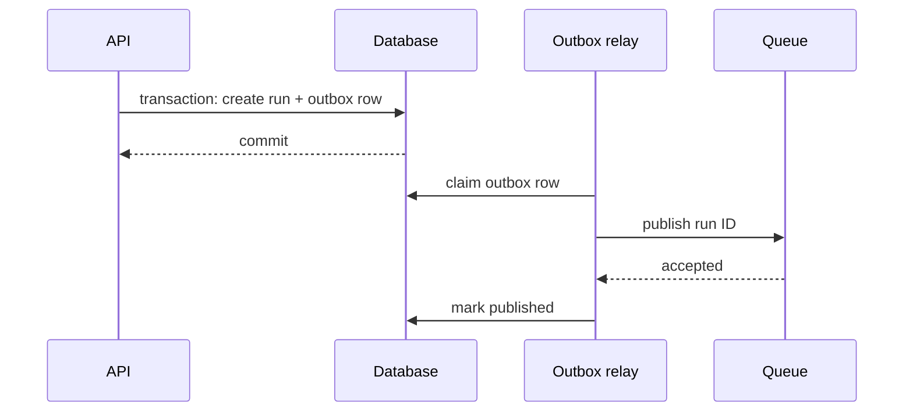

# Go Queues, State, and Durable Workers

> **Last researched:** 2026-08-31  
> **Use with:** [Durable execution](../../runtime/durable-execution.md) and [idempotency](../../reliability/idempotency-and-side-effects.md)

Goroutines and channels provide in-process concurrency. They do not survive a process crash, retain a user approval for days, replay completed steps, or coordinate ownership across replicas. Use a durable queue or workflow engine when the business run must outlive the process.

## Make the durability boundary explicit

| Requirement | Smallest practical mechanism |
|---|---|
| Finish within one request and safe to lose on crash | Owned goroutine tree |
| Background work, redelivery acceptable | Durable queue + idempotent worker |
| Queryable multi-step run state | Database state machine + outbox/leases |
| Long waits, signals, timers, replay, operator repair | Durable workflow engine |
| Atomic DB write plus job publication | Transactional outbox or engine/database integration |

Do not add a workflow engine to make a three-step request handler look sophisticated. Do not keep a goroutine alive for a business process that must survive restart.

## Model durable run state

A durable run record commonly needs:

- run ID, tenant/principal, workflow type and schema version;
- current state, attempt/version, lease owner and expiry;
- input/reference and bounded canonical digest;
- deadline/cancellation intent;
- tool calls, effect IDs, and receipts;
- model call receipts and output artifact references;
- checkpoint/event sequence;
- terminal result/error code;
- created/updated/retention metadata.

Use an atomic version/lease condition on every worker transition:

```sql
UPDATE runs
SET state = $next, version = version + 1, updated_at = now()
WHERE id = $id AND version = $expected AND lease_token = $lease;
```

If zero rows update, the worker no longer owns the run. Stop before publishing a late result.

## Queue semantics are part of correctness

Define:

- delivery guarantee and acknowledgement boundary;
- visibility/lease duration and extension/heartbeat;
- maximum attempts and retry delay;
- ordering and partition key;
- per-tenant/global concurrency and rate limits;
- deduplication scope/retention;
- poison work and repair/dead-letter path;
- payload size, encryption, privacy, and retention;
- shutdown behavior for leased work.

A lease must exceed normal step time or be extended cooperatively. If a worker loses the lease, it must be fenced even if its context cancellation arrives late.

Queue payloads should contain identities and immutable references, not huge prompts, credentials, or mutable SDK objects. Workers reauthorize when necessary; submission-time authorization may not remain valid for a delayed high-impact effect.

## Use an outbox for state plus publication



The outbox prevents the gap where the run commits but queue publication does not, or vice versa. The relay and consumer still need idempotency because publication/acknowledgement can be repeated.

## Keep replay code deterministic

Durable engines rebuild state from a history/journal. Model calls, HTTP, database queries, current time, random IDs, map iteration, goroutine scheduling, and native `select` are nondeterministic unless the engine records them through a supported primitive.

Put external work in an Activity/step/run block. Store a versioned domain result or receipt. Workflow code decides; activities perform effects.

Never replay a model call to “reconstruct” its earlier answer. Models and provider behavior change, and the second call incurs cost and can choose different tools.

## Current Go durable-runtime boundaries

| Runtime | Go production boundary | Important constraints |
|---|---|---|
| Temporal | Mature Go SDK, Workflows + Activities + Workers | Workflow code deterministic; Activities own I/O/effects; configure timeouts, retries, heartbeats, cancellation, history, and versioning |
| Restate | Go services, virtual objects, workflows, durable steps | Nondeterminism in `restate.Run`; use Restate durable concurrency, not goroutines/channels around blocking Restate operations |
| DBOS | Go workflows, steps, queues, durable `Go`/`Select` | Steps execute at least once; use durable concurrency primitives; error serialization and queue-version behavior matter |
| Dapr Workflow | Go SDK with Dapr runtime/sidecar/state-store | Orchestration is deterministic; operational correctness includes sidecar/runtime/state-store deployment |

### Temporal

Temporal Workflow code must remain deterministic. External API/model/database work belongs in Activities. Configure at least Start-to-Close and usually Schedule-to-Close/Schedule-to-Start and heartbeat timeouts based on the activity. Heartbeat long activities so cancellation and progress are observable. Use Worker Versioning or patching for changes that would break replay, and control history growth with Continue-As-New where appropriate.

### Restate

Restate records durable operations in an execution log and replays application code. Wrap nondeterministic operations in `restate.Run`, use its deterministic time/random/concurrency primitives, and mark terminal errors deliberately. Its Go docs explicitly warn against combining blocking Restate operations with ordinary goroutines, channels, or `select`; use its durable combinators.

### DBOS

DBOS resumes a Workflow from completed durable steps. Steps may re-execute if the process crashes after an external effect but before checkpoint, so target effects still need idempotency. DBOS supplies durable `Go` and `Select` because ordinary goroutine/select ordering is nondeterministic. Queue global concurrency can interact with old application versions; test rollout and pending-work behavior.

### Dapr

Dapr Workflow offers deterministic orchestration through Dapr components. Treat the sidecar/runtime/state store, placement/availability, upgrade policy, API authentication, and observability as part of the system. Dapr Agents is a separate framework and should not be inferred from Go Workflow support.

## State and history design

Persist domain events and receipts, not object graphs from provider or framework SDKs. Version each durable payload and keep migrations readable for the full retention period.

Control history growth:

- store large artifacts outside history with immutable, authorized references;
- summarize/compact conversation state explicitly;
- bound tool output and event count;
- roll/continue long histories using the engine's supported mechanism;
- retain enough receipts to reconcile effects;
- encrypt sensitive payloads and define deletion/retention semantics.

Durability can increase privacy cost because prompts, tool outputs, and errors live longer and replicate into backups/observability systems.

## Human approval and external signals

Persist an approval request with exact effect digest, principal, expiry, and policy version. A later response must bind to that request and re-check that:

- the run/attempt is still current;
- the proposed arguments have not changed;
- the approver has current authority;
- the approval has not expired or already been consumed;
- the target resource has not changed in a way that invalidates the decision.

Use durable signals/promises/callback tokens, not an in-memory channel that disappears on restart.

## Failure-injection checklist

- [ ] Crash after an effect commits but before its step/checkpoint completes.
- [ ] Redeliver the same queue message concurrently to two workers.
- [ ] Let a lease expire while the old worker continues.
- [ ] Cancel during a long model/tool activity and during a durable sleep.
- [ ] Deploy new workflow code while old histories are active.
- [ ] Fill queue partitions and verify tenant fairness and global limits.
- [ ] Exceed history/payload limits with long-context runs.
- [ ] Lose the queue after committing the run/outbox transaction.
- [ ] Replay with the current code and previous retained payload versions.
- [ ] Rotate/delete credentials while delayed work is pending.

## Selected primary sources

- [Temporal Go developer guide](https://docs.temporal.io/develop/go)
- [Temporal Go versioning](https://docs.temporal.io/develop/go/workflows/versioning)
- [Restate Go durable steps](https://docs.restate.dev/develop/go/durable-steps)
- [Restate Go concurrent tasks](https://docs.restate.dev/develop/go/concurrent-tasks)
- [DBOS Go workflows](https://docs.dbos.dev/golang/tutorials/workflow-tutorial)
- [DBOS Go queues](https://docs.dbos.dev/golang/tutorials/queue-tutorial)
- [Dapr Workflow overview](https://docs.dapr.io/developing-applications/building-blocks/workflow/workflow-overview/)

