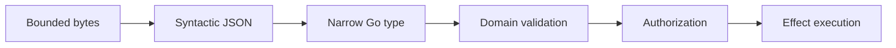

# Go Schemas, Serialization, and Structured Output

> **Last researched:** 2026-08-31  
> **Baseline:** `encoding/json/v2` and `encoding/json/jsontext` in Go 1.27

Go's static types constrain trusted program values. Model output, tool arguments, provider events, queue messages, durable histories, and HTTP bodies are still hostile bytes. Production boundaries need strict decoding, domain validation, authorization, schema/version discipline, and compatibility tests.

## Use a staged boundary



Each stage answers a different question:

1. Are the bytes within transport/resource limits?
2. Is this valid, interoperable JSON?
3. Does it match the expected shape?
4. Are values meaningful and safe for this operation?
5. May this user/tenant/run perform the effect now?

JSON Schema does not enforce authorization, cross-record invariants, resource existence, or business policy.

## Design narrow wire types

Avoid `map[string]any` at stable boundaries. Use explicit types with documented optionality:

```go
type SearchArgs struct {
	Query string `json:"query"`
	Limit *int   `json:"limit,omitempty"`
}

func (a SearchArgs) Validate() error {
	if strings.TrimSpace(a.Query) == "" {
		return ErrEmptyQuery
	}
	if a.Limit != nil && (*a.Limit < 1 || *a.Limit > 100) {
		return ErrInvalidLimit
	}
	return nil
}
```

Pointers can distinguish absent from present zero, but do not use them everywhere. For public/durable contracts, explicitly define:

- absent versus `null` versus zero/empty;
- unknown-member behavior;
- case sensitivity;
- number range and precision;
- duplicate object-name behavior;
- enum extensibility;
- timestamp/duration/UUID representation;
- maximum string, array, map, and nesting sizes;
- forward/backward version policy.

Generate a schema from the same canonical type only if the generator produces the provider-supported subset. Inspect the emitted schema in tests; provider “structured output” dialects often support less than full JSON Schema.

## Go 1.27 JSON v2 changes the migration question

Go 1.27 makes `encoding/json/v2` and `encoding/json/jsontext` generally available. V2 has configurable options and stricter, more interoperable defaults, including rejecting invalid UTF-8 in strings and duplicate names in objects. The old `encoding/json` API is backed by the v2 implementation while preserving v1 behavior, though exact error text may change.

Migration risk is behavioral, not merely an import rename. Important v1/v2 differences include nil slice/map encoding, case matching, unknown members, byte-array handling, custom marshal method semantics, duplicate fields, invalid UTF-8, and tag behavior.

Use one wire contract per boundary:

| Boundary | Recommended approach |
|---|---|
| New security-sensitive tool input | V2 strict defaults plus explicit unknown-member policy |
| Existing public API | Golden compatibility fixtures; migrate option-by-option |
| Durable history/checkpoint | Freeze codec and schema version; never silently flip semantics |
| Provider SDK object | Use SDK codec expectations; translate into domain type |
| Large/streaming JSON | `jsontext.Decoder` or bounded streaming decoder with depth/item limits |

The Go migration guide recommends an all-at-once path only for lower-risk applications, option-by-option troubleshooting, and production comparison tooling for server migrations. Do not deploy a global codec change without cross-version and cross-language fixtures.

## Enforce unknown-field policy deliberately

Unknown fields can help forward compatibility but can also hide model hallucinations and misspellings (`recpient` instead of `recipient`). For effectful tool input, rejecting unknown members is usually safer. For evolving events, use an envelope/version and a compatibility policy.

```go
type Envelope struct {
	Version int             `json:"version"`
	Type    string          `json:"type"`
	Data    jsontext.Value  `json:"data"`
}
```

Decode the envelope, select a known version/type, then decode `Data` into its exact type. Do not accept a new version and “best effort” an external effect.

## Structured output is still fallible

Provider-enforced structured output reduces syntax and shape errors. It does not guarantee:

- semantic correctness;
- factual accuracy;
- safe or authorized arguments;
- satisfaction of constraints unsupported by the provider dialect;
- stability across model/provider versions;
- a response before timeout or truncation;
- valid partial output during streaming.

Validate the completed value locally. Never execute a mutating tool from partial streamed JSON. If a provider refuses, truncates, or returns a safety outcome, treat it as a distinct result class rather than a generic parse error.

## Keep SDK types out of durable state

Provider and framework types evolve for API parity, not your replay compatibility. Translate them into versioned domain records:

```go
type ModelReceiptV1 struct {
	Provider       string
	Model          string
	ProviderID     string
	FinishReason   string
	Usage          Usage
	OutputDigest   string
	RecordedAt     time.Time
}
```

Store raw provider payloads only when audit/debug value justifies privacy, retention, and migration cost. If stored, encrypt/classify them, cap size, record content type and SDK/API version, and keep domain state independently readable.

## Numbers, maps, and canonicalization

Decoding arbitrary JSON numbers into `float64` can lose integer precision. Use typed integer/decimal fields, a decoder number mode, or raw numeric tokens followed by range validation.

Do not sign, hash for equality, or use JSON bytes as an idempotency key unless you define canonicalization. Object key order, whitespace, numeric representation, omitted fields, and nil/empty behavior can differ. Prefer a versioned canonical request structure and explicit digest algorithm.

Maps are unordered in Go semantics. Never rely on map iteration order for prompts, durable decisions, workflow replay, signatures, or golden output.

## Bound decoding work

An HTTP byte limit is necessary but insufficient. Also limit:

- decompressed bytes;
- JSON nesting depth;
- array/map element counts;
- individual string and base64 sizes;
- retained raw values;
- schema complexity and recursion;
- error detail copied into logs or model context.

Reject early before allocating large nested objects. Fuzz decoders and validators with duplicates, invalid UTF-8, extreme numbers, deep nesting, repeated keys, huge arrays, and version confusion.

## Compatibility test matrix

- [ ] Golden fixtures round-trip across the current and previous deployed version.
- [ ] V1/v2 JSON semantics are compared for every existing wire/durable boundary.
- [ ] Unknown, duplicate, case-variant, missing, `null`, and zero fields have explicit expectations.
- [ ] Provider schema generation is snapshot-tested against its supported subset.
- [ ] Structured outputs are locally validated before authorization/execution.
- [ ] Cross-language consumers agree on numbers, timestamps, UUIDs, bytes, nil/empty, and enums.
- [ ] Durable payload migrations can read all retained versions.
- [ ] Size/depth/item limits fail predictably without large allocations.
- [ ] Error messages are not asserted verbatim when the contract is an error class/path.

## Selected primary sources

- [Go 1.27 release notes: JSON v2](https://go.dev/doc/go1.27#json_v2)
- [`encoding/json/v2` migration guide](https://go.dev/doc/jsonv2-migration)
- [`encoding/json/v2`](https://pkg.go.dev/encoding/json/v2@go1.27.0)
- [`encoding/json/jsontext`](https://pkg.go.dev/encoding/json/jsontext@go1.27.0)

