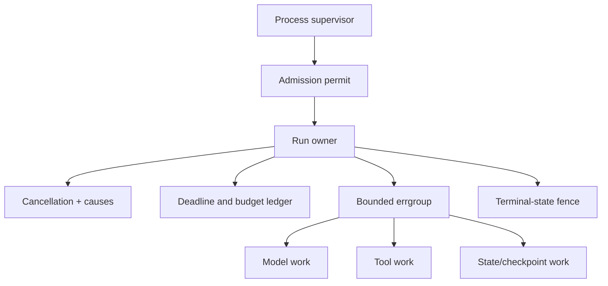
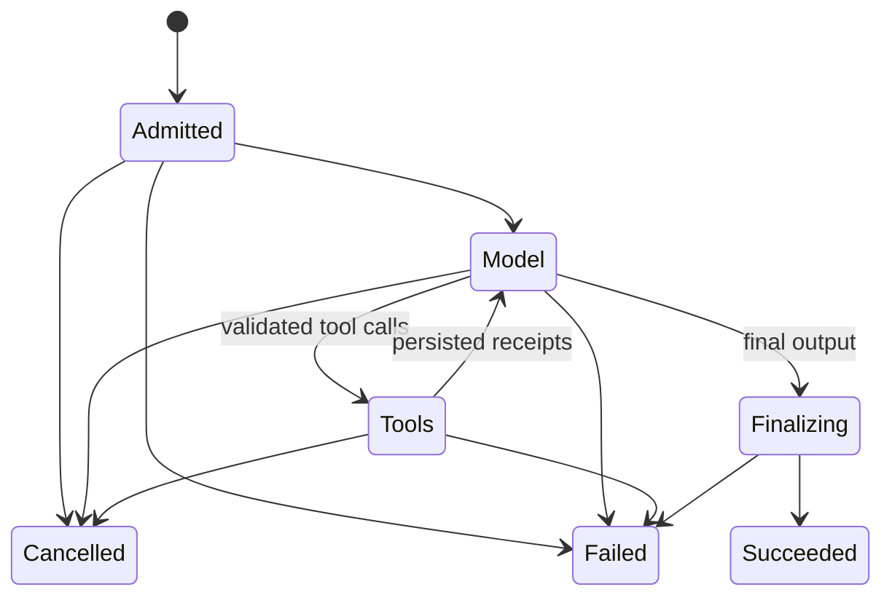

# Go Service Architecture and Goroutine Ownership

> **Last researched:** 2026-08-31  
> **Use with:** [Run controls](../../runtime/run-controls.md) and [execution boundaries](../../runtime/execution-boundaries.md)

Go makes starting concurrent work trivial. Production architecture is the discipline of making the owner of that work equally obvious.

## Separate process services from run authority

A practical service has a small process-scoped dependency graph and an explicit run-scoped object:

```go
type App struct {
	HTTP      *http.Client
	Providers ProviderRegistry
	Tools     ToolRegistry
	Runs      RunStore
	Limits    *Limits
}

type Run struct {
	ID       RunID
	TenantID TenantID
	Attempt  uint64
	Budget   Budget
}

func (a *App) Execute(ctx context.Context, run Run, input Input) (Result, error)
```

`App` owns long-lived clients, stores, registries, and process limits. `Run` carries identity and policy for one attempt. The `context.Context` carries lifetime. Do not store request contexts in `App`, and do not use a global cancellation function for per-run work.

Use distinct types for values whose accidental interchange would be dangerous:

```go
type RunID string
type ToolCallID string
type EffectID string
type TenantID string

type AuthorizedCall struct {
	CallID   ToolCallID
	EffectID EffectID
	Tool     ToolName
	Args     ValidatedArgs
}
```

The useful distinction is raw → decoded → validated → authorized → executed. Types should prevent raw model strings or unvalidated maps from reaching an effect executor.

## Give each run one owner



The run owner must:

- acquire admission before allocating large prompts or retrieval results;
- derive and cancel the run context;
- start only work it can join or deliberately hand to another supervisor;
- hold resource permits for the complete protected operation;
- reconcile child results into one terminal outcome;
- fence late writes with run ID, attempt, version, or lease token;
- persist effect receipts before a later model turn depends on them.

An `errgroup.Group` is a good default for a finite group of related subtasks:

```go
g, groupCtx := errgroup.WithContext(ctx)
g.SetLimit(maxParallelTools)

results := make([]ToolResult, len(calls))
for i, call := range calls {
	i, call := i, call
	g.Go(func() error {
		result, err := executeTool(groupCtx, call)
		if err != nil {
			return fmt.Errorf("tool %q: %w", call.Name, err)
		}
		results[i] = result // each goroutine owns a distinct slot
		return nil
	})
}
if err := g.Wait(); err != nil {
	return nil, err
}
```

This joins all functions and cancels the derived context after the first error. It does not make a non-cooperative tool stop, enforce byte limits, recover remote effects, or provide durable execution. `SetLimit` also makes `Go` block when full; use `TryGo` when overload should be rejected or queued instead.

## Prefer structured lifetime to detached work

Every `go f()` should fit one of these categories:

| Category | Owner | Completion rule |
|---|---|---|
| Synchronous child | Current run | Joined before the run returns |
| Dynamic run child | Current run tracker/group | Drained on all terminal paths |
| Process service | Process supervisor | Stopped and joined during shutdown |
| Durable job | Queue/workflow runtime | Identified, persisted, leased, retried, and acknowledged |

“Fire and forget” is not a fifth category. If work must outlive an HTTP request, transfer it to a process supervisor or durable queue with a new identity, context, deadline, retry policy, and shutdown behavior. `context.WithoutCancel` alone does not perform that transfer.

Avoid starting goroutines from constructors unless the returned object exposes `Close`/`Wait` and the caller is clearly responsible for them. Background refreshers and exporters should surface startup failure and terminate when their owner stops.

## Keep state transitions explicit

Represent legal run states, rather than scattering booleans across goroutines:

```go
type RunState uint8

const (
	StateAdmitted RunState = iota
	StateModel
	StateTools
	StateFinalizing
	StateSucceeded
	StateFailed
	StateCancelled
)
```



Local mutexes can protect a transition inside one process. A compare-and-swap version, lease token, transaction, or durable runtime is needed to fence two workers or a restarted attempt. Terminal invariants should include:

- exactly one terminal state is externally visible;
- a cancelled or superseded attempt cannot advance state;
- each tool call has a unique call ID;
- each mutating effect has a stable effect ID across retries;
- a client disconnect has a documented run-continuation policy;
- receipts are durable before the next decision consumes them.

## Use interfaces at volatile or high-trust boundaries

Narrow interfaces are valuable for providers, effects, persistence, clocks, and isolation:

```go
type ModelGateway interface {
	Stream(context.Context, ModelRequest) (ModelStream, error)
}

type EffectExecutor interface {
	Execute(context.Context, AuthorizedCall) (EffectReceipt, error)
}
```

Keep concrete orchestration code where there is only one implementation. A large `AgentRuntime` interface, repository abstraction over a single store, or generic framework that mirrors every internal method usually hides the invariants reviewers need to see.

## Choose synchronization by ownership

| Need | Prefer | Warning |
|---|---|---|
| Immutable process dependency | Plain field / immutable value | Do not smuggle mutable request state into it |
| Small shared critical section | `sync.Mutex` / `RWMutex` | Never hold across provider/tool I/O |
| Single owner with ordered commands | Bounded channel + owner goroutine | Bound payload bytes and sender lifetime |
| Finite related subtasks | `errgroup` | Child work must observe cancellation |
| Resource capacity | Semaphore / token channel | The permit must live through cleanup |
| Cross-process state transition | Database/version/lease | A local lock is insufficient |

A channel-owned run state machine can simplify ordering, but one goroutine per run is not free when runs wait for days. Persist and suspend long waits rather than retaining a goroutine, timers, buffers, and connections indefinitely.

## Architecture anti-patterns

| Anti-pattern | Failure | Better design |
|---|---|---|
| Global `map[RunID]*Run` as source of truth | Lost on crash; unbounded retention; contention | Durable store plus bounded cache |
| Detached goroutine writes run state | Late writes after cancellation; hidden failure | Join under run owner or durable job |
| One semaphore for every dependency | Unrelated slow tool blocks all work | Limit by provider, tenant, tool/resource class |
| Mutex held during network call | Convoy and shutdown stalls | Copy state, release lock, perform I/O, reconcile |
| Provider response object stored durably | SDK upgrades break replay/data | Versioned domain event and raw receipt where needed |
| Panic as ordinary tool failure | Can crash process and skip reconciliation | Return typed errors; recover only at deliberate containment boundaries |

## Review checklist

- [ ] The process supervisor, run owner, and owner of every goroutine are identifiable.
- [ ] Every goroutine is joined, supervised, or represented as a durable job.
- [ ] Admission happens before large allocations and external work.
- [ ] Permit lifetime covers the operation and cleanup it protects.
- [ ] State transitions are fenced across attempts and processes.
- [ ] Raw, validated, authorized, and executed values cannot be confused.
- [ ] Client disconnect, cancellation, process crash, and duplicate delivery have separate semantics.
- [ ] Interfaces exist only where substitution, testing, or authority boundaries justify them.

## Selected primary sources

- [Go context package](https://pkg.go.dev/context@go1.27.0)
- [`errgroup` package](https://pkg.go.dev/golang.org/x/sync/errgroup)
- [Go pipelines and cancellation](https://go.dev/blog/pipelines)
- [Go memory model](https://go.dev/ref/mem)

