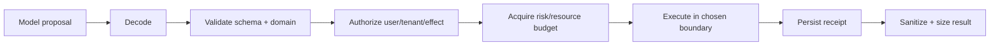

# Go Tools, Processes, and Sandboxing

> **Last researched:** 2026-08-31  
> **Use with:** [Tool contracts](../../tools/tool-contracts.md) and [permissions, sandboxing, and secrets](../../security/permissions-sandboxing-and-secrets.md)

An in-process Go tool has the authority of the agent service: memory, credentials, filesystem, network, database clients, and process identity. `os/exec` starts a process; it does not create a security boundary. Tool architecture must make authority, validation, isolation, cancellation, and effect reconciliation explicit.

## Separate the tool pipeline into gates



Do not combine validation and authorization. A perfectly valid delete request may still be unauthorized. Do not let tool descriptions or “read-only” annotations substitute for policy enforcement at execution time.

Each mutating call should carry a stable effect ID allocated before the first attempt. Persist the request hash, authorization decision, attempt, dependency receipt, and terminal classification needed for reconciliation.

## Choose the execution boundary by trust

| Boundary | Appropriate for | What it does not provide |
|---|---|---|
| In-process function | Fully trusted, reviewed, narrow capability | Isolation from panic, memory corruption via unsafe/cgo, credential access |
| Child process | Trusted executable needing resource/process separation | Strong sandbox, descendant cleanup, filesystem/network isolation |
| Container/OS sandbox | Untrusted or semi-trusted tools | Perfect escape prevention; requires hardened policy and updates |
| Wasm runtime | Portable capability-oriented plugins | Universal syscall/library compatibility |
| Remote tool service | Strong operational/credential separation | Automatic authorization or trustworthy responses |
| Disposable VM/microVM | Hostile code or high-impact boundary | Low latency or low operational cost |

Put model-generated shell, code, package installs, browser automation, document parsers, and user-supplied plugins outside the controller process. Run the agent controller with less authority than the isolated tool host whenever possible.

## Use `os/exec` without a shell by default

```go
cmd := exec.CommandContext(ctx, executable, args...)
cmd.Dir = workspace
cmd.Env = minimalEnvironment()
cmd.Stdin = nil
cmd.WaitDelay = 2 * time.Second
```

Arguments passed to `exec.CommandContext` are not interpreted by a shell. Do not build `sh -c`, `cmd /c`, or PowerShell strings from model input. If a shell is the tool, treat the entire script as hostile code and execute it in the sandbox designed for that authority.

Resolve executables from an allowlist to absolute paths. Go's `os/exec` refuses implicit current-directory PATH resolution with `ErrDot`; keep that defense and avoid `.` in `PATH`. `Cmd.String()` is for debugging and is not valid shell input.

Build a minimal environment rather than inheriting all service secrets. Explicitly control:

- `PATH`, home/temp directories, locale, proxy variables, and credential helpers;
- cloud/provider tokens and metadata-service access;
- working directory and filesystem mounts;
- network/DNS egress;
- stdin availability;
- CPU, memory, process, file, output, and wall-clock limits.

## Bound process output and wait behavior

`CombinedOutput` buffers the complete output. Do not use it for untrusted or unbounded commands. Drain stdout and stderr concurrently into capped sinks or a bounded streaming pipeline.

Call `Wait` exactly once after `Start`; it releases process resources. `Cmd.WaitDelay` bounds two problematic cases after context cancellation or process exit: a child that fails to exit and I/O pipes kept open, often by descendants. A zero `WaitDelay` may wait indefinitely for orphaned descendants holding pipe descriptors.

`CommandContext` defaults to killing only the direct process on cancellation. `os.Process.Kill` explicitly does not kill processes started by that process. Descendant termination is OS-specific:

- on Unix, use a deliberately created process group/cgroup or stronger sandbox supervisor;
- on Windows, use Job Objects or a sandbox runtime that owns the process tree;
- do not assume a portable `SysProcAttr` recipe covers every platform and privilege model.

Test descendant cleanup on every supported OS. A process tree that survives cancellation can retain files, sockets, CPU, and credentials.

## Filesystem access: capability, not path cleanup

Go 1.24 introduced `os.Root` for traversal-resistant operations beneath a directory. Prefer it when a tool must access only a workspace:

```go
root, err := os.OpenRoot(workspace)
if err != nil {
	return err
}
defer root.Close()

f, err := root.Open(userRelativePath)
```

`os.Root` prevents `..` and symlink escape on its supported threat model, but it is not a sandbox:

- it does not prevent access through privileged mount arrangements;
- platform guarantees differ;
- it does not restrict network, processes, existing file descriptors, or in-process code;
- operations with many path components may be expensive;
- use a fully patched Go release because filesystem boundary fixes are security-sensitive.

For lexical-only cases, `filepath.IsLocal`/`Localize` help validate local paths. Do not use “clean then prefix-check” as a defense against symlink and TOCTOU attacks.

## Treat tool results as untrusted input

A tool response can contain prompt injection, malicious markup, huge payloads, secrets, terminal escapes, invalid UTF-8, or schema-confusing duplicate fields.

Before returning a result to the model or user:

- cap bytes and item counts;
- parse into a narrow typed form when possible;
- label origin and trust;
- redact secrets and credentials;
- separate data from instructions;
- escape for the destination renderer/log/terminal;
- store large artifacts out of band with an authorized reference;
- preserve a digest/receipt for audit and replay.

Do not put raw tool output into logs. Do not allow the model to choose arbitrary log fields, metric labels, file paths, URLs, or command names.

## Secrets and network authority

Give each tool only the credential and egress it needs. Prefer a remote capability service or short-lived workload credential over injecting broad service credentials into every subprocess.

Protect against SSRF:

- allowlist schemes and destinations by policy;
- resolve and validate addresses against private/link-local/metadata ranges;
- define redirect policy because redirects can cross trust boundaries;
- revalidate after resolution and consider DNS rebinding;
- use an egress proxy/firewall as the enforcing boundary;
- cap response bytes and time.

Application validation alone is not a complete network sandbox.

## Failure matrix

| Failure | Correct handling |
|---|---|
| Command path chosen by model | Reject; map tool name to allowlisted executable/capability |
| Context cancelled | Begin protocol/OS-specific stop; enforce kill/wait bound; persist ambiguity |
| Direct child exits but descendants remain | Process-group/job/cgroup cleanup; close pipes; incident evidence |
| Output cap reached | Stop/drain by policy, terminate tool if necessary, return explicit truncation |
| Filesystem path escapes | `os.Root`/sandbox enforcement; fail closed |
| Tool write committed, response lost | Query/reconcile by effect ID before retry |
| In-process tool panics | Recover only at registered containment boundary, mark internal failure, inspect invariants |
| Tool returns prompt injection | Treat as data; provenance label, validation, policy, bounded context |

## Production checklist

- [ ] Every tool declares authority, side-effect class, timeout, concurrency class, and maximum input/output.
- [ ] Validation, authorization, and execution are separate gates.
- [ ] Mutating calls receive stable effect IDs before the first attempt.
- [ ] Model input cannot select arbitrary commands, paths, environments, or egress.
- [ ] Process output, process count, CPU, memory, filesystem, network, and wall time are bounded outside the process when needed.
- [ ] Descendant termination is tested on each supported OS.
- [ ] Workspace paths use traversal-resistant APIs plus an isolation boundary appropriate to the threat.
- [ ] Tool results are size-limited, provenance-labeled, redacted, and escaped for their sink.
- [ ] Sandbox escape, policy bypass, ambiguous commit, and cancellation are failure-injected.

## Selected primary sources

- [`os/exec` Go 1.27](https://pkg.go.dev/os/exec@go1.27.0)
- [`os.Process.Kill`](https://pkg.go.dev/os#Process.Kill)
- [Command PATH security in Go](https://go.dev/blog/path-security)
- [Traversal-resistant file APIs](https://go.dev/blog/osroot)
- [`os.Root` Go 1.27](https://pkg.go.dev/os@go1.27.0#Root)
- [Go security best practices](https://go.dev/doc/security/best-practices)

