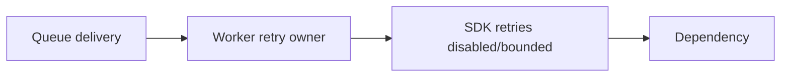
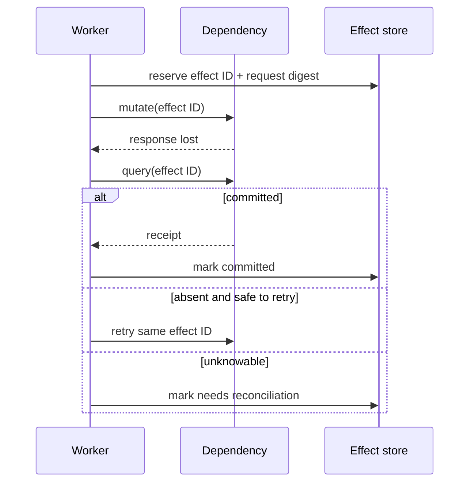

# Go Typed Errors, Retries, and Idempotency

> **Last researched:** 2026-08-31  
> **Use with:** [Idempotency and side effects](../../reliability/idempotency-and-side-effects.md)

Retries are not an error-handling default. They are a semantic decision about an operation, its remaining deadline, the dependency's failure signal, and whether a previous attempt may have committed. Go's error tree supports stable classification, but the application must define the taxonomy and one retry owner.

## Preserve identity while adding context

```go
return fmt.Errorf("execute tool %q for run %s: %w", tool, runID, err)
```

Use `errors.Is`, `errors.As`, and typed/sentinel errors. Never branch on error strings. Wrapping an error makes its identity part of your API, so expose only errors callers should depend on.

`errors.Join` represents multiple independent failures, such as shutdown errors. Its error tree can match any child. Do not use it to hide which failure is primary for retry or terminal-state decisions; carry explicit classification separately when ordering matters.

```go
type Class uint8

const (
	ClassInvalid Class = iota
	ClassDenied
	ClassCancelled
	ClassDeadline
	ClassRateLimited
	ClassUnavailable
	ClassConflict
	ClassAmbiguousEffect
	ClassInternal
)

type OpError struct {
	Op         string
	Class      Class
	RetryAfter time.Duration
	Err        error
}

func (e *OpError) Error() string { return e.Op + ": " + e.Err.Error() }
func (e *OpError) Unwrap() error { return e.Err }
```

Avoid putting secrets, prompts, full tool arguments, or provider bodies into `Error()`.

## Classify before deciding

| Class | Default action |
|---|---|
| Invalid schema/domain | Terminal; return bounded correction detail |
| Unauthorized/forbidden/policy | Terminal; audit without sensitive payload |
| Context cancelled | Terminal for this owner; join/fence children |
| Deadline exceeded | Retry only with budget and safe semantics |
| Rate limited | Honor bounded `Retry-After`; one retry layer |
| Dependency unavailable/reset | Bounded retry for safe/idempotent operations |
| Conflict/version mismatch | Re-read/reconcile; do not blind retry stale write |
| Ambiguous effect | Query by effect/idempotency ID before retry |
| Internal invariant/corruption | Fail closed; capture evidence; avoid automated repetition |

HTTP status alone is insufficient. A `500` after a remote write may be ambiguous; a `429` may apply to an account-wide quota; a connection reset before headers does not prove the server did not commit.

## Give retries one owner

Provider SDK, HTTP middleware, service code, durable activity runtime, and queue can all retry. If each performs three attempts, the dependency can see multiplicative load and duplicate effects.



Record the effective policy:

- total attempts across layers;
- per-attempt and total deadline;
- exponential factor, cap, and jitter;
- retryable classes/status codes;
- whether `Retry-After` is honored and capped;
- idempotency/effect key behavior;
- telemetry for each attempt and final outcome.

Retry sleeps must observe context:

```go
timer := time.NewTimer(delay)
defer timer.Stop()
select {
case <-timer.C:
case <-ctx.Done():
	return context.Cause(ctx)
}
```

Use full or decorrelated jitter to avoid synchronized retry storms. A retry must leave enough time for another complete attempt and final reconciliation.

## Design idempotency before the first call

An idempotency key is not just a random header. Define its scope and durable record:

| Field | Purpose |
|---|---|
| Effect ID/key | Stable identity across all attempts |
| Tenant/principal | Prevent cross-tenant key collision |
| Operation | Bind key to an effect type |
| Canonical request digest | Reject reuse with different arguments |
| State | Reserved, running, committed, failed, unknown |
| Dependency receipt | Reconcile remote outcome |
| Result reference/digest | Return consistent result on duplicate |
| Retention | Cover maximum retry/redelivery window |

The storage operation that claims a key must be atomic. Concurrent callers with the same key should observe one owner or the same completed result. Reuse of a key with a different canonical request must fail.

Exactly-once delivery is not exactly-once effect. Even a durable engine that records a completed step cannot atomically include an arbitrary remote API unless the remote system participates in the same transaction or idempotency protocol.

## Handle the ambiguous window



If the dependency has no idempotency or query mechanism, classify the operation as ambiguous and route to repair/compensation. Blind retry is a product decision with potential duplicate impact, not a reliability improvement.

## Queue and durable-runtime interactions

Queue acknowledgements should occur only after the durable terminal state and required effect receipts are committed. If the process crashes before acknowledgement, redelivery must be safe by run/effect identity.

Durable engines serialize errors differently:

- Temporal converts ordinary Activity errors into `ApplicationError` and exposes distinct timeout, cancellation, and panic types to Workflow code.
- Restate retries handler/run failures unless configured terminal and records step results in its journal.
- DBOS persists workflow errors; concrete Go error identity may not survive its serialization unless the type is encodable and registered, so do not assume `errors.Is/As` survives a database round trip.

Keep a durable, versioned error envelope (`code`, retryability, safe detail, operation, receipt) instead of relying solely on process-local Go error types.

## Panic policy

Panics indicate programmer faults or violated invariants, not ordinary provider/tool failures. Recover only at deliberate containment boundaries such as an HTTP middleware or worker item boundary, then:

- capture stack and run/effect identities;
- mark the attempt as internal failure without claiming an effect did not commit;
- release resources through deferred cleanup;
- avoid continuing if shared state may be corrupt;
- let supervisors restart when appropriate.

Never recover silently and retry the same panic in a tight loop.

## Verification checklist

- [ ] Callers branch on stable classes/types, never strings.
- [ ] Sensitive inputs are absent from errors and bounded logs.
- [ ] Exactly one layer owns retries for each operation.
- [ ] Total attempts and deadline include SDK/queue/durable-runtime retries.
- [ ] Retry delay observes context and uses jitter/caps.
- [ ] Mutating calls receive a stable effect ID before attempt one.
- [ ] Idempotency records bind tenant, operation, and canonical request digest.
- [ ] Lost-response-after-commit is failure-injected.
- [ ] Durable error serialization preserves an explicit error code even if Go type identity is lost.
- [ ] Panic recovery is a containment policy, not routine control flow.

## Selected primary sources

- [`errors` Go 1.27](https://pkg.go.dev/errors@go1.27.0)
- [Go 1.13 errors](https://go.dev/blog/go1.13-errors)
- [Temporal Go error handling](https://docs.temporal.io/develop/go/best-practices/error-handling)
- [Restate Go durable steps](https://docs.restate.dev/develop/go/durable-steps)
- [DBOS Go workflows and steps](https://docs.dbos.dev/golang/reference/workflows-steps)

