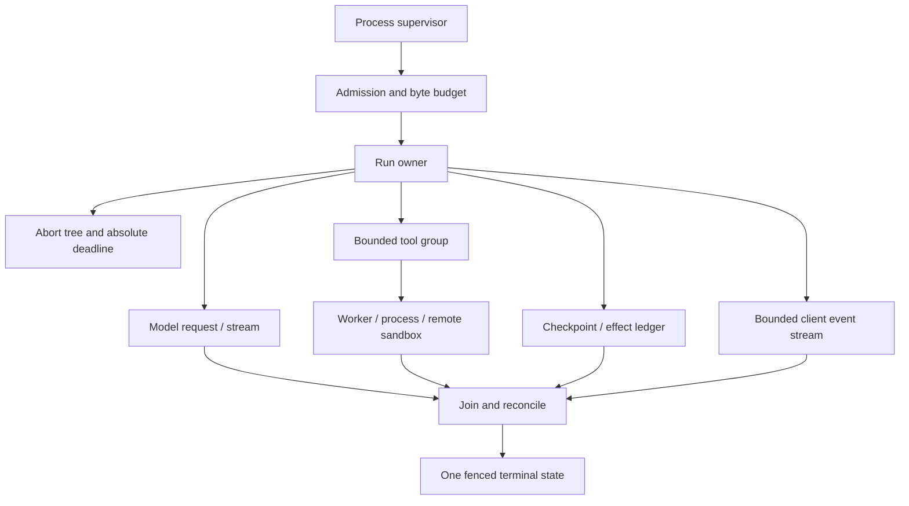

# Node.js Agent Runtime Engineering

> **Status:** Deep production playbook  
> **Last researched:** 2026-08-31  
> **Production baseline:** Node.js 24.20.0 LTS (Krypton)  
> **Forward-looking baseline:** Node.js 26.8.1 Current; planned to enter LTS on 2026-10-28  
> **Evidence:** [Node.js agent-runtime research packet](../../research/packets/nodejs-agent-runtime-deep-dive.md)  
> **Scope:** Runtime and operational engineering for agent APIs, gateways, tool hosts, streaming services, queue consumers, and durable workers

Node.js is a strong agent runtime when the service is dominated by concurrent network I/O, streaming, web integration, and a TypeScript-first ecosystem. Its single JavaScript event loop makes I/O concurrency economical, but also gives each callback shared responsibility for every other run in the process. A synchronous parser, runaway microtask chain, CPU-heavy tool, unbounded stream, or blocked queue-lock renewal can delay tokens, deadlines, disconnect detection, leases, and shutdown at once.

The production unit is therefore not “an async function.” It is an owned, bounded run tree:

Every child needs an owner, an abort and deadline contract, a join or detach policy, a concurrency and byte budget, and a rule for late results. JavaScript promises do not supply structured concurrency automatically.

## A zero-to-production learning path

Do not add every subsystem on day one. Promote the runtime only when the previous stage has a tested contract.

| Stage | Build and prove | Do not add yet |
|---|---|---|
| 0 — choose the boundary | Confirm that full Node is required; choose Node 24 LTS; define request-bound versus durable completion | Workers, a workflow engine, long-term memory, or WebSocket without a product need |
| 10 — one bounded turn | One authenticated request, one model attempt, runtime validation, absolute deadline, composed abort, response byte cap, one terminal result | Detached promises or automatic retries |
| 25 — owned tools and transport | Process-owned bounded Undici dispatcher, typed tool registry, effect authorization, stable attempt/effect IDs, cleanup on every path | Model-selected shell commands or arbitrary URLs |
| 40 — streaming and context | Typed events, bounded Node/Web Stream path, slow-consumer policy, explicit context budget, artifact handles, compaction threshold | Full transcript in `AsyncLocalStorage`, unbounded token queues, or implicit resume |
| 60 — crash survival where required | Versioned run/state/event/effect records, transactional enqueue/outbox, duplicate delivery tests, reconnect cursor | A durable engine for work that is deliberately request-bound |
| 75 — scale and deploy | Weighted global/tenant admission, worker/process pools only for measured needs, RSS headroom, readiness-aware shutdown, rollback lane | Autoscaling on request count alone |
| 90 — operate safely | Event-loop/pool/queue/stream/memory telemetry, permission and OS controls, redaction, incident captures, provider/SDK upgrade tests | Raw prompt capture or unstable APIs without a fallback |
| 100 — production promotion | Fault injection, load/soak, kill-around-effect tests, mixed-version rollout, exact Node/container/platform evidence, rehearsed repair | Promotion based only on unit tests or a successful canary request |

“100” is not permanent completion. It means the current release has passed explicit evidence gates. A Node, Undici, provider SDK, native dependency, proxy, durable-runtime, or platform upgrade reopens the affected gates.

## Use the guide that matches the failure surface

| Need | Start here |
|---|---|
| Process/run ownership, event-loop fairness, microtasks, libuv boundaries | [Architecture, event loop, and run ownership](architecture-event-loop-and-run-ownership.md) |
| `AbortSignal`, deadline composition, cancellation cleanup, shutdown intent | [Cancellation, deadlines, and shutdown signals](cancellation-deadlines-and-shutdown-signals.md) |
| Node streams, Web Streams, SSE, WebSocket, slow consumers | [Streams, backpressure, SSE, and WebSocket](streams-backpressure-sse-and-websockets.md) |
| `fetch`, Undici dispatchers, connection pools, phase timeouts, keep-alive | [HTTP, Undici, connections, and timeouts](http-undici-connections-and-timeouts.md) |
| Main-loop CPU, libuv pool, `worker_threads`, native addons, clusters | [CPU, libuv, workers, and native code](cpu-libuv-workers-and-native-code.md) |
| Tool execution, `spawn`, process trees, output limits, hostile code | [Tools, subprocesses, and sandboxing](tools-subprocesses-and-sandboxing.md) |
| Queue leases, durable state, BullMQ, Temporal, Restate, DBOS | [Queues, state, and durable workers](queues-state-and-durable-workers.md) |
| Heap/RSS, buffers, handles, weighted capacity, overload | [Memory, resource budgets, and admission](memory-resource-budgets-and-admission.md) |
| Error taxonomy, retries, ambiguous writes, stable effect IDs | [Errors, retries, idempotency, and effects](errors-retries-idempotency-and-effects.md) |
| `AsyncLocalStorage`, diagnostic channels, tracing, metric cardinality | [Async context, observability, and tracing](async-context-observability-and-tracing.md) |
| CPU/heap profiles, reports, inspector safety, leak diagnosis | [Profiling, memory debugging, and diagnostics](profiling-memory-debugging-and-diagnostics.md) |
| `node:test`, fake time, load, interleavings, failure injection | [Testing, load, races, and failure injection](testing-load-races-and-failure-injection.md) |
| Permission model, ESM/CJS, loaders, install scripts, provenance | [Security, permissions, modules, and supply chain](security-permissions-modules-and-supply-chain.md) |
| Containers, serverless, edge compatibility, rolling shutdown | [Deployment, serverless, edge, and shutdown](deployment-containers-serverless-edge-and-shutdown.md) |
| Recurring defects, release gates, incident-oriented checklist | [Anti-patterns and production checklist](anti-patterns-and-production-checklist.md) |

## Version posture at this snapshot

| Line | Status on 2026-08-31 | How to use it |
|---|---|---|
| Node 24.20.0 | Active LTS; maintenance transition scheduled for 2026-10-20; end of life 2028-04-30 | Default production baseline. Pin the patch, image digest, package manager, and lockfile. Audit mode, `permission.drop()`, and iterable streams arrived in this patch, but iterable streams remain experimental. |
| Node 26.8.1 | Current; LTS transition planned for 2026-10-28 | Compatibility and performance target. Do not call it LTS early. Version-gate 26-only APIs. |
| Node 22 | Maintenance LTS | A supported migration source, not the baseline for new runtime design. |

Node's project recommends production applications use Active or Maintenance LTS. A major becoming even-numbered does not make it LTS on release day. Security releases can also change behavior inside an LTS line, so deploy exact patches through staged tests rather than floating tags.

This playbook calls out Current-only behavior where it matters. For example, Node 26.7 added `IncomingMessage.signal`; Node 24 code must continue to derive disconnect cancellation from the lifecycle APIs it actually supports. Node 24.20 backported permission audit but does not have every Node 26 permission scope. Module hooks and other fast-moving surfaces still need exact-version tests.

## Baseline production rules

1. Keep the main event loop an orchestrator; move sustained CPU and blocking native work to a bounded, supervised boundary.
2. Admit before materializing large context and cap bytes as well as task counts.
3. Derive all operation timeouts from one absolute run deadline; propagate one composed abort tree and preserve its reason.
4. Track and settle every promise/task you create. A dropped promise is not cancelled work.
5. Reuse explicitly bounded HTTP dispatchers and always consume, cancel, or destroy response bodies.
6. Use `pipeline()` or disciplined async iteration and define what happens to a slow downstream consumer.
7. Treat worker threads as parallel JavaScript with shared process risk, child processes as lifecycle isolation, and containers/VMs as security boundaries.
8. Assume queues and remote effects are at least once. Fence attempts and reconcile ambiguous outcomes with stable IDs.
9. Measure event-loop delay, event-loop utilization, queue/pool waits, live handles, RSS, heap, external memory, and stream backlog together.
10. Crash under supervision after an uncaught exception; graceful shutdown belongs to the normal signal path, not the `exit` event.
11. Treat the Node permission model as defense in depth for trusted code, never as a malicious-code sandbox.
12. Test the exact container, serverless runtime, or edge compatibility date. Import success does not prove API behavior.
13. Treat context as budgeted run data: keep large content out of ambient async context, compact with provenance, and promote only justified facts to long-term memory.
14. Put provider SDK upgrades through an adoption suite that verifies abort, retry, streaming, usage, body cleanup, telemetry, and ESM/CJS behavior on the pinned Node/Undici combination.

## Runtime boundary versus TypeScript boundary

This area intentionally does not duplicate compiler, native type-stripping, JSON Schema, or runtime-validation guidance. TypeScript types are erased and Node's native type stripping is not a type checker. Keep compiler and schema decisions in the [TypeScript agent-engineering playbook](../typescript/README.md); use the concise [TypeScript/Node.js runtime overview](../typescript-node-agent-runtimes.md) for cross-language selection. This area owns the runtime behavior that remains after JavaScript is emitted or type syntax is stripped.

The reusable system-level contracts also remain canonical elsewhere:

- [Run controls](../../runtime/run-controls.md)
- [Execution boundaries](../../runtime/execution-boundaries.md)
- [Agent state and event contracts](../../runtime/agent-state-and-event-contracts.md)
- [Durable execution](../../runtime/durable-execution.md)
- [Context engineering](../../context-memory/context-engineering.md)
- [Compaction and continuity](../../context-memory/compaction-and-continuity.md)
- [Memory architecture](../../context-memory/memory-architecture.md)
- [Queues, scheduling, and backpressure](../../operations/queues-scheduling-and-backpressure.md)
- [Idempotency and side effects](../../reliability/idempotency-and-side-effects.md)
- [Permissions, sandboxing, and secrets](../../security/permissions-sandboxing-and-secrets.md)

## Refresh triggers

Re-research this area when:

- Node 26 enters LTS or its schedule changes;
- Node 24 enters Maintenance LTS;
- Undici changes dispatcher, retry, HTTP/2, WebSocket, or timeout semantics;
- a Node security release changes HTTP, TLS, permissions, loaders, or native-addon behavior;
- the test runner, permission model, module hooks, TypeScript support, or diagnostics APIs change stability;
- Temporal, Restate, DBOS, or a queue library changes Node support or replay/lease semantics;
- a target serverless or edge platform changes Node compatibility, duration, streaming, or shutdown rules.

## Selected primary sources

- [Node.js release schedule](https://github.com/nodejs/Release#release-schedule)
- [Node.js 24.20.0 LTS release](https://nodejs.org/en/blog/release/v24.20.0)
- [Node.js 26.0.0 release](https://nodejs.org/en/blog/release/v26.0.0)
- [Node.js 24-to-LTS migration guide](https://nodejs.org/en/blog/migrations/v22-to-v24)
- [Do not block the event loop or worker pool](https://nodejs.org/en/learn/asynchronous-work/dont-block-the-event-loop)
- [libuv design overview](https://docs.libuv.org/en/v1.x/design.html)
- [Node.js API documentation](https://nodejs.org/api/)
- [Undici documentation](https://github.com/nodejs/undici/tree/main/docs/docs/api)
