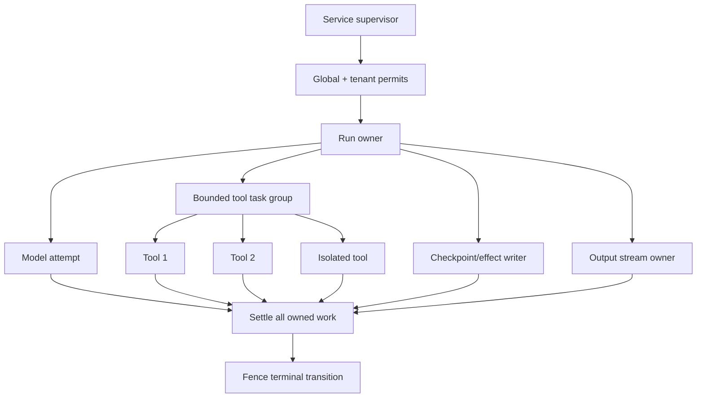
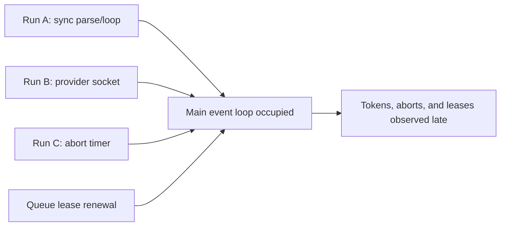
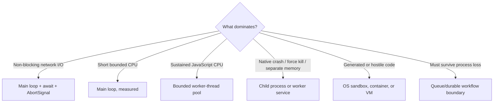

# Architecture, Event Loop, and Run Ownership

> **Last researched:** 2026-08-31  
> **Baseline:** Node.js 24.20.0 LTS; Node.js 26.8.1 Current is a compatibility target  
> **Use with:** [Agent loop](../../foundations/agent-loop.md) and [execution boundaries](../../runtime/execution-boundaries.md)

Node's event loop is a shared scheduler, not a tenant boundary. All ordinary JavaScript callbacks in one isolate take turns on the same thread. When one run performs excessive synchronous work, every other run in that isolate observes late timers, late abort handling, delayed socket progress, missed lease renewals, and slow shutdown.

The architecture must make fairness and ownership explicit.

## Separate process ownership from run ownership

Process-scoped resources should be created once, bounded, and closed by one supervisor:

- HTTP/Undici dispatchers;
- database and cache pools;
- worker-thread and subprocess pools;
- telemetry providers/exporters;
- queue consumers and durable-worker clients;
- global admission controllers;
- configuration and release identity.

Run-scoped state should contain only authority and budgets for one execution:

```js
const run = {
  runId,
  attemptId,
  tenantId,
  deadlineAt,
  signal,
  budget,
  effects,
};
```

Do not place a request's `AbortController`, mutable transcript, approval state, or result promise in an unbounded global map. If a process map is needed for routing live events, it is a bounded cache/index; durable storage remains the source of truth.

## Model an owned run tree

Promises do not have parent-child ownership. Calling an async function starts work; ignoring the returned promise does not attach it to a supervisor and does not cancel it when the caller ends.



For every branch, define:

1. who records the returned promise;
2. how it receives cancellation;
3. whether failures cancel siblings;
4. how cleanup is awaited;
5. whether late results are ignored or reconciled;
6. when resource permits are released;
7. what survives a process crash.

`Promise.all()` is fail-fast from the caller's perspective but does not cancel sibling operations. `Promise.allSettled()` observes every outcome but does not impose a stop policy. A production task group normally needs an `AbortController`, a bounded set of tracked promises, and a final `allSettled()` cleanup/join phase.

## Understand the two shared schedulers

Node applications routinely confuse the JavaScript event loop with libuv's worker pool.

| Work | Usual execution place | Contention symptom |
|---|---|---|
| JavaScript callbacks, promise continuations, JSON parsing, validation, regex, template rendering | Main event-loop thread | Event-loop delay/utilization rises; all callbacks become late |
| Network socket readiness | Polled by the event loop/OS | Delayed processing when JavaScript monopolizes the loop |
| Async filesystem, `dns.lookup`, selected crypto, zlib, native `uv_queue_work` | Global libuv thread pool | Operations queue behind unrelated pool work |
| CPU-heavy JavaScript in `worker_threads` | Separate V8 isolates/threads | Worker queue and CPU saturate; process RSS grows |
| Child process or remote worker | Separate process/service | IPC, startup, queue, and lifecycle limits dominate |

libuv's thread pool defaults to four threads and is global across event loops in the process. Raising `UV_THREADPOOL_SIZE` can improve a measured bottleneck, but the pool preallocates the configured maximum when used and each libuv worker has stack cost. More threads can increase memory and CPU contention. It is not the pool used by `worker_threads`.

## Protect event-loop fairness

Node is responsive when each callback does a small, bounded amount of work. The following remain synchronous even inside an `async` function:

- everything before the first `await`;
- code between awaits and promise continuations;
- `JSON.parse`/`stringify` and schema traversal;
- token counting, prompt assembly, sorting, diffing, and large array transforms;
- many regex operations;
- compression or crypto APIs with synchronous variants;
- synchronous logging/stdio behavior in some destinations;
- native addons that block their calling thread.

Microtasks deserve special attention. Promise reactions and `queueMicrotask()` callbacks run before the loop returns to later phases; `process.nextTick()` has its own queue and can starve I/O when recursively refilled. Converting a long loop into a chain of already-resolved promises does not create useful fairness. Partition only small, interruptible CPU work and yield with a mechanism that returns control to the event loop; offload sustained CPU.



## Measure delay and utilization together

`monitorEventLoopDelay()` records scheduling delay; event-loop utilization (ELU) estimates active versus idle time. Neither alone explains the cause.

| Observation | Likely direction |
|---|---|
| High delay, high ELU, high process CPU | CPU-heavy callbacks or native work on the main thread |
| High delay, lower process CPU | Blocking native call, scheduler throttling, GC pause, synchronous I/O, or noisy host |
| Low delay, high ELU | Busy but callbacks remain short; validate latency before changing anything |
| Low main-loop ELU, high request latency | Downstream, queue/pool wait, worker saturation, or network problem |

Node 26.5 added `samplePerIteration` to `monitorEventLoopDelay()`. Its measurements differ materially from timer-resolution sampling and should not be compared in one historical series. Version and record the measurement mode.

Collect at least:

- event-loop delay p50/p95/p99/max and ELU delta;
- process and per-worker CPU;
- libuv-backed operation latency where relevant;
- worker/job queue depth and wait time;
- outbound pool acquisition and socket counts;
- GC duration, heap, external memory, and RSS;
- admitted, running, streaming, and queued runs.

## Choose boundaries by failure mode



Do not add a worker thread merely because a function is async, and do not use in-process threads as a security boundary. Conversely, do not split routine network I/O into workers; Node's built-in asynchronous I/O is already designed for the event loop.

## Make terminal state a fenced transition

A run can receive a timeout while a provider or tool is committing a result. Local cancellation cannot decide which state won across processes. Persist a state version, attempt/lease token, or durable-runtime identity and make completion conditional on ownership.

Useful invariants:

- only the current attempt can transition the run;
- exactly one terminal state is externally visible;
- each model/tool attempt has a stable attempt ID;
- each mutating effect has a stable effect ID and receipt;
- a client stream closing does not implicitly define run durability;
- completion releases permits only after owned cleanup settles;
- process-local state is reconstructable or explicitly disposable.

## Architecture review checklist

- [ ] One component owns process startup, readiness, signal handling, and pool shutdown.
- [ ] Every run has an absolute deadline, composed signal, task registry, and terminal fence.
- [ ] No promise is intentionally fire-and-forget without a separate durable/supervised owner.
- [ ] Synchronous work is size-bounded and exercised at maximum inputs under concurrent load.
- [ ] Main-loop and libuv-pool contention are measured separately.
- [ ] Worker/process boundaries match CPU, crash, kill, memory, and trust requirements.
- [ ] Global maps, listeners, timers, and callbacks have removal/eviction rules.
- [ ] Admission permits live until the protected work and cleanup actually finish.
- [ ] Crash recovery does not depend on the old process remembering in-flight work.

## Selected primary sources

- [Node.js: do not block the event loop or worker pool](https://nodejs.org/en/learn/asynchronous-work/dont-block-the-event-loop)
- [libuv design overview](https://docs.libuv.org/en/v1.x/design.html)
- [libuv thread pool](https://docs.libuv.org/en/latest/threadpool.html)
- [Node.js performance hooks](https://nodejs.org/api/perf_hooks.html)
- [Node.js process events](https://nodejs.org/api/process.html#process-events)

