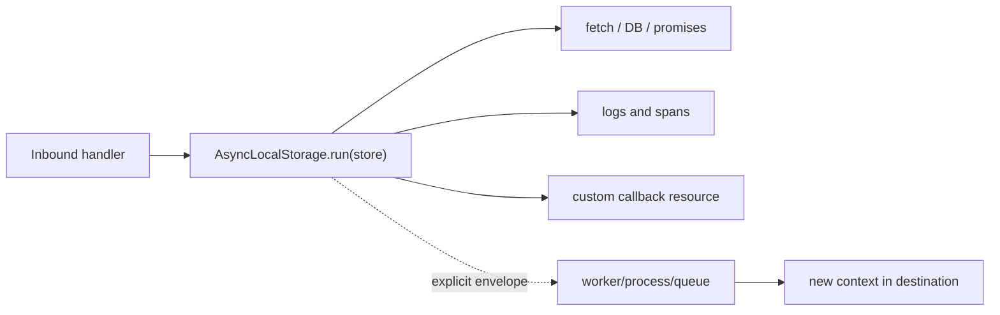
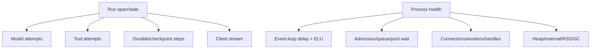

# Async Context, Observability, and Tracing

> **Last researched:** 2026-08-31  
> **Baseline:** Stable `AsyncLocalStorage` and `diagnostics_channel` on Node 24/26  
> **Related:** [Observability and tracing](../../evaluation/observability-and-tracing.md)

Observability must explain shared-runtime contention and one run's causal path without leaking prompts, credentials, or high-cardinality payloads. Node provides stable async context and diagnostic channels, but context does not cross every execution/durability boundary automatically.

## Use `AsyncLocalStorage` for correlation, not hidden authority

Suitable run-scoped values include:

- trace/span context;
- run, attempt, tenant, and request IDs;
- absolute deadline and release identity;
- a logger facade with fixed redaction policy.

Avoid placing mutable transcripts, database transactions, tool capabilities, or authorization decisions in ambient context. Re-authorize immediately before effects; ambient values can be stale, confused across queues, or missing in a worker/process.

Create one `AsyncLocalStorage` instance per semantic concern or one small immutable store. Prefer `run()` for a bounded scope. `enterWith()` persists for the current synchronous execution and can accidentally affect later handlers; use it only with a clear reason.

Node 24 added `name` and `defaultValue` constructor options. `bind()` and `snapshot()` are stable and help capture a context for callback-style code. For custom thenables/event resources where propagation breaks, use `AsyncResource` or `AsyncLocalStorage.snapshot()` according to the API shape.

Node 24.20 added experimental `withScope()`/`RunScope` support for explicit `using` blocks. Do not replace `run()` in async request paths with it: Node documents a caller-context hazard when an async function changes scope before its first `await`. Keep `run()` as the production default and evaluate `withScope()` only in bounded synchronous code behind an exact-version test.

The low-level `async_hooks.createHook` surface is experimental and explicitly discouraged due to usability, safety, and performance implications. Prefer `AsyncLocalStorage`, diagnostic channels, and active-resource APIs.

## Cross boundaries explicitly

`AsyncLocalStorage` does not automatically cross:

- worker-thread messages;
- child-process IPC;
- queue messages;
- HTTP to another service without propagation headers;
- durable workflow/activity serialization;
- later cron/scheduled work;
- detached work whose creation scope is gone.

Send a versioned correlation envelope, validate tenant/principal at the receiver, then create a new local context. Never serialize the entire ambient store.

## Instrument the run and the shared runtime

Run telemetry should answer:

- where time was spent: admission, provider connection, first token, tool queue, effect reconciliation, client drain;
- which attempt/retry/cancellation source occurred;
- whether output/event delivery lagged computation;
- which version/model/tool/schema executed;
- what state transition/effect receipt was durably recorded.

Runtime telemetry should answer:

- event-loop delay and utilization;
- process and worker CPU;
- libuv-heavy operation latency;
- admitted/queued/running runs and bytes;
- dispatcher connections, pending requests, origins, reuse/errors;
- worker/process queue and crash counts;
- active streams and slow-consumer backlog;
- RSS, heap, external/array-buffer memory, GC, and OOM/restart evidence;
- live resources preventing shutdown.

## Use diagnostic channels as integration surfaces

`node:diagnostics_channel` provides stable named channels with low overhead when unsubscribed. Libraries can publish lifecycle data without a hard dependency on a telemetry vendor. Acquire channels at module initialization, not repeatedly on hot paths.

Treat channel message shape as a contract. Do not publish raw prompts/tool results by default. Subscribers run in-process and can add latency or throw if poorly written; isolate/export asynchronously through bounded telemetry queues and test failure behavior.

Node 26's test runner publishes `node.test` tracing events through diagnostics channels. Permission audit also publishes denied-scope messages: Node 24.20 has channels for its scope set, while Node 26 adds channels for wider scopes such as network and FFI. Instrumentation must tolerate channel absence and message evolution on the exact target.

## Control cardinality and payload sensitivity

Good metric labels are bounded dimensions such as provider, model family, tool class, status class, retry class, deployment, and region. Run IDs, URLs, error messages, prompt hashes, user IDs, and tool names from unbounded registries belong in logs/traces with sampling and access control, not metric labels.

Sensitive surfaces include:

- prompts, responses, retrieved documents, and tool arguments/results;
- authorization headers, cookies, API keys, proxy URLs;
- filesystem paths, command lines, environment variables;
- trace baggage propagated to third parties;
- diagnostic reports and heap snapshots.

Define capture modes: off, metadata-only, redacted bounded content, or privileged incident capture. Apply retention, encryption, tenant isolation, and deletion rules. Framework “AI telemetry” can be experimental and may capture content by default; inspect configuration rather than assuming safety.

## OpenTelemetry maturity and initialization

At the research date, OpenTelemetry JavaScript lists traces and metrics as Stable and logs as Development. Semantic conventions can be less stable than the SDK itself. Pin packages and convention versions, and initialize instrumentation before importing libraries that need patching/hooks.

Verify ESM/CJS preload behavior for the exact packaging setup. Instrumentation that starts after an HTTP/provider module loads can silently miss hooks. Exporters need bounded queues, drop counters, timeouts, and shutdown flushing; telemetry must not become an unbounded memory or availability dependency.

## Trace async work correctly

Close spans when the operation—not merely the synchronous callback—settles. Record queue wait separately from service time. Link or parent retries/activities according to the causal model and preserve attempt IDs.

For streaming, useful timestamps include:

- request accepted/admitted;
- connection acquired/established;
- headers/first semantic event;
- last semantic progress;
- provider completion;
- client terminal event flushed/connection closed;
- cleanup and durable terminal commit.

An HTTP span ending at headers hides a ten-minute body stall. A run span ending before output drains hides slow-client resource retention.

State, event, effect, and memory operations need distinct evidence:

| Operation | Record | Never assume |
|---|---|---|
| State transition | run/attempt ID, prior/new version, transition, fence result | span success means the database commit won |
| Event append/delivery | event ID/sequence, durable append time, client drain/ack lag | socket write means the client processed it |
| External effect | stable effect ID, downstream request/receipt ID, ambiguity/reconciliation result | timeout means nothing committed |
| Context compaction | input/output bytes and estimated tokens, source count, summary version, validation result, duration/cost | shorter output retained all required evidence |
| Long-term-memory write | policy reason, provenance, tenant, expiry/correction version | every transcript statement is safe or true memory |

Keep IDs in spans/logs, not metric labels. Content capture stays off or metadata-only by default. A compaction or memory write is a model/tool effect with its own deadline, retry, authorization, and failure state—not invisible prompt preprocessing.

## Observability verification

- [ ] Context propagates across promises/callbacks and is explicitly re-created across workers/processes/queues.
- [ ] Ambient context does not grant authorization or hold large mutable state.
- [ ] Event-loop, pool/queue, connection, worker, stream, and memory metrics can explain latency.
- [ ] Retry, cancellation source, cleanup latency, and effect ambiguity are visible.
- [ ] Metric labels are bounded; tenant/run IDs are not high-cardinality labels.
- [ ] Prompt/tool/credential data has an explicit capture/redaction/retention policy.
- [ ] Telemetry queues/exporters are bounded and expose drops.
- [ ] Instrumentation initializes before target modules and works in the chosen ESM/CJS package mode.
- [ ] Shutdown flushes telemetry within a smaller bounded deadline.

## Selected primary sources

- [Node.js asynchronous context tracking](https://nodejs.org/api/async_context.html)
- [Node.js 24.20 asynchronous context tracking](https://nodejs.org/download/release/latest-v24.x/docs/api/async_context.html)
- [Node.js async hooks warning](https://nodejs.org/api/async_hooks.html)
- [Node.js diagnostics channel](https://nodejs.org/api/diagnostics_channel.html)
- [Node.js performance hooks](https://nodejs.org/api/perf_hooks.html)
- [OpenTelemetry JavaScript status](https://opentelemetry.io/docs/languages/js/)
- [OpenTelemetry JavaScript instrumentation](https://opentelemetry.io/docs/languages/js/instrumentation/)
