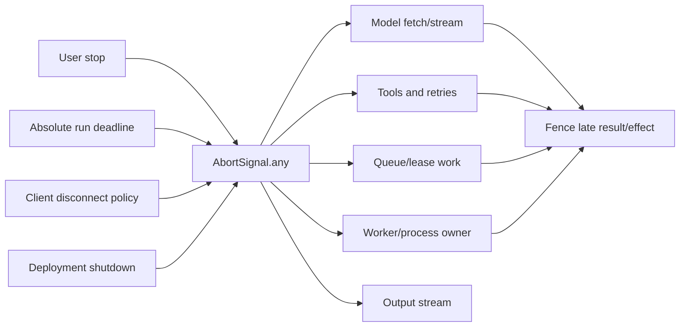

# Cancellation, Deadlines, and Shutdown Signals

> **Last researched:** 2026-08-31  
> **Baseline:** Stable `AbortController`, `AbortSignal.timeout()`, and `AbortSignal.any()` on Node 24/26  
> **Related:** [Run controls](../../runtime/run-controls.md) and [deployment/shutdown](deployment-containers-serverless-edge-and-shutdown.md)

An `AbortSignal` communicates intent. It does not interrupt arbitrary JavaScript, roll back a remote side effect, kill a process tree, or prove cleanup finished. A correct agent runtime composes stop sources, passes the signal to every cancellable layer, fences late outcomes, and joins cleanup under a separate bounded shutdown deadline.

## Build one cancellation tree per run

Typical stop sources are independent:



Use `AbortSignal.any()` to compose signals without hand-written listener chains. Preserve `signal.reason` and classify the source at creation time; an undifferentiated `AbortError` is weak incident evidence.

Before starting work:

```js
signal.throwIfAborted();
```

Then pass the signal through every API boundary that supports it. For custom code, observe abort both before listener registration and during execution so an already-aborted signal cannot race past setup.

## Derive attempts from one absolute deadline

Independent relative timers drift and allow nested retries to outlive the user's budget. Store an absolute deadline using a monotonic duration calculation where possible, then compute remaining time at every boundary.

| Budget | What it governs | Failure if confused |
|---|---|---|
| Queue/admission wait | Time before execution begins | Work starts after the request SLO is already spent |
| Run total | User/business latency budget | Nested attempts exceed the promised ceiling |
| Model/tool attempt | One dependency call | One hung attempt consumes the entire run |
| Connect | DNS/TCP/TLS establishment | Reported as generic total timeout |
| Headers/first byte | Upstream starts responding | Slow start hidden by a large body timeout |
| Stream idle gap | No meaningful progress between chunks/events | Healthy long streams are killed by a total-body timer, or stalled streams hang forever |
| Cleanup/termination | Cooperative close before hard kill | Shutdown waits without bound |

`AbortSignal.timeout(ms)` uses a relative duration and produces a timeout reason. Compose it with the parent, but never allocate a negative or meaningless timeout when the absolute deadline has expired—fail before starting the operation.

Timers are delayed by event-loop starvation. A “5 second” timer means eligible after five seconds, not guaranteed execution at five seconds. Record both deadline time and abort-observed time; large gaps point to loop or scheduler problems rather than only downstream slowness.

A small boundary helper prevents each SDK call from inventing its own timer policy:

```js
function attemptSignal({ parentSignal, deadlineAtMs, maxAttemptMs }) {
  if (!Number.isFinite(deadlineAtMs) || !Number.isSafeInteger(maxAttemptMs) || maxAttemptMs <= 0) {
    throw new TypeError('Invalid deadline or attempt budget');
  }
  const remainingMs = Math.floor(deadlineAtMs - Date.now());
  if (remainingMs <= 0) {
    throw new DOMException('Run deadline already expired', 'TimeoutError');
  }

  const windowMs = Math.max(1, Math.min(remainingMs, maxAttemptMs));
  const attemptTimeout = AbortSignal.timeout(windowMs);
  return AbortSignal.any([parentSignal, attemptTimeout]);
}

async function callProvider(options) {
  const signal = attemptSignal(options);
  signal.throwIfAborted();
  try {
    return await options.client.generate({ signal });
  } catch (error) {
    // Keep the transport error as cause and the winning stop source as evidence.
    if (signal.aborted) {
      const stopped = new Error('Provider attempt stopped', { cause: error });
      stopped.stopReason = signal.reason;
      throw stopped;
    }
    throw error;
  }
}
```

The example is a boundary pattern, not a provider API contract: verify the real SDK accepts `signal` and actually stops transport, parsing, retries, and streaming. Give user stop and shutdown controllers distinct structured reasons. `AbortSignal.any()` exposes the first winning reason, but it does not identify a source that used an indistinguishable reason.

Use a separate bounded cleanup signal. Once the run signal is aborted, passing it into `close()`, checkpoint, reconciliation, or telemetry flush can cause cleanup to fail immediately. Cleanup has its own small budget and is still fenced from changing the run outcome.

## Cancellation is layer-specific

| Layer | What abort usually does | What remains your responsibility |
|---|---|---|
| `fetch`/Undici | Rejects the operation and cancels/destroys body activity | Consume/cancel body correctly; classify transport cause; stop outer retries |
| `stream.pipeline()` | Destroys/aborts participating streams when wired with a signal | Ensure custom transforms release resources and ignore late callbacks |
| `timers/promises` | Rejects with `AbortError` | Avoid swallowing the abort and continuing a retry loop |
| Event listeners/iterators | Can remove/cancel listeners with signal-aware APIs | Bound buffered events and ensure emitter can actually pause |
| Worker thread | No automatic job cancellation unless your protocol implements it | Cooperative stop message, deadline fence, then `worker.terminate()` policy |
| Child process | `spawn` supports a signal and sends the configured kill signal | Descendant processes, grace/escalation, Windows behavior, effect reconciliation |
| Queue/durable activity | Runtime-specific cancellation intent | Lease/heartbeat semantics, retries, committed effects, durable terminal state |
| Plain promise | Nothing | Design a cancellable operation; promise rejection alone cannot stop hidden work |

Never implement a timeout as only `Promise.race([work, sleep])`. The losing work continues unless it receives cancellation, remains tracked, and is fenced from committing a late result.

## Write safe abort listeners

Node recommends one-shot listeners and checking `signal.aborted` before adding them. Long-lived listeners retain closures and can leak run state.

Prefer `events.addAbortListener()` for custom Node APIs. It is stable in Node 24 and returns a disposable listener; it also avoids another holder of the signal suppressing the listener with `stopImmediatePropagation()`.

```js
import { addAbortListener } from 'node:events';

async function ownedOperation(signal) {
  signal.throwIfAborted();
  const disposable = addAbortListener(signal, () => requestStop());
  try {
    return await doWork();
  } finally {
    disposable[Symbol.dispose]();
  }
}
```

An abort handler should be small and non-blocking: mark intent, close/cancel an owned primitive, or wake a supervisor. Await cleanup in the owning async control flow.

## Distinguish client disconnect from run cancellation

Interactive agents need an explicit policy:

| Product policy | On socket close | Required design |
|---|---|---|
| Request-bound | Cancel the run | Propagate disconnect signal; reconcile any effects already started |
| Durable continuation | Detach the run | Persist run/events; client reconnects by durable cursor |
| Pause for reconnect | Stop new expensive work temporarily | Durable state, bounded pause, expiry, and ownership transfer |

Do not let a transport accident silently choose among these behaviors.

Node 26.7 introduced `IncomingMessage.signal`, aborted when an incoming message is destroyed before completion or its underlying socket closes early. It is not available on the Node 24 baseline, and in 26.7 it was also refined not to abort after normal completion. Code targeting both lines needs a tested adapter around the supported request lifecycle events rather than a blind property access.

## Fence late results and ambiguous effects

Cancellation races with completion:

```mermaid
sequenceDiagram
    participant R as Run owner
    participant T as Tool/provider
    participant S as State/effect ledger
    R->>T: attempt A with signal
    R-->>R: deadline expires; abort A
    T->>S: effect may have committed
    T-->>R: late success or transport error
    R->>S: reconcile effect ID and attempt fence
    S-->>R: committed / absent / unknown
    R->>S: one legal terminal transition
```

Rules:

- a timed-out attempt cannot update state merely because its promise eventually fulfills;
- a remote write with unknown outcome is `ambiguous`, not automatically `failed`;
- retry a mutating call only with a stable idempotency/effect key or a reconciliation read;
- preserve abort source, attempt ID, effect ID, and cleanup outcome in telemetry;
- do not report “cancelled” as proof that no side effect occurred.

## Use two-phase service shutdown

Shutdown is process-scoped cancellation plus proof of settlement:

1. mark unready and stop new admission;
2. stop leasing/dequeuing new work;
3. signal in-flight runs according to durability policy;
4. close listeners to new HTTP/stream connections;
5. await run/task cleanup and checkpointing;
6. close or terminate workers and subprocesses;
7. gracefully close HTTP/database/cache dispatchers;
8. flush telemetry within its own deadline;
9. force remaining work before the platform hard stop.

Use a separate shutdown signal from individual request signals so one client cannot stop the process. Repeated termination signals should shorten the path to forced exit, not start overlapping cleanup routines.

The `exit` event cannot perform asynchronous cleanup. `beforeExit` is not emitted for explicit termination or uncaught exceptions and is not a deployment shutdown hook. Begin graceful work from platform lifecycle notification (`SIGTERM`, service-manager control, runtime-specific hook), and let an external supervisor restart after fatal errors.

## Cancellation test matrix

- [ ] Signal is already aborted before each operation starts.
- [ ] Abort occurs during queue wait, connect, headers, body, and stream idle gap.
- [ ] Abort happens immediately before and after a mutating effect commits.
- [ ] A nested retry delay is aborted and no later attempt starts.
- [ ] A custom listener is disposed on success, failure, and abort.
- [ ] Worker cooperates; non-cooperating worker reaches bounded termination.
- [ ] Child and descendants terminate on every supported OS.
- [ ] Client disconnect follows the documented cancel/detach policy.
- [ ] Event-loop stall delays timer delivery and is visible in telemetry.
- [ ] Shutdown settles within a grace period shorter than the platform hard limit.

## Selected primary sources

- [Node.js `AbortController` and `AbortSignal`](https://nodejs.org/api/globals.html#class-abortcontroller)
- [Node.js `events.addAbortListener`](https://nodejs.org/api/events.html#eventsaddabortlistenersignal-listener)
- [Node.js timers and cancellation](https://nodejs.org/api/timers.html#cancelling-timers)
- [Node.js streams pipeline](https://nodejs.org/api/stream.html#streampipelinesource-transforms-destination-options)
- [Node.js HTTP request signal](https://nodejs.org/api/http.html#message-signal)
- [Node.js process events](https://nodejs.org/api/process.html#process-events)
