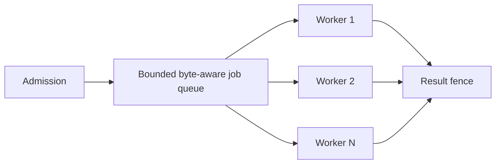

# CPU, libuv, Workers, and Native Code

> **Last researched:** 2026-08-31  
> **Baseline:** Stable `worker_threads`; Node 24 adds useful out-of-thread worker telemetry  
> **Related:** [Architecture and event-loop ownership](architecture-event-loop-and-run-ownership.md)

“Async” describes an interface, not where work executes. CPU-heavy JavaScript remains on the calling isolate unless explicitly moved. Some built-in asynchronous APIs use libuv's global pool. Worker threads use separate V8 isolates. Child processes have a separate address space. Native addons can choose any of these—or block the main thread by mistake.

## Map work to the real execution resource

| Workload | Correct first choice | Why |
|---|---|---|
| HTTP/database/provider I/O | Main event loop with async APIs | Built-in non-blocking I/O is already efficient |
| Small bounded parse/validation | Main event loop, measured | Offload overhead may exceed work |
| Sustained JavaScript CPU | Long-lived bounded worker-thread pool | Parallel V8 isolates use additional cores |
| Async filesystem, `dns.lookup`, crypto, zlib | Built-in async API; observe libuv contention | Common APIs share libuv's pool |
| Blocking/unreliable native library | Process or dedicated service when possible | A worker thread cannot contain a whole-process native crash/OOM |
| Hostile/generated code | OS sandbox/container/VM | Threads, `vm`, and permissions are not security isolation |

## Do not tune libuv by folklore

The libuv pool defaults to four threads and is shared across all loops in the process, including work submitted from worker isolates. File operations, `getaddrinfo`/`getnameinfo`, selected crypto/zlib APIs, and addons using `uv_queue_work()` can compete.

Before changing `UV_THREADPOOL_SIZE`:

1. reproduce queueing with the real combination of DNS, filesystem, crypto, compression, and native dependencies;
2. separate event-loop delay from libuv operation latency;
3. measure throughput, tail latency, CPU, thread count, and RSS;
4. set the value before the runtime initializes the pool;
5. test inside the actual CPU/memory container quota.

More threads may improve throughput for blocking I/O but worsen memory, cache contention, and CPU throttling. A large pool does not fix CPU-bound JavaScript on the main loop.

## Use a worker pool, not a worker per call

Creating a worker loads a V8 isolate and module graph and adds memory/startup cost. A worker per tool call allows request rate to create threads and can exhaust the process.



Pool contract:

- fixed or measured maximum workers based on `os.availableParallelism()`, CPU quota, and memory—not `os.cpus().length`;
- maximum queued jobs and queued bytes;
- versioned message schema and maximum transfer size;
- attempt ID, deadline, and cancellation protocol;
- result timeout and late-message fence;
- crash replacement with rate limit/circuit breaker;
- poison-job handling so one input does not crash replacements forever;
- graceful drain and forced termination during deployment;
- per-worker ELU, CPU, heap/RSS contribution, job wait, and execution time.

Node documents workers as useful for CPU-intensive JavaScript and not especially useful for I/O-intensive work.

Make the parent the source of truth. A job message should contain only a version, job/run/attempt identity, absolute deadline, operation name, and bounded payload or artifact reference. The worker replies with a matching identity and one typed outcome; the parent rejects unknown, duplicate, oversized, or late messages.

```js
// Parent -> worker. Validate again inside the worker.
const job = {
  schemaVersion: 2,
  jobId,
  runId,
  attemptId,
  deadlineAt,
  operation: 'compact_context',
  payloadRef,
};

worker.postMessage({ type: 'run', job });
// Cancellation is a second protocol message, not a cloned AbortSignal.
worker.postMessage({ type: 'cancel', jobId, reason: 'run_deadline' });
```

Parent invariants:

- register the job before `postMessage()` and release its byte/CPU permit only after terminal handling;
- treat worker `'error'`, unexpected `'exit'`, malformed reply, deadline, and termination as different outcomes;
- fence a success whose attempt no longer owns the run;
- reconcile any effect the worker could have started before retrying;
- replace a crashed worker with rate limiting and quarantine a repeatedly crashing job;
- use `AsyncResource` around pool jobs so traces and diagnostic stacks correlate submission with completion.

## Transfer ownership instead of copying when safe

`postMessage` uses structured clone. Large values can be expensive in time and memory. `ArrayBuffer` can be transferred, moving ownership and detaching the sender's view; `SharedArrayBuffer` shares memory and requires synchronization.

Prefer:

- small immutable metadata plus artifact/file/object-store references;
- transferable buffers when the sender truly relinquishes ownership;
- copy-on-boundary when isolation/correctness is more important than throughput;
- shared memory only after measurement and with a small, reviewed synchronization protocol.

Beware pooled Node `Buffer` backing stores: transfer behavior can expose or clone more memory than the visible slice. Test the exact buffer source and use `markAsUntransferable()`/copying where ownership is unsafe.

## Resource limits are not process memory limits

Worker `resourceLimits` constrain selected V8 engine regions. They do not include external `ArrayBuffer` memory, native allocations, or all process memory; the process can still abort on global out-of-memory. Treat them as a guardrail, not tenancy isolation.

Worker failure rules:

- an `'error'` means uncaught worker exception; observe it;
- an `'exit'` with nonzero code needs classification and replacement policy;
- termination is abrupt and can interrupt an effect or shared-memory update;
- a native fatal error may terminate the whole process;
- worker completion must include cleanup of ports/listeners and queued job accounting.

Node 24 provides `worker.cpuUsage()` from the parent, per-worker ELU, heap statistics/snapshots, and from 24.8 worker CPU profiling. Use version checks if the production patch predates a capability.

## Worker cancellation is an application protocol

An `AbortSignal` cannot be structured-cloned into a worker as a live signal. Send a cancellation message keyed by job/attempt ID, check it at safe points, and fence the result in the parent. If the worker fails to cooperate by the deadline, terminate and replace it according to policy.

CPU kernels or native functions that never return cannot observe the message. If hard kill or separate memory is required, use a process/service boundary.

## Child process versus cluster versus worker

| Primitive | Address space | Share memory | Best use | Important limitation |
|---|---|---|---|---|
| `worker_threads` | Shared process, separate V8 isolate | Yes | CPU-parallel JS pool | Whole process shares RSS/fate/native crash risk |
| `child_process` | Separate process | IPC only | Crash/kill/memory/credential boundary | Startup/IPC/process-tree management |
| `cluster` | Multiple Node processes sharing server ports | IPC/socket distribution | Legacy/process-level HTTP scaling needs | Operationally more complex than orchestrator replicas; not a durable worker system |
| External worker service | Separate deployment | Network contract | Independent scaling/trust/runtime | Distributed-system latency and failure modes |

Modern container orchestration often makes one Node process per container plus horizontal replicas easier to operate than an in-container cluster primary. Cluster remains supported, but do not confuse socket distribution with work durability, CPU job scheduling, or security isolation.

## Native addons expand the failure surface

Node-API offers ABI stability across supported Node versions, not proof that addon code is memory-safe, non-blocking, cancellable, thread-safe, or compatible with the target libc/architecture. Native modules can:

- block the main thread;
- use the libuv pool unexpectedly;
- retain external memory outside V8 heap metrics;
- crash or corrupt the process;
- spawn their own unmanaged threads;
- break across platform/toolchain changes despite Node-API intent;
- execute install/build scripts during dependency installation.

For critical addons, retain source/build provenance, test every target image/architecture, expose native queue/memory metrics where possible, and isolate high-risk operations in a process.

## CPU boundary verification

- [ ] Maximum real inputs cannot monopolize the main loop beyond the latency budget.
- [ ] libuv-backed APIs and their shared pool are inventoried.
- [ ] `UV_THREADPOOL_SIZE` is measured, pinned, and included in memory tests if changed.
- [ ] Worker count and queue are bounded by CPU and bytes.
- [ ] Worker startup, transfer, cloning, and steady-state costs are benchmarked.
- [ ] Cancellation, late result, crash replacement, and poison jobs are tested.
- [ ] Worker messages are versioned/validated/byte-limited and stale job/attempt replies cannot commit.
- [ ] External/native memory is included in capacity calculations.
- [ ] Native addon failures cannot silently bypass the chosen trust/lifecycle boundary.
- [ ] Cluster is used only when its socket/process model is actually required.

## Selected primary sources

- [Node.js worker threads](https://nodejs.org/api/worker_threads.html)
- [Node.js child processes](https://nodejs.org/api/child_process.html)
- [Node.js cluster](https://nodejs.org/api/cluster.html)
- [Node.js OS available parallelism](https://nodejs.org/api/os.html#osavailableparallelism)
- [libuv thread pool](https://docs.libuv.org/en/latest/threadpool.html)
- [Node-API](https://nodejs.org/api/n-api.html)
