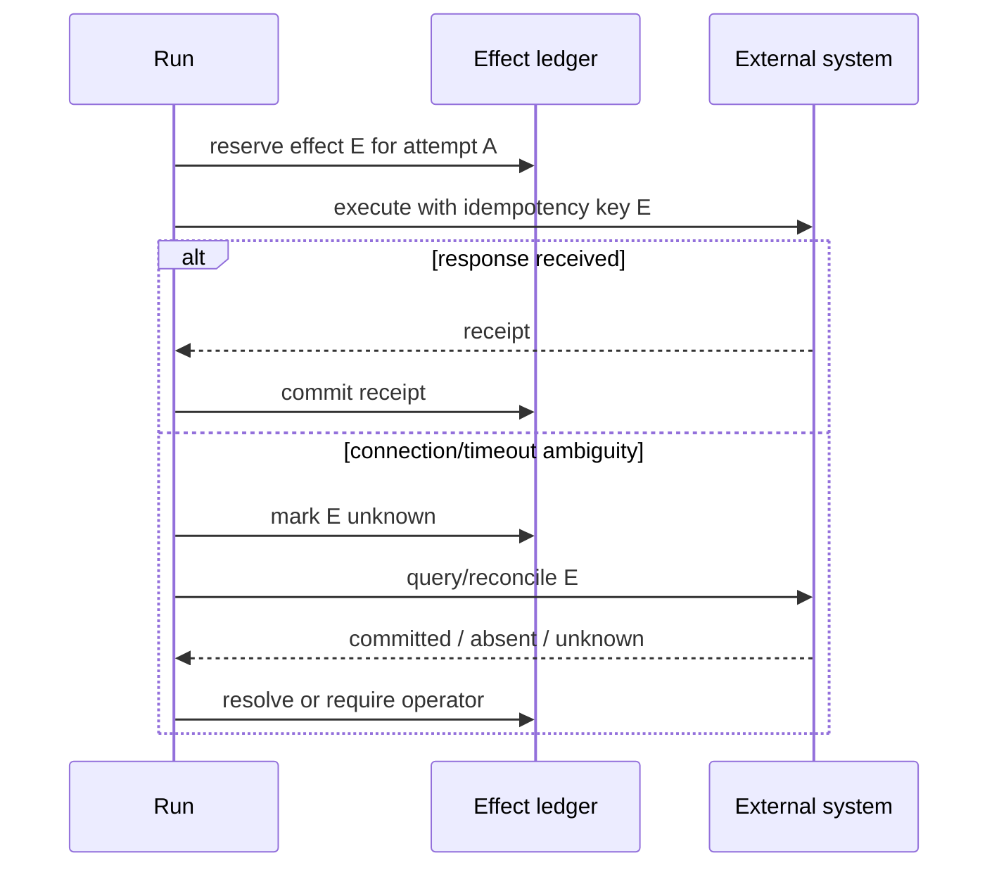

# Errors, Retries, Idempotency, and Effects

> **Last researched:** 2026-08-31  
> **Baseline:** Node.js 24.20.0 LTS; retry-library behavior must be pinned separately  
> **Use with:** [Failure taxonomy](../../reliability/failure-taxonomy.md) and [idempotency/side effects](../../reliability/idempotency-and-side-effects.md)

A retry is a new execution attempt, not an error-handling reflex. It consumes deadline, connections, rate quota, model tokens, and sometimes money. If the previous attempt might have committed an effect, an automatic retry can duplicate it. Node's error objects provide evidence; the application must translate that evidence into domain-specific retry and reconciliation policy.

## Preserve causal evidence

Node system errors commonly include `code`, `errno`, `syscall`, and sometimes `address`, `port`, `path`, or `dest`. Undici adds its own error classes/codes, and `fetch` may wrap a lower-level cause in a `TypeError`. Do not classify only by message text.

Normalize at the boundary without discarding the original cause:

```js
throw new ProviderAttemptError('provider stream failed', {
  cause: err,
  attemptId,
  phase: 'body',
  retryClass: classify(err),
});
```

Store a bounded, redacted representation containing:

- domain operation and phase;
- stable error code/class and selected nested cause codes;
- provider HTTP status/request ID/retry-after when present;
- attempt count and remaining deadline;
- abort source/reason and whether cleanup succeeded;
- effect ID and ambiguity state;
- release/runtime/client versions.

Stack traces, URLs, headers, diagnostic reports, and command lines can contain secrets. Redact at capture/export, not by erasing all useful structure.

## Use a retry decision matrix

| Failure | Default decision | Conditions |
|---|---|---|
| Local validation/authorization | Do not retry | Correct input/policy first |
| User cancellation/deadline exhausted | Do not retry | Preserve cancellation as terminal for this attempt/run |
| Connection refused/reset before any write with safe method | Maybe retry | Remaining deadline, bounded attempts, downstream health |
| 429/503 with `Retry-After` | Maybe retry | Honor bounded delay; avoid retry storms |
| Provider 4xx semantic error | Usually do not retry | Except explicit transient/status contract |
| Malformed successful response | Usually do not blind-retry | May be deterministic; quarantine evidence |
| Non-idempotent request, outcome known absent | Retry only by domain policy | Stable idempotency key preferred |
| Remote effect outcome unknown | Reconcile first | Never convert ambiguity to “failed” automatically |
| Worker/process crash | Retry/quarantine by job policy | Stable attempt/effect IDs and poison limit |

Error code alone is insufficient. An `ECONNRESET` before sending headers differs from a reset after an upstream accepted a POST and committed it.

## Bound the complete retry stack

Retries may exist in:

- provider SDK;
- Undici `RetryAgent`/interceptor;
- application attempt loop;
- tool client;
- queue delivery;
- durable activity/step;
- ingress/load balancer.

Multiplication is dangerous: three layers with three attempts can create far more than three calls. Choose one primary owner per operation, disable/reduce others where possible, and expose total attempts across layers.

Retry budget includes:

- maximum attempts;
- maximum elapsed/absolute deadline;
- exponential backoff with jitter and cap;
- server `Retry-After`, capped by remaining budget;
- concurrency/rate admission for retries;
- per-tenant cost/token budget;
- circuit breaking or load shedding during correlated failure.

Do not hold scarce connection or worker permits while sleeping between attempts unless that reservation is intentional.

## Know Undici's policy—and override deliberately

Current Undici `RetryHandler` documentation describes exponential backoff, `Retry-After`, a default maximum of five retries, selected HTTP statuses, network codes, and methods considered retryable. It refuses stateful stream/async-iterable bodies that cannot be replayed. These are library defaults, not your business contract.

Notable consequences:

- PUT and DELETE are HTTP-idempotent by specification, but application implementations and intermediate systems can still behave poorly; test the actual endpoint;
- POST can be safely retried only with an application/provider idempotency contract or reconciliation;
- a buffered body may be replayable in memory while a live stream is not;
- retrying a partial download with Range/ETag has integrity and header-forwarding implications;
- a retry component can have security defects—pin patched Undici releases.

In July 2026, Undici published an advisory for retry/resume behavior that could expose a stale `Content-Length` to downstream consumers; patched lines were released. This is a strong reminder to treat retry middleware as part of the security-sensitive HTTP stack and keep Node's embedded Undici plus any installed package current.

## Model effect identity explicitly



An effect ID should be stable across retries of the same logical effect, scoped to tenant/tool/operation, and accepted by the downstream or represented in a local ledger that can reconcile. A new ID per network attempt defeats deduplication.

Use an outbox/inbox or transactional boundary when local state and message/effect intent must agree. Exactly-once database commit does not make an email, payment, file write, or provider call exactly once.

## Separate failure from cancellation and crash

At minimum, terminal classes should distinguish:

- succeeded;
- rejected/invalid/unauthorized;
- dependency failed;
- timed out (which deadline/phase);
- cancelled (which source);
- capacity rejected;
- crashed/process lost;
- effect outcome ambiguous;
- retry exhausted/quarantined.

Do not catch an abort and wrap it as a retryable generic network error. Do not catch an uncaught exception and resume serving; Node documents the process as being in an undefined state. Capture synchronous emergency evidence and let supervision replace the process.

## Retry/effect verification

- [ ] All retry layers and their default attempt counts are inventoried.
- [ ] An absolute deadline and total cost budget cap nested retries.
- [ ] Backoff has jitter and releases unneeded resource permits.
- [ ] Cancellation and validation errors cannot enter retry loops.
- [ ] Streaming request bodies are never replayed without an explicit replay source.
- [ ] Mutating operations use stable effect/idempotency IDs.
- [ ] Timeout after remote commit is reconciled instead of assumed failed.
- [ ] Concurrent duplicate attempts are fenced.
- [ ] Poison work reaches a bounded exhausted/quarantine state.
- [ ] Pinned Undici/SDK versions include relevant security fixes.

## Selected primary sources

- [Node.js common system errors](https://nodejs.org/api/errors.html#common-system-errors)
- [Undici RetryHandler](https://github.com/nodejs/undici/blob/main/docs/docs/api/RetryHandler.md)
- [HTTP idempotent methods and retries, RFC 9110](https://www.rfc-editor.org/rfc/rfc9110.html#name-idempotent-methods)
- [Undici retry response-desynchronization advisory](https://github.com/nodejs/undici/security/advisories/GHSA-8xcm-r25x-g524)
- [Node.js uncaught-exception guidance](https://nodejs.org/api/process.html#warning-using-uncaughtexception-correctly)

