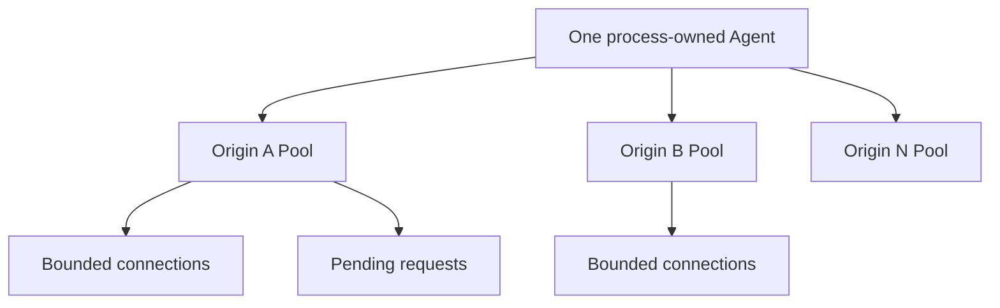
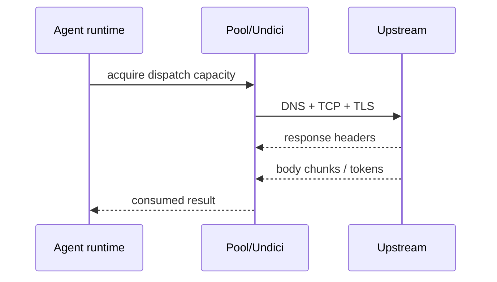

# HTTP, Undici, Connections, and Timeouts

> **Last researched:** 2026-08-31  
> **Baseline:** Node 24.20 embeds Undici 7.x; Node 26 began with Undici 8 and must be tested as a separate transport line  
> **Related:** [Errors, retries, idempotency, and effects](errors-retries-idempotency-and-effects.md)

Most agent latency is remote I/O, but HTTP behavior is still local architecture. Dispatcher lifetime decides connection reuse; connection ceilings decide overload; body consumption decides whether sockets return to the pool; phase timers decide whether “timeout” is diagnosable; and retry semantics decide whether an effect is duplicated.

## Own and bound the dispatcher

Node's built-in `fetch` is implemented with Undici. The separately installed `undici` package exposes lower-level dispatchers and can move faster than the version embedded in Node. Record both Node and Undici versions in release evidence.



Undici's `Agent` creates per-origin dispatchers. Current documentation exposes `maxOrigins`; without a bound, attacker- or tenant-controlled destinations can create unbounded origin state. A `Pool` spreads requests over clients/connections and defaults can be effectively unbounded when `connections` is `null`. Set deliberate per-origin connections and application admission limits.

Do not create an Agent/Pool for every request. Reuse it for the process lifetime, then call graceful `close()` during shutdown; use `destroy()` only for forced abort. Separate pools where credentials, proxies, certificates, trust zones, or workload priorities require isolation.

## Capacity is more than socket count

For each upstream, budget:

- total concurrent application attempts;
- pool connections and pending dispatches;
- HTTP/1.1 pipelining factor, normally left at 1 unless a trusted target and measured need justify more;
- HTTP/2 connection count and `maxConcurrentStreams` if enabled;
- DNS/TCP/TLS concurrency;
- response bodies being streamed versus buffered;
- retries consuming new slots;
- tenant and priority share.

Current Undici Pool documentation notes that unlimited connections defeat HTTP/2 multiplexing because concurrent work can open separate clients/sockets. If evaluating `allowH2`, deliberately cap connections and verify negotiated protocol and stream ceilings. Treat HTTP/2 support/settings as version-specific; do not infer them from browser `fetch` behavior.

## Always settle the response body

With Undici's lower-level APIs, every response body must be fully consumed or destroyed. Fetch bodies should likewise be read, piped, or cancelled. Failure to settle a body retains a connection/resource and can turn a light leak into pool exhaustion under load.

Set maximum decoded bytes before `.json()` or `.text()` materializes the whole body. For large/tool outputs, stream to a bounded parser or artifact store. `Content-Length` is useful evidence, not sufficient enforcement: transfer encoding, compression, and malformed/missing lengths require an actual byte counter.

Avoid parsing a provider stream twice. Body mixins are one-shot; after one consumes the body, another sees an unusable body. Capture only the bounded diagnostic excerpt required by policy.

A lower-level Undici client should make settlement and materialization limits visible in code:

```js
import { Buffer } from 'node:buffer';

async function boundedJson(pool, request, { signal, maxBytes = 1_000_000 }) {
  const { statusCode, headers, body } = await pool.request({
    ...request,
    signal,
  });

  try {
    if (statusCode < 200 || statusCode >= 300) {
      await body.dump({ limit: 64 * 1024 });
      throw new Error(`Upstream returned ${statusCode}`);
    }

    const contentType = String(headers['content-type'] ?? '');
    if (!contentType.toLowerCase().startsWith('application/json')) {
      throw new Error(`Unexpected content type: ${contentType || 'missing'}`);
    }

    const chunks = [];
    let total = 0;
    for await (const chunk of body) {
      total += chunk.byteLength;
      if (total > maxBytes) throw new Error('Response body exceeds byte limit');
      chunks.push(chunk);
    }

    // This allocation is bounded but still duplicates the body before JSON.parse.
    return JSON.parse(Buffer.concat(chunks, total).toString('utf8'));
  } catch (error) {
    body.destroy(error); // Safe after end; essential on early exit.
    throw error;
  }
}
```

This is intentionally not a “streaming JSON parser”: it makes a small-response policy explicit. Large provider/tool payloads need a reviewed incremental parser or direct artifact pipeline with decompressed-byte enforcement. For built-in `fetch`, the body is a Web Stream; consume it or call `response.body?.cancel(reason)` on abandoned paths. Test both surfaces because built-in fetch uses the embedded Undici while an installed package can have different APIs and security fixes.

## Use phase-aware timeouts



Measure and cap separately:

| Phase | Signal/setting direction | What it reveals |
|---|---|---|
| Admission/pool wait | Application queue deadline; pool stats | Local saturation before a socket attempt |
| Connect | Undici `connectTimeout` | DNS/address/TCP/TLS establishment path |
| Headers | `headersTimeout` | Time until complete response headers |
| Body idle | `bodyTimeout` | Gap between received body chunks, subject to exact Undici semantics |
| Semantic stream idle | Application watchdog reset by meaningful events | Provider sent bytes but no useful progress, or consumer-induced pause |
| Attempt total | Composed `AbortSignal` | One attempt ceiling |
| Run total | Absolute parent deadline | End-to-end budget across attempts/tools |

Node's legacy `http.ClientRequest.setTimeout()` emits a timeout event; it does not itself abort the request. Wire destruction/abort deliberately.

Do not treat any timeout as perfectly precise. Timers depend on event-loop scheduling. Undici's documented parser timers also trade precision for overhead at longer durations.

A current Undici issue documents a body-timeout edge while the response parser is paused by consumer backpressure. That issue is an adoption-test lead, not a universal guarantee. Add an application semantic-progress watchdog for critical long downloads/streams and test it against the exact pinned Undici version.

## Keep-alive races are normal transport failures

Servers, proxies, and clients have independent idle lifetimes. Reusing a socket near the peer's close boundary can produce resets. Node 24.6 added `server.keepAliveTimeoutBuffer`, and current client `http.Agent` has `agentKeepAliveTimeoutBuffer`, both intended to reduce edge races around advertised timeouts.

Operational guidance:

- align client idle lifetime below the upstream/proxy lifetime with safety margin;
- use jitter or staggered connection retirement where fleet-wide synchronized churn is costly;
- retry only semantically safe work within the remaining deadline;
- diagnose resets with socket age, reuse flag, loop lag, pool stats, and upstream deployment events;
- do not disable keep-alive as the first response—it trades resets for handshakes, ports, latency, and load.

## Treat pipelining conservatively

HTTP/1.1 pipelining can amplify head-of-line and failure coupling. Undici disables factors greater than one by default and recommends enabling them only for trusted servers. An abort can affect other requests in a pipeline, and connection failure creates retry ordering constraints.

For agent/provider traffic, multiple bounded connections with pipelining 1 is usually the simpler baseline. Evaluate higher pipelining only under the exact provider/proxy behavior, with non-idempotent requests excluded and tail latency measured.

## Inbound HTTP is also a resource boundary

Configure and test:

- request header and body byte limits;
- headers/request timeouts against slowloris behavior;
- maximum requests per socket where useful;
- keep-alive lifetime and connection count;
- decompressed-size limits;
- upgrade/WebSocket authorization before handing over the socket;
- readiness behavior during shutdown;
- server close plus active-stream policy.

`server.close()` stops accepting and reaps idle keep-alive connections on supported modern Node lines, but active requests/streams can remain. Track them explicitly. `closeAllConnections()` is forceful and does not close upgraded sockets such as WebSocket; the application/library must own those.

## Proxy, TLS, and destination policy

Agent tools often accept URLs. Validate destinations after every redirect and resolution according to the security policy. Protect against internal/metadata addresses, DNS rebinding assumptions, credential forwarding, proxy bypass, and unbounded distinct origins.

Use separate dispatchers for different client certificates or proxy authority. Never disable certificate verification as an availability workaround. Record TLS/auth failures separately from provider application errors.

## Connection test matrix

- [ ] Cold and reused connections under the real proxy/load balancer.
- [ ] DNS dual-stack and address-family fallback behavior.
- [ ] Connect, headers, body-idle, semantic-idle, and total deadlines.
- [ ] Response rejected early and body destroyed/connection released.
- [ ] Slow consumer and large compressed/decompressed response.
- [ ] Peer closes an idle keep-alive socket just before reuse.
- [ ] Pool connection/pending/origin ceilings under burst and retry.
- [ ] HTTP/2 negotiation and stream limits if enabled.
- [ ] Graceful dispatcher close and forced destroy during shutdown.
- [ ] Redirect and dynamic-destination security controls.
- [ ] `process.versions.undici`, installed Undici version, Node patch, proxy, and provider SDK version are recorded together.
- [ ] Early status/content-type/size rejection demonstrably returns or destroys the connection instead of exhausting the pool.

## Selected primary sources

- [Undici Agent](https://github.com/nodejs/undici/blob/main/docs/docs/api/Agent.md)
- [Undici Pool](https://github.com/nodejs/undici/blob/main/docs/docs/api/Pool.md)
- [Undici Client and timeouts](https://github.com/nodejs/undici/blob/main/docs/docs/api/Client.md)
- [Undici Dispatcher and body consumption](https://github.com/nodejs/undici/blob/main/docs/docs/api/Dispatcher.md)
- [Node.js HTTP](https://nodejs.org/api/http.html)
- [Node.js 26 release: Undici 8](https://nodejs.org/en/blog/release/v26.0.0)
- [Node.js global fetch and embedded Undici version](https://nodejs.org/api/globals.html#fetch)
- [Undici backpressure/body-timeout issue](https://github.com/nodejs/undici/issues/5393)
