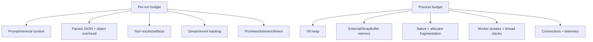
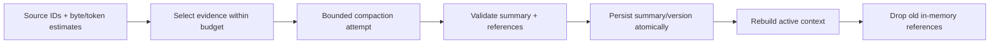
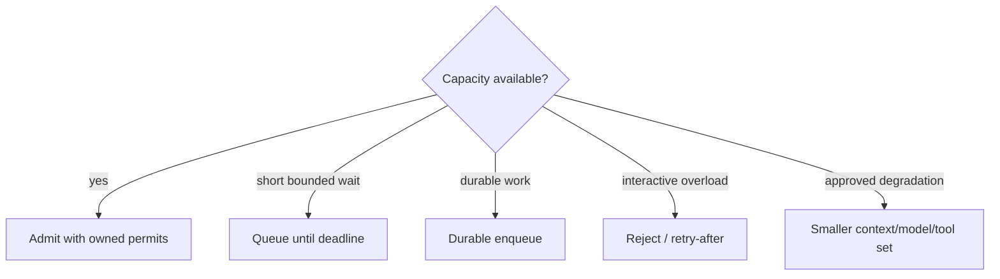

# Memory, Resource Budgets, and Admission

> **Last researched:** 2026-08-31  
> **Baseline:** Node.js 24.20.0 LTS  
> **Related:** [Scaling, capacity, and SLOs](../../operations/scaling-capacity-and-slos.md)

The V8 heap is only one part of a Node process. Agent workloads also retain `Buffer`/`ArrayBuffer` memory, native-library allocations, TLS/socket buffers, worker isolates, libuv threads, stream queues, telemetry batches, memory-mapped files, and child processes. A healthy `heapUsed` graph can coexist with rising RSS and an imminent container kill.

## Budget the complete working set

Use measured peak RSS under representative context, concurrency, slow-consumer, retry, and shutdown conditions. Leave headroom below the container limit for transient duplication, GC, profiling, native libraries, and the OS. Avoid choosing `--max-old-space-size` equal to the container limit.

## Admit before expensive materialization

Bad order:

1. accept a large request;
2. decompress and parse it;
3. fetch and materialize retrieval results;
4. assemble a giant prompt;
5. wait for a model semaphore.

Memory is already committed while the run waits. Enforce compressed and decompressed body limits, then acquire global/tenant/run admission before retrieval and prompt construction.

Separate limits by resource:

- admitted runs and queue waiters;
- tenant/priority share;
- model/provider attempts;
- database/cache pool;
- outbound origin connections;
- CPU worker threads and subprocesses;
- libuv-heavy operations where they dominate;
- per-run context/tool/artifact/event bytes;
- total process working-set pressure.

A single semaphore cannot express a run that uses little CPU but 100 MB of context versus one that uses 2 MB and a CPU worker.

## Count bytes, not only objects

Examples of hidden amplification:

- a UTF-8 JSON body becomes JavaScript strings, objects, property tables, and temporary parse memory;
- concatenating strings can retain or copy backing storage depending on representation and later flattening;
- a small `Buffer.subarray()` can retain a large underlying allocation;
- object-mode stream high-water marks count objects, not bytes;
- `Promise.all()` retains every result until the aggregate settles;
- errors/log contexts can retain full request/tool payloads;
- a completed task registry or listener can keep a whole run reachable;
- worker structured clone temporarily holds sender and receiver copies.

Use artifact handles for large data. Keep model context and diagnostic excerpts separately bounded. Coalesce token deltas before queues fill.

## Treat context as a budgeted data product

Agent “memory” is not one Node object and should not share one lifetime. Separate four stores:

| Data | Lifetime and owner | Node-specific rule |
|---|---|---|
| Active turn context | One model attempt | Build after admission; cap source and rendered bytes; release references when the attempt settles |
| Run working state | One run across attempts/tools | Keep a small versioned domain record; do not retain raw SDK responses, streams, closures, or `AbortSignal` objects |
| Continuity summary | Across compaction or reconnect | Persist summary plus source IDs, compaction version, token/byte estimate, and coverage boundary |
| Long-term memory | Across runs, only when product policy justifies it | Store validated facts/preferences/evidence with tenant, provenance, expiry, correction, and deletion controls; retrieve into the active context under a fresh budget |

`AsyncLocalStorage` is for small correlation metadata, not transcripts or memory. A large store is retained by every reachable async resource in its scope. A timer, listener, pending promise, socket callback, or telemetry closure can therefore keep the whole context graph alive after the visible request finishes.

Use the canonical [context-engineering](../../context-memory/context-engineering.md), [compaction](../../context-memory/compaction-and-continuity.md), and [memory-architecture](../../context-memory/memory-architecture.md) guides for semantic design. The Node runtime is responsible for when bytes are admitted, represented, copied, retained, serialized, and released.

## Compact before materialization becomes an outage

A safe Node compaction path is a bounded state transition:

Production rules:

1. Estimate and select before joining large strings or parsing every artifact.
2. Give compaction its own attempt ID, deadline, signal, input/output byte cap, and model-cost budget.
3. Preserve instructions, unresolved approvals/effects, current plan, source IDs, and uncertainty explicitly; a fluent summary is not proof of fidelity.
4. Persist the new summary/version before switching the run pointer. Concurrent writers must fail a stale version check rather than overwrite one another.
5. Replace—not append—the superseded context in live run state, remove listeners/task references, and let old buffers become unreachable.
6. Do not expect RSS to fall immediately. V8 and the allocator can retain released capacity; prove bounded reuse with load/quiescence tests.

Serialization has peak-memory consequences. `JSON.stringify()` creates a complete string before many writers send it, and parsing can temporarily retain both bytes and object graphs. Tokenization, ranking, redaction, and summary validation are synchronous CPU unless their libraries provide a real offload boundary. Measure them with maximum context; move sustained CPU to a bounded worker while accounting for structured-clone duplication or transfer ownership.

Long-term memory should be promoted by a policy step, never by dumping the transcript. Separate candidate extraction from authorization and persistence. Sensitive or user-correctable facts need provenance, conflict handling, retention, and deletion; large documents remain artifacts/retrieval sources rather than ambient per-run objects.

## Interpret memory metrics correctly

`process.memoryUsage()` reports:

| Field | Meaning |
|---|---|
| `rss` | Resident memory for the whole process, including JS/native/code |
| `heapTotal` / `heapUsed` | Current V8 heap allocation/use for the calling isolate |
| `external` | C++ objects tied to JS, including array-buffer-related allocations |
| `arrayBuffers` | `ArrayBuffer`/`SharedArrayBuffer`, including Node Buffers; included in external |

With worker threads, RSS is process-wide while most other fields describe the current thread/isolate. Query workers separately where supported. `process.memoryUsage.rss()` is a cheaper RSS-only read than the full page walk.

V8 `getHeapStatistics()` adds the heap limit, native contexts, detached contexts, external memory, and other clues. Increasing native/detached context counts can indicate leaks. Stable heap with rising RSS can be allocator fragmentation, external/native memory, thread stacks, or mappings—not proof of a V8 leak.

`process.constrainedMemory()` and `process.availableMemory()` expose runtime/OS views useful for telemetry. Do not turn a momentary value into an exact admission guarantee; concurrent allocations and platform semantics still race. Protect with conservative static budgets plus observed pressure and shedding.

## Avoid unsafe buffer retention

`Buffer.allocUnsafe()` can expose uninitialized memory until fully overwritten. Use `Buffer.alloc()` for secrets or code where correct full initialization is not mechanically guaranteed. A small slice of the internal pool can retain the pool's backing allocation; copy data that must live much longer than the source stream when retention matters.

Bound `Buffer.concat` and conversions to string. For uploads/downloads, stream through byte counters instead of accumulating chunk arrays.

## Make overload an explicit state

Do not leave arbitrary promises waiting on a semaphore with a large input captured in their closure. Bound queue count, bytes, and wait time. Reserve capacity for cancellation, health, checkpoint, and repair traffic so overload does not prevent recovery.

Use hysteresis for pressure-based admission: stop admitting before the hard limit and resume only after sustained recovery. An OOM is often abrupt and may not permit diagnostic flush or graceful shutdown.

## Find live-resource leaks

`process.getActiveResourcesInfo()` lists resource types keeping the event loop alive. It is useful for test baselines and shutdown diagnosis, but types are not stable application identities. Add your own registries/metrics for:

- active HTTP requests/bodies/sockets;
- timers and abort listeners;
- run task groups;
- worker threads and message ports;
- child processes;
- queue leases;
- database clients/transactions;
- active SSE/WebSockets;
- telemetry exporters.

Unref'ing a timer or port merely stops it from keeping the process alive; it does not cancel the work or free its captured memory.

## Resource verification

- [ ] Peak RSS, heap, external, array buffers, worker heaps, and native memory are observed.
- [ ] Container headroom covers transient duplication, profiles, threads, and child processes.
- [ ] Admission precedes retrieval, parsing, and prompt materialization where practical.
- [ ] Limits exist for counts, aggregate bytes, and wait time.
- [ ] Streams and event queues enforce byte budgets.
- [ ] Large tool/retrieval data uses artifacts rather than retained in-memory objects.
- [ ] Compaction is fenced/versioned, preserves source IDs and unresolved state, and releases superseded live references.
- [ ] Long-term memory is promoted separately with provenance, tenant, expiry/correction, and deletion controls.
- [ ] Cancellation and completion remove listeners, timers, task records, and buffers.
- [ ] Stable heap/rising RSS and rising heap are diagnosed separately.
- [ ] Overload rejects/degrades before OOM and retains control-plane capacity.
- [ ] Capacity tests include slow consumers, retries, worker crashes, and shutdown.

## Selected primary sources

- [Node.js process memory usage](https://nodejs.org/api/process.html#processmemoryusage)
- [Node.js available and constrained memory](https://nodejs.org/api/process.html#processavailablememory)
- [Node.js active resources](https://nodejs.org/api/process.html#processgetactiveresourcesinfo)
- [Node.js V8 heap statistics](https://nodejs.org/api/v8.html#v8getheapstatistics)
- [Node.js Buffer allocation](https://nodejs.org/api/buffer.html#static-method-bufferallocunsafesize-alignment)
- [Node.js CLI heap sizing](https://nodejs.org/api/cli.html#--max-old-space-sizesize-in-mib)
- [Node.js asynchronous context tracking](https://nodejs.org/api/async_context.html)
