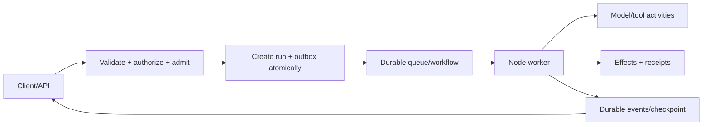
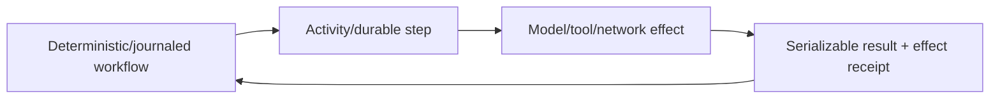

# Queues, State, and Durable Workers

> **Last researched:** 2026-08-31  
> **Baseline:** Node.js 24 LTS for workers; verify each queue/workflow SDK's explicit Node support  
> **Use with:** [Durable execution](../../runtime/durable-execution.md), [agent state and event contracts](../../runtime/agent-state-and-event-contracts.md), and [queues/scheduling](../../operations/queues-scheduling-and-backpressure.md)

An in-memory promise, timer, event emitter, stream, or worker queue is lost with the process. If an agent run must survive deploys, crashes, long human waits, or provider outages, move ownership to a durable queue/state store or workflow runtime. That does not create exactly-once external effects; it creates recoverable execution records that still need idempotency and reconciliation.

## Separate the interactive edge from durable ownership



The API can stream while the process remains attached, but the durable run—not the socket—owns completion. On reconnect, clients read by run ID/cursor. If the product is deliberately request-bound, keep it simpler and cancel on disconnect; do not add a durable engine without a real survival requirement.

## Queue delivery is normally at least once

A worker usually:

1. receives or leases a message;
2. performs work;
3. records state/effects;
4. acknowledges/completes the message.

A crash between steps creates duplicates or ambiguous outcomes. Make handlers idempotent, keep attempts visible, and acknowledge only after the chosen durability boundary.

For lease-based queues, event-loop starvation is a correctness risk: a CPU-heavy callback can delay lock/visibility renewal, causing another worker to receive the same job while the first still runs. BullMQ explicitly documents at-least-once behavior and stalled jobs when lock renewal fails, including from event-loop stalls.

## Durable state needs an explicit contract

Persist stable, versioned records rather than framework objects:

- run ID, attempt/lease token, tenant, principal snapshot/reference;
- status and state version;
- absolute deadline and cancellation intent;
- model/tool attempt metadata and bounded receipts;
- external effect IDs and reconciliation state;
- approval requests/decisions;
- event sequence/cursor and artifact references;
- behavior, prompt, tool-schema, model, runtime, and code versions;
- terminal reason and repair/audit history.

Do not serialize `AbortSignal`, sockets, streams, closures, errors with hidden properties, class instances, SDK response objects, or open database handles. Normalize errors and payloads into versioned wire contracts.

Keep state, events, effects, and memory separate even if one database stores them:

| Record | Write rule | Why separation matters |
|---|---|---|
| Run state | Compare-and-set on state version and current attempt/lease token | Prevents a late/stale Node worker from committing a terminal transition |
| Event | Append with stable event ID and per-run sequence | Supports ordered replay, dedupe, reconnect, and retention independent of current state |
| Effect | Reserve stable logical effect ID; persist receipt or `unknown` outcome | Makes timeout/crash ambiguity reconcilable across retries |
| Context snapshot | Replace by version with source IDs, budget, and compaction metadata | Avoids repeatedly appending summaries and stale working context |
| Long-term memory | Separate policy-authorized upsert with provenance, tenant, expiry/correction | Prevents recovery checkpoints from becoming unreviewed user memory |

An application envelope should be boring JSON-safe data:

```js
const work = {
  schemaVersion: 3,
  runId: 'run_01...',
  attemptId: 'attempt_04...',
  leaseToken: 'opaque-fence-token',
  behaviorVersion: 'agent-2026-08-31.2',
  deadlineAt: '2026-08-31T12:34:56.000Z',
  contextVersion: 7,
  payloadRef: 'artifact://tenant/run/input/sha256:...',
};
```

Validate this after deserialization and re-authorize the tenant/tool/effect at the worker. Queue data is untrusted input even when the publisher is another service. Large context and tool outputs travel by authorized artifact reference, not by repeatedly cloning multi-megabyte messages through Redis, IPC, or workflow history.

## Use transactional enqueue where state and work must agree

The dual-write failure is common:

- database commit succeeds, queue publish fails; or
- queue publish succeeds, database transaction rolls back.

Use an outbox written in the same transaction as run/effect state, then publish idempotently. If the queue/workflow product supports atomic enqueue with the application database, verify its exact guarantees and failure boundary. An “exactly once” marketing label rarely includes an arbitrary external provider.

## Choose the simplest durable tier that fits

| Need | Practical tier | Costs/limits |
|---|---|---|
| Short background job, simple retry | Managed queue + idempotent worker | You own state machine, leases, dedupe, progress, repair |
| Redis-backed Node jobs and flows | BullMQ-class queue | Redis durability/ops, stalled locks, at-least-once effects |
| Long waits, signals, replay, workflow versioning | Temporal | Separate service/control plane, deterministic workflow rules, activity boundaries |
| Journaled services/objects with durable promises | Restate | Runtime/server semantics, deployment/version compatibility, journal growth |
| Postgres-centered durable workflows/queues | DBOS | Database/system-schema operations, recovery/version procedures |
| Existing orchestrator/platform workflow | Platform-specific engine | Language/runtime restrictions and vendor lifecycle |

Do not adopt a workflow engine only to run one retryable HTTP request. Do not hand-build replay, signals, timers, and repair tables once those become core product requirements.

## Keep nondeterminism outside replay code

In replay-based or journaled systems, use the runtime's deterministic APIs. Model calls, ordinary `fetch`, `Date.now`, random values, process environment reads, and arbitrary package behavior can diverge on replay unless recorded through an activity/step/side-effect primitive.



Temporal's TypeScript worker depends on authentic Node features including native modules, worker threads, `vm`, `AsyncLocalStorage`, and async hooks; its project currently lists official support through Node 24, not Node 26. Do not deploy its worker to an edge runtime or promote Node 26 until the SDK's support matrix and tests agree. Its workflow sandbox enforces determinism; it is not an untrusted-code sandbox.

Restate durable promises/awakeables and DBOS messages/events can suspend long waits without holding a live Node request. Their cancellation, retention, version, and exactly-once wording are product-specific; document the chosen engine's actual contract.

## Bound worker concurrency by the downstream resource

Queue depth is not a license to start everything. Separate:

- poll/lease concurrency;
- active model attempts by provider/model;
- tool class and tenant concurrency;
- database connection slots;
- CPU worker/process slots;
- rate starts per second/minute;
- run working-set bytes;
- priority/reserved repair capacity.

Lease more work only when the process can safely own it. Long local prefetch can make shutdown slow and hide queue-level capacity. Autoscale on queue age and constrained resource utilization, not only message count.

## Cancellation, retries, and dead letters

Durable cancellation is a persisted intent. A running attempt may observe it late; a committed effect remains committed. Define whether cancellation:

- stops future attempts only;
- requests cooperative activity cancellation;
- terminates a subprocess;
- compensates a completed effect;
- preserves or discards pending approvals/events;
- is terminal or resumable.

Retries need maximum attempts, elapsed-time/deadline budget, backoff with jitter, retry classification, and an operator-visible exhausted state. A dead-letter queue is not a repair plan. Provide inspect, replay/fork/resume, skip/compensate, and audit procedures appropriate to the engine.

Poison work can crash a Node process before it records an ordinary failure. Cap crash recovery attempts and quarantine by stable job/run ID so a fleet does not crash-loop indefinitely. DBOS exposes `maxRecoveryAttempts` for this class of protection; queue consumers need an equivalent operational policy.

## Version long-lived behavior

Deploys can leave old runs in flight. Record the behavior/tool/schema/workflow version and decide:

- sticky or compatible routing to old code;
- patch/version markers for replay changes;
- migration or fork to new behavior;
- retention limit for old worker artifacts;
- safe rollback when new and old workers share a queue;
- provider/model version drift during resume.

Never assume a TypeScript refactor is replay-compatible merely because types compile. Runtime ordering and emitted commands are what matter.

## Durable worker verification

- [ ] Kill the process before and after each state/effect/ack boundary.
- [ ] Delay lease renewal with event-loop CPU starvation and verify duplicate handling.
- [ ] Deliver the same job concurrently to two workers; only the fenced owner commits state.
- [ ] Retry an ambiguous remote write with the same effect ID and reconcile.
- [ ] Cancel queued, running, waiting, and effect-committed runs.
- [ ] Deploy incompatible behavior while old executions remain and exercise rollback.
- [ ] Exhaust retries/crash recovery and prove operator repair/audit paths.
- [ ] Bound history/journal/event retention and large payloads.
- [ ] Shutdown stops polling first and returns/relinquishes work safely.
- [ ] SDK/server/Node compatibility is pinned and tested.
- [ ] State, event, effect, context, and long-term-memory writes have distinct schemas and retention/repair policies.
- [ ] Every queue/workflow payload is size-limited, runtime-validated, and re-authorized after deserialization.

## Selected primary sources

- [BullMQ stalled jobs and at-least-once behavior](https://docs.bullmq.io/bull/important-notes)
- [BullMQ idempotent jobs](https://docs.bullmq.io/patterns/idempotent-jobs)
- [Temporal TypeScript SDK requirements](https://github.com/temporalio/sdk-typescript#requirements)
- [Restate TypeScript external events](https://docs.restate.dev/develop/ts/external-events)
- [DBOS TypeScript workflows](https://docs.dbos.dev/typescript/tutorials/workflow-tutorial)
- [DBOS workflow recovery](https://docs.dbos.dev/production/workflow-recovery)
