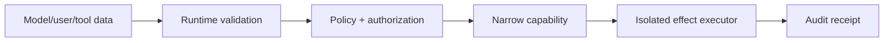

# Security, Permissions, Modules, and Supply Chain

> **Last researched:** 2026-08-31  
> **Baseline:** Node.js 24.20.0 LTS; permission-audit and loader details are version-sensitive  
> **Use with:** [Agent threat model](../../security/agent-threat-model.md) and [permissions/sandboxing](../../security/permissions-sandboxing-and-secrets.md)

Node agent services combine untrusted model output, powerful tools, a large dependency graph, dynamic module loading, and long-lived credentials. Security requires layered capability design. The permission model can reduce accidental authority in trusted code, but the OS/container identity, tool boundary, dependency policy, and effect authorization remain primary.

## Start with capability boundaries

Keep compiler/schema mechanics in [TypeScript/Node.js agent runtimes](../typescript-node-agent-runtimes.md). At runtime, shape validation is followed by domain validation, authorization, destination/path resolution, and effect fencing. A valid JSON object is not authorized intent.

## Use the permission model as defense in depth

The permission model is stable, but its scopes differ across the two baselines:

| Surface | Node 24.20 LTS | Node 26.8 Current |
|---|---|---|
| Filesystem, child process, worker, addon, WASI, inspector | Enforced by the permission model | Enforced |
| Network, FFI, selected OpenSSL STORE authority | Not part of the documented 24.20 scope set | Documented in the wider Node 26 scope set |
| `--permission-audit` | Added to 24.20; publishes would-be denials without blocking | Available with additional channels for newer scopes |
| `process.permission.drop()` | Added to 24.20; irreversibly removes an exact grant for future checks | Available; exact behavior still follows target documentation |

Start the process with `--permission` and the narrow grants supported by the pinned patch. Never copy Node 26 flags into a Node 24 deployment without a startup test. Audit mode is useful for discovery, not enforcement: the operation still happens. Run it in a controlled environment, review bounded diagnostics, then switch to enforcement and run negative tests.

`permission.drop()` supports startup privilege reduction, for example reading one configuration directory and then dropping that exact grant. It affects future permission checks; it does not close an existing file descriptor, child process, worker, or socket. Drop plus explicit resource cleanup is required.

Constraints matter:

- the permission model does not automatically inherit to worker threads;
- some runtime/bootstrap flags read files before permission initialization;
- existing file descriptors and other documented surfaces can bypass assumptions;
- symlink behavior and path resolution require care;
- allowing child processes/workers/addons greatly expands authority;
- where supported, allowing OpenSSL STORE loaders can expose resources outside ordinary fs/net scopes;
- permission checks do not protect against CPU/memory denial of service or all native behavior.

The 24.20 documentation is more specific: filesystem permission checks do not cover every alternative subsystem (for example, documented `node:sqlite` behavior), granted paths can follow relative symlinks outside the intended tree, and cross-process inspector activation is an OS-level capability. Use separate OS identities, mount/network boundaries, and seccomp/AppArmor-equivalent controls where those threats matter.

Node documentation states the model is not a malicious-code sandbox. Keep least-privilege OS identity, read-only/mounted filesystems, network policy, secrets broker, and container/VM isolation underneath it.

## Make modules explicit

Set `package.json` `type` explicitly. Ambiguous `.js` files can incur syntax detection/reparse cost and create tool/runtime differences. Prefer a consistent internal ESM or CJS format; publish dual packages only when consumers require them and test both entry points.

Conditional exports can load different files for `import` and `require`, causing duplicate singleton instances/state if both paths enter one process. This is dangerous for AsyncLocalStorage instances, registries, metrics providers, caches, and SDK clients. Add a mixed-import test or avoid dual stateful entry points.

Use the `node:` prefix for built-ins where practical to reduce name confusion. Restrict dynamic `import()` specifiers to an allowlisted registry; never import an arbitrary package/path chosen by model output.

## Treat loader hooks as privileged code

Node 26 runtime-deprecates asynchronous `module.register()` and current docs recommend synchronous `module.registerHooks()` for most uses. Synchronous hooks are release-candidate; asynchronous hooks remain active development with a separate loader thread and CommonJS caveats.

Hooks can rewrite resolution and source before application code loads. They are a supply-chain/security boundary and hot-path performance risk. Use only for a concrete need, preload them before target modules, pin Node behavior, and test worker inheritance. A network loader example in Node's docs is explicitly slow, uncached, and insecure—do not turn module resolution into live production fetching.

Instrumentation often needs preload hooks; keep those minimal, signed/pinned, observable, and unable to leak sensitive source/configuration.

## Lock and reproduce dependencies

For npm-based deployments:

- commit and review `package-lock.json`;
- use `npm ci` with the same resolver flags that produced the lock;
- pin the Node patch, npm/package-manager version, base image digest, platform, and native build chain;
- avoid git/file/URL dependencies unless specifically reviewed;
- separate build and runtime images; omit package manager/build tools from runtime when practical;
- retain deployed lockfile, SBOM, image/artifact digest, and dependency audit evidence;
- stage dependency and provider-SDK updates with runtime/effect evals.

Treat a provider SDK as runtime code, not a schema-only dependency. A minor release can change default retries, Undici/Fetch selection, streaming event shapes, usage timing, abort behavior, telemetry capture, or ESM/CJS entry points. Keep it behind a narrow application adapter and require an upgrade diff that records:

- package and transitive transport versions, including `process.versions.undici`;
- retry owner/default attempt count and whether request bodies are replayed;
- accepted cancellation API and behavior before headers, during body, and during backpressure;
- response-body settlement on success, error, size rejection, and caller abort;
- terminal/usage/tool event ordering and unknown-event behavior;
- content logging/tracing defaults and metric cardinality;
- full Node, serverless, and edge support statements;
- clean install, package exports, native addon, and ESM/CJS results.

Compile success is not this evidence. Replay recorded fixtures through the adapter, then run transport fault tests against the exact pinned Node/runtime.

`npm ci` is frozen with respect to the committed manifest/lock, but it still executes lifecycle scripts unless policy changes that. It also removes an existing `node_modules` directory; use it only in an intended build workspace.

## Control install-time execution

`preinstall`, `install`, `postinstall`, `prepare`, native builds, and git dependencies can execute during installation. Current npm 12 documentation supports project `allowScripts` policy and strict enforcement; npm 11.10 added related security controls and `--allow-git` to address git dependency executable override risk. Feature availability depends on the npm version, not merely Node 24.

Adopt progressively:

1. inventory scripts in the locked graph;
2. use an isolated unprivileged network-restricted build environment;
3. deny/allowlist scripts with the pinned package manager where supported;
4. avoid blanket escape hatches;
5. rebuild and test native artifacts on every target;
6. treat postinstall output as untrusted.

`--ignore-scripts` reduces one surface but does not by itself make all dependency acquisition safe; npm's 2026 git-dependency guidance is an example of a separate path.

## Use provenance and signatures correctly

`npm audit signatures` verifies registry signatures and provenance attestations for installed dependencies where available. Provenance links a package to a source/build identity; npm explicitly notes that it does not prove the code is non-malicious.

For packages you publish, trusted publishing uses short-lived OIDC credentials rather than long-lived npm tokens and automatically generates provenance in supported public-source/public-package conditions. Keep 2FA, ownership review, staged release/rollback, and artifact inspection; provenance is one signal.

## Secrets and telemetry

Do not expose whole `process.env` to tools/workers or serialize it into diagnostics. Pass task-scoped credentials explicitly, prefer short-lived tokens, and separate provider/tool identities. Remove authorization headers and proxy credentials from errors/traces. Node diagnostic reports can include environment/network/command-line data unless exclusion and handling policy is set.

## Security verification

- [ ] Runtime boundaries validate, authorize, and fence effects after parsing.
- [ ] Node permissions deny supported scopes; OS/container policy denies network and other authority absent from the target's scope set.
- [ ] Permission tests use the exact Node 24/26 scope set; audit discovery is followed by enforce-mode negative tests.
- [ ] Any `permission.drop()` use proves that already-open resources are closed separately.
- [ ] Hostile/generated code always crosses an OS sandbox boundary.
- [ ] Package `type`, exports, and ESM/CJS entry paths are explicit and tested.
- [ ] Loader hooks are minimal, pinned, preloaded correctly, and reviewed as privileged code.
- [ ] Frozen install uses the reviewed lock and identical resolver flags.
- [ ] Install scripts, git dependencies, and native builds are allowlisted/isolated.
- [ ] Provider SDK upgrades pass abort/retry/stream/body-cleanup/telemetry/module/runtime adoption tests.
- [ ] Audit, signatures/provenance, SBOM, and artifact digests are retained.
- [ ] Secrets, prompts, tool data, reports, and snapshots follow redaction/retention policy.

## Selected primary sources

- [Node.js permission model](https://nodejs.org/api/permissions.html)
- [Node.js 24.20 permission model](https://nodejs.org/download/release/latest-v24.x/docs/api/permissions.html)
- [Node.js packages and module type](https://nodejs.org/api/packages.html)
- [Node.js module customization hooks](https://nodejs.org/api/module.html#customization-hooks)
- [npm clean install and script policy](https://docs.npmjs.com/cli/commands/npm-ci/)
- [npm provenance limitations and verification](https://docs.npmjs.com/generating-provenance-statements/)
- [npm trusted publishing](https://docs.npmjs.com/trusted-publishers/)
- [npm 2026 install-script/git dependency controls](https://github.blog/changelog/2026-02-18-npm-bulk-trusted-publishing-config-and-script-security-now-generally-available/)
