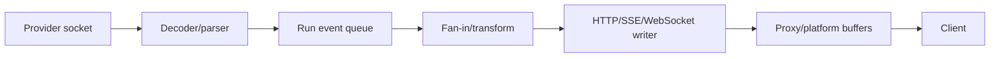
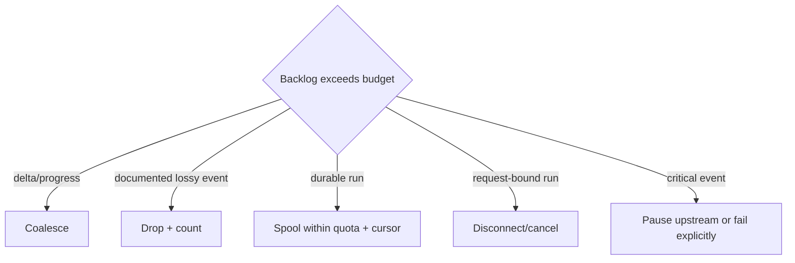

# Streams, Backpressure, SSE, and WebSocket

> **Last researched:** 2026-08-31  
> **Baseline:** Stable Node streams and WHATWG Web Streams on Node 24/26  
> **Related:** [Queues, scheduling, and backpressure](../../operations/queues-scheduling-and-backpressure.md)

Streaming reduces time to first useful output and can lower peak buffering. It does not make memory bounded automatically. Backpressure exists only when each producer observes the next boundary's capacity and the application has a policy for a consumer that never catches up.

## Follow the bytes through every boundary



A bounded high-water mark at `H` cannot protect `Q` if the producer continues appending there. Inventory buffers in SDKs, transforms, async iterators, framework adapters, HTTP libraries, proxies, and the browser. Budget aggregate bytes, not only message count.

## Use Node streams and Web Streams deliberately

Node exposes two stable stream families:

| Surface | Best fit | Important behavior |
|---|---|---|
| Node `Readable`/`Writable`/`Transform` | Node libraries, files, sockets, server responses, many SDKs | `write()` boolean, `'drain'`, object mode, `highWaterMark`, destroy semantics |
| WHATWG `ReadableStream`/`WritableStream`/`TransformStream` | `fetch`, web/serverless/edge portability, Web APIs | reader locking, `desiredSize`, cancel/abort, queuing strategies |

`Readable.fromWeb()`/`toWeb()` and corresponding writable/duplex adapters bridge the families. Conversion does not erase semantic differences: chunk type, object mode, cancellation, error propagation, and queuing strategy still need tests.

Prefer `stream.pipeline()`/`node:stream/promises` when connecting a source through transforms to a destination. It coordinates backpressure and propagates errors/closure better than a chain of unmanaged `.pipe()` calls. Supply an `AbortSignal` where the owning lifecycle has one.

Node 24.20 also introduced `node:stream/iter`, an iterable/batched-byte streaming API with explicit byte budgets and strict/drop policies. It is Stability 1, requires `--experimental-stream-iter`, and is not the production baseline of this playbook. Evaluate it behind an adapter and compatibility test; do not migrate stable agent streams merely because it landed in an LTS patch.

`pipeline()` is lifecycle ownership, not an HTTP error renderer. On failure it destroys participating streams and can destroy an `IncomingMessage`/response socket before an application writes a fallback status. It can also leave listeners on reused stream instances after failure. Create per-operation streams, decide status/headers before handing the response to a destructive pipeline, and do not reuse a failed pipeline member without a specific test.

With a writable stream:

```js
if (!writable.write(chunk)) {
  await once(writable, 'drain', { signal });
}
```

Ignoring `false` means the writable is buffering faster than it drains. Waiting for `'drain'` is only safe while also handling error, close, and abort; `pipeline()` usually packages those edges more reliably.

## High-water marks are thresholds, not hard memory limits

High-water marks describe when a stream should ask upstream to slow down. They do not guarantee:

- a producer actually stops producing;
- only one extra chunk is buffered;
- chunks are small;
- transforms do not retain previous chunks;
- an SDK does not buffer independently;
- a proxy or client drains at the same rate.

Object mode is especially deceptive: a limit of 16 objects can mean 16 multi-megabyte tool results. Track queued bytes alongside items and move large artifacts to object storage, passing references through the event path.

## Design the event protocol, not token plumbing

An agent stream needs typed events and one terminal outcome:

| Event class | Loss policy |
|---|---|
| Token/text delta | May be coalesced; sometimes droppable if documented |
| Tool started/progress | Coalesce progress; preserve meaningful state changes |
| Tool result/effect receipt | Never silently drop |
| Approval request/decision | Never silently drop |
| Checkpoint/cursor | Preserve if needed for resume |
| Terminal success/failure/cancel | Exactly one externally visible terminal event |

Define maximum frame size, aggregate queued bytes, maximum events per run, serialization failure behavior, and ordering across parallel tool calls. A merger should attach monotonic sequence numbers or stable event IDs rather than relying on callback arrival order.

## SSE is resumable only with durable event identity

Server-sent events are UTF-8 `text/event-stream` records separated by blank lines. An `id` updates the client's last event ID; reconnects can send `Last-Event-ID`. The browser may reconnect automatically, and HTTP 204 tells it to stop.

```text
id: 1842
event: tool_result
data: {"call_id":"c7","status":"ok"}

```

Production rules:

- end every event with the required blank line;
- encode embedded newlines as multiple `data:` fields or inside JSON;
- send periodic comment heartbeats only when they solve an observed intermediary idle timeout;
- disable or account for proxy buffering and response compression behavior;
- authenticate reconnects and validate the cursor belongs to the same tenant/run;
- persist event IDs and replayable events if resume must survive process loss;
- return an explicit resync/expired-cursor result when retention no longer covers the ID;
- deduplicate replayed terminal/effect events on the client.

Keep framing and drain behavior in one small writer rather than duplicating ad hoc `res.write()` calls:

```js
import { Buffer } from 'node:buffer';
import { once } from 'node:events';

function encodeSse({ id, event, data }) {
  if (!/^[A-Za-z0-9_.-]+$/.test(event)) throw new Error('Invalid event name');
  if (/[\r\n]/.test(id)) throw new Error('Invalid event id');
  return `id: ${id}\nevent: ${event}\ndata: ${JSON.stringify(data)}\n\n`;
}

async function writeSse(response, message, { signal, maxFrameBytes = 64_000 }) {
  signal.throwIfAborted();
  const frame = encodeSse(message);
  if (Buffer.byteLength(frame) > maxFrameBytes) throw new Error('SSE frame too large');
  if (!response.write(frame)) await once(response, 'drain', { signal });
}
```

This helper does not make events durable. Allocate the sequence/event ID and persist a replayable critical event before treating it as published. On write failure, the run owner follows the request-bound or durable-disconnect policy; it never retries a partially written frame blindly on the same connection.

An in-memory incrementing counter is not a durable resume protocol. If the run continues after disconnect, persist the cursor and events before acknowledging their visibility.

For browser HTTP/1.1, per-origin connection limits can make multiple SSE tabs painful; HTTP/2 multiplexing changes that constraint but introduces its own stream/session limits. Test the real proxy and browser path.

## WebSocket adds bidirectional lifecycle obligations

WebSocket is useful for bidirectional control, acknowledgements, interactive audio, and multiplexed sessions. It is not automatically more reliable than SSE.

Node's built-in/Undici WHATWG `WebSocket` is a client surface. Server-side WebSocket behavior normally comes from a userland server/library or platform. Pin and test that component independently.

For each connection define:

- authenticated principal and authorization refresh/expiry;
- maximum frame/message and aggregate buffered bytes;
- inbound rate and concurrency limits;
- heartbeat/ping ownership and dead-peer timeout;
- `bufferedAmount` or library-specific send backlog policy;
- message IDs, acknowledgements, deduplication, and replay boundary;
- close codes and graceful-close deadline;
- reconnect/resume semantics;
- maximum runs/streams multiplexed on one socket.

TCP/WebSocket delivery does not mean the application processed or durably recorded a message. If an approval or mutating command matters, acknowledge only after the chosen durability boundary.

## Define a slow-consumer policy



Never let the default be “keep buffering.” Backpressure can propagate all the way to an upstream provider body, but doing so may change provider idle-timeout behavior or billed connection duration. Coalescing token deltas often gives a better user experience and smaller event overhead than forwarding each token-shaped fragment.

## Handle closure and half-completion

Distinct events can occur:

- client stops reading while provider continues;
- provider completes but buffered client writes remain;
- transform throws after response headers were sent;
- proxy closes while server socket has not emitted the expected event yet;
- shutdown begins while a stream is between semantic events;
- a WebSocket closes without a complete close handshake.

The run owner needs one rule for each. After response headers are committed, an HTTP status code may no longer communicate the error; emit a typed terminal frame when possible, then close. Durable runs should record final state independently of transport success.

## Stream verification checklist

- [ ] Every buffer has an element and byte limit.
- [ ] Node/Web Stream adapters are tested for chunk, error, cancel, and close semantics.
- [ ] `pipeline()` or equivalent propagates backpressure and failure end to end.
- [ ] Slow-consumer behavior is deliberate and observable.
- [ ] SSE event framing, IDs, retention, reconnect, and expired-cursor behavior are tested.
- [ ] WebSocket frames, inbound rate, send backlog, heartbeat, auth expiry, and close are bounded.
- [ ] Client disconnect policy is independent from run durability.
- [ ] Exactly one terminal semantic event/state is visible.
- [ ] Shutdown drains or terminates active streams inside the platform grace period.

## Selected primary sources

- [Node.js streams](https://nodejs.org/api/stream.html)
- [Node.js Web Streams](https://nodejs.org/api/webstreams.html)
- [Node.js iterable streams (experimental in 24.20)](https://nodejs.org/download/release/latest-v24.x/docs/api/stream_iter.html)
- [WHATWG server-sent events](https://html.spec.whatwg.org/multipage/server-sent-events.html)
- [Undici WebSocket](https://github.com/nodejs/undici/blob/main/docs/docs/api/WebSocket.md)
- [AWS Lambda response streaming and `pipeline()`](https://docs.aws.amazon.com/lambda/latest/dg/config-rs-write-functions.html)
