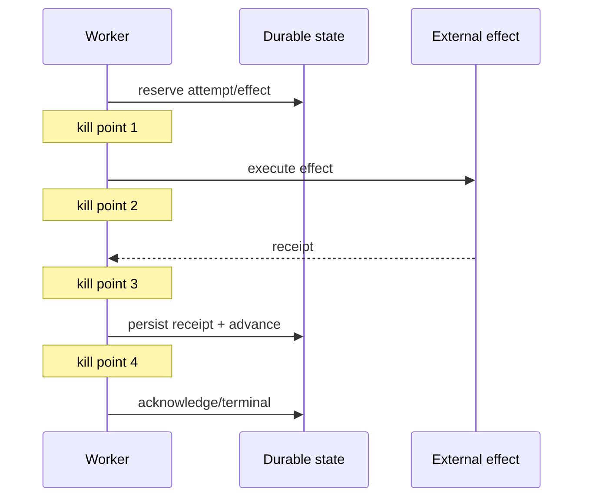

# Testing, Load, Races, and Failure Injection

> **Last researched:** 2026-08-31  
> **Baseline:** Stable `node:test` core runner and mock timers on Node 24/26; some runner features remain experimental  
> **Related:** [Evaluation-driven development](../../evaluation/evaluation-driven-development.md)

Agent-runtime correctness lives in interleavings: abort versus completion, process exit versus effect commit, slow client versus provider stream, queue lease renewal versus event-loop stall, and shutdown versus active retries. Happy-path unit tests cannot establish those properties.

## Use a layered verification model

| Layer | What to prove |
|---|---|
| Pure unit/state machine | Legal transitions, deadline math, retry classification, event ordering, byte accounting |
| Component | Abort cleanup, stream backpressure, dispatcher reuse, worker/process protocol, persistence fences |
| Integration | Real database/queue/proxy/provider test double and exact Node runtime |
| Fault test | Kill, reset, stall, duplicate, delay, truncate, exhaust, corrupt |
| Load/soak | Tail latency, fairness, memory/handle return, pool queues, retries under sustained pressure |
| Deployment | Readiness, rolling shutdown, old/new worker compatibility, serverless/edge limits |

Model/provider semantic evals and runtime reliability tests are complementary. A high-quality answer is irrelevant if the run duplicates an effect or leaks a socket.

## Use `node:test` with stability awareness

The built-in test runner supports process isolation by default, concurrency, timeouts, mocks, stable mock timers, snapshots, reporters, and coverage. At the snapshot date, watch mode and coverage still carry experimental labels; module mocking is early development. Pin the Node patch and avoid building critical CI behavior on an unstable surface without an adoption test.

Process isolation is valuable because test files can otherwise share globals, module caches, AsyncLocalStorage instances, dispatchers, and listeners. If using `--test-isolation=none` for speed, treat shared state as an explicit test and cleanup responsibility.

Await all subtests and async work. The test runner reports activity/rejections after a test ends, but that diagnostic is not a substitute for ownership. A passing test that leaves a timer/socket/worker alive is a failure of the component contract.

## Fake time does not fake the event loop or network

Mock timers can control `setTimeout`, `setInterval`, `setImmediate`, and `Date`. They are useful for deterministic deadline/backoff state tests.

They do not automatically simulate:

- DNS/TCP/TLS/Undici timeout machinery;
- operating-system signals;
- worker scheduling or CPU starvation;
- queue lease servers;
- proxy idle timeouts;
- every package's clock source;
- monotonic versus wall-clock behavior;
- microtask/I/O phase interleavings exactly like production.

Use fake time for pure clock-driven logic, and real bounded-time integration tests for transport and lifecycle. Node documents that `setTime()` changes mocked Date but does not fire timers; `tick()`/`runAll()` have different semantics. Test the behavior you intend, not only the final timestamp.

## Make time injectable at policy boundaries

Represent an absolute deadline and pass a narrow clock/sleeper interface to retry/admission state machines. Keep actual I/O using native signals/timers. This avoids replacing every global timer while allowing deterministic budget tests.

Test:

- zero/expired remaining budget;
- clock jumps for persisted wall deadlines;
- timer delivered late after event-loop stall;
- backoff capped by remaining deadline;
- cleanup deadline independent from cancelled work signal;
- repeated shutdown signal.

## Exercise cancellation at every await boundary

For a model/tool flow, inject abort:

1. before admission;
2. while queued;
3. during connection setup;
4. after request send, before headers;
5. during streaming body;
6. while blocked on downstream backpressure;
7. before and after effect commit;
8. during retry sleep;
9. during checkpoint/terminal transition;
10. during shutdown cleanup.

Pass conditions include no later attempts, no unhandled rejection, settled task registry, released pool/permit, destroyed or consumed body, correct terminal fence, and reconciled effect state.

## Test backpressure with a deliberately slow sink

Do not benchmark streaming with a localhost consumer that drains instantly. Create a writable/client that pauses, reads tiny chunks, disconnects mid-frame, and never resumes.

Measure:

- provider read rate and whether it pauses;
- every internal queue's items and bytes;
- RSS/heap/external memory;
- time until coalesce/drop/disconnect policy triggers;
- terminal event/state delivery;
- cleanup and connection return.

For SSE, reconnect with old/current/expired `Last-Event-ID`, duplicate the terminal event, and restart the process between events. For WebSocket, fill send backlog, stop pong responses, send oversized/inbound floods, expire auth, and close without handshake.

## Reproduce event-loop and libuv contention separately

Event-loop stall test: run a bounded CPU loop/large parse on the main isolate and verify delay alarms, admission protection, deadline-observed lag, and queue lease behavior.

libuv test: concurrently exercise the actual filesystem/DNS/crypto/zlib operations and observe their latency without blocking JavaScript. If `UV_THREADPOOL_SIZE` is tuned, repeat the matrix across CPU/memory quotas.

Worker tests: crash, hang, send malformed/oversized messages, finish after cancellation, exceed resource limit, and repeatedly crash on a poison job. Confirm bounded replacement and no unbounded queue.

## Kill around durable boundaries

Use a deterministic failpoint or external process termination at each transition:

After restart, prove no lost run, legal duplicate behavior, stable effect ID, and operator-visible ambiguity. Also deliver the same lease concurrently to two workers and verify the stale token cannot commit.

## Load test the constrained system

Use representative distributions of prompt/context/tool output and stream duration, not uniform tiny requests. Include downstream latency variance, rate limits, retries, client disconnects, and a noisy tenant.

Report:

- throughput and p50/p95/p99 end-to-end latency;
- queue/admission wait and rejection;
- event-loop delay/ELU and CPU throttle;
- dispatcher connections/pending/reuse/errors;
- worker/libuv queues;
- stream backlog/slow-consumer actions;
- RSS, heap, external memory, GC, handle count;
- retry amplification, provider cost, and effect duplicates;
- shutdown drain time at peak load.

A load result is invalid if generators, provider mocks, or the target share a bottleneck that masks real behavior.

## Soak for return-to-baseline

Short load tests find throughput cliffs; soak tests find retention. Alternate high load and quiescence. After runs settle/cancel, verify memory, handles, listeners, sockets, worker queue, dispatcher pending count, and task registry return near a stable baseline. Account for legitimate caches separately.

## Put every provider SDK behind an adoption suite

Run the same black-box adapter suite before and after an SDK update. It should not import SDK internals; it should exercise the contract your runtime depends on:

| Probe | Required evidence |
|---|---|
| Abort before send/connect/headers/body and while downstream is paused | No later SDK retry, body/socket cleanup, bounded settlement, preserved stop reason |
| Retry and rate limit | Total wire attempts, backoff/`Retry-After`, remaining deadline and cost, replayed body behavior |
| Streaming | Known/unknown event handling, ordering, terminal and usage events, truncated/error body, slow-consumer behavior |
| Tools/structured output | Runtime validation, malformed partial arguments, duplicate tool call ID, late result fence |
| Transport | Embedded versus installed Undici, dispatcher reuse/bounds, proxy/TLS/redirect behavior |
| Observability | Spans initialized before imports, bounded attributes, no raw content/credentials, exporter failure does not fail the run |
| Packaging/runtime | ESM and/or CJS entry used in production, clean lock install, full Node/serverless/edge target execution |

Capture the wire-level attempt count and adapter events, not only the returned object. A library can preserve its TypeScript signature while changing hidden retry, stream, body, or telemetry behavior. Keep representative recorded fixtures for parser compatibility, but use a real local fault server/proxy for cancellation, backpressure, keep-alive, and timeout behavior.

When the Node patch changes, rerun this suite even if the SDK version does not: built-in `fetch` follows the embedded Undici. When an installed Undici major changes, verify its dispatcher contract against the built-in fetch combination rather than assuming cross-major compatibility.

## Release test matrix

- [ ] Node 24 production patch and Node 26 compatibility patch run the same suite.
- [ ] Node 24.20 permission audit/enforcement scopes and Node 26 wider scopes have separate negative tests.
- [ ] Experimental `node:stream/iter` is absent from the production path, or has an explicit flag, adapter, fallback, and upgrade test.
- [ ] Linux/container target plus every supported OS for subprocess behavior.
- [ ] Exact proxy/load balancer and serverless/edge runtime where applicable.
- [ ] Cold/reused keep-alive, HTTP/2 if enabled, large/slow/truncated bodies.
- [ ] Cancellation at every boundary and delayed timer delivery.
- [ ] Slow SSE/WebSocket consumer and reconnect/resume.
- [ ] Main-loop stall, libuv saturation, worker crash/hang/poison job.
- [ ] Duplicate queue delivery and kill around effects/checkpoints.
- [ ] Rolling shutdown under peak active streams/workers.
- [ ] Soak demonstrates bounded RSS/resources and cleanup toward baseline.
- [ ] Every provider/tool/telemetry SDK upgrade passes the black-box adoption suite with wire-attempt evidence.

## Selected primary sources

- [Node.js test runner](https://nodejs.org/api/test.html)
- [Node.js mock timers](https://nodejs.org/api/test.html#class-mocktimers)
- [Node.js process isolation and test concurrency](https://nodejs.org/api/test.html#test-runner-execution-model)
- [Node.js streams](https://nodejs.org/api/stream.html)
- [Node.js worker threads](https://nodejs.org/api/worker_threads.html)
- [BullMQ stalled-job behavior](https://docs.bullmq.io/bull/important-notes)
