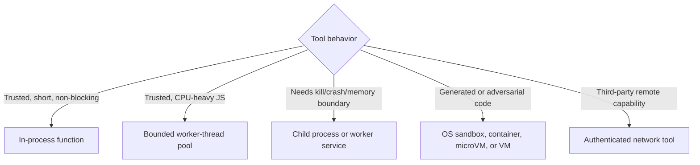
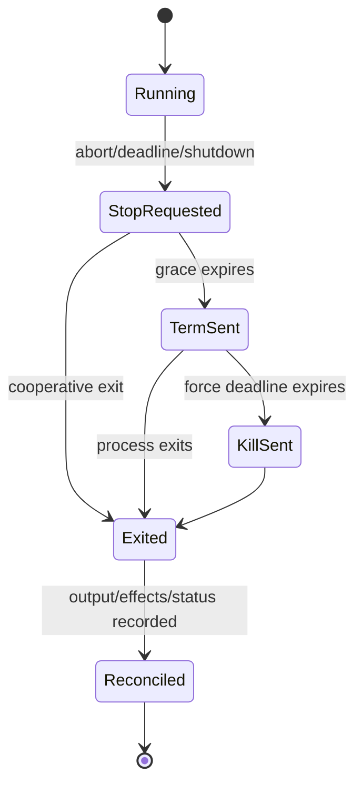

# Tools, Subprocesses, and Sandboxing

> **Last researched:** 2026-08-31  
> **Baseline:** Node.js 24.20.0 LTS  
> **Use with:** [Execution boundaries](../../runtime/execution-boundaries.md), [tool contracts](../../tools/tool-contracts.md), and [permissions/sandboxing](../../security/permissions-sandboxing-and-secrets.md)

An in-process Node tool has the full authority and failure domain of the agent service. It can read process secrets, mutate global state, consume the event loop, retain memory, and crash the process. Use it only for trusted, bounded code. Move work outward when you need force termination, a separate identity or memory envelope, native-crash containment, or an actual security boundary.

## Select isolation by the threat and failure model



Node's `vm` module executes code in a V8 context; its documentation explicitly says it is not a security mechanism. Worker threads share the process. The Node permission model constrains trusted applications but is not a malicious-code sandbox. None of these replaces an OS isolation boundary for generated code.

## Keep the shell out of model-controlled paths

Use `spawn(executable, args, { shell: false })` with an allowlisted executable and arguments passed separately. Do not build a command string from model output and feed it to a shell. Shell quoting is platform-specific, and escaping one metacharacter class does not make a general command safe.

Model/tool boundaries should produce a typed operation such as:

```text
operation: git_show
repository_id: repo-17
revision: 4d2a...
path: docs/guide.md
```

The executor maps that operation to a reviewed executable, fixed flags, validated identifiers, an authorized working directory, and a minimal environment. The model never chooses an arbitrary program, shell, environment variable name, filesystem root, or network destination.

Prefer `execFile` over `exec` when output is small and bounded. Prefer `spawn` for streamed output and lifecycle control. Never use synchronous child-process APIs on a service request path.

## Bound every subprocess resource

| Resource | Control |
|---|---|
| Wall time | Absolute deadline plus abort/termination escalation |
| CPU | Container/cgroup/job-object/OS quota, not only a JavaScript timer |
| Memory | Process/container limit; do not rely on parent V8 heap limit |
| Processes/threads | PID/process limit; prevent fork bombs |
| Stdout/stderr | Concurrent drains and byte caps; spool large artifacts with quota |
| Stdin | Close when complete; never leave a child waiting indefinitely |
| Filesystem | Dedicated working directory, allowlisted mounts, quota, cleanup |
| Network | Default deny or egress allowlist; DNS and redirect policy |
| Credentials | Short-lived, task-scoped identity; minimal environment |
| File descriptors/handles | OS limit and supervised cleanup |

`exec`/`execFile` buffer output and terminate when `maxBuffer` is exceeded; truncation and multibyte encoding require care. With `spawn`, the application owns pipes. Drain stdout and stderr concurrently or a full pipe can deadlock the child. Cap by bytes while preserving a bounded tail/excerpt for diagnosis.

## Termination is a state machine



`spawn` accepts an `AbortSignal` and uses a configured `killSignal`, but that is not a complete process-tree guarantee. On POSIX, signals to the direct child do not automatically kill every descendant; process groups/session configuration and privileges matter. On Windows, signal names and tree termination behave differently; use Job Objects or an external supervisor/container where strong descendant ownership is required.

Test the actual operating systems. A tool that can daemonize, detach, or spawn grandchildren can outlive the parent unless the isolation boundary owns the whole tree.

Do not use `detached`/`unref()` for request-owned tools. Those settings explicitly allow a child to outlive or stop keeping the parent alive. Detached background work requires a durable external owner, its own identity, output destination, monitoring, and cleanup procedure.

## Treat output as untrusted input

Tool output can contain:

- prompt injection and instructions aimed at the model;
- escape/control sequences and terminal injection;
- secrets from files/environment;
- enormous or infinite output;
- malformed UTF-8/binary data;
- symlink/path references outside the intended workspace;
- plausible but false success text despite nonzero exit status.

Capture structured exit evidence: spawn error, exit code, signal, timeout/abort source, output truncation flags, artifact IDs, duration, and resource violations. Never decide success from stdout text alone.

Normalize/redact only with a policy that preserves forensic value. Store large binary artifacts outside the prompt/context and pass a typed handle plus bounded summary.

## Filesystem authority must follow resolved paths

Validate the final resolved target, not only the user-provided string. Defend against `..`, absolute paths, alternate separators, symlinks/junctions, case folding, device names, and race between validation and use. The strongest design mounts only the authorized workspace into the sandbox and performs operations relative to an already-open directory capability where the OS/API supports it.

Use a new per-run/tool directory with a quota and deterministic cleanup. Never recursively delete a path derived only from model text or an unresolved environment variable.

## Network tools need egress policy

A URL fetch tool can reach cloud metadata, loopback admin endpoints, private networks, unix sockets through adapters, or attacker-controlled redirects. Enforce scheme/host/port policy at every redirect, resolve and compare IP ranges according to the threat model, bound distinct origins, prevent credential forwarding across origins, and control proxy environment variables.

For high-risk fetching, place the downloader in a network sandbox/proxy that enforces policy independently of JavaScript checks.

## Sandbox contract

A serious untrusted-code runner defines:

- immutable base image/runtime and verified artifact digest;
- non-root identity with no host socket or cloud credentials;
- read-only root plus a small ephemeral writable workspace;
- seccomp/AppArmor/SELinux or equivalent policy where applicable;
- CPU, memory, PID, file, disk, and wall-clock limits;
- default-deny egress and explicit destinations;
- no Docker/Kubernetes/control-plane socket;
- bounded input/output transport;
- per-execution destruction and cleanup evidence;
- audit log linking run, tool, image, policy, and result.

Container isolation strength depends on the runtime and configuration. For strong multi-tenant or hostile workloads, a microVM/VM or specialized sandbox may be appropriate. Benchmark startup and warm-pool risks rather than silently weakening isolation for latency.

## Tool execution checklist

- [ ] Trusted in-process tools are small, non-blocking, and input-bounded.
- [ ] Model output selects an allowlisted operation, not a shell command.
- [ ] Executable, arguments, working directory, environment, and identity are explicit.
- [ ] Stdin/stdout/stderr are drained and byte-limited.
- [ ] Deadline, cooperative stop, process-tree escalation, and cleanup are tested per OS.
- [ ] Tool status uses exit/process evidence, not prose output.
- [ ] Filesystem and network authority are independently enforced.
- [ ] Generated/adversarial code runs outside the Node process under OS isolation.
- [ ] Effects use stable IDs and are reconciled after timeout/kill ambiguity.
- [ ] Sandbox images, policies, and native dependencies are pinned and observable.

## Selected primary sources

- [Node.js child processes](https://nodejs.org/api/child_process.html)
- [Node.js VM warning](https://nodejs.org/api/vm.html)
- [Node.js permission model constraints](https://nodejs.org/api/permissions.html#permission-model-constraints)
- [Node.js worker threads](https://nodejs.org/api/worker_threads.html)
- [Node.js errors and system error fields](https://nodejs.org/api/errors.html#common-system-errors)

