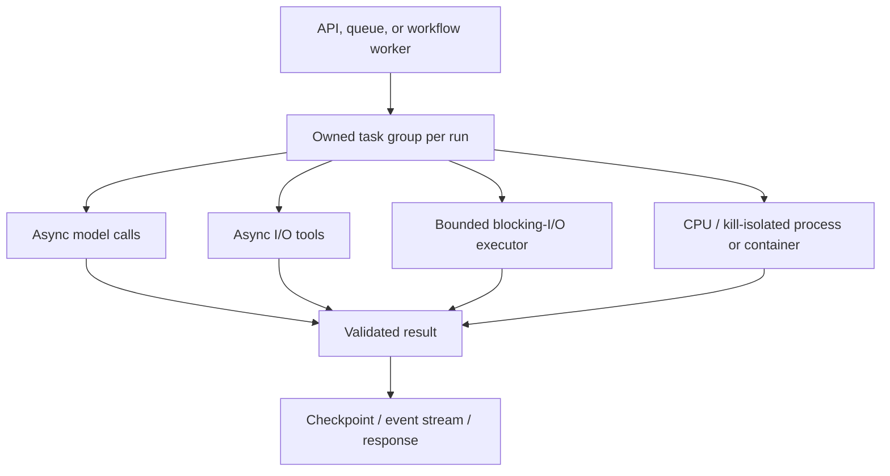
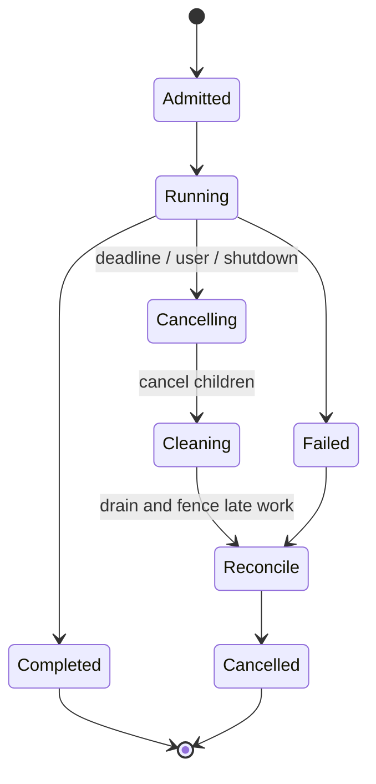
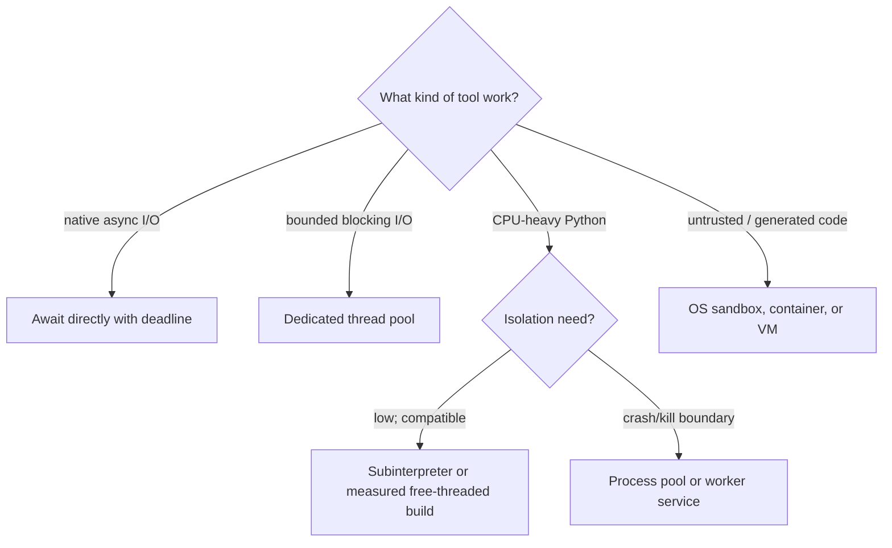
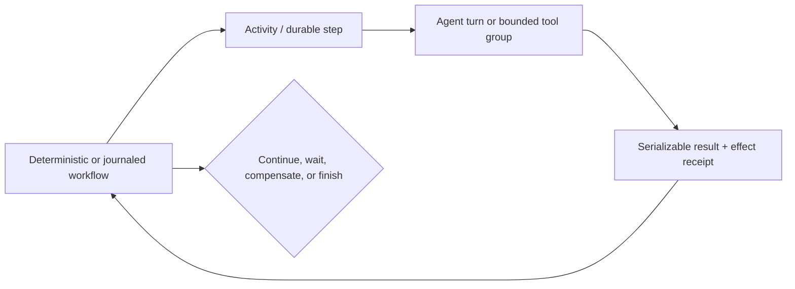

# Python Agent Runtimes in Production

> **Status:** Research-backed production guide  
> **Last researched:** 2026-08-31  
> **Current baseline:** CPython 3.14.7 stable; 3.15 prerelease  
> **Evidence:** [Python and TypeScript/Node.js runtime packet](../research/packets/python-and-typescript-agent-runtimes.md)  
> **Decision companion:** [Python vs TypeScript/Node.js](../comparisons/python-vs-typescript-node-agent-runtimes.md)

Python is a strong default when agent SDK breadth, evaluation/data tooling, retrieval, or a Python-operating team matters most. Production success depends on treating `asyncio`, synchronous tools, worker processes, validation, and shutdown as explicit architecture—not implementation detail.

## Choose Python when the whole fit is strong

| Strong fit | Reconsider or isolate |
|---|---|
| Evaluation, data, retrieval, ML, or scientific libraries are central | Most work is CPU-heavy inside the serving process and no isolation plan exists |
| Required provider/framework/durable adapter is Python-first | Team operates Node/JVM/.NET services but not Python async/process systems |
| Workload is mostly concurrent model, HTTP, database, and queue I/O | Untrusted generated code would execute in the agent process |
| Pydantic-style runtime contracts fit the tool/state model | Deployment requires a browser/edge runtime rather than a Python service |
| Python team owns profiling, packaging, patching, and on call | A synchronous dependency can block indefinitely and cannot be moved out of process |

Do not choose Python only because an agent tutorial did. Prototype availability is not a reliability argument.

## The production mental model

One event loop can coordinate many I/O-bound runs. It cannot make blocking Python code asynchronous, stop a thread safely, undo an external effect, or persist work through a process crash. Add a specific mechanism for each requirement.

## Baseline and version policy

As of 2026-08-31, Python 3.14 is in bugfix support through October 2027 and security support through October 2030; 3.15 is prerelease. Prefer a supported stable minor that every critical SDK and native wheel tests. Pin the minor version and container/build image, then update on a staged cadence.

Python 3.14 changes worth deliberate evaluation include:

- `InterpreterPoolExecutor` for isolated subinterpreters and multicore execution;
- explicit process-pool termination and kill operations;
- supported, optional free-threaded builds under PEP 779;
- deprecation of the `asyncio` policy system, scheduled for removal in 3.16.

These are capabilities, not automatic migration targets. Verify framework, extension, profiler, and deployment compatibility before adopting them.

## Structure every run

Use one owning task or task group for the run. Every child model request, tool call, stream pump, and telemetry exporter must either be inside that ownership tree or registered with a longer-lived supervisor.

`asyncio.TaskGroup` provides the right default shape: it waits for all children and cancels siblings when a child fails. Prefer it to an untracked set of `create_task()` calls. If a task truly outlives a run, give it a named owner, bounded queue, shutdown sequence, and observable lifecycle.

### Cancellation contract

`asyncio` cancellation is injected at an await point. Follow these rules:

1. Put cleanup in `finally`.
2. After cleanup, re-raise `CancelledError` unless the code deliberately converts cancellation into a documented terminal result.
3. Do not call `uncancel()` in normal application code.
4. Use `shield()` only for a small cleanup/commit fragment whose ownership is explicit; retain a strong reference to the task.
5. Bound cleanup time separately from run time.
6. Record requested, observed, and completed cancellation timestamps.

Swallowing `CancelledError` can break task groups and timeouts because those facilities use cancellation internally. A caught cancellation is not a routine retryable exception.

### Deadline hierarchy

| Deadline | Owns | On expiry |
|---|---|---|
| User/request deadline | Interactive response contract | Stop admission to new steps; cancel or hand off run |
| Run deadline | Entire agent loop | Cancel owned task group; checkpoint terminal state |
| Turn/model deadline | One provider request or stream gap | Classify provider timeout; retry only within remaining budget |
| Tool deadline | One tool attempt | Stop/cooperate if possible; fence late result and reconcile effects |
| Cleanup deadline | Drain/close/checkpoint/telemetry | Escalate to worker termination; preserve recovery evidence |

Never multiply independent default timeouts. Derive child deadlines from one absolute run deadline.

## Separate I/O, blocking, CPU, and untrusted work

### Threads

`asyncio.to_thread()` is appropriate for bounded blocking I/O. It does not stop the underlying thread when the awaiting task is cancelled. Therefore:

- cap pool size and queue depth;
- reject or shed load before unbounded submission;
- require cooperative deadlines where the library supports them;
- attach an operation ID before any external write;
- ignore/fence a late return after cancellation;
- reconcile whether an ambiguous write committed.

A synchronous function with no deadline or cancellation mechanism is a process-boundary candidate.

### Subinterpreters and free threading

`InterpreterPoolExecutor` gives each worker an isolated interpreter and GIL. It can run on multiple cores, but mutable state is not shared and callables/results are serialized. Native extension and framework assumptions must be tested. It is useful for controlled CPU tasks, not a substitute for a security boundary.

Free-threaded Python 3.14 is officially supported but optional. Adopt it only after measuring the real workload and validating the complete native dependency graph. Keep a rollback path to the standard build.

### Processes and containers

Use a process or external worker when work is CPU-heavy, crash-prone, memory-leaky, or must be terminated. Process pools require importable entrypoints and picklable values; interactive functions and lambdas are poor boundaries. On Windows, process and signal semantics differ and pool size is limited.

Use a container/VM/OS sandbox—not a pool alone—for model-generated code or hostile content. Apply filesystem, network, credential, syscall, time, memory, process-count, and output limits.

## Bound concurrency at every scarce resource

An async function can still overload a provider, database, tool service, or memory budget.

| Scope | Suggested control | Watch |
|---|---|---|
| Concurrent runs | Admission queue and tenant fairness | queue age, rejection, active runs |
| Model requests | Per-provider/model semaphore or limiter | 429s, time to first token, retry amplification |
| Tool class | Separate pools for read, write, browser, CPU | queue wait, saturation, effect ambiguity |
| Per-run tools | Small explicit cap | fan-out, context growth, sibling cancellation |
| Streams | Bounded event queue | buffered bytes, consumer lag, dropped/coalesced deltas |
| Executors | Bounded submission queue | threads/processes busy, oldest work age |

Do not use a single semaphore for unrelated bottlenecks. A slow browser fleet should not prevent a cheap database lookup unless the global run budget requires it.

## Treat schemas as executable boundary policy

Python annotations do not validate runtime values. Validate all model outputs, tool inputs/results, queue messages, checkpoints, approval responses, and configuration.

With Pydantic:

- use strict fields/mode for identifiers, amounts, booleans, enums, and effect controls where coercion could change meaning;
- remember strict JSON behavior can differ from strict Python-object behavior;
- use discriminated unions for versioned event/tool variants;
- reject or explicitly retain unknown fields according to compatibility policy;
- reuse `TypeAdapter` instances on hot paths;
- validate JSON directly where it is measured to help;
- review generated JSON Schema against the provider's supported subset.

Shape validation comes before domain validation and authorization. A syntactically valid transfer request can still be forbidden.

### Serialization rule

Use explicit, versioned, language-neutral values for queues and durable state. Never unpickle untrusted data: pickle can execute arbitrary code. `multiprocessing` connections use pickle internally, so process boundaries are not automatically trust boundaries.

## Framework and runtime selection

Python has broad choices, but each solves a different layer:

| Need | Representative options | Verify before adoption |
|---|---|---|
| Provider/direct loop | Provider SDKs, OpenAI Agents SDK | exact tools, approvals, streaming, state, tracing |
| Typed lightweight agent loop | Pydantic AI | timeout/cancellation semantics, provider adapters, durable integration |
| Explicit graph/checkpoint runtime | LangGraph | checkpoint granularity, node replay, graph upgrades, interrupt rules |
| Multi-agent framework | Google ADK, Strands, CrewAI, LlamaIndex | topology, shared state, session durability, feature maturity |
| Durable workflow | Temporal, Restate, DBOS, Prefect, Dapr Workflow/Agents | replay model, effect boundary, cancellation, versioning, retention |

An agent framework does not replace process supervision, idempotency, workload admission, or a durable engine. Read the relevant [framework guides](../frameworks/README.md) and [durable runtime comparison](../comparisons/durable-agent-workflow-runtimes.md).

## Durable execution boundary

Do not place arbitrary async agent code inside a deterministic workflow without understanding replay restrictions.

Pin the workflow/runtime SDK, agent SDK, model behavior release, tool/schema versions, and state migrator independently. Keep workflow state small and serializable. Treat model calls, clocks, randomness, network I/O, and external effects according to the selected engine's replay model.

## Serving and shutdown

Uvicorn's worker processes do not share memory. In-memory sessions, locks, rate limits, and background tasks become per-worker unless backed by an external system.

At deployment:

1. mark the instance unready and stop new run admission;
2. stop leasing queued work;
3. signal cancellation or handoff to in-flight runs;
4. drain task groups within a bounded grace period;
5. checkpoint resumable state and reconcile ambiguous effects;
6. close HTTP/database/MCP clients and executors;
7. flush telemetry;
8. let the supervisor terminate anything that exceeds the hard deadline.

Use Uvicorn concurrency limits to protect memory and return overload explicitly. Request-count recycling can contain leaks, but it is not a fix for unowned tasks or missing cleanup.

## Packaging and supply chain

- Pin the Python minor, OS/base image, and native libraries.
- Commit a reproducible lock (`pylock.toml` where tooling supports it) or fully pinned, hashed requirements.
- Use hash-checking mode in deployment; all dependencies must be hashed.
- Prefer prebuilt wheels from approved indexes when source builds are not required.
- Build a wheelhouse for controlled/offline deployment when availability warrants it.
- Generate an SBOM, scan direct and transitive dependencies, and stage upgrades.
- Keep secrets out of build metadata, traces, exceptions, and validation payloads.

## Observe the runtime, not only the model

Record spans/events for run, turn, model request, tool attempt, queue wait, approval, checkpoint, effect, and cancellation. Add:

- event-loop lag;
- active/runnable tasks and oldest task age;
- thread/process executor queue depth and utilization;
- HTTP pool acquisition wait and connection reuse;
- stream consumer lag and buffered bytes;
- cancellation cleanup duration and late-result count;
- process RSS, heap, file descriptors, and child count;
- validation failures by schema version, without unsafe payload capture.

OpenTelemetry Python traces and metrics are stable; logs are Development at this snapshot. Treat GenAI semantic conventions as versioned and keep stable internal attributes for `run_id`, `turn_id`, `tool_call_id`, `effect_id`, tenant, release, and deadline.

## Production test matrix

| Test | Pass condition |
|---|---|
| Event-loop blocking | Inject sync sleep/CPU work; loop-lag alert fires and unrelated runs remain protected by isolation/admission |
| Parallel child failure | One tool fails; siblings cancel and drain; no task leak |
| Swallowed cancellation | Misbehaving tool catches cancellation; run cannot be reported as successful |
| Sync tool timeout | Caller stops waiting; late result is fenced; any effect is reconciled |
| Client disconnect | Documented cancel/pause/background policy occurs; provider stream closes |
| Worker termination | Durable run resumes without duplicating committed effects |
| Schema drift | Old/new golden fixtures behave according to compatibility policy |
| Pool saturation | Queue remains bounded; overload is explicit and tenant-fair |
| Shutdown | Admission stops, leases stop, work drains/checkpoints, telemetry flushes within grace |
| Dependency rebuild | Locked inputs reproduce and signatures/hashes verify in clean CI |

## Common failure patterns

| Pattern | Consequence | Better design |
|---|---|---|
| Calling blocking SDKs inside `async def` | All runs on the loop stall | Native async client or bounded executor |
| Catching `BaseException` or cancellation and continuing | Timeouts/shutdown silently fail | Cleanup then re-raise cancellation |
| Fire-and-forget `create_task()` | Leaks, lost exceptions, broken shutdown | Task group or supervised background owner |
| One default timeout everywhere | Retry and cleanup budgets conflict | Absolute run deadline with derived child budgets |
| Using threads for untrusted or unkillable work | Same-process compromise or zombie effects | Process/container/VM boundary |
| Assuming annotations validate payloads | Malformed tool/state data reaches effects | Runtime schema plus semantic/authorization checks |
| In-memory session with multiple workers | Randomly missing or divergent state | External checkpoint/session store |
| Pickle for queue/checkpoint data | Code execution and portability risk | Explicit versioned wire format |

## Release gate

- [ ] Stable Python minor and every critical wheel/SDK version are pinned.
- [ ] No blocking call runs on the event loop without an explicit measured exception.
- [ ] Every run and spawned task has an owner and shutdown path.
- [ ] Cancellation reaches model, tools, streams, workers, and durable runtime.
- [ ] Thread-late results and external effects are fenced/reconciled.
- [ ] Concurrency and buffers are bounded per resource and tenant.
- [ ] Runtime schemas validate every untrusted boundary in both directions.
- [ ] Durable code satisfies replay, serialization, versioning, and retention rules.
- [ ] Worker count, pool sizes, HTTP limits, and memory budgets are load-tested together.
- [ ] Event-loop, executor, cancellation, stream, and process telemetry supports incident diagnosis.
- [ ] Dependencies are locked, hash-verified, scanned, and reproducibly built.
- [ ] Shutdown and crash recovery pass failure injection.

## Related guides

- [Choosing an agent runtime language](choosing-an-agent-runtime-language.md)
- [Python vs TypeScript/Node.js](../comparisons/python-vs-typescript-node-agent-runtimes.md)
- [Run controls](../runtime/run-controls.md)
- [Durable execution](../runtime/durable-execution.md)
- [Permissions, sandboxing, and secrets](../security/permissions-sandboxing-and-secrets.md)
- [Observability and tracing](../evaluation/observability-and-tracing.md)

## Selected sources

- [Python 3.14 release](https://www.python.org/downloads/release/python-3140/)
- [`asyncio` tasks and cancellation](https://docs.python.org/3.14/library/asyncio-task.html)
- [Concurrent futures and subinterpreters](https://docs.python.org/3.14/library/concurrent.futures.html)
- [PEP 779 free-threaded support](https://peps.python.org/pep-0779/)
- [Uvicorn settings](https://www.uvicorn.org/settings/)
- [Pydantic strict mode](https://pydantic.dev/docs/validation/latest/concepts/strict_mode/)
- [Python `pylock.toml`](https://packaging.python.org/en/latest/specifications/pylock-toml/)
- [pip secure installs](https://pip.pypa.io/en/stable/topics/secure-installs/)
- [OpenTelemetry Python status](https://opentelemetry.io/docs/languages/python/)

