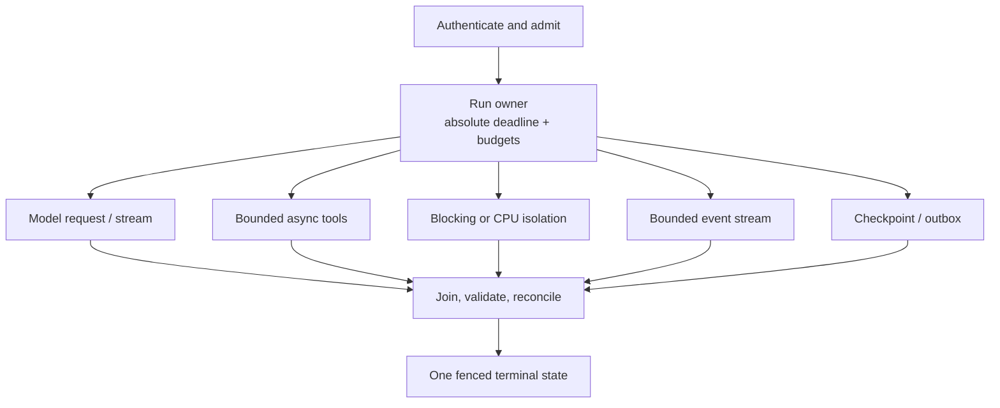

# Python Agent Engineering

> **Status:** Deep production playbook  
> **Last researched:** 2026-08-31  
> **Runtime baseline:** CPython 3.14.7 stable; CPython 3.15.0rc1 prerelease  
> **Evidence:** [Python agent-engineering research packet](../../research/packets/python-agent-engineering-deep-dive.md)  
> **Scope:** What changes when a serious agent runtime is implemented and operated in Python

Python is often the shortest path from model API to useful agent because its SDK, validation, data, retrieval, evaluation, and automation ecosystems meet in one runtime. That advantage becomes a production liability when a prototype quietly depends on unowned tasks, synchronous libraries, in-memory state, permissive coercion, or process-global objects.

The production unit is not an `async def` handler. It is an owned, bounded run tree:

Every child needs an owner, a deadline, a concurrency and byte budget, a cancellation rule, and a late-result policy. `asyncio` supplies useful mechanisms; it does not choose those policies for the application.

## Use this map

| Problem in front of you | Start here |
|---|---|
| Component boundaries, run ownership, state machines, dependency lifetime | [Architecture and ownership](architecture-and-ownership.md) |
| `TaskGroup`, cancellation, timeouts, queues, runners, and cleanup | [`asyncio` structured concurrency and cancellation](asyncio-structured-concurrency-and-cancellation.md) |
| Threads, processes, subinterpreters, native code, and free threading | [Blocking, CPU, and native isolation](blocking-cpu-and-native-isolation.md) |
| HTTPX, ASGI, SSE/WebSocket streaming, connection pools, and slow consumers | [HTTP, streaming, and backpressure](http-streaming-and-backpressure.md) |
| Subprocesses, filesystem authority, hostile code, and OS sandboxes | [Tools, processes, and sandbox boundaries](tools-processes-and-sandbox-boundaries.md) |
| Pydantic, coercion, JSON Schema, serialization, and structured output | [Schemas, validation, and structured output](schemas-validation-and-structured-output.md) |
| Failure classes, `ExceptionGroup`, retry ownership, ambiguous effects | [Errors, retries, and idempotency](errors-retries-and-idempotency.md) |
| `asyncio.Queue`, brokers, checkpoints, context compaction, memory boundaries, durable engines | [Queues, durable workers, and state](queues-durable-workers-and-state.md) |
| Heap/RSS, GC, file descriptors, pools, weighted admission | [Memory, GC, resources, and admission](memory-gc-resources-and-admission.md) |
| OpenTelemetry, event-loop health, profiles, task stacks, crash evidence | [Observability, profiling, and debugging](observability-profiling-and-debugging.md) |
| Async tests, fake clocks, race schedules, failure injection, and load | [Testing, fake time, races, and load](testing-fake-time-races-and-load.md) |
| Locks, wheels, native artifacts, indexes, hashes, attestations, SBOMs | [Packaging, dependencies, and supply chain](packaging-dependencies-and-supply-chain.md) |
| ASGI workers, readiness, signals, drain, termination, and recovery | [Deployment, workers, shutdown, and crash recovery](deployment-workers-shutdown-and-crash-recovery.md) |
| Custom loop versus agent framework versus durable runtime | [Ecosystem selection and anti-patterns](ecosystem-selection-and-anti-patterns.md) |

The concise [Python runtime overview](../python-agent-runtimes.md) remains the language-comparison entry point. This area goes deeper on Python mechanics without repeating the repository-wide contracts for [run controls](../../runtime/run-controls.md), [durable execution](../../runtime/durable-execution.md), [tool contracts](../../tools/tool-contracts.md), [idempotency](../../reliability/idempotency-and-side-effects.md), or [sandboxing](../../security/permissions-sandboxing-and-secrets.md).

Use the application-owned [agent state and event contract](../../runtime/agent-state-and-event-contracts.md) for stable run identity, ordering, terminal fencing, reconnect, and effect correlation across Python processes, brokers, streams, and durable adapters.

## Follow a zero-to-production path

Do not read all guides before building anything. Progress through evidence gates:

| Stage | Build and prove | Read next |
|---|---|---|
| 0. Bounded prototype | One provider, one typed read-only tool, explicit turn/usage limit, no durable claims | [Architecture and ownership](architecture-and-ownership.md), [schemas and validation](schemas-validation-and-structured-output.md) |
| 1. Reliable single process | One run owner, absolute deadline, structured cancellation, bounded pools/queues/streams | [`asyncio` cancellation](asyncio-structured-concurrency-and-cancellation.md), [HTTP and backpressure](http-streaming-and-backpressure.md) |
| 2. Safe effects | Execution-time authorization, approval where required, stable effect ID, receipt and reconciliation | [Errors, retries, and idempotency](errors-retries-and-idempotency.md), [tool/sandbox boundaries](tools-processes-and-sandbox-boundaries.md) |
| 3. Recoverable service | Versioned state/events, short/long-term memory boundaries, broker or durable runtime only where recovery needs it | [Queues, durable workers, and state](queues-durable-workers-and-state.md) |
| 4. Operable deployment | Admission control, worker/process capacity, graceful drain, hard-kill recovery, bounded telemetry | [Resources and admission](memory-gc-resources-and-admission.md), [observability](observability-profiling-and-debugging.md), [deployment](deployment-workers-shutdown-and-crash-recovery.md) |
| 5. Evolvable production | Old-state migration, SDK/runtime contract tests, failure injection, canary, immutable rollback artifact | [Testing](testing-fake-time-races-and-load.md), [packaging](packaging-dependencies-and-supply-chain.md), [ecosystem selection](ecosystem-selection-and-anti-patterns.md) |

Each stage inherits the previous gates. A framework demo, vector store, or multi-agent topology does not skip them.

## Version posture

As of the research date:

- CPython **3.14.7** is the current stable maintenance release. The 3.14 branch is in bugfix support.
- CPython **3.15.0rc1** is a release candidate; PEP 790 schedules 3.15.0 final for **2026-10-01**. Treat 3.15 behavior as a test target, not the default production baseline.
- Python 3.14 makes free-threaded builds officially supported but optional, adds `InterpreterPoolExecutor`, adds `concurrent.interpreters`, adds process-pool terminate/kill operations, changes the POSIX multiprocessing default away from `fork`, and continues removal of the `asyncio` policy system.
- Python 3.15's trajectory includes a dedicated profiling package and sampling profiler, async-aware stack dumps, frame pointers enabled by default, a free-threaded stable ABI variant, upgraded JIT work, and explicit lazy imports. Re-verify all of these against the final release and the complete native dependency graph before adoption.

Patch releases matter. For example, the 3.14.5 GC documentation records restoration of generation-1 and `threshold2` behavior for 3.13 compatibility. Do not operate from an early 3.14 mental model while deploying 3.14.7.

Pin the interpreter minor and patch in release artifacts. Test critical SDKs, profilers, event-loop replacements, and native wheels before changing it.

## Baseline architecture rules

1. Give each run one owner and one absolute monotonic deadline.
2. Put related child tasks in `asyncio.TaskGroup`; keep longer-lived tasks under an explicit service supervisor.
3. Re-raise `CancelledError` after bounded cleanup. Cancellation is a control signal, not a retryable business error.
4. Separate native async I/O, blocking I/O, CPU work, crash-prone native work, and hostile code. They need different boundaries.
5. Bound concurrency and buffered bytes at admission, provider, tool, executor, transport, and stream layers.
6. Validate every external value at runtime. Python annotations do not establish trust.
7. Put a stable operation identity before every retryable external effect; reconcile ambiguous outcomes.
8. Keep durable values language-neutral and versioned. Never use `pickle` across an untrusted boundary.
9. Assume ASGI workers have independent heaps, pools, registries, and event loops.
10. Make shutdown a two-phase protocol: stop admission, then drain/reconcile within a hard deadline.
11. Observe queue wait, event-loop lag, executor saturation, pool wait, cleanup time, RSS, file descriptors, and late work—not only model latency.
12. Promote new concurrency mechanisms only after measured compatibility tests. A capability is not an architecture mandate.

## The three boundaries Python teams most often blur

| Boundary | What Python gives you | What it does **not** give you |
|---|---|---|
| Coroutine | Cooperative suspension on one event-loop thread | Preemption of blocking code, durability, rollback |
| Process or subinterpreter | Parallelism and some failure/state isolation | Authorization, hostile-code containment, exactly-once effects |
| Schema model | Shape parsing, conversion, serialization, JSON Schema | Business invariants, permissions, provider-schema parity |

Most production failures come from treating the right column as if it followed automatically from the left.

## A minimum production gate

- [ ] Stable CPython patch and OS/base image are pinned.
- [ ] All run children are joined or registered with a service owner.
- [ ] One absolute deadline is translated into provider, tool, queue, and cleanup budgets.
- [ ] Thread/process submissions are bounded before the standard executor queue.
- [ ] Stream event count **and bytes** are bounded; disconnect behavior is explicit.
- [ ] Model, tool, queue, checkpoint, approval, and config payloads are validated.
- [ ] Every write tool has authorization, idempotency, and reconciliation tests.
- [ ] Worker/process loss is tested while an effect is in flight.
- [ ] Readiness drops before shutdown; drain fits inside the platform grace period.
- [ ] Telemetry export is bounded and redacted; its failure cannot stall the run.
- [ ] Dependency resolution is reproducible for every deployment platform.
- [ ] The sandbox threat model is enforced outside the agent process.

## Canonical guides to reuse

- [Agent loop](../../foundations/agent-loop.md)
- [Execution boundaries](../../runtime/execution-boundaries.md)
- [Agent state and event contracts](../../runtime/agent-state-and-event-contracts.md)
- [Queues, scheduling, and backpressure](../../operations/queues-scheduling-and-backpressure.md)
- [Idempotency and side effects](../../reliability/idempotency-and-side-effects.md)
- [Observability and tracing](../../evaluation/observability-and-tracing.md)
- [Prompt injection and untrusted data](../../security/prompt-injection-and-untrusted-data.md)
- [Deployment, release, and incident response](../../operations/deployment-release-and-incident-response.md)
- [Framework guides](../../frameworks/README.md)

## Refresh triggers

Re-research this area when:

- CPython 3.15 reaches final or the deployment baseline changes minor version;
- `asyncio` changes cancellation, task-group, runner, queue, or stream semantics;
- a free-threaded or `abi3t` build is proposed for production;
- a critical native dependency changes wheel, subinterpreter, or GIL support;
- the ASGI server/process manager changes worker, lifespan, or graceful-shutdown behavior;
- Pydantic changes coercion, serialization, schema, or version policy;
- an agent SDK or durable engine changes retry, streaming, state, or replay semantics;
- PyPA/pip lock, attestation, or index behavior changes.

## Selected primary sources

- [Python version status](https://devguide.python.org/versions/), [Python 3.14.7 release](https://www.python.org/downloads/release/python-3147/), and [PEP 790: Python 3.15 schedule](https://peps.python.org/pep-0790/)
- [Python 3.14 `asyncio` tasks](https://docs.python.org/3.14/library/asyncio-task.html), [queues](https://docs.python.org/3.14/library/asyncio-queue.html), and [runners](https://docs.python.org/3.14/library/asyncio-runner.html)
- [Python 3.14 concurrent futures](https://docs.python.org/3.14/library/concurrent.futures.html), [multiple interpreters](https://docs.python.org/3.14/library/concurrent.interpreters.html), and [free-threading HOWTO](https://docs.python.org/3.14/howto/free-threading-python.html)
- [PEP 779: supported free-threaded Python](https://peps.python.org/pep-0779/) and [Python 3.15 what's new](https://docs.python.org/3.15/whatsnew/3.15.html)
