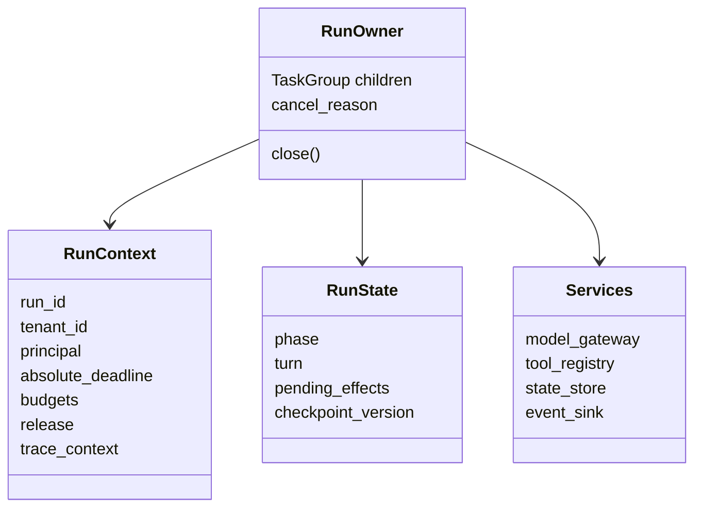
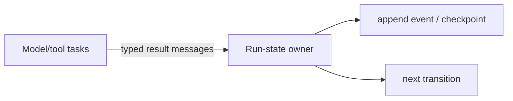
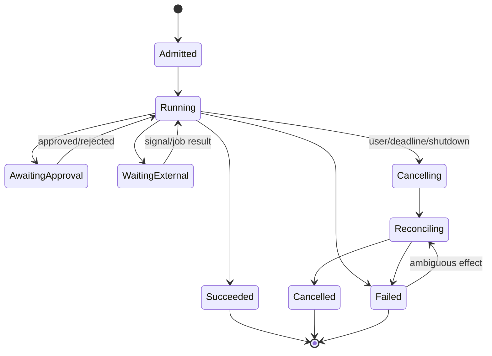

# Python Agent Runtime Architecture and Ownership

> **Research date:** 2026-08-31  
> **Use with:** [Agent loop](../../foundations/agent-loop.md), [run controls](../../runtime/run-controls.md), and [execution boundaries](../../runtime/execution-boundaries.md)

Python makes it easy to pass a client, callback, coroutine, or dictionary anywhere. Production architecture should resist that convenience. Make ownership visible in the object graph, task tree, and state machine so a run can finish, cancel, crash, or resume without relying on garbage collection or process exit.

## Model the run as an aggregate

A run owns identity and policy; it should not own every implementation detail.



Keep these concepts distinct:

| Concept | Lifetime | Rule |
|---|---|---|
| Immutable run context | One admitted run | Copy identifiers and policy; never put mutable progress in a `ContextVar` |
| Mutable run state | One run/checkpoint stream | Change through one owner or explicit transactional messages |
| Service clients | ASGI lifespan or worker | Create and close in the same event loop; never recreate in a hot path |
| Durable state | Beyond process lifetime | Store explicit versioned values, not live tasks/clients/models |
| Telemetry context | One causal path | Propagate explicitly across queues/processes/durable steps |

`ContextVar` is appropriate for request/run identifiers and tracing baggage. It is not a database, authorization source, or replacement for function parameters at durable boundaries.

## Put one owner around the run tree

The owner admits children, records why cancellation began, waits for settlement, and publishes exactly one terminal transition.

```python
async def execute_run(spec: RunSpec, services: Services) -> RunResult:
    deadline = services.clock.monotonic() + spec.max_seconds
    context = RunContext.from_spec(spec, deadline=deadline)

    async with asyncio.timeout_at(deadline):
        async with asyncio.TaskGroup() as group:
            events = BoundedEventSink(group, context, services.event_store)
            result = await run_loop(context, services, events, group)

    return await finalize_once(context, result, services)
```

This is a shape, not a complete implementation. `finalize_once` still needs durable compare-and-set or transactional fencing if multiple workers can recover the same run. A timeout still cannot stop an underlying thread or undo an external effect.

### Service-owned work

Some tasks legitimately outlive a run: queue consumers, lease renewers, telemetry exporters, connection health loops, and checkpoint flushers. Give each a service supervisor with:

- a bounded input queue;
- a named task and health signal;
- failure escalation policy;
- shutdown ordering and deadline;
- an explicit drain/drop rule;
- metrics for queue age, failures, and oldest active item.

Do not keep a module-level `set[Task]` and call that supervision. A set prevents garbage collection; it does not define restart, failure, capacity, or shutdown semantics.

## Keep mutation single-owner where possible

Python's GIL does not make compound application operations atomic, and an `await` can interleave another task between any two suspension points. Free-threaded builds remove even more accidental serialization.

Prefer:



over several tasks mutating a shared dictionary under an expanding collection of locks.

Use a lock only when the invariant is genuinely local and the critical section contains no slow or externally controlled await. A lock does not protect data in another process, prevent a stale worker from writing, or make an external effect transactional.

## Make state transitions explicit



Persist a transition record with at least `run_id`, previous and next phase, sequence/version, release, schema version, reason, timestamps, and effect references. Use optimistic concurrency or one durable owner to reject stale transitions.

Do not serialize arbitrary agent/framework objects as the canonical state. Store facts needed to reconstruct execution: normalized messages, tool/effect receipts, approvals, budgets consumed, cursor/checkpoint IDs, and versioned control state.

## Separate state, events, effects, and telemetry

These records answer different questions and should not collapse into one Python object or callback stream:

| Record | Question answered | Correctness property |
|---|---|---|
| State snapshot | What may happen next? | One current version, updated by compare-and-set or one durable owner |
| Event | What transition/fact occurred? | Ordered, versioned, append-only within its retention/audit contract |
| Effect intent/receipt | What external action may have or did commit? | Stable effect ID across attempts; ambiguity survives cancellation/crash |
| Telemetry | How did execution behave operationally? | Best-effort/sampled projection; never required to recover the run |

For a retryable write, commit the authorized effect intent and state version first, perform the external call **outside** the database transaction, then commit the receipt/outcome against the expected version. If the response is lost, reconcile by stable effect/provider ID. A restarted worker must reconstruct Python runtime objects from these records and be fenced if its expected version is stale. Reuse the canonical [agent state and event contract](../../runtime/agent-state-and-event-contracts.md) and [idempotency/effect guidance](../../reliability/idempotency-and-side-effects.md) rather than inventing framework-specific persistence.

## Define ports around failure and trust boundaries

Python protocols or abstract base classes are useful when they clarify a real boundary:

- `ModelGateway`: request/stream, usage, provider request ID, cancellation contract;
- `ToolExecutor`: validate, authorize, execute, receipt, ambiguous-outcome result;
- `StateStore`: compare-and-set transition, checkpoint, lease, outbox;
- `EventSink`: bounded publish with resume cursor and redaction;
- `Clock`: monotonic deadlines plus wall-clock timestamps;
- `IdGenerator`: stable run/attempt/effect identities.

Avoid a generic plugin container, event bus, repository layer, and dependency-injection framework unless the current system needs them. Plain constructor parameters and small protocols are usually enough.

## Align object lifetime with ASGI lifespan

The ASGI lifespan specification runs once per event loop that processes requests. In a multi-process server it runs in every process. Create event-loop-bound HTTP/database clients, semaphores, and service supervisors during lifespan startup and close them during lifespan shutdown.

Never assume:

- a module singleton is shared across workers;
- a client created before process forking is safe afterward;
- a semaphore controls global cluster concurrency;
- an in-memory session survives request routing or worker recycling;
- an `atexit` callback will perform async drain or run after a fatal crash.

Externalize cluster-wide leases, rate limits, durable sessions, and effect fences.

## Architecture smells

| Smell | Why it fails | Replace with |
|---|---|---|
| `create_task()` inside request code with no handle | Work escapes response/error/shutdown ownership | Run `TaskGroup` or durable job |
| Global mutable `current_run` | Cross-request leakage and race conditions | Explicit `RunContext`; `ContextVar` only for metadata |
| One giant `AgentService` object | Hidden lifetimes and impossible failure isolation | Small service clients plus run owner |
| Framework session as system of record | Upgrade and worker-placement coupling | Versioned application state/checkpoints |
| Lock around model/tool await | Head-of-line blocking and cancellation complexity | Single-owner messages or shorter critical section |
| In-process registry for tenant limits | Per-worker, reset on restart | External quota/admission coordinator where globality is required |
| Catch-all exception to return partial output | Loses cancellation and ambiguous-effect evidence | Typed terminal classification and reconciliation |

## Architecture review checklist

- [ ] Can every task be named with its owner and join/detach rule?
- [ ] Is run context immutable and progress state versioned?
- [ ] Is the absolute deadline available at every boundary?
- [ ] Can a stale/restarted worker be fenced from terminal and effect writes?
- [ ] Are state snapshots, ordered events, effect evidence, and lossy telemetry separate contracts?
- [ ] Are process-local and cluster-global limits clearly separated?
- [ ] Are all event-loop-bound clients created and closed in one lifespan?
- [ ] Can the durable state be read without importing the agent framework?
- [ ] Are authorization and effect identity available at execution time?
- [ ] Does crash recovery depend only on persisted evidence, not object finalizers?

## Selected primary sources

- [ASGI specification](https://asgi.readthedocs.io/en/latest/specs/main.html) and [lifespan protocol](https://asgi.readthedocs.io/en/latest/specs/lifespan.html)
- [Python `contextvars`](https://docs.python.org/3.14/library/contextvars.html)
- [Python `asyncio` tasks and task groups](https://docs.python.org/3.14/library/asyncio-task.html)
- [Python `atexit`](https://docs.python.org/3.14/library/atexit.html)
