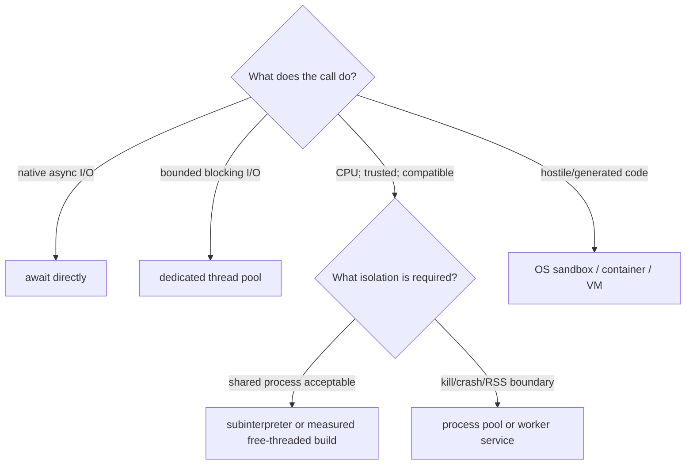

# Blocking, CPU, and Native Isolation in Python

> **Research date:** 2026-08-31  
> **Related:** [Execution boundaries](../../runtime/execution-boundaries.md)

Do not choose a concurrency mechanism by API familiarity. Classify the work by whether it blocks, needs parallel CPU, can corrupt the process, must be forcibly stopped, or is hostile. Python 3.14 expands the choices, but it does not erase their different failure boundaries.

## Route work by its real behavior



The most important questions are:

1. Can the operation block the event-loop thread?
2. Does cancellation need to stop execution, or only stop waiting?
3. Can a crash, leak, deadlock, or native fault be tolerated in the serving process?
4. What state crosses the boundary, and how is it serialized?
5. Is the code trusted?

## Use threads for bounded blocking I/O

`asyncio.to_thread()` copies the current `contextvars.Context` and runs a callable in the default thread pool. CPython's documentation positions it primarily for I/O-bound calls because the standard GIL limits CPU parallelism unless native code releases it or a different build/runtime is used.

```python
async def read_legacy_client(client, request, deadline):
    return await asyncio.to_thread(client.call, request, deadline=deadline)
```

This is safe only if `client.call` has its own effective deadline. Cancelling the awaiting task does **not** terminate the function or thread. A timed-out write can finish later.

### Bound submission before the executor

`ThreadPoolExecutor` uses an internal work queue that application code should not treat as a load-shedding mechanism. Put an application semaphore or bounded dispatcher before `submit()`/`to_thread()`, with separate pools for workloads that should not starve each other.

| Pool | Why separate it |
|---|---|
| Short blocking reads | Protect ordinary compatibility calls |
| Slow browser/filesystem adapters | Prevent long tools from occupying every worker |
| Telemetry/logging fallback | Prevent exporter stalls from blocking run cleanup |
| Native library with known thread constraints | Enforce its measured safe parallelism |

Threads share all process memory. Audit client thread safety, mutable caches, callbacks into the event loop, `fork` interactions, and trace-context propagation. Use `loop.call_soon_threadsafe()` or `run_coroutine_threadsafe()` when crossing back to the loop; normal loop APIs are not generally thread-safe.

## Use process boundaries when termination and faults matter

`ProcessPoolExecutor` bypasses the GIL, but only picklable callables/arguments/results cross the boundary and the `__main__` module must be importable. Lambdas, REPL-defined functions, live clients, open streams, tasks, locks, and framework objects make poor process contracts.

Python 3.14 changes operational assumptions:

- POSIX multiprocessing no longer defaults to `fork`; `forkserver` is the default where available, while Windows and macOS use `spawn`.
- Code that requires `fork` must request it explicitly; forking a multithreaded service is unsafe and has emitted warnings in recent Python versions.
- `ProcessPoolExecutor.terminate_workers()` and `kill_workers()` provide explicit escalation.
- `max_tasks_per_child` can recycle workers, but test it with queued work and your exact patch release.

Keep process functions in importable modules and pass versioned, minimal data. Set per-child environment, CPU/memory/file limits, temporary directories, and output limits. Treat process exit code, signal, stderr tail, and attempt identity as result evidence.

### Termination is destructive

The multiprocessing documentation warns that terminating a process using a pipe or queue can corrupt that channel, and terminating while holding a lock/semaphore can deadlock peers. Therefore:

1. stop new submissions;
2. request cooperative cancellation;
3. allow a small grace period;
4. terminate the child;
5. kill if still alive;
6. discard/recreate affected pool and IPC channels;
7. reconcile any external effects using stable operation IDs.

Do not continue using a process pool after its invariants are uncertain.

## Evaluate subinterpreters as isolation-within-a-process

Python 3.14 adds `concurrent.interpreters` and `InterpreterPoolExecutor`. Each worker interpreter has separate runtime/import/builtin state and its own GIL, enabling multicore execution in one process. Most values are copied, commonly via pickle; a small set can be shared or communicated through cross-interpreter queues.

Benefits:

- parallel Python execution without a process per worker;
- lower conceptual API cost through the executor interface;
- stronger state separation than ordinary threads.

Costs and boundaries:

- a native crash still takes down the process;
- memory/RSS and file descriptors remain process-level concerns;
- mutable Python state is not implicitly shared;
- serialization and import initialization cost remain;
- not every PyPI/native extension supports multiple interpreters;
- it is not a hostile-code sandbox.

Use it for controlled, pure-ish CPU functions after compatibility tests. Prefer processes when kill, memory, crash, credential, or trust isolation matters.

## Treat free-threaded Python as a measured runtime variant

PEP 779 makes free-threaded Python officially supported but optional in 3.14. It is not the default CPython build. A free-threaded build may re-enable the GIL when importing an extension that is not marked compatible; `sys._is_gil_enabled()` reports runtime state and `sysconfig.get_config_var("Py_GIL_DISABLED")` identifies build support.

Adoption gate:

- every native wheel declares/tests free-threaded compatibility;
- correctness tests run under high thread interleaving and sanitizers where available;
- throughput, p99 latency, CPU, and RSS improve on the real workload;
- shared caches, random generators, metrics, and logging contention are measured;
- profiler and observability tooling work;
- a standard-build rollback artifact exists.

Free threading changes the value of the GIL as accidental serialization. It does not make application state thread-safe. It can also increase memory usage or move contention into object locks and extension code.

Python 3.15 is expected to add an `abi3t` stable ABI path for free-threaded extensions. That may reduce wheel maintenance; it does not validate an extension's behavior under concurrent use.

## Native libraries need their own contract

For NumPy/tokenizers/parsers/database drivers/inference runtimes and other native extensions, determine:

- whether the call releases the GIL;
- whether it creates its own thread pool;
- whether it is reentrant and fork-safe;
- how to cap internal threads (`OMP_NUM_THREADS`-style controls where applicable);
- how it signals cancellation and out-of-memory;
- whether a segfault/abort can be contained only by a process;
- whether wheels support the target CPython, platform, architecture, free-threaded build, and subinterpreters.

Nested pools can oversubscribe CPU badly: ASGI workers × process workers × native threads. Capacity-test the product, not each layer independently.

## Boundary comparison

| Mechanism | Parallel Python CPU | Hard kill | Crash/RSS isolation | Shared mutable state | Hostile-code boundary |
|---|---:|---:|---:|---:|---:|
| Coroutine | No | No | No | Yes | No |
| Thread / `to_thread` | Usually no on standard build | No | No | Yes | No |
| Free-threaded build | Yes | No | No | Yes, with synchronization | No |
| Subinterpreter | Yes | No independent process kill | No | Limited/explicit | No |
| Process pool | Yes | Yes, destructive | Yes | Serialized/IPC | Not by itself |
| Sandbox container/VM | Depends | Yes | Stronger, policy-dependent | Explicit I/O | Yes, when correctly hardened |

## Failure-injection checklist

- [ ] Cancel while a blocking thread owns an external write; verify late completion is fenced.
- [ ] Saturate every executor queue; verify admission rejects before memory grows unboundedly.
- [ ] Crash one native/process worker; verify pool replacement and effect reconciliation.
- [ ] Terminate a child writing stdout/stderr; verify pipes are drained and the child is reaped.
- [ ] Run process entrypoints under Windows `spawn` and POSIX `forkserver`.
- [ ] Import the full native dependency graph in every subinterpreter/free-threaded candidate.
- [ ] Measure nested worker/thread counts under production CPU quotas.

## Selected primary sources

- [`asyncio.to_thread()`](https://docs.python.org/3.14/library/asyncio-task.html#asyncio.to_thread) and [event-loop executor APIs](https://docs.python.org/3.14/library/asyncio-eventloop.html#executing-code-in-thread-or-process-pools)
- [`concurrent.futures`](https://docs.python.org/3.14/library/concurrent.futures.html)
- [`multiprocessing` start methods and programming guidelines](https://docs.python.org/3.14/library/multiprocessing.html)
- [`concurrent.interpreters`](https://docs.python.org/3.14/library/concurrent.interpreters.html)
- [Free-threading HOWTO](https://docs.python.org/3.14/howto/free-threading-python.html) and [PEP 779](https://peps.python.org/pep-0779/)
- [PEP 803: stable ABI for free-threaded builds](https://peps.python.org/pep-0803/)

