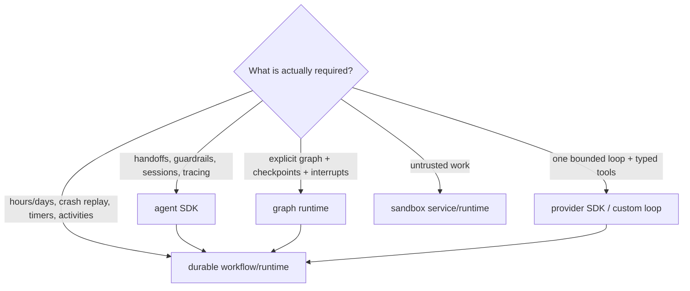

# Python Agent Ecosystem Selection and Anti-Patterns

> **Research date:** 2026-08-31  
> **Related:** [Custom loop vs framework vs workflow engine](../../comparisons/custom-loop-vs-framework-vs-workflow-engine.md) and [framework guides](../../frameworks/README.md)

Python's agent ecosystem is broad enough that framework selection can create more risk than language selection. Start from required semantics—provider surface, control-loop shape, state/replay, approvals, streaming, deployment, and team ownership—then choose the smallest layer that earns its dependency and migration cost.

## Select the layer, not the logo

A durable engine can host an agent turn/activity; an agent framework does not become durable merely because it has a session store. A sandbox does not make workflow state durable. An observability integration does not define effect idempotency.

## Compare concrete contracts

| Contract | Questions to prove in a spike |
|---|---|
| Run loop | Turn limit, stop conditions, recursion/nested agents, cancellation propagation |
| Model/provider | Exact models, streaming events, usage, hosted tools, retry ownership, custom endpoint |
| Tools | Schema dialect, sync/async execution, parallel calls, approvals, MCP lifecycle, result limits |
| State | Message normalization, session/checkpoint ownership, migrations, tenant scoping, encryption |
| Durability | Replay boundary, effect isolation, crash point, timers/signals, versioning, retention |
| Streaming | Settlement semantics, disconnect, resume cursor, backpressure, final usage/result |
| Observability | Span schema, redaction, sampling, context propagation, exporter ownership |
| Testing | Scripted model, deterministic run, old-state fixtures, trace/eval hooks |
| Operations | ASGI/worker integration, lifespan close, concurrency controls, release policy |

Read source/release notes and test the exact package version. Similar names across Python and TypeScript SDKs do not guarantee parity.

## Reasonable Python starting points

| Need | Representative option | Production boundary to keep |
|---|---|---|
| Direct provider control | Official provider SDK and a small custom loop | Application owns turns, tools, authz, state, retries, tracing |
| Lightweight typed agent | Pydantic AI | Pydantic validation is not authz/durability; inspect retries and durable integration |
| OpenAI-native loop | OpenAI Agents SDK | SDK owns in-process orchestration; application still owns effects, tenancy, deployment, persistence policy |
| Explicit graph/checkpoint | LangGraph | Checkpointer/replay/node side-effect semantics and graph upgrades |
| Other provider/multi-agent SDKs | Google ADK, Strands, LlamaIndex, CrewAI, Microsoft Agent Framework | Version maturity, topology, state, cancellation, provider coupling |
| Durable execution | Temporal, Restate, DBOS, Prefect, Dapr Workflow/Agents | Determinism/journaling, activity/effect boundary, retention, worker ops |
| Broker task worker | Celery and alternatives | Ack/redelivery/prefetch/pool semantics; not a deterministic workflow |
| ASGI service | Starlette/FastAPI with Uvicorn/other ASGI server | Lifespan, worker isolation, flow control, graceful shutdown |

Use the repository's dedicated guides for [OpenAI Agents SDK](../../frameworks/openai-agents-sdk/README.md), [LangGraph](../../frameworks/langgraph/README.md), [Pydantic AI](../../frameworks/pydantic-ai.md), [Google ADK](../../frameworks/google-adk.md), [Strands](../../frameworks/strands-agents.md), [CrewAI](../../frameworks/crewai.md), [Temporal](../../frameworks/temporal-for-agent-workflows.md), [Restate](../../frameworks/restate-for-agent-workflows.md), [DBOS](../../frameworks/dbos-for-agent-workflows.md), and other frameworks. This guide focuses on composition rules.

## Prefer one asyncio abstraction per component

Starlette/FastAPI are built around ASGI and AnyIO, while many provider/database libraries expose asyncio directly. Mixing is normal, but cancellation scopes, task groups, thread helpers, and test plugins can differ.

Choose one owner for each task tree. Do not nest competing “background task” systems or mix Trio/asyncio assumptions accidentally. AnyIO documents differences from `asyncio.TaskGroup`; verify semantics before translating patterns mechanically.

Use synchronous framework APIs only behind a known thread-pool boundary. A framework may offload sync endpoints/functions, but pool capacity and cancellation behavior remain application concerns.

## Prove integration with a production slice

Build the same thin slice before committing:

1. stream one provider response through ASGI to a deliberately slow client;
2. run two safe read tools concurrently and one approved idempotent write;
3. cancel during model stream, async tool, blocking tool, and write ambiguity;
4. persist/checkpoint, kill the worker, and recover;
5. upgrade schema/tool/framework state from a previous fixture;
6. inspect traces, usage, event-loop lag, queues, and effect receipts;
7. overload provider/tool/admission limits and shut down under load.

Measure code surface, p95/p99, RSS, dependency count, cold start, trace clarity, migration burden, and on-call diagnosis—not tutorial terseness.

## Put third-party SDK churn behind an adoption contract

An adapter should normalize only the behavior the application actually depends on. Do not hide every vendor feature behind a speculative universal interface. For each provider, framework, durable runtime, MCP client, vector store, and telemetry integration, keep a versioned contract fixture that proves:

| Surface | Upgrade/adoption test |
|---|---|
| Request/model configuration | Exact option names, omitted-versus-null behavior, timeout and retry ownership |
| Streaming | Event order/types, partial failure, usage/final-result settlement, close and cancellation |
| Tools/structured output | Generated schema snapshot, unknown fields, malformed/refusal paths, parallel-call behavior |
| State/memory | Serialized fixture from the last supported release, migration, tenant scope, compaction/retrieval compatibility |
| Effects | Stable operation ID reaches the adapter; ambiguous timeout preserves provider request/receipt evidence |
| Observability | Internal event names/fields remain stable even when vendor or OTel attributes change |
| Lifecycle | Client creation/close, fork/worker safety, thread/loop affinity, shutdown under exporter/network failure |

Upgrade one risk surface at a time when practical: runtime, framework/SDK, model, generated schema, and infrastructure. Review release notes and the transitive diff, run the contract fixtures against both old and candidate artifacts, canary with bounded traffic, and retain the old immutable artifact. A deprecation warning is already migration work; treat imports from private modules and monkey patches as explicit expiring debt.

Do not infer parity across Python and another language from product branding. Do not let an adapter convert a vendor-specific refusal, safety stop, partial stream, or background operation into generic success/failure if the distinction affects retry or effects.

## Common anti-patterns

### Framework as infrastructure

**Symptom:** assuming sessions, callbacks, or memory imply durable execution, authz, quotas, and idempotency.  
**Correction:** draw ownership across SDK, application, stores, worker, durable engine, and sandbox.

### Async by declaration

**Symptom:** `async def` wraps a synchronous SDK, parser, filesystem call, or CPU loop.  
**Correction:** inspect the dependency, measure loop lag, and move work to the correct bounded boundary.

### Detached “background” runs

**Symptom:** request handler calls `create_task()` and returns.  
**Correction:** join within the run, register with a service supervisor for short disposable work, or enqueue durably.

### Multi-agent by default

**Symptom:** agents delegate to agents before one agent with tools is proven.  
**Correction:** add topology only when specialist context/permissions/evaluation measurably justify more turns, state, cost, and failure paths.

### Pydantic equals safety

**Symptom:** schema-valid tool call executes immediately.  
**Correction:** perform domain validation, execution-time authorization, approval, idempotency, and sandboxing separately.

### Timeout equals stop

**Symptom:** an asyncio timeout is treated as proof a thread/process/effect ended.  
**Correction:** model cooperative cancel, hard termination, fencing, and reconciliation by boundary.

### Unbounded convenience

**Symptom:** default `Queue()`, `gather()` over arbitrary fan-out, whole-response `.read()`, unlimited tool artifacts.  
**Correction:** cap items, bytes, tasks, connections, attempts, context, and output.

### Pickle as persistence

**Symptom:** serializing framework/run objects for queues/checkpoints.  
**Correction:** store versioned language-neutral state and rebuild runtime objects.

### Worker-local global truth

**Symptom:** global semaphore/cache/session/registry assumed cluster-wide.  
**Correction:** name process-local scope; externalize only invariants that truly need cluster scope.

### New runtime mechanism as default

**Symptom:** adopting free threading, subinterpreters, JIT, or a new agent framework because it is available.  
**Correction:** require workload evidence, dependency compatibility, operational tooling, and rollback.

## Build-versus-buy decision

Prefer a custom loop when the required lifecycle is small, the team can own provider/tool contracts, and framework abstractions would hide critical behavior. Prefer an agent SDK when its concrete run/handoff/guardrail/streaming/testing features remove meaningful code and their ownership is understood. Prefer a graph when explicit state transitions/checkpoints/interrupts are central. Add a durable runtime when waits, retries, crash recovery, schedules, or human interaction exceed one process lifetime.

Do not combine all four preemptively. Each boundary adds serialization, versioning, observability, deployment, and incident complexity.

## Selection checklist

- [ ] Required capability is demonstrated on the exact Python/package/model versions.
- [ ] Run, task, state, retry, effect, and shutdown ownership are documented.
- [ ] Sync/native dependencies and cancellation behavior are measured.
- [ ] Session/checkpoint data has an application-owned migration path.
- [ ] Provider/framework retries do not multiply durable/application retries.
- [ ] Streaming settlement and disconnect semantics are tested with slow clients.
- [ ] The framework does not become the authorization or sandbox boundary.
- [ ] Dependency/maturity/version policy and rollback cost are acceptable.
- [ ] Exact-version adapter fixtures cover streams, usage, errors, cancellation, schema drift, and lifecycle.
- [ ] Runtime, SDK/framework, model, and state-schema changes can be canaried or rolled back independently.
- [ ] A one-agent/custom-loop baseline was compared before adding topology/layers.
- [ ] On-call engineers can inspect and recover the system without framework internals being the only evidence.

## Selected primary sources

- [OpenAI Agents documentation](https://developers.openai.com/api/docs/guides/agents)
- [Pydantic AI durable execution](https://ai.pydantic.dev/durable_execution/)
- [LangGraph persistence/durable execution](https://docs.langchain.com/oss/python/langgraph/durable-execution)
- [AnyIO task groups](https://anyio.readthedocs.io/en/stable/tasks.html) and [ASGI specification](https://asgi.readthedocs.io/en/latest/specs/main.html)
- [Celery tasks](https://docs.celeryq.dev/en/latest/userguide/tasks.html), [Temporal Python sandbox](https://docs.temporal.io/develop/python/python-sdk-sandbox), [Restate durable steps](https://docs.restate.dev/develop/python/durable-steps), and [DBOS workflows](https://docs.dbos.dev/python/tutorials/workflow-tutorial)
