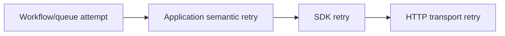
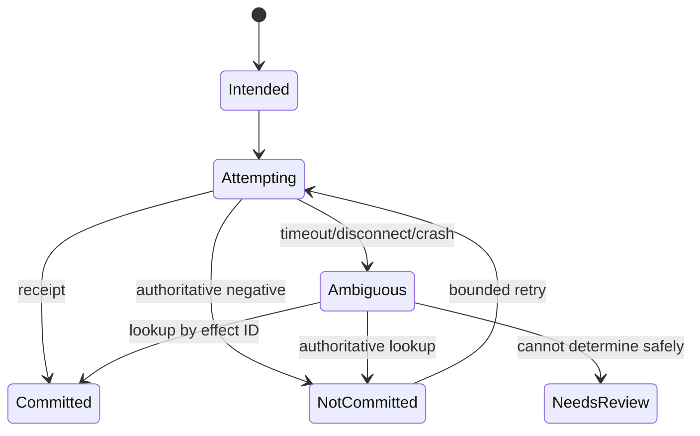

# Errors, Retries, and Idempotency in Python Agent Runtimes

> **Research date:** 2026-08-31  
> **Related:** [Failure taxonomy](../../reliability/failure-taxonomy.md) and [idempotency and side effects](../../reliability/idempotency-and-side-effects.md)

A Python exception class rarely contains enough policy to decide whether an agent step should retry. Retry decisions require operation phase, effect evidence, remaining deadline, attempt count, idempotency contract, and caller intent. Preserve those facts instead of flattening every failure into `RuntimeError` or a generic “tool failed” string.

## Classify failures by semantics

```python
@dataclass(frozen=True)
class Failure:
    kind: Literal[
        "invalid", "forbidden", "rate_limited", "unavailable",
        "timeout", "cancelled", "ambiguous_effect", "bug"
    ]
    retry_safe: bool
    effect_state: Literal["none", "not_started", "committed", "ambiguous"]
    source: str
    attempt: int
    retry_after_seconds: float | None = None
    provider_request_id: str | None = None
```

Keep the original exception as internal causal evidence. Expose a sanitized, stable public error code and correlation ID.

| Failure | Default action |
|---|---|
| Validation/domain rejection | Do not retry unchanged input |
| Authentication/authorization | Do not retry; audit |
| Rate limit | Retry only within budget, honor valid server delay, enforce tenant fairness |
| Connect failure before send | Retry replayable operation with jitter |
| Read/write/protocol failure | Determine phase and effect ambiguity first |
| Provider 5xx/unavailable | Bounded retry if operation is replayable |
| Cancellation | Clean up and propagate; never ordinary retry |
| Programmer invariant/bug | Fail, capture evidence, let supervisor/release policy act |
| Ambiguous effect | Reconcile by stable identity; do not blind-retry |

HTTPX's exception hierarchy distinguishes connect/read/write/pool timeouts, network/protocol failures, and HTTP status failures. Preserve this phase information when adapting provider SDK exceptions.

## Put retries at one semantic owner

Provider SDK, HTTP transport, agent framework, durable engine, queue worker, and application code may all retry. Multiplication creates retry storms and destroys deadline reasoning.



Inventory every layer. Select one owner for the semantic operation; disable or tightly bound lower retries where configurable. Include lower-layer attempts in telemetry and the total budget.

Tenacity is useful only with explicit stop, retry predicate, wait/jitter, and logging hooks. Its documented bare `@retry` behavior can retry forever without waiting—never use that production default.

## Use a retry budget, not only max attempts

Before another attempt, require:

```text
remaining_run_time
  > planned_backoff
  + minimum_useful_attempt_time
  + cleanup_and_reconciliation_reserve
```

Use exponential backoff with full/decorrelated jitter, cap the delay, and respect trustworthy `Retry-After` guidance without exceeding the run deadline. Enforce a fleet/tenant retry budget so an outage does not turn every original request into several simultaneous requests.

Record attempt number, cumulative elapsed time, backoff, classification, and whether the attempt reached the effect boundary. Never sleep while holding a semaphore, database transaction, queue lease that will expire, or ASGI response resource unnecessarily.

## Give effects stable identity

Derive one effect ID from the logical operation, not a fresh random ID per retry:

```text
effect_id = hash(tenant_id, run_id, tool_call_id, effect_schema_version)
attempt_id = effect_id + attempt_number
```

The receiver should atomically store or recognize the effect ID and return the prior result/receipt on duplication. The application persists:

- intent and validated arguments digest;
- effect ID and attempt ID;
- provider/resource request ID;
- known state: not started, committed, rejected, ambiguous;
- response/receipt digest and timestamps.

An HTTP idempotency header is only useful if the receiving service documents its scope, retention, conflict behavior, and response replay. Do not infer exactly-once delivery from the presence of a header.

## Reconcile ambiguous outcomes



Never map `CancelledError`, timeout, or connection reset directly to “did not happen.” The call may have committed before the response was lost. Provide a status lookup or reconciliation job for consequential tools; otherwise require human review instead of blind repetition.

## Handle `ExceptionGroup` without losing siblings

Task groups can raise multiple failures. Use `except*` to classify subgroups while preserving unmatched exceptions:

```python
try:
    async with asyncio.TaskGroup() as group:
        ...
except* ExpectedToolError as group:
    record_expected(group.exceptions)
except* Exception as group:
    record_unexpected(group.exceptions)
    raise
```

A `try` statement cannot mix `except` and `except*`. `CancelledError` derives from `BaseException`; do not bury it inside broad catch/retry wrappers. Be cautious with `BaseExceptionGroup`, which can contain cancellation or system-exiting exceptions.

## Preserve causal chains safely

Use `raise DomainFailure(...) from exc` internally to preserve cause. In APIs/logs:

- include run/attempt/effect IDs and stable error code;
- redact prompts, tool inputs, authorization headers, signed URLs, and database values;
- cap traceback/exception payload size;
- sample repeated identical errors;
- retain provider request IDs for support/reconciliation;
- separate user-facing explanation from operator evidence.

If interpreter finalization blocks an operation, Python 3.14 may raise `PythonFinalizationError`; it is shutdown evidence, not a reason to start more cleanup threads.

## Retry verification checklist

- [ ] Every retryable operation has one semantic retry owner.
- [ ] Lower-layer SDK/transport/workflow retries are inventoried and observable.
- [ ] Stop condition, jitter, deadline reserve, and tenant/fleet budget are explicit.
- [ ] Cancellation and validation/authorization failures never enter generic retry.
- [ ] Effect ID is stable across attempts and receiver deduplication is tested.
- [ ] Ambiguous timeout/disconnect/process loss enters reconciliation.
- [ ] `ExceptionGroup` tests preserve all sibling failures.
- [ ] Retries do not hold scarce concurrency slots or expiring transactions during backoff.
- [ ] Public errors are stable and sanitized; operator evidence retains causal IDs.

## Selected primary sources

- [Python built-in exception groups](https://docs.python.org/3.14/library/exceptions.html#exception-groups) and [`except*`](https://docs.python.org/3.14/reference/compound_stmts.html#except-star-clause)
- [`asyncio` exceptions](https://docs.python.org/3.14/library/asyncio-exceptions.html)
- [HTTPX exception hierarchy](https://www.python-httpx.org/exceptions/)
- [Tenacity retry documentation](https://tenacity.readthedocs.io/en/latest/)
- [AWS Builders' Library: timeouts, retries, backoff, and jitter](https://aws.amazon.com/builders-library/timeouts-retries-and-backoff-with-jitter/)

