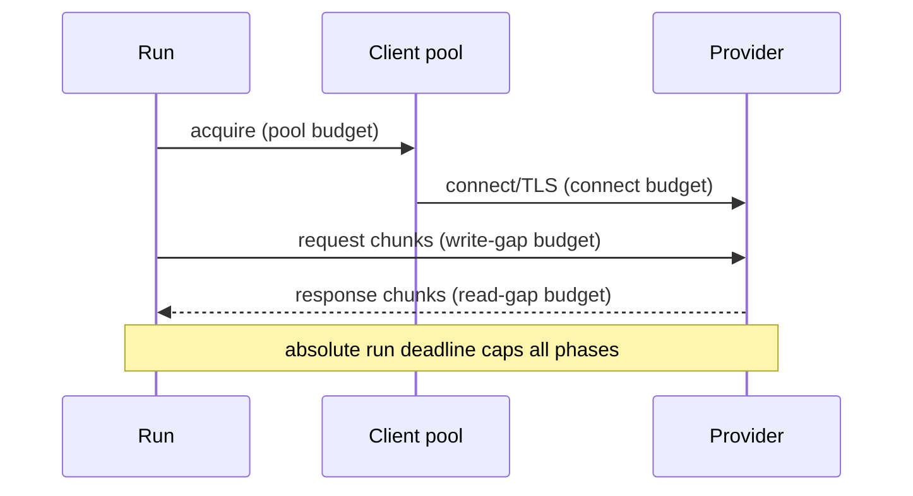
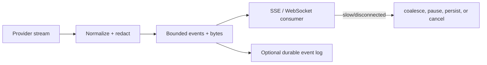

# HTTP, Streaming, and Backpressure in Python Agent Services

> **Research date:** 2026-08-31  
> **Related:** [Queues, scheduling, and backpressure](../../operations/queues-scheduling-and-backpressure.md)

Agent traffic combines long response streams, bursty tool events, slow browsers, provider rate limits, and expensive connection pools. “Async” does not make any buffer infinite or any disconnect self-cleaning. Budget every transport phase and every producer/consumer boundary.

## Reuse clients at the worker lifespan

Create one appropriately scoped `httpx.AsyncClient` (or selected alternative) during ASGI lifespan startup and close it during lifespan shutdown. HTTPX explicitly warns against creating clients inside a hot loop because that defeats connection pooling.

```python
@asynccontextmanager
async def lifespan(app):
    app.state.http = httpx.AsyncClient(
        timeout=httpx.Timeout(connect=5, read=30, write=10, pool=2),
        limits=httpx.Limits(max_connections=100, max_keepalive_connections=20),
    )
    try:
        yield
    finally:
        await app.state.http.aclose()
```

The numbers are examples, not defaults. Derive them from provider concurrency, pod memory/file descriptors, latency objectives, and the run deadline. A client is process- and event-loop-local; it is not shared across Uvicorn workers.

## Separate transport phase budgets

HTTPX distinguishes connect, read, write, and pool timeouts. A read timeout is a maximum wait for a chunk, not necessarily a whole-response deadline. A pool timeout reveals local saturation and should not be misclassified as provider failure.



Log the phase without leaking URLs/query secrets. Retry rules differ: a pre-connect failure for a replayable read may be safe; a read timeout after bytes or a write failure during a side-effecting request may be ambiguous.

## Stream with a bounded relay

Do not let provider callbacks append to an unbounded list while a client consumes slowly. Use a bounded event channel with both item and byte accounting.



Choose a policy by event class:

| Event | Slow-consumer policy |
|---|---|
| Token/text delta | Coalesce adjacent deltas up to a byte cap; optionally drop presentation-only deltas |
| Tool started/completed | Preserve ordering; persist if resumability matters |
| Approval required | Persist and stop in-memory run if it may wait long |
| Usage/final result | Never silently drop; commit before terminal response where required |
| Debug trace | Sample/drop independently from user-visible stream |

An item-count-only queue is vulnerable to one enormous event. Enforce maximum decoded chunk, event, line/frame, and total buffered bytes.

## Close provider responses on every path

HTTPX streaming via `async with client.stream(...)` closes the response on exit. In manual streaming mode, the application must call `Response.aclose()`; HTTPX warns that failure leaks connections. This matters when an ASGI client disconnects or cancellation interrupts iteration.

Use `try/finally` around:

- provider response/stream;
- relay producer task;
- ASGI response generator;
- durable event writer;
- heartbeat task.

Test early loop exit, generator close, client disconnect, cancellation during `aiter_bytes()`, malformed chunks, and exporter failure.

## Understand ASGI disconnect and lifespan semantics

ASGI exposes a connection `scope` and asynchronous `receive`/`send` messages. The HTTP spec says a `send()` on a closed connection should raise a server-specific `OSError` in servers supporting spec version 2.4, but older/racy implementations may surface disconnect differently. A receive-side `http.disconnect` can race with send failure.

Treat disconnect as a product decision:

- **cancel:** interactive work has no value without the client;
- **continue:** the run is durable and the client can reconnect by cursor;
- **pause:** persist checkpoint and await explicit resume;
- **handoff:** enqueue remaining work under a new durable owner.

Never infer policy from a socket exception deep inside the response generator.

ASGI lifespan runs once per event loop. Initialize pools and background supervisors there so requests and resources remain on the same loop.

## Know server flow-control limits

Uvicorn documents transport read/write flow control and can pause writes above a high-water mark until drained. It also stops buffering an unread request body after the response completes. Application code can still defeat these protections by accumulating decoded data, event objects, tool results, or whole provider responses.

Uvicorn's concurrency limit is an application-level refusal gate, not a waiting queue: excess requests receive 503. Current server-behavior documentation also notes that open keep-alive connections count toward the limit and that `--backlog` is a separate TCP accept-queue control. Validate exact behavior against the pinned Uvicorn version before setting a small limit.

Server request-count recycling limits leak impact but does not fix unowned tasks or missing cleanup.

## Choose SSE and WebSocket deliberately

| Concern | SSE | WebSocket |
|---|---|---|
| Direction | Server to client over HTTP | Bidirectional |
| Reconnect | Browser semantics and event IDs help | Application-defined |
| Intermediaries | Usually simpler; proxy buffering must be disabled/tested | Upgrade/timeouts need explicit support |
| Backpressure | ASGI send + application buffer policy | Send and receive queues both need bounds |
| Best fit | Token/status stream with separate command API | Interactive duplex voice/control/tool channel |

Heartbeats keep intermediaries aware but also consume connections and bandwidth. They are not proof the application can accept new work. Bound heartbeat tasks under the same stream owner.

## Parse streams defensively

`asyncio.StreamReader` has a configurable limit. Its implementation pauses the transport when its buffer grows beyond a threshold and resumes after draining; `readuntil()` can raise `LimitOverrunError`. `StreamWriter.drain()` participates in write flow control.

Higher-level libraries do not remove the need to cap:

- response headers and redirects;
- compressed and decoded body size (compression bombs);
- line/frame/event length;
- JSON nesting/array cardinality;
- tool artifact size;
- total run output and context ingestion.

Do not call `.read()`/`.aread()` for an untrusted or unbounded stream merely because the API is convenient.

## Streaming verification checklist

- [ ] HTTP clients are lifespan-scoped and all manual streams close.
- [ ] Connect/read/write/pool budgets are distinct and capped by the run deadline.
- [ ] Pool wait is measured separately from upstream latency.
- [ ] Each relay has item and byte limits plus a slow-consumer policy.
- [ ] Disconnect maps to cancel, continue, pause, or handoff explicitly.
- [ ] Reconnect cursors refer to persisted normalized events, not memory offsets.
- [ ] Provider/tool streams are drained or closed after downstream disconnect.
- [ ] 503 overload, proxy buffering, idle timeouts, and half-open connections are tested.
- [ ] Decoded/compressed payload limits are enforced before allocation grows.

## Selected primary sources

- [ASGI HTTP and WebSocket specification](https://asgi.readthedocs.io/en/latest/specs/www.html) and [lifespan protocol](https://asgi.readthedocs.io/en/latest/specs/lifespan.html)
- [HTTPX async support](https://www.python-httpx.org/async/), [timeouts](https://www.python-httpx.org/advanced/timeouts/), and [resource limits](https://www.python-httpx.org/advanced/resource-limits/)
- [Uvicorn server behavior](https://uvicorn.dev/server-behavior/) and [settings](https://uvicorn.dev/settings/)
- [`asyncio` streams](https://docs.python.org/3.14/library/asyncio-stream.html) and [CPython streams implementation](https://github.com/python/cpython/blob/3.14/Lib/asyncio/streams.py)
