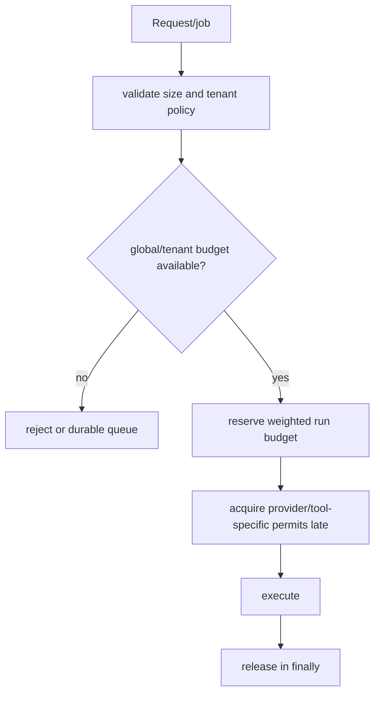

# Memory, GC, Resources, and Admission in Python Agent Services

> **Research date:** 2026-08-31  
> **Related:** [Scaling, capacity, and SLOs](../../operations/scaling-capacity-and-slos.md) and [queues/backpressure](../../operations/queues-scheduling-and-backpressure.md)

Agent workloads accumulate memory in many places the Python heap alone does not explain: decoded prompts, token/event buffers, HTTP pools, native extensions, model artifacts, child processes, allocator arenas, thread stacks, file mappings, and telemetry queues. Control resident-set size (RSS) and scarce resources with admission and ownership before tuning garbage collection.

## Build a resource budget per admitted run

```text
worker capacity
  >= fixed process baseline
   + active_runs × reserved_run_memory
   + stream/executor/telemetry buffers
   + native/allocator headroom
   + shutdown/recovery reserve
```

Estimate from measured distributions, then enforce explicit caps:

- input and decompressed bytes;
- context/messages and retrieved documents;
- active model/tool calls;
- stream events and bytes;
- tool stdout/stderr/artifacts;
- executor submissions;
- HTTP connections/file descriptors;
- subprocesses and native threads;
- durable checkpoint/event history.

Reject, queue durably, reduce fan-out, or downgrade features before the worker enters swap/OOM. A semaphore with one unit per run is inadequate when run sizes differ greatly; use weighted admission or workload classes.

## Bound bytes, not only object counts

`asyncio.Queue(maxsize=N)` counts items. One item may contain a 100 MB artifact. Keep an atomic/accounted byte budget around producers and release it in `finally` after the consumer is finished.

Similarly, cap:

- number **and bytes** of messages in context;
- compressed **and decompressed** response size;
- number of retrieved chunks and aggregate characters/tokens;
- individual and total tool results;
- per-run and per-worker buffered SSE/WebSocket output;
- telemetry batch count and encoded size.

Use immutable object-store references for large artifacts. Copying `bytes`/strings/dicts between parsing, validation, event, trace, and persistence layers can multiply peak memory.

## Understand what CPython collectors can and cannot reclaim

Reference counting usually releases objects promptly when references drop; the cyclic GC finds unreachable reference cycles. Neither guarantees RSS immediately returns to the OS because allocators retain arenas, native libraries own memory, and fragmentation persists.

Python 3.14.7 patch-level behavior matters. The GC docs note that generation 1 and `threshold2`, initially described as removed/ignored in 3.14, were restored in 3.14.5 to match 3.13 behavior. Recheck deployed patch docs before tuning thresholds.

Rules:

- do not call `gc.collect()` per request as a default “fix”;
- use `gc.get_stats()`, allocation profiles, and RSS evidence first;
- inspect cycles from callbacks, exceptions/tracebacks, caches, tasks, generators, and finalizers;
- bound caches explicitly and expose hit/size/eviction metrics;
- prefer context managers/`finally` for resources instead of relying on finalization;
- tune GC only after a reproducible workload shows material pause/RSS benefit.

`gc.freeze()` can improve copy-on-write sharing for carefully designed pre-fork deployments, but Python 3.14 no longer defaults multiprocessing to `fork`; ASGI/process-manager/native-library safety must be validated. Do not add pre-fork complexity solely for theoretical sharing.

## Free-threaded memory behavior is different

The free-threading HOWTO documents additional memory considerations including larger object headers in some cases, delayed freeing from per-thread reference counting/QSBR, and different allocator behavior. The GC also considers process-memory growth in free-threaded builds before running collections.

Capacity-test free-threaded artifacts from scratch. Do not carry standard-build RSS thresholds, leak heuristics, or GC tuning over unchanged.

## Measure heap, native, child, and OS views separately

| View | Useful tools | What it misses |
|---|---|---|
| Python allocations | `tracemalloc`, object/GC stats | most native allocations, allocator RSS retention |
| Native + Python allocations | Memray or native allocator profiler | environment/tool overhead; platform limits |
| Process RSS/CPU/fds | cgroup/container metrics, `resource`, OS tools | exact allocation owner |
| Children | supervisor/cgroup aggregate | in-process object attribution |
| Queue/pool ownership | application metrics | uninstrumented library buffers |

Start `tracemalloc` early when using it because it only traces allocations after start. Compare snapshots by traceback, and use `get_traced_memory()`/`reset_peak()` for targeted peak tests. Capturing more traceback frames costs memory; do it in controlled diagnostic runs.

Memray can attribute Python, interpreter, and native-extension allocations on supported Linux/macOS environments. Use production-like replay or a canary, since allocation tracing changes performance.

`sys.getsizeof()` reports only directly attributed size, not recursively referenced objects, and third-party extension behavior is implementation-specific. It is not a service memory accounting system.

## Treat every resource as an owned pool

| Resource | Owner | Limit/close signal |
|---|---|---|
| HTTP connections | Lifespan client | pool limits, `aclose()` |
| Database connections | Lifespan pool | acquisition timeout, pool close |
| Threads/processes/interpreters | Service supervisor | bounded submissions, shutdown/terminate |
| Files/sockets | smallest context | context manager and fd metrics |
| Async generators | run/service owner | `aclose()`; runner finalization as last resort |
| Temporary workspaces | tool attempt/sandbox | explicit cleanup and quota |
| Telemetry batches | exporter | bounded queue, flush/drop deadline |

Raise `ResourceWarning` in tests. Finalizers and `atexit` are diagnostics/backstops, not normal ownership.

## File descriptors and process limits matter

One streamed request can consume inbound socket, outbound provider socket, database socket, files, pipes, and sandbox descriptors. Multiply by ASGI workers and retry overlap. Track open descriptors and pool wait; set process/container `nofile`, process-count, memory, and CPU limits with headroom for shutdown and diagnostics.

Python's `resource` module exposes Unix resource limits/usage but is not portable to Windows and is not a complete container policy. Enforce aggregate limits with the deployment runtime/cgroup/job object.

## Admission sequence



Acquire the broad run reservation before allocating large state. Acquire narrow provider/tool permits immediately before use, not while awaiting unrelated work. Release all permits in `finally`. Define fairness so a noisy tenant or large batch cannot starve interactive work.

## Memory/resource failure injection

- [ ] Send maximum compressed input and verify decoded cap stops growth.
- [ ] Stall a stream consumer while provider/tool events continue.
- [ ] Fill executor and HTTP pools; verify queue wait/rejection before RSS explodes.
- [ ] Leak a response/file/task in a test and verify warning/metric detection.
- [ ] Crash/recycle a child with shared memory, pipes, and temporary files.
- [ ] Compare heap snapshot, native allocation profile, and RSS for the same leak.
- [ ] Run long soak with realistic context churn and checkpoint retention.
- [ ] Trigger shutdown near capacity and verify cleanup reserve is sufficient.

## Selected primary sources

- [Python garbage collector interface](https://docs.python.org/3.14/library/gc.html)
- [Python `tracemalloc`](https://docs.python.org/3.14/library/tracemalloc.html) and [`sys` memory/debugging functions](https://docs.python.org/3.14/library/sys.html)
- [Python resource limits](https://docs.python.org/3.14/library/resource.html)
- [Python free-threading HOWTO](https://docs.python.org/3.14/howto/free-threading-python.html)
- [Memray project](https://github.com/bloomberg/memray)

