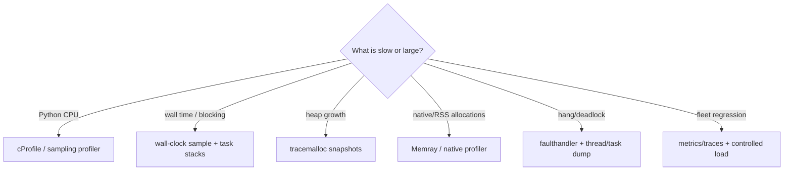

# Observability, Profiling, and Debugging Python Agents

> **Research date:** 2026-08-31  
> **Related:** [Observability and tracing](../../evaluation/observability-and-tracing.md)

Model spans alone cannot explain an agent incident. Python services need causal agent events plus runtime evidence: event-loop stalls, executor queues, HTTP pool wait, cancellation settlement, worker/process loss, RSS, file descriptors, and late effects.

## Build one causal identity chain

Propagate these across task, queue, process, sandbox, and durable boundaries:

```text
tenant / principal
  -> run_id
    -> turn_id
      -> model_request_id
      -> tool_call_id
        -> effect_id
          -> attempt_id
```

Add release, Python runtime/build, schema/tool/model versions, absolute deadline, and trace context. Use `ContextVar` for in-process async metadata, but serialize the required identifiers explicitly into broker messages, process payloads, and durable state. Context-local state does not magically cross those boundaries.

Avoid raw IDs as metric labels when cardinality is unbounded. Put them in sampled traces/logs; metrics aggregate by bounded tenant tier, model, tool class, release, failure kind, and worker pool.

## Use OpenTelemetry with a stability-aware schema

Initialize providers/exporters once per worker lifespan. Use batch processors/readers so request code does not synchronously export spans. Bound exporter queues and define drop/flush policy so telemetry failure cannot stall the agent or shutdown indefinitely.

Current maturity is not uniform: OpenTelemetry Python documents traces and metrics as stable while logs remain development. The GenAI conventions moved from the general semantic-conventions repository into `open-telemetry/semantic-conventions-genai`; its agent and framework span document is still marked **Development**. Pin the Python packages and chosen convention/schema version rather than treating every `gen_ai.*` name as a permanent database contract.

Instrument:

- run admission and queue wait;
- turn/model request and stream phases;
- tool validation, authorization, queue wait, attempt, and receipt;
- approval/checkpoint/outbox/durable step;
- retry/backoff and reconciliation;
- cancellation requested/observed/settled;
- stream disconnect and late-result fence.

Keep the durable application event log and telemetry separate. The event log decides recovery, ordering, terminal state, and effect evidence; traces/logs/metrics are sampled or lossy operational projections. Map stable internal events into the selected OTel convention so a convention rename, dropped batch, or exporter outage cannot change application correctness or break historical queries.

Do not attach prompts, model output, tool arguments/results, secrets, signed URLs, or user documents by default. Record lengths, digests, classes, policy decisions, and safe identifiers. Add sampling/redaction tests.

## Observe scheduler and pool health

| Signal | Why it matters |
|---|---|
| Event-loop lag | Blocking Python/native callback or CPU saturation |
| Slow callback count/duration | Pinpoints loop monopolization |
| Active/runnable tasks and oldest age | Leaks, hangs, missing ownership |
| Executor queued/active and oldest wait | Hidden blocking bottleneck |
| HTTP pool acquisition wait | Local saturation mistaken for provider latency |
| Stream buffered events/bytes and consumer lag | Slow-client memory pressure |
| Queue oldest age/redelivery | Capacity or poison work |
| Cancellation cleanup duration/late results | Uncooperative boundaries |
| RSS/Python heap/native alloc/fds/child count | Resource leak/source separation |
| Telemetry queue drops/flush latency | Blindness and shutdown risk |

Measure event-loop lag by scheduling against `loop.time()`/monotonic time. Do not emit a high-frequency watchdog that itself becomes material overhead. Asyncio debug mode logs callbacks over `loop.slow_callback_duration` and selector delays in diagnostic environments.

## Profile by the question



`cProfile` is deterministic and documented as reasonable-overhead for longer programs, but async wall time can misleadingly attribute waiting. Pair CPU profiles with wall-clock sampling, task stacks, event-loop lag, and transport/pool spans.

Python 3.15's trajectory includes a dedicated profiling package, a high-frequency statistical sampler, async-aware process dumps, and frame pointers enabled by default. These could materially improve live diagnosis; treat them as prerelease until 3.15 final and validate security/overhead in the deployment environment.

## Capture crash and hang evidence safely

Enable `faulthandler` early or via runtime flags where appropriate. It can dump Python tracebacks on fatal signals and after a timeout; Python 3.14 can also dump C stacks where supported. Keep its output file descriptor valid—the docs warn that replacing/closing it can redirect later dumps unexpectedly.

For hangs:

1. snapshot thread stacks (`faulthandler`, `sys._current_frames()`, or platform tools);
2. snapshot asyncio task names/stacks from a safe control path;
3. record event-loop lag and executor/pool/queue state;
4. capture child processes and open descriptors;
5. take a profile only if overhead and data exposure are acceptable;
6. preserve release/config hashes and recent bounded state transitions.

`sys._current_frames()` can inspect deadlocked thread stacks without their cooperation. Treat frames/locals as sensitive and restrict access.

For subprocess/native crashes, retain exit code/signal, worker PID, attempt/effect IDs, stderr tail, core/minidump reference according to policy, and pool replacement outcome. Never dump credentials or entire prompts to make debugging easier.

## Multi-process metrics need explicit design

ASGI workers have separate metrics state. The Prometheus Python client supports a multiprocess mode but documents significant limitations: custom collectors, some gauge behavior, Info/Enum, exemplars, Pushgateway, and label removal/clear are constrained; its multiprocess directory must be managed correctly between runs.

Prefer OTLP/exporter-per-worker or an explicitly supported aggregation mode. If using Prometheus multiprocess mode, test worker crash/recycle, stale files, gauge semantics, and deployment startup cleanup.

## Logs are events, not string dumps

Emit structured records with stable fields: timestamp, severity, event name, run/attempt/effect IDs, release, source component, failure kind, duration, and safe dimensions. Bound message/exception size and make redaction happen before formatter/exporter queues.

Avoid:

- logging full Pydantic validation inputs;
- duplicating exceptions at every layer;
- logging every token delta;
- serializing arbitrary objects with expensive/unsafe `repr`;
- relying on logs as the only durable effect receipt.

## Operational dashboards and alerts

At minimum correlate:

- request/run rate, admission rejection, queue age;
- success/cancel/failure/ambiguous-effect rates;
- p50/p95/p99 end-to-end, model, tool, pool-wait, and cleanup latency;
- retry amplification and provider rate-limit/unavailable signals;
- event-loop lag and executor saturation;
- stream disconnect/consumer lag/buffer bytes;
- RSS/fd/child growth by release/worker age;
- telemetry drops and trace sampling rate;
- durable replay/resume and outbox backlog.

Alert on sustained SLO symptoms and saturation, not every individual model/tool error.

## Verification checklist

- [ ] Trace context and causal IDs cross queues/processes/durable steps explicitly.
- [ ] Exporters are lifespan-owned, bounded, and cannot block shutdown indefinitely.
- [ ] OTel Python signal maturity and the selected GenAI convention/schema version are pinned and recorded.
- [ ] Durable state/effect evidence does not depend on sampled or dropped telemetry.
- [ ] Prompt/tool/state capture is off by default or redacted and policy-gated.
- [ ] Runtime health metrics distinguish event loop, executors, pools, streams, and RSS.
- [ ] CPU, wall, heap, and native profiles are selected by the diagnostic question.
- [ ] Hang/crash runbooks capture task/thread/child evidence before restart where safe.
- [ ] Multi-process metric mode is tested under worker recycle and crash.
- [ ] Cardinality, payload size, and telemetry cost have explicit budgets.

## Selected primary sources

- [OpenTelemetry Python](https://opentelemetry.io/docs/languages/python/), [instrumentation](https://opentelemetry.io/docs/languages/python/instrumentation/), and [exporters](https://opentelemetry.io/docs/languages/python/exporters/)
- [OpenTelemetry GenAI agent and framework spans](https://github.com/open-telemetry/semantic-conventions-genai/blob/main/docs/gen-ai/gen-ai-agent-spans.md) and [the general-repository migration notice](https://opentelemetry.io/docs/specs/semconv/gen-ai/)
- [Python `contextvars`](https://docs.python.org/3.14/library/contextvars.html) and [asyncio debug mode](https://docs.python.org/3.14/library/asyncio-dev.html)
- [Python profilers](https://docs.python.org/3.14/library/profile.html), [`tracemalloc`](https://docs.python.org/3.14/library/tracemalloc.html), and [`faulthandler`](https://docs.python.org/3.14/library/faulthandler.html)
- [Prometheus Python multiprocess mode](https://prometheus.github.io/client_python/multiprocess/)
- [Python 3.15 profiling trajectory](https://docs.python.org/3.15/whatsnew/3.15.html)
