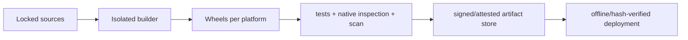

# Packaging, Dependencies, and Supply Chain for Python Agents

> **Research date:** 2026-08-31  
> **Related:** [Deployment, release, and incident response](../../operations/deployment-release-and-incident-response.md)

An agent artifact includes more than application packages: CPython patch/build, OS libraries, CA roots, native wheels, model/tool SDKs, sandbox images, browser/runtime binaries, and resolver output. Reproducibility and provenance must cover the artifact actually deployed on every target platform.

## Pin the complete runtime

Record and reproduce:

- CPython implementation, minor, patch, standard versus free-threaded build, and architecture;
- base image by immutable digest and OS package snapshot;
- Python packages including transitive dependencies and extras;
- wheel tags/native shared-library dependencies;
- agent/provider/durable SDK and model/tool schema versions;
- browser/sandbox/tool images and helper binaries;
- build frontend/backend and build dependencies;
- generated JSON Schemas, migrations, and configuration schema.

`python:3.14`, `latest`, and unconstrained `>=` ranges are not release artifacts.

## Lock per supported environment

The standardized `pylock.toml` format can represent reproducible environments and multiple artifacts/markers, but tool support and semantics still matter. Current pip 26.2 documentation labels `pip lock` **experimental** and guarantees its generated lock only for the current Python version and platform.

Therefore:

- choose an approved lock tool and version;
- generate/verify locks for each supported Python/platform/architecture combination;
- reject install-time re-resolution in deployment;
- keep direct intent (`pyproject.toml`) separate from resolved artifacts;
- test environment markers and optional extras;
- record why a dependency is present and its owning feature.

A lock file cannot make an sdist build deterministic across compiler/OS changes by itself.

## Prefer prebuilt, verified wheels for deployment

Pip's secure-install guidance recommends hash-checking mode (`--require-hashes`) and, where suitable, disallowing source distributions with `--only-binary :all:`. Hash mode is all-or-nothing: all requirements, including transitive ones, must be pinned and hashed.

Build a controlled wheelhouse when availability, repeatability, or index trust warrants it:

Package builds execute build-backend code and install build dependencies. Build isolation separates those dependencies from the runtime environment; it is not a malware sandbox. Restrict network/credentials, run unprivileged, pin build inputs, and retain build logs/provenance.

If a required project only ships an sdist, build it once in the controlled builder and deploy the verified wheel, rather than compiling in every production startup.

## Control indexes and dependency confusion

Avoid casually combining a private index with public fallback for the same unconstrained package namespace. Define one authoritative source per internal name or use a curated proxy that applies precedence and allowlist policy. Pin exact artifacts/hashes so a higher public version cannot win unexpectedly.

Review:

- typosquatting/name similarity;
- abandoned/low-maintenance transitive packages;
- dependency extras that pull large/unneeded trees;
- direct VCS/path dependencies and mutable references;
- install/build scripts and native binaries;
- licensing and export/usage constraints;
- release/yank behavior and incident response.

Package popularity is not provenance or security evidence.

## Use provenance without overstating it

PyPI Trusted Publishing exchanges short-lived OIDC identity for publishing and avoids long-lived API tokens. PyPI digital attestations can bind a distribution digest to a publishing identity/workflow and support PyPI Publish/SLSA provenance attestations.

Attestation proves a claimed build/publish relationship; it does not prove source safety, review quality, absence of compromise, or runtime compatibility. Combine provenance with review, hermetic-ish builds, tests, vulnerability/malware controls, and staged deployment.

For internal releases:

- use short-lived workload identity for publication;
- sign/attest application and sandbox images;
- retain source commit, build workflow, materials, SBOM, and artifact digest;
- verify policy at promotion/deploy, not only record metadata;
- protect the CI definition and release environment as high-trust code.

## Scan, but know scanner scope

`pip-audit` checks environments/requirements/locks for known vulnerabilities using advisory data. It does not prove packages are non-malicious or configured safely. Generate an SBOM containing Python and OS/native components, then scan continuously because advisories arrive after build time.

Define:

- severity/exploitability/usage-based remediation SLA;
- exception owner and expiry;
- emergency lock/artifact rebuild path;
- ability to block or roll back a compromised package/image;
- inventory query from a vulnerable component to deployments/runs.

Do not auto-upgrade production dependencies directly from a scanner finding. Resolve, test, evaluate behavioral/schema changes, and promote a new immutable artifact.

## Manage native and free-threaded compatibility

For each native dependency, verify wheels for OS/arch/CPython patch/minor and inspect linked libraries. Run import and functional tests under the deployment image—not only on a developer machine.

Free-threaded CPython has distinct wheel/extension compatibility. Python 3.15's `abi3t` trajectory may reduce per-version wheel builds, but cannot prove thread safety. Subinterpreter compatibility is a separate axis. Track all three explicitly:

| Axis | Question |
|---|---|
| Standard CPython ABI | Does an approved wheel exist and load on target? |
| Free-threaded ABI/behavior | Does it load without re-enabling GIL and pass concurrency tests? |
| Multiple interpreters | Is module state isolated and tested across interpreters? |

## Keep environments minimal and inspectable

- use a non-root runtime and read-only root filesystem where possible;
- exclude compilers, package managers, caches, tests, notebooks, and credentials from runtime images unless required;
- make imports/startup deterministic and fail fast on missing binary dependencies;
- set explicit locale/UTF-8/timezone behavior;
- compile bytecode during build only if it materially helps and is reproducible;
- expose package/runtime/SBOM/release identity in diagnostics;
- retain debug symbols or symbol references for native crash investigation according to policy.

## Upgrade protocol

1. Review changelog, advisories, version policy, native/platform support, and transitive diff.
2. Resolve new lock(s) in a clean builder.
3. Build/obtain verified wheels and immutable image.
4. Run import, type, unit, async leak, schema snapshot, migration, integration, eval, load, and failure tests.
5. Canary by workload/release and compare latency, loop lag, memory, retries, output behavior, and cost.
6. Promote progressively with rollback artifact retained.
7. Update provenance/SBOM and close the upgrade record.

Agent SDK and model changes should be decoupled when possible; otherwise diagnosis becomes ambiguous.

## Supply-chain checklist

- [ ] CPython patch/build, base image digest, OS/native packages, and Python lock are immutable.
- [ ] A lock is generated/tested for every deployment platform and Python version.
- [ ] Deployment installs verified wheels without network re-resolution/source builds.
- [ ] Build workers are isolated, unprivileged, credential-minimal, and reproducible enough to audit.
- [ ] Index authority prevents dependency confusion and mutable VCS references.
- [ ] Publishing uses short-lived identity and attestations are verified at promotion.
- [ ] SBOM/vulnerability inventory covers Python, native, OS, tool, browser, and sandbox assets.
- [ ] Scanner scope and remediation exceptions are explicit.
- [ ] Native/free-threaded/subinterpreter support is independently tested.
- [ ] Last-known-good artifacts and emergency rebuild/rollback paths are exercised.

## Selected primary sources

- [`pylock.toml` specification](https://packaging.python.org/en/latest/specifications/pylock-toml/) and [`pip lock`](https://pip.pypa.io/en/stable/cli/pip_lock/)
- [Pip secure installs](https://pip.pypa.io/en/stable/topics/secure-installs/) and [build-system interface](https://pip.pypa.io/en/stable/reference/build-system/)
- [PyPI Trusted Publishing](https://docs.pypi.org/trusted-publishers/) and [digital attestations](https://docs.pypi.org/attestations/)
- [`pip-audit`](https://github.com/pypa/pip-audit)
- [PEP 803: `abi3t`](https://peps.python.org/pep-0803/)

