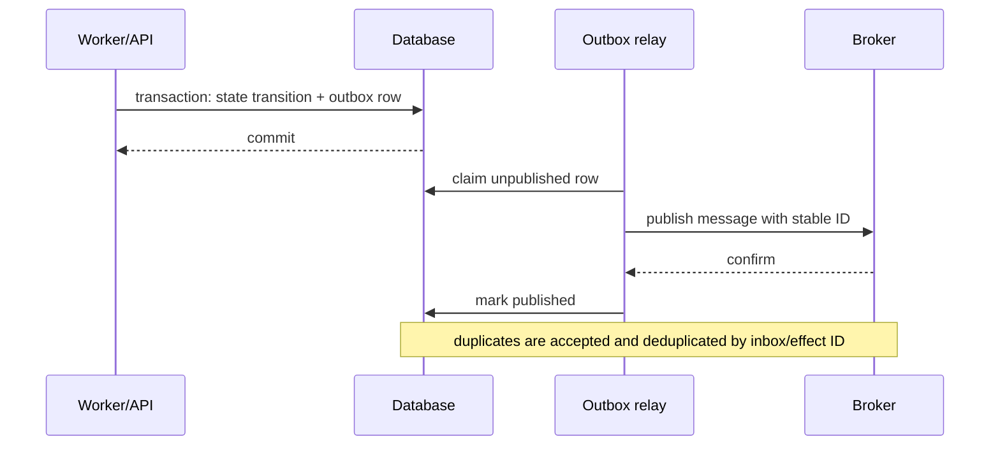

# Queues, Durable Workers, and State in Python

> **Research date:** 2026-08-31  
> **Related:** [Durable execution](../../runtime/durable-execution.md), [queues and backpressure](../../operations/queues-scheduling-and-backpressure.md), and [idempotency](../../reliability/idempotency-and-side-effects.md)

An in-memory queue schedules work while a process is alive. A broker redelivers messages. A durable workflow records decisions and wakeups. A database transaction protects local state. These are different guarantees; choose the smallest mechanism that matches the required recovery contract.

## Choose by recovery need

| Need | Appropriate starting point |
|---|---|
| Coordinate producer/consumer tasks inside one run | Bounded `asyncio.Queue` or direct task group |
| Run short background work after request, loss acceptable | Service-owned in-process supervisor—not framework response “background task” by accident |
| Survive process restart and distribute work | Broker + idempotent worker + durable state |
| Sleep/wait/approve for hours or days; resume after failure | Durable workflow/runtime |
| Atomically change database state and publish work | Transactional outbox + relay |
| Exactly reconstruct a stream/UI | Durable event log with sequence/cursor |

Do not add a broker because “agents are asynchronous.” Do not keep approval or long model work in an ASGI process because adding a broker feels heavy.

## Use `asyncio.Queue` only as local flow control

Give it a positive `maxsize`, a separate byte budget, and a shutdown protocol. Every successful `get()` must pair with `task_done()` in `finally`; otherwise `join()` can hang. Python 3.13's `Queue.shutdown()` helps stop producers and drain consumers, but immediate shutdown intentionally breaks the normal “all joined work completed” invariant.

An `asyncio.Queue` is not thread-safe, persistent, tenant-fair, visibility-timeout-aware, or cluster-wide. Process termination loses pending and in-flight items.

This complete Python 3.14 example demonstrates **normal local drain**, not durable work:

```python
import asyncio


async def worker(queue: asyncio.Queue[int]) -> None:
    while True:
        try:
            item = await queue.get()
        except asyncio.QueueShutDown:
            return
        try:
            await asyncio.sleep(0.01)  # replace with bounded, replay-safe work
            print(item)
        finally:
            queue.task_done()


async def main() -> None:
    queue: asyncio.Queue[int] = asyncio.Queue(maxsize=4)
    async with asyncio.TaskGroup() as group:
        for index in range(2):
            group.create_task(worker(queue), name=f"worker:{index}")
        for item in range(10):
            await queue.put(item)
        await queue.join()
        queue.shutdown()  # blocked consumers exit with QueueShutDown


asyncio.run(main())
```

If the process dies, queued items still disappear. If `shutdown(immediate=True)` is used, record discarded items/work because `join()` no longer proves completion.

## Design a broker message as a reference, not a heap dump

```json
{
  "kind": "agent_run_ready",
  "schema_version": 2,
  "run_id": "...",
  "tenant_id": "...",
  "expected_state_version": 17,
  "deadline": "...",
  "release": "...",
  "trace_parent": "..."
}
```

Store large prompts/artifacts/checkpoints in controlled durable storage and reference immutable versions/digests. Sign or authenticate messages where the broker trust model requires it. Never send pickled application objects through a boundary that can receive untrusted or tampered bytes.

The worker must atomically claim/fence the expected state version or lease before acting. Redelivery then becomes a duplicate scheduling hint rather than duplicate authority.

## Assume at-least-once processing

Broker acknowledgment timing creates a trade-off:

- ack before execution avoids redelivery after worker loss but can lose work;
- ack after completion permits redelivery but requires idempotent processing;
- a lease/visibility timeout can redeliver while a slow worker is still executing;
- a crash after external commit but before ack is always an ambiguity case.

Celery's current task guide makes this concrete: default acknowledgement occurs before execution; `acks_late` is intended for idempotent tasks. It also documents cases where a lost child can still be acknowledged unless `task_reject_on_worker_lost` is selected, and warns that such redelivery can create failure loops. Test the exact pool/broker/settings combination.

Use heartbeats/lease extensions only while making progress. A heartbeat is not a substitute for idempotency or a hard deadline.

## Couple state and messages with outbox/inbox



The outbox prevents “database committed but publish lost.” It can publish duplicates, so consumers need an inbox/deduplication record or idempotent transition keyed by message/effect ID. Keep transaction boundaries small; never hold a database transaction open across a model or tool call.

## Persist reconstructable state

Store:

- run/state version and phase;
- normalized conversation/event references;
- tool intent, attempt, receipt, and ambiguity;
- approvals and authorization snapshot/reference;
- budget consumption and absolute deadline;
- model/tool/schema/release versions;
- durable timer/signal/job references;
- terminal result and reconciliation status.

Do not store live coroutine frames, `Task`, clients, locks, generators, callbacks, or arbitrary framework objects. Encrypt sensitive state, enforce tenant scoping, define retention/deletion, and test migrations on old snapshots.

## Keep context, short-term state, and long-term memory separate

Python dictionaries and framework message objects make these layers easy to blur. Persist distinct, versioned records instead:

| Layer | Canonical content | Python/runtime rule |
|---|---|---|
| Run/event state | Phase, ordered normalized events, attempts, effects, budgets, terminal fence | Append or compare-and-set by expected version; never rely on one worker's object identity |
| Short-term working context | Selected recent turns, tool receipts, current plan, compaction cursor | Rebuild from durable facts; cap serialized bytes/tokens before model submission |
| Compaction artifact | Summary, source event range, source digest, compactor model/prompt/schema versions | Write as a derived artifact; do not delete source evidence until retention policy allows it |
| Long-term memory | Tenant-scoped facts/episodes with provenance, consent, confidence, expiry/deletion metadata | Retrieval is untrusted input; re-authorize before use or effect |
| Large artifacts | Documents, transcripts, tool output, embeddings | Store by immutable digest/reference; do not copy into broker messages or checkpoints |

A safe compaction update reads state version `n`, produces a bounded candidate outside the transaction, then commits only if the durable state is still version `n`. If another worker advanced the run, discard or recompute the candidate. Never hold a database transaction open while a model summarizes. A compactor retry must not create two authoritative summaries for the same source range; key it by run, source range/digest, and compaction-policy version.

Token counting, serialization, embedding, and summarization can consume CPU, memory, and provider concurrency. Put them behind the same weighted admission, deadline, retry, telemetry, and cancellation rules as other work. Cache only by immutable inputs and algorithm/model version. See the canonical [memory architecture](../../context-memory/memory-architecture.md), [context engineering](../../context-memory/context-engineering.md), and [compaction and continuity](../../context-memory/compaction-and-continuity.md) guides for product-level policy.

## Put long waits behind a durable engine

Durable engines differ in replay model:

- **Temporal Python:** workflow code is replayed and sandboxed to detect non-determinism; external effects belong in activities. The workflow sandbox is explicitly not full security isolation.
- **Restate:** non-deterministic operations are wrapped in durable steps such as `ctx.run`, whose result is journaled and retried according to policy.
- **DBOS:** workflows and steps provide durable execution around database-backed state; review transaction/step boundaries.
- **Pydantic AI integrations:** currently documents co-maintained durable integrations with Temporal, DBOS, Prefect, and Restate; the framework integration does not erase each engine's replay/effect rules.
- **LangGraph:** production checkpointers persist graph state; in-memory savers do not survive restart. Review node replay and side-effect placement.

Read the repository's [durable runtime comparison](../../comparisons/durable-agent-workflow-runtimes.md) and framework-specific guides. Do not place arbitrary async code, clocks, randomness, network calls, or mutable imports inside deterministic workflow code without the selected runtime's prescribed boundary.

## Separate cancellation, abandonment, and termination

| Action | Meaning |
|---|---|
| Cancel | Cooperative request; activity/tool may observe and clean up |
| Abandon | Owner stops waiting; late work may continue and must be fenced |
| Terminate | Runtime/process is forcibly stopped; cleanup may not run |
| Compensate | A new effect attempts to offset a prior committed effect |

Persist which one occurred. “Cancelled” must not imply an external effect was rolled back.

## Queue and durable-worker metrics

Track by tenant/work class, without high-cardinality raw IDs in metric labels:

- ready and leased/in-flight count;
- oldest message age and queue wait distribution;
- redelivery and duplicate-deduplication rate;
- lease extension/expiry and worker-lost count;
- attempts per logical operation and retry budget consumed;
- outbox oldest unpublished age and publish failures;
- checkpoint/history bytes and replay/resume latency;
- ambiguous effects awaiting reconciliation;
- poison/dead-letter count and manual resolution age.

## Verification checklist

- [ ] In-memory versus broker versus durable guarantees are documented accurately.
- [ ] Messages are small versioned references with deadlines and trace context.
- [ ] Worker claim uses a lease/version fence before effects.
- [ ] Ack/loss/redelivery behavior is tested against the exact broker and worker pool.
- [ ] State transition and publish use outbox; consumers deduplicate.
- [ ] Model/tool calls do not run inside database transactions.
- [ ] Context snapshots/compactions are derived, version-fenced artifacts with source ranges and digests.
- [ ] Short-term context and long-term memory have separate provenance, authorization, retention, and deletion rules.
- [ ] Long waits and approvals survive process restart.
- [ ] Workflow code obeys the engine's deterministic/replay rules.
- [ ] Cancellation, abandonment, termination, and compensation are distinct states.
- [ ] Poison messages stop retrying and retain sanitized resolution evidence.

## Selected primary sources

- [`asyncio` queue semantics and shutdown](https://docs.python.org/3.14/library/asyncio-queue.html)
- [Celery tasks](https://docs.celeryq.dev/en/latest/userguide/tasks.html) and [worker shutdown/prefetch behavior](https://docs.celeryq.dev/en/latest/userguide/workers.html)
- [Temporal Python workflow sandbox](https://docs.temporal.io/develop/python/python-sdk-sandbox)
- [Restate Python durable steps](https://docs.restate.dev/develop/python/durable-steps)
- [DBOS Python workflows](https://docs.dbos.dev/python/tutorials/workflow-tutorial)
- [Pydantic AI durable execution](https://ai.pydantic.dev/durable_execution/)
