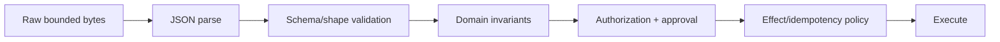
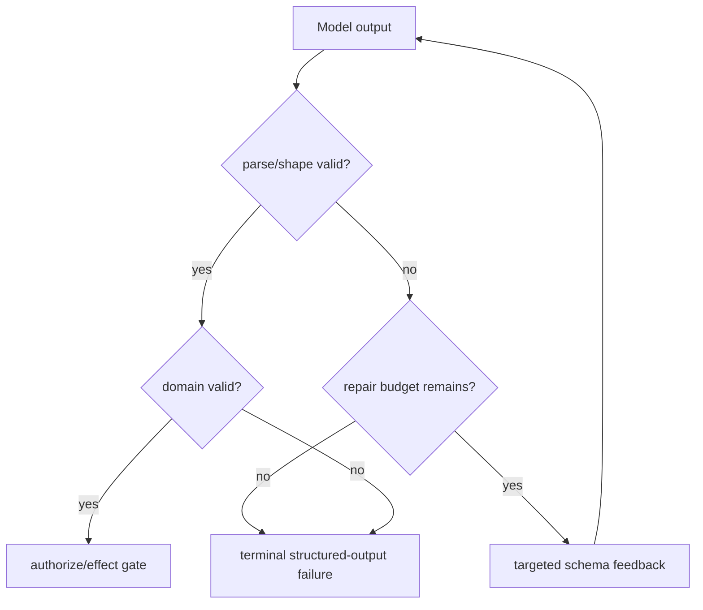

# Schemas, Validation, and Structured Output in Python

> **Research date:** 2026-08-31  
> **Related:** [Tool contracts](../../tools/tool-contracts.md) and [prompt injection and untrusted data](../../security/prompt-injection-and-untrusted-data.md)

Python type annotations help authors and static analyzers; they do not validate runtime values. Model outputs, tool arguments/results, HTTP bodies, queue messages, checkpoints, approvals, configuration, and environment variables all cross trust or compatibility boundaries. Validate each at the boundary and keep shape, meaning, authorization, and effect safety separate.

## Use a staged boundary



A JSON object that matches a transfer schema can still reference a nonexistent account, exceed a business limit, violate tenant scope, or duplicate an already committed effect. Do not collapse later stages into Pydantic validators that silently perform network I/O.

## Make coercion a deliberate policy

Pydantic defaults to lax conversion in many cases. Strict mode rejects conversions such as string-to-integer that could change meaning. Pydantic also documents that strict validation from JSON can be looser for some types than strict validation of Python objects—for example date strings—so test both entry paths you use.

Use strict fields/mode for:

- identifiers and version numbers;
- booleans controlling effects (`"false"` must not become truthy by accident elsewhere);
- currency/amounts and bounded counts;
- enums, approval decisions, and authorization scopes;
- sequence/cursor/idempotency keys;
- tool choice and filesystem/network policy.

Coercion can be appropriate at human configuration boundaries, but record the normalized value and reject ambiguous forms. Keep validation errors free of secret values.

## Prefer explicit versioned variants

Discriminated/tagged unions are more predictable and performant than untagged unions because the discriminator selects one branch.

```python
class ToolStarted(BaseModel):
    model_config = ConfigDict(strict=True, extra="forbid")
    kind: Literal["tool_started"]
    schema_version: Literal[1]
    call_id: UUID
    tool: str

class ToolFinished(BaseModel):
    model_config = ConfigDict(strict=True, extra="forbid")
    kind: Literal["tool_finished"]
    schema_version: Literal[1]
    call_id: UUID
    outcome: Literal["succeeded", "failed", "ambiguous"]

RunEvent = Annotated[ToolStarted | ToolFinished, Field(discriminator="kind")]
```

Choose unknown-field policy by boundary:

- **forbid** for effect commands, approvals, security policy, and internal contracts that deploy together;
- **ignore** only for explicitly forward-compatible readers where discarded fields are harmless;
- **retain** in a dedicated extension map when round-trip compatibility is required.

Pydantic's model default is `extra="ignore"`, so an unexpected producer field can disappear silently. Do not inherit that default accidentally for commands, events, effect receipts, or migration fixtures. Also avoid `model_construct()` at an untrusted boundary: it skips validation, and the current documentation notes that even `extra="forbid"` does not raise there.

Add explicit `schema_version`; do not infer it from optional field combinations.

## Separate four schema contracts

| Contract | Consumer | Typical constraints |
|---|---|---|
| Python runtime model | Application | Pydantic/Python types and validators |
| Wire schema | APIs/queues/state | Language-neutral JSON/Protobuf-compatible values |
| Provider structured-output schema | Model API | Provider-supported JSON Schema subset |
| Durable migration schema | Future releases | Old-version reader/migrator and semantic invariants |

Pydantic generates JSON Schema Draft 2020-12/OpenAPI 3.1-compatible schemas. A provider may support only a subset or add requirements. Generate the provider artifact deliberately, lint it against the exact provider/model surface, snapshot it, and validate the returned value locally again.

Provider-enforced structured output reduces syntax/shape failure. It does not remove refusals, truncation, transport failure, semantic invalidity, authorization, prompt injection, or version drift.

## Validate bytes before building large objects

Pydantic performance guidance recommends `model_validate_json()` over `json.loads()` followed by object validation in general, reusing `TypeAdapter` instead of constructing it repeatedly, and tagged unions for variants. Performance is secondary to bounding input first.

Apply:

- compressed and decoded byte limits;
- maximum JSON depth, collection cardinality, string length, and artifact references;
- stream/frame limits before concatenation;
- early failure where it does not leak whether a protected resource exists;
- schema adapter reuse at module/service initialization.

Do not validate every token delta against a large model. Validate the normalized complete event/tool/result at the correct boundary while still bounding raw stream bytes.

## Serialize deliberately

Pydantic's Python-mode and JSON-mode serialization differ. Subclass serialization, `SerializeAsAny`, aliases, exclusion, field serializers, and context can change the wire surface. Snapshot-test the exact wire representation and avoid a runtime flag that makes a security-sensitive payload unexpectedly include subclass-only secret fields.

For durable or cross-language values:

- use JSON-compatible primitives, UUID/string timestamps, explicit enum strings, and decimal policy;
- choose canonical timezone/precision and reject naive timestamps where unsafe;
- store large artifacts by immutable digest/reference rather than embedding them;
- attach schema, producer release, and content digest;
- migrate on read into a current internal type, but retain original evidence when audits require it.

Never unpickle untrusted data. Python documents that malicious pickle data can execute arbitrary code during unpickling. `multiprocessing`, process pools, and subinterpreters may use pickle internally, which means those channels are only for mutually trusted endpoints and inputs.

## Keep model repair bounded

When structured output fails:



Limit repair turns, tokens, time, and repeated identical failures. Do not paste raw secrets or enormous validation dumps back into the model. Permanent domain/authorization failure is not a formatting repair opportunity.

## Settings are also untrusted input

Validate environment, secrets, CLI, and file configuration at startup. Fail readiness before serving if required settings are missing or inconsistent. Do not log full settings objects or Pydantic `ValidationError` input values when they may contain secrets.

Resolve precedence explicitly: deployment environment, secret manager/mount, config file, and defaults. Do not let `.env` convenience silently override production policy.

## Verification checklist

- [ ] Raw and decoded payload limits apply before large allocations.
- [ ] Strict/coercing fields are chosen explicitly and tested via JSON and Python entry paths.
- [ ] Effect/event variants use a discriminator and schema version.
- [ ] Unknown-field behavior is part of the compatibility policy.
- [ ] Untrusted boundaries do not use `model_construct()` or silently inherit `extra="ignore"`.
- [ ] Generated provider schema is tested against the exact provider/model.
- [ ] Provider output is locally validated, then domain-checked and authorized.
- [ ] Serialization snapshots cover aliases, exclusions, subclasses, decimals, and timestamps.
- [ ] Durable state and IPC trust do not depend on pickle.
- [ ] Repair loops have turn/token/time limits and sanitized feedback.
- [ ] Configuration failures block readiness without exposing secret values.

## Selected primary sources

- [Pydantic strict mode](https://docs.pydantic.dev/latest/concepts/strict_mode/), [unions](https://docs.pydantic.dev/latest/concepts/unions/), and [performance guidance](https://docs.pydantic.dev/latest/concepts/performance/)
- [Pydantic serialization](https://docs.pydantic.dev/latest/concepts/serialization/) and [JSON Schema](https://docs.pydantic.dev/latest/concepts/json_schema/)
- [Pydantic settings](https://docs.pydantic.dev/latest/concepts/pydantic_settings/)
- [Python pickle security warning](https://docs.python.org/3.14/library/pickle.html)
- [OpenAI structured outputs](https://developers.openai.com/api/docs/guides/structured-outputs) as one example of a provider-specific schema surface
