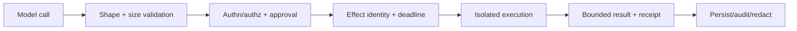

# Python Tools, Processes, and Sandbox Boundaries

> **Research date:** 2026-08-31  
> **Related:** [Tool contracts](../../tools/tool-contracts.md), [execution boundaries](../../runtime/execution-boundaries.md), and [permissions, sandboxing, and secrets](../../security/permissions-sandboxing-and-secrets.md)

Python is an excellent tool-host language and a poor security boundary for hostile Python code. Treat a tool call as authorization plus a constrained execution protocol. Move generated code, untrusted plugins, shell access, hostile parsers, and privileged automation behind an OS-enforced boundary.

## Pick the boundary by authority and failure impact

| Tool class | Minimum boundary | Examples |
|---|---|---|
| Pure deterministic transformation | In-process, validated | formatting a bounded object |
| Trusted async service read | In-process client with deadline | search, database read |
| Trusted blocking adapter | Bounded thread pool | legacy SDK call |
| CPU/crash-prone parser | Process or worker service | document conversion, native codec |
| Privileged side effect | Dedicated service/identity and approval | deployment, payment, write admin API |
| Generated or hostile code | Hardened container, sandbox, or VM | shell/Python execution, untrusted plugin |

A subprocess is not automatically a sandbox. It often inherits the parent user, filesystem, environment, network, and credentials.

## Build every tool call as a narrow pipeline



Tool visibility is not authorization. Recheck the authenticated principal, tenant, current policy, resource scope, and approval at execution time. Do not let the model choose credentials, network destinations, mount paths, or sandbox policy.

## Invoke programs without a shell

Prefer `asyncio.create_subprocess_exec()` or `subprocess.run([...], shell=False)` with an argument vector. `shell=True`, string concatenation, and platform quoting make injection likely. Python's `shlex.quote()` is for Unix shells and is not a cross-platform process API.

```python
proc = await asyncio.create_subprocess_exec(
    executable,
    *validated_args,
    cwd=workspace,
    env=minimal_env,
    stdin=asyncio.subprocess.DEVNULL,
    stdout=asyncio.subprocess.PIPE,
    stderr=asyncio.subprocess.PIPE,
)
```

Resolve `executable` from an administrator-controlled allowlist to an absolute path. Validate each argument semantically; do not merely reject a few metacharacters. Use a minimal environment and avoid passing secrets that the child does not require.

If a platform launches a batch file through a shell despite API choices, document and test that platform-specific behavior. If shell syntax is truly required, put it in a reviewed static script and pass only narrowly validated data through a safe channel.

## Bound time and output while reaping children

`asyncio` subprocess `wait()`/`communicate()` do not accept timeout parameters; wrap them in an asyncio timeout. `wait()` can deadlock when stdout/stderr pipes fill, so drain both streams—`communicate()` does this but buffers whole output in memory.

For untrusted or large output, pump both pipes concurrently into bounded sinks:

1. cap bytes per stream and total;
2. preserve a small tail for diagnostics;
3. terminate when output exceeds policy;
4. close stdin;
5. request graceful process-group stop;
6. wait briefly, then kill;
7. drain/close pipes and reap the process;
8. record exit code/signal, truncation, and attempt ID.

Killing only the direct child can leave grandchildren. Use a process group/job object/cgroup or the sandbox supervisor's lifecycle, with platform-specific tests.

## Constrain filesystem authority

String prefix checks such as `resolved.startswith(workspace)` are not a complete defense: symlinks and concurrent path replacement create time-of-check/time-of-use races.

Prefer:

- a dedicated, short-lived workspace owned by the sandbox identity;
- read-only input mounts and a separate bounded output mount;
- directory-descriptor-relative operations and no-follow flags where supported;
- no host socket, Docker socket, SSH agent, cloud metadata, or home-directory mount;
- quota/inode/file-count/individual-file limits;
- artifact promotion by a trusted parent after validation.

Python exposes `dir_fd`, `follow_symlinks`, and platform flags such as `O_NOFOLLOW` where supported; check `os.supports_dir_fd`/`supports_follow_symlinks`. These are building blocks, not a portable complete jail.

Use `TemporaryDirectory`, `NamedTemporaryFile`, or `mkstemp`/`mkdtemp`, which create unpredictable names securely. Never use deprecated `mktemp()`, whose documentation warns of a race/security hole.

## Enforce sandbox policy outside Python

An adequate hostile-code boundary combines:

- unprivileged UID/GID and no privilege escalation;
- user/mount/PID/network namespaces or VM-equivalent isolation;
- read-only root filesystem and explicit mounts;
- deny-by-default egress with destination/protocol allowlists;
- seccomp/syscall filtering and mandatory access control;
- CPU, wall time, memory, process/thread, file descriptor, disk, and output limits;
- no ambient credentials; short-lived scoped capability injection;
- image provenance, patching, and teardown guarantees;
- audit events generated outside the guest.

Docker's default seccomp profile is a useful layer and its documentation recommends retaining it; a hardened sandbox may need stronger isolation such as gVisor or a microVM according to threat model. Kubernetes' Restricted Pod Security Standard requires controls such as non-root execution, no privilege escalation, and a non-unconfined seccomp profile. Namespace/container isolation alone is not a proof against kernel or runtime escape.

## Know what is explicitly **not** a sandbox

- `eval()`/`exec()` with filtered builtins;
- a separate module, virtual environment, thread, or subinterpreter;
- `multiprocessing` or a process pool running as the same identity;
- Pydantic/JSON Schema validation;
- CPython audit hooks—Python's documentation explicitly says Python-level audit hooks are not suitable for sandboxing and malicious code can bypass them;
- RestrictedPython—its documentation explicitly says it is not a sandbox or secured environment;
- a timeout without CPU/memory/process/output enforcement.

Python objects can reach import machinery, descriptors, native extensions, `ctypes`, process APIs, files, and sockets through surprising paths. Deny authority at the OS boundary.

## Separate secrets from model-visible data

Resolve a credential by an opaque capability/tool identity after authorization. Never place raw credentials in prompts, tool schemas, command-line arguments, environment dumps, traces, exception messages, or persisted stdout/stderr.

Command-line arguments and environment variables may be visible through process inspection or crash diagnostics. Prefer a brokered service call or short-lived file descriptor/secret mount with narrow permissions and immediate cleanup.

## Sandbox verification checklist

- [ ] Executables and images come from administrator-controlled allowlists.
- [ ] Shell interpretation is absent or confined to reviewed static scripts.
- [ ] Parent and descendants are stopped as one unit after deadline/output violation.
- [ ] stdout/stderr are drained concurrently with byte limits.
- [ ] The child has no host home, control socket, metadata service, or broad egress.
- [ ] Workspace paths resist symlink races and artifacts are validated before promotion.
- [ ] CPU, RSS, process count, file descriptors, disk, and wall time are enforced externally.
- [ ] Credentials are short-lived, scoped, and invisible to prompts/logs where possible.
- [ ] Sandbox escape, fork bomb, output flood, disk fill, and orphan process tests run in CI/staging.
- [ ] External effects have stable identity and reconciliation independent of sandbox exit.

## Selected primary sources

- [Python subprocess security and timeout behavior](https://docs.python.org/3.14/library/subprocess.html) and [`asyncio` subprocesses](https://docs.python.org/3.14/library/asyncio-subprocess.html)
- [Python temporary files](https://docs.python.org/3.14/library/tempfile.html) and [`os` file-descriptor-relative operations](https://docs.python.org/3.14/library/os.html)
- [Python audit-hook warning](https://docs.python.org/3.14/library/sys.html#sys.addaudithook) and [RestrictedPython documentation](https://restrictedpython.readthedocs.io/en/latest/)
- [Docker seccomp profiles](https://docs.docker.com/engine/security/seccomp/), [gVisor security model](https://gvisor.dev/docs/architecture_guide/security/), and [Kubernetes Pod Security Standards](https://kubernetes.io/docs/concepts/security/pod-security-standards/)

