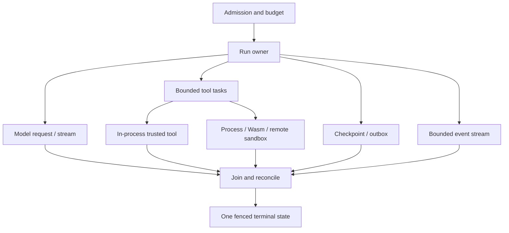

# Rust Agent Engineering

> **Status:** Deep production playbook
> **Last researched:** 2026-08-31
> **Runtime baseline:** Rust 1.98.0, Tokio 1.53.1
> **Evidence:** [Rust agent-engineering research packet](../../research/packets/rust-agent-engineering-deep-dive.md)
> **Scope:** What changes when a serious agent runtime is implemented and operated in Rust

Rust is a strong fit for agent gateways, tool hosts, protocol adapters, isolation layers, local agents, and high-concurrency workers when memory safety, explicit ownership, low steady-state overhead, and native deployment justify the smaller agent SDK ecosystem. Its type system eliminates important classes of defects. It does not automatically provide structured task ownership, durable execution, safe cancellation, bounded memory, valid model output, or a secure sandbox.

The production unit to reason about is an owned run tree:

Every child needs an owner, cancellation behavior, a join or detach policy, a byte and concurrency budget, and a rule for late results. Rust makes those contracts expressible; the application still has to create them.

## Choose this path by the problem in front of you

| Need | Start here |
|---|---|
| Component boundaries, ownership, traits, and run-state design | [Architecture and ownership](architecture-and-ownership.md) |
| Tokio task lifetimes, cancellation safety, deadlines, blocking work, shutdown | [Tokio runtime, cancellation, and shutdown](tokio-runtime-cancellation-and-shutdown.md) |
| reqwest, Axum/Tower, SSE, WebSocket, byte limits, slow consumers | [HTTP, streaming, and backpressure](http-streaming-and-backpressure.md) |
| Processes, filesystem authority, Wasmtime, and hostile tool isolation | [Tools, processes, and sandboxing](tools-processes-and-sandboxing.md) |
| Serde, JSON Schema, model/tool boundary validation | [Schemas, Serde, and structured output](schemas-serde-and-structured-output.md) |
| Typed failure classes, panics, retries, ambiguous effects | [Errors, retries, idempotency, and panics](errors-retries-idempotency-and-panics.md) |
| SQL state, checkpoints, outbox, Temporal, Restate, replay | [State, persistence, and durable workers](state-persistence-and-durable-workers.md) |
| Provider clients, Rig, MCP, SDK maturity, build-or-buy | [Providers, frameworks, and MCP](providers-frameworks-and-mcp.md) |
| `tracing`, OpenTelemetry, Tokio Console, Loom, fuzzing | [Observability, profiling, and testing](observability-profiling-and-testing.md) |
| Heap/RSS, queues, tasks, semaphores, weighted admission | [Memory, resources, and admission control](memory-resources-and-admission-control.md) |
| Cargo, build scripts, unsafe/native code, artifacts, containers | [Supply chain, build, and deployment](supply-chain-build-and-deployment.md) |
| Incident patterns, release gates, go-live and failure injection | [Failure modes and production checklist](failure-modes-and-production-checklist.md) |

## The language-specific decision

Choose Rust when:

- the team can own Rust in development and on call;
- the component benefits from a compact native artifact and predictable runtime footprint;
- protocol, tool, gateway, local-inference, or sandbox work dominates;
- data races and lifetime mistakes at a high-trust boundary are unacceptable;
- the required provider features exist through an official vendor SDK, stable protocol, or a community dependency the team is prepared to own;
- longer compile cycles and a smaller agent-framework ecosystem are acceptable.

Prefer another controller language when:

- the required agent SDK is Python- or TypeScript-only and its orchestration features are central;
- rapid notebook/data-science iteration is the primary workflow;
- the operating team cannot reliably debug async Rust, ownership, native linking, and symbolized production failures;
- the proposed Rust service would be only a translation layer with no security, performance, deployment, or ownership benefit.

A mixed-language system can be appropriate: keep a framework-native controller in Python or TypeScript and use Rust for a gateway, MCP server, tool sandbox, parser, local daemon, or durable activity. Add that boundary only when it earns its serialization, deployment, and incident-response cost.

## Stable runtime is not stable ecosystem

Keep three labels separate:

| Label | Question |
|---|---|
| Package release | Is this exact crate version non-prerelease and governed by a compatibility policy? |
| Vendor support | Does the model or workflow vendor officially own the Rust SDK? |
| Product maturity | Is the particular agent, MCP, telemetry, or durable feature GA, preview, beta, or experimental? |

At this snapshot:

- Rust 1.98.0 and Tokio 1.53.1 are stable releases.
- OpenAI lists `async-openai` as a community library; the official Agents SDKs are Python and TypeScript.
- AWS provides an official Rust SDK including Bedrock Runtime APIs.
- Rig is a community agent/provider framework and explicitly warns that breaking evolution is expected.
- Temporal's Rust SDK is public preview.
- Restate's Rust SDK says it is in active development and may break across releases.
- `rmcp` 3.0.x is a stable official MCP Rust SDK release, but the public maturity story changed quickly; see the [ecosystem guide](providers-frameworks-and-mcp.md) before assigning a tier label.
- OpenTelemetry Rust traces, metrics, and logs are all Beta.

Pinning a stable crate does not upgrade a preview product surface to GA.

## Baseline architecture rules

1. Model a run as explicit state plus owned tasks, not as a web handler with detached futures.
2. Use bounded channels; an element count is not a byte budget.
3. Treat cancellation as dropping a future at an `.await`; audit cancellation safety.
4. Do not use `spawn_blocking` for work that may never return.
5. Reuse HTTP clients and bound headers, bodies, decompression, time-to-first-byte, idle gaps, and total duration separately.
6. Deserialize into narrow boundary types, validate domain constraints, authorize, then execute.
7. Make retryability a typed property of an operation and reconcile ambiguous effects by stable effect ID.
8. Keep durable orchestration nondeterminism inside recorded steps/activities.
9. Treat in-process tools as fully trusted code; isolate hostile code outside the controller.
10. Make resource permits own the resources they protect and live through the actual operation.
11. Instrument future poll lifetimes correctly; never hold a `Span::enter` guard across `.await`.
12. Treat build scripts, proc macros, native dependencies, and CI as execution surfaces.

## Canonical guides to reuse

These Rust guides explain runtime-specific consequences and intentionally defer generic policy:

- [Agent loop](../../foundations/agent-loop.md)
- [Run controls](../../runtime/run-controls.md)
- [Execution boundaries](../../runtime/execution-boundaries.md)
- [Durable execution](../../runtime/durable-execution.md)
- [Agent state and event contracts](../../runtime/agent-state-and-event-contracts.md)
- [Tool contracts](../../tools/tool-contracts.md)
- [Queues, scheduling, and backpressure](../../operations/queues-scheduling-and-backpressure.md)
- [Idempotency and side effects](../../reliability/idempotency-and-side-effects.md)
- [Observability and tracing](../../evaluation/observability-and-tracing.md)
- [Permissions, sandboxing, and secrets](../../security/permissions-sandboxing-and-secrets.md)

## Refresh triggers

Re-research this area when any of these changes:

- a new Rust stable release changes the project MSRV or Cargo security posture;
- Tokio changes cancellation, task, process, or runtime-shutdown behavior;
- reqwest, Tower, Axum, Serde, Schemars, SQLx, Wasmtime, or OpenTelemetry crosses a major version;
- OpenAI or another major provider ships or withdraws an official Rust SDK;
- Rig declares a stable compatibility line or materially changes its run loop;
- the MCP SDK registry approves a different Rust tier or a new protocol revision ships;
- Temporal Rust or Restate Rust changes maturity;
- a RustSec, Cargo, crates.io, build-script, proc-macro, or native dependency incident affects the graph.

## Selected primary sources

- [Rust 1.98.0 announcement](https://blog.rust-lang.org/releases/latest/)
- [Tokio 1.53.1 changelog](https://docs.rs/crate/tokio/latest/source/CHANGELOG.md)
- [Tokio graceful shutdown](https://tokio.rs/tokio/topics/shutdown)
- [Official OpenAI SDK list](https://developers.openai.com/api/docs/libraries)
- [MCP Rust SDK releases](https://github.com/modelcontextprotocol/rust-sdk/releases)
- [OpenTelemetry Rust status](https://opentelemetry.io/docs/languages/rust/)
