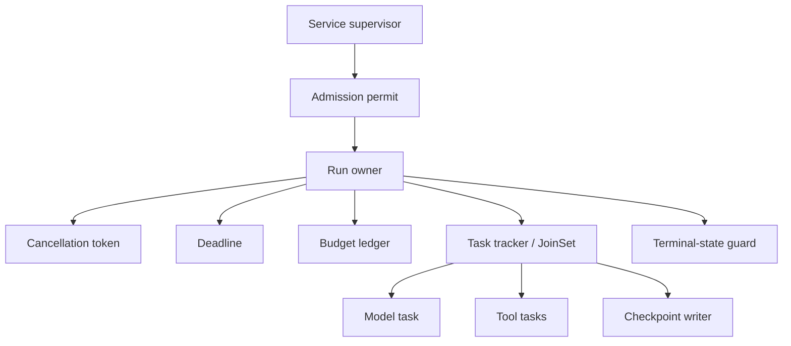
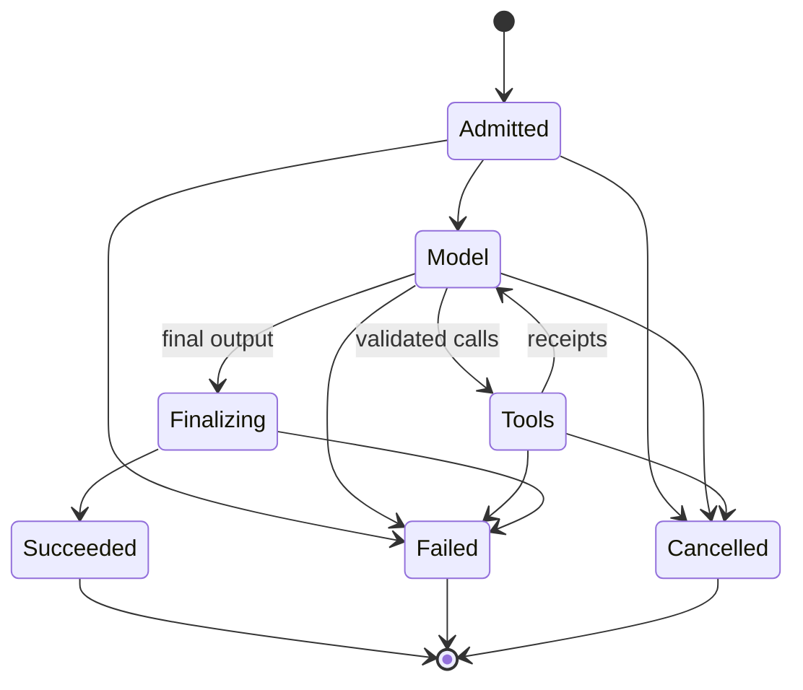

# Rust Agent Runtime Architecture and Ownership

> **Last researched:** 2026-08-31
> **Use with:** [Agent loop](../../foundations/agent-loop.md), [run controls](../../runtime/run-controls.md), and [execution boundaries](../../runtime/execution-boundaries.md)

Rust's ownership model is most valuable when the architecture makes ownership visible. An `Arc<Mutex<Everything>>` controller may compile, but it erases the exact run, task, state transition, and resource relationships that Rust could have enforced.

## Make the run an aggregate, not a bag of globals

Separate process-scoped services from run-scoped authority:

```rust
#[derive(Clone)]
struct App {
    http: reqwest::Client,
    store: RunStore,
    providers: ProviderRegistry,
    limits: Limits,
}

struct RunContext {
    run_id: RunId,
    tenant_id: TenantId,
    deadline: tokio::time::Instant,
    cancel: tokio_util::sync::CancellationToken,
    budget: RunBudget,
}
```

`App` may be cheap to clone because its members are internally shared. `RunContext` represents authority for exactly one run. Do not put a request cancellation token into a singleton and do not use an application-global mutex for ordinary per-run state.

Use newtypes for identifiers and capabilities that must not be mixed:

```rust
struct RunId(uuid::Uuid);
struct EffectId(uuid::Uuid);
struct TenantId(String);

struct AuthorizedToolCall {
    effect_id: EffectId,
    tool: ToolId,
    args: ValidatedArgs,
}
```

The point is not type ornamentation. It is preventing a raw model string, an unvalidated argument object, or a different identifier from reaching the effect executor.

## Put one owner around each run tree



The run owner should:

- acquire admission before materializing large inputs;
- derive cancellation and deadlines;
- spawn only work it can observe and join;
- fence state transitions by run attempt/version;
- reconcile task outcomes into one terminal result;
- release permits only after work and cleanup are complete;
- persist enough evidence to repair ambiguous outcomes.

Dropping a Tokio `JoinHandle` detaches its task. That is a lifecycle decision, not cleanup. Use a `JoinSet`, `TaskTracker`, or an application supervisor when dynamic child tasks are required, and drain all results so panics and failures are observed.

## Prefer message ownership to shared mutation

Shared state is sometimes correct, but a channel-owned state machine often exposes invariants more clearly:

```rust
enum RunCommand {
    ModelEvent(ModelEvent),
    ToolFinished { call_id: CallId, result: ToolResult },
    Cancel(CancelReason),
}

enum RunState {
    Admitted,
    CallingModel,
    WaitingForTools { pending: usize },
    Finalizing,
    Succeeded,
    Failed,
    Cancelled,
}
```

A single run actor can own `RunState`, while child tasks send typed outcomes through a bounded channel. This avoids holding async mutex guards across slow I/O and centralizes legal transitions. It does not remove the need to bound the channel, payload bytes, or sender lifetime.

Use `Arc<Mutex<T>>` when the protected data is genuinely shared and the critical sections are small. Rules:

- never hold a `std::sync::Mutex` guard across `.await`;
- avoid holding a Tokio mutex across provider or tool I/O;
- do not use a mutex to compensate for missing state-machine design;
- define lock ordering if more than one lock can be held;
- measure contention rather than assuming it is negligible.

## Define trait boundaries around capabilities

Traits are useful at volatile or security-relevant boundaries:

```rust
trait ModelGateway {
    async fn stream(
        &self,
        ctx: &RunContext,
        request: ModelRequest,
    ) -> Result<ModelStream, ModelError>;
}

trait EffectExecutor {
    async fn execute(
        &self,
        ctx: &RunContext,
        call: AuthorizedToolCall,
    ) -> Result<EffectReceipt, ToolError>;
}
```

Keep the interface narrow and domain-oriented. Avoid a giant `AgentRuntime` trait that mirrors the entire implementation, and avoid making every internal function generic. Static dispatch is appropriate inside a performance-sensitive component; trait objects can be practical for registries. Choose based on actual plugin and test needs.

Async trait methods may be expressed with stable async functions in traits where the resulting bounds fit, or with boxed futures/macros where object safety or ecosystem compatibility requires them. Verify the `Send` behavior of the exact interface; do not add `Send + Sync + 'static` reflexively to values that never cross tasks.

## Keep the run state machine explicit

Useful terminal invariants:

- exactly one terminal state becomes externally visible;
- a cancelled or superseded attempt cannot commit a late result;
- an effect receipt is persisted before the next model decision uses it;
- every tool call has a unique call ID and every externally mutating attempt has a stable effect ID;
- a stream disconnect does not silently decide whether the run cancels or continues;
- state version/lease ownership fences concurrent workers.



Use a database compare-and-swap, version column, lease token, or durable runtime ownership to enforce these transitions across process crashes. Rust enum exhaustiveness helps local state handling but cannot fence two processes by itself.

## Avoid ownership-shaped anti-patterns

| Anti-pattern | Why it fails | Better boundary |
|---|---|---|
| `Arc<Mutex<HashMap<RunId, ...>>>` as the source of truth | Lost on crash; global contention; unclear eviction | Durable run store plus bounded in-memory cache |
| Drop `JoinHandle` after spawning | Detaches and hides failure | Track, join, and record task result |
| Clone all handles into every task | Authority and shutdown ownership become implicit | Pass a narrow run context/capability |
| `'static` everywhere | Encourages detached lifetimes and unnecessary allocation | Borrow within a scope; own only across task boundaries |
| Generic repository/provider abstractions for one backend | Type complexity without a real substitution need | Concrete implementation behind a narrow domain interface |
| In-memory cancellation equals durable cancellation | Process crash loses it; committed effects remain | Persist intent, fence attempts, reconcile effects |

## Architecture review checklist

- [ ] The process supervisor, run owner, and child-task owners are identifiable.
- [ ] Every spawned task is joined, tracked, or deliberately supervised.
- [ ] Every shared mutable value has a stated invariant and contention plan.
- [ ] Boundary types distinguish raw, decoded, validated, authorized, and executed values.
- [ ] Terminal transitions are fenced across workers, not only within the process.
- [ ] Admission and resource permits live for the full protected operation.
- [ ] Detached/background work has its own identity, budget, cancellation, persistence, and shutdown path.
- [ ] Durable state does not depend on serializing opaque provider/framework internals.

## Selected primary sources

- [Rust async and futures](https://doc.rust-lang.org/stable/book/ch17-01-futures-and-syntax.html)
- [Tokio spawning and task ownership](https://tokio.rs/tokio/tutorial/spawning)
- [Tokio `JoinHandle`](https://docs.rs/tokio/latest/tokio/task/struct.JoinHandle.html)
- [Tokio `JoinSet`](https://docs.rs/tokio/latest/tokio/task/struct.JoinSet.html)
- [Tokio `TaskTracker`](https://docs.rs/tokio-util/latest/tokio_util/task/struct.TaskTracker.html)
