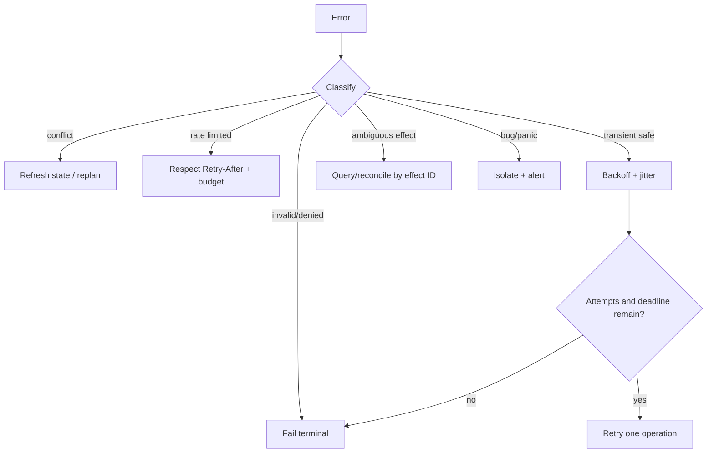
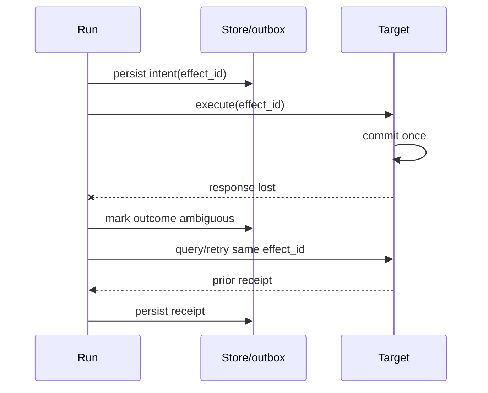

# Typed Errors, Retries, Idempotency, and Panics

> **Last researched:** 2026-08-31
> **Related:** [Failure taxonomy](../../reliability/failure-taxonomy.md) and [idempotency and side effects](../../reliability/idempotency-and-side-effects.md)

Rust's `Result<T, E>` forces a failure channel into many APIs, but a production agent still needs semantic error classes. A string or `anyhow::Error` at the retry boundary cannot reliably answer whether to retry, compensate, wait for a human, or fail permanently.

## Preserve retry semantics in types

```rust
enum ToolError {
    InvalidInput(ValidationError),
    Denied(PolicyError),
    Conflict { current: Revision },
    RateLimited { retry_after: Option<Duration> },
    TransientDependency { source: DependencyError },
    AmbiguousOutcome { effect_id: EffectId },
    Deadline,
    Cancelled,
    Bug(InternalError),
}

impl ToolError {
    fn retry_class(&self) -> RetryClass { /* explicit mapping */ }
}
```

Use `thiserror` or manual enums in libraries/domain layers when callers need to match variants. Use `anyhow`-style context at binary/application boundaries for operator diagnostics, but do not erase typed categories before policy decisions.

Every error exposed to the model should be a bounded, redacted projection. Preserve a richer causal chain, source, request ID, and debug evidence for operators.

## Put retries at one semantic owner



The layer that understands the operation's semantics owns retry. Transport middleware does not know whether a POST committed. A durable engine does not know whether a target ignored the idempotency key. A model loop should not repeat an entire turn because one read timed out.

Inventory SDK, HTTP middleware, queue, durable activity, service-mesh, and application retries. Bound the total attempt fan-out.

## Use stable effect identity

For an externally mutating tool:

1. generate a stable `EffectId` before the first attempt;
2. persist intent and the exact validated command;
3. send the effect ID/idempotency key to the target if supported;
4. persist the receipt/result;
5. on timeout after send, query or reconcile by effect ID;
6. never invent a new ID merely because the response was lost.



If the target has no idempotency or query capability, the correct state may be “unknown, requires reconciliation,” not “retry.”

## Keep deadlines, cancellation, and retry distinct

- **Deadline:** the caller's time budget expired.
- **Cancellation:** an owner requested stop.
- **Timeout:** one operation exceeded a local budget.
- **Rate limit:** dependency requests a delay.
- **Conflict:** precondition/version changed.
- **Ambiguous outcome:** request may have committed.

Do not flatten all of these into `Timeout`. Preserve the cause through task joins and HTTP/provider wrappers. A timeout drops the future, which may leave the underlying dependency in a state its own docs define; audit that dependency's cancellation contract.

## Treat panics as bugs, not business errors

Rust defines `panic!` for unrecoverable conditions and `Result` for recoverable failure. Do not use `unwrap`/`expect` on model data, tool results, environment variables, network responses, locks, or other runtime inputs.

Tokio task panics are returned as `JoinError` when the handle is awaited. If the handle is detached or its result ignored, the supervisor may miss the failure. Always observe owned task outcomes.

Panic strategy matters:

| Strategy | Behavior | Trade-off |
|---|---|---|
| `unwind` | Stack frames unwind where supported; destructors run | Larger artifact/runtime machinery; catching requires unwind-safety reasoning |
| `abort` | Process terminates immediately | Strong failure containment by process supervisor; no in-process cleanup |

Do not use `catch_unwind` as a general service recovery mechanism. It does not make corrupted invariants safe, does not catch aborting panics, and is especially unsuitable across unsafe/FFI assumptions. Isolate high-risk plugins/tools in another process or Wasm instance and restart that boundary.

Poisoned standard locks are a signal that a panic occurred while invariants may be broken. Blindly calling `into_inner` can continue with corrupted state. Decide per invariant whether to rebuild, fail the run, or terminate the process.

## Retry policy checklist

- [ ] Error variants preserve invalid, denied, conflict, rate-limit, transient, deadline, cancellation, ambiguous, and bug classes.
- [ ] Exactly one layer owns each retry.
- [ ] Attempts, elapsed time, tokens/cost, and downstream calls are jointly bounded.
- [ ] Backoff uses jitter and honors provider retry guidance.
- [ ] Mutations reuse one stable effect ID across attempts.
- [ ] Ambiguous effects reconcile rather than blindly repeat.
- [ ] Model-visible errors are bounded and redacted.
- [ ] All task `JoinError` values are observed.
- [ ] `unwrap`/`expect` is absent from runtime-controlled paths.
- [ ] Panic strategy and supervisor restart behavior are tested.

## Selected primary sources

- [Rust error handling](https://doc.rust-lang.org/stable/book/ch09-00-error-handling.html)
- [When to panic](https://doc.rust-lang.org/book/ch09-03-to-panic-or-not-to-panic.html)
- [Rust panic reference](https://doc.rust-lang.org/reference/panic.html)
- [Tokio task panic and cancellation](https://docs.rs/tokio/latest/tokio/task/)
- [Cargo panic profiles](https://doc.rust-lang.org/cargo/reference/profiles.html)
