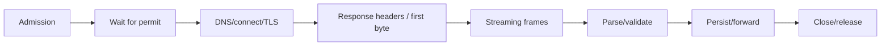
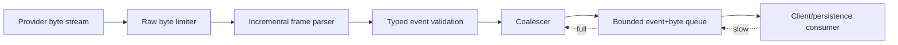

# HTTP, Streaming, and Backpressure in Rust Agent Services

> **Last researched:** 2026-08-31
> **Checked releases:** reqwest 0.13.4, Tower 0.5.3, tower-http 0.7.0
> **Related:** [Queues, scheduling, and backpressure](../../operations/queues-scheduling-and-backpressure.md)

Agent traffic combines long response bodies, token/event streams, slow clients, large tool results, retries, and expensive downstream calls. The Rust HTTP stack provides strong primitives, but no single timeout or middleware protects every phase.

## Reuse clients and own the transport policy

`reqwest::Client` holds a connection pool and is already internally reference-counted. Construct and configure it once per transport/security policy, then clone the client handle. Per-request clients lose pooling and can create socket, DNS, TLS, and latency churn.

Configure and test:

- connect timeout;
- request/overall timeout where suitable;
- pool idle timeout and maximum idle connections per host;
- proxy and no-proxy rules;
- redirect policy, especially credential stripping and host changes;
- TLS roots, client identity, and minimum versions;
- DNS behavior;
- decompression features and post-decompression byte caps;
- HTTP/2/HTTP/3 behavior required by the exact provider;
- user agent, request ID, and trace propagation;
- maximum response headers and body bytes at surrounding layers.

Do not use `Client::new()` in a path that needs initialization failure handling; its docs note it can panic if TLS or resolver initialization fails. Build the client at startup and fail readiness clearly.

## Budget every phase separately

A whole-request timeout alone is not enough. Define:

| Budget | Failure it bounds |
|---|---|
| Admission wait | Queue overload and tenant starvation |
| Connect/TLS | Network path and endpoint failure |
| Time to headers/first byte | Provider stalls before streaming |
| Idle inter-frame | Stalled SSE/body while total deadline is far away |
| Absolute request/run deadline | Slow but continuously active requests |
| Compressed bytes | Network and buffer amplification |
| Decompressed bytes | Decompression bombs |
| Parsed events/tokens | Logical output explosion |
| Client output backlog bytes | Slow-consumer memory |

`tokio::time::timeout` drops the wrapped future and checks the deadline only when the future yields. It is not a kill switch for CPU-bound parsing. tower-http distinguishes a request future timeout from body idle timeouts and absolute body deadlines; streaming bodies are processed after the original service future resolves, so body layers are necessary.

## Stream incrementally

Avoid `.bytes().await`, `.text().await`, or collecting an entire provider response when an incremental parser will do. For SSE or newline-delimited events:

1. cap raw bytes before accumulating;
2. maintain a bounded partial-frame buffer;
3. reject oversized individual frames;
4. parse and validate each event;
5. coalesce low-value token deltas before fan-out;
6. forward through a bounded channel;
7. stop reading and close promptly on cancellation;
8. persist a cursor/sequence only if resume is a supported contract.

Backpressure must reach the producer or trigger an explicit policy: wait, coalesce, sample, spool, detach, or cancel. “Keep buffering” is not a policy.

## Bound inbound Axum/Tower services

Tower layers can express important controls, but layer ordering changes what is protected. A representative stack needs:

- request-body size limit;
- request-body idle timeout and/or absolute deadline;
- authentication and tenant extraction;
- global and per-tenant concurrency limits;
- rate or load shedding policy;
- run-level timeout/cancellation;
- trace and request IDs;
- response-body idle timeout/deadline for streams.

`RequestBodyLimitLayer` can reject a too-large declared `Content-Length` immediately. Without a length, the limit is enforced as the body is read; if the handler never consumes beyond the limit, no length error is produced. Hyper handles connection resynchronization concerns when oversized streams are dropped, but application behavior still needs testing.

`ConcurrencyLimitLayer` bounds concurrent service calls, not model tokens, subprocesses, database connections, or stream backlog. Use a global layer/shared semaphore where clones must share one limit; a per-service layer can otherwise create multiple independent limits.

The tower-http request timeout returns an HTTP response rather than a service error. Choose status semantics intentionally; an upstream timeout is often not a client `408`. Do not expose internal timeout categories as misleading status codes.

## Treat streaming disconnect as a product decision

When the client disconnects:

| Policy | Appropriate when | Required design |
|---|---|---|
| Cancel run | Interactive result has no value without client | Propagate cancellation; fence late effects |
| Continue durably | Work has independent business value | Persist run ID, status, events, ownership |
| Detach after checkpoint | Safe resume boundary exists | Durable cursor and explicit handoff |
| Pause | Workflow supports a durable wait state | Lease release and resume protocol |

Do not accidentally inherit the behavior from dropping an Axum response body. If the run continues, it must move to a separately owned supervisor/durable worker before request scope ends.

## Retry only replayable requests

Inventory retries in:

- provider/community SDK;
- reqwest middleware;
- application loop;
- queue consumer;
- durable activity/workflow;
- proxy/service mesh.

Streaming requests are especially difficult to replay after bytes have been consumed. A request body may not be clonable; a response may have produced user-visible events or committed tools before failure. Retry only from an explicit checkpoint with a stable attempt/effect identity. Never restart a whole agent turn merely because a stream ended unexpectedly.

## Failure-injection checklist

- [ ] DNS failure, connect refusal, TLS failure, and header timeout are distinct.
- [ ] A provider sends one byte before every idle deadline but exceeds the absolute deadline.
- [ ] Compressed data expands past the decompressed byte limit.
- [ ] One SSE frame never terminates and hits the frame-buffer cap.
- [ ] The downstream client reads extremely slowly and memory stays bounded.
- [ ] Client disconnect behavior matches the selected run policy.
- [ ] A cancelled stream closes the body and returns pool capacity.
- [ ] Retry layers cannot multiply attempts beyond the run budget.
- [ ] Per-tenant and global admission remain fair under load.
- [ ] Shutdown stops new requests before streaming bodies are drained.

## Selected primary sources

- [reqwest `Client` and connection pooling](https://docs.rs/reqwest/latest/reqwest/struct.Client.html)
- [tower concurrency limits](https://docs.rs/tower/latest/tower/limit/concurrency/)
- [tower-http request-body limits](https://docs.rs/tower-http/latest/tower_http/limit/)
- [tower-http request and body timeouts](https://docs.rs/tower-http/latest/tower_http/timeout/)
- [Tokio timeout semantics](https://docs.rs/tokio/latest/tokio/time/fn.timeout.html)
