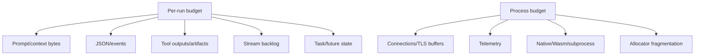

# Rust Memory, Resource Budgets, and Admission Control

> **Last researched:** 2026-08-31
> **Related:** [Scaling, capacity, and SLOs](../../operations/scaling-capacity-and-slos.md) and [queues, scheduling, and backpressure](../../operations/queues-scheduling-and-backpressure.md)

Rust avoids a garbage collector, but it does not impose a memory ceiling. An agent can still retain unlimited prompts, `Arc` graphs, channel elements, JSON trees, stream fragments, task state, connection buffers, native allocations, Wasm stores, and subprocess output until the allocator or container fails.

## Budget the whole working set



Capacity planning should use RSS and peak concurrent working set, not only Rust heap allocations. Measure at representative context sizes and failure conditions.

## Acquire before allocating

Bad flow:

1. accept request;
2. read/decompress a huge body;
3. tokenize/materialize retrieval;
4. wait for a model semaphore.

By the time admission rejects, memory is already consumed. Apply byte limits at ingress and acquire the relevant run/tenant budget before constructing large run state.

Use separate limits for:

- admitted runs;
- provider/model family;
- tenant and priority class;
- tool class and subprocess/Wasm instance;
- database pool;
- outbound host;
- CPU/blocking work;
- event queue elements and bytes;
- total context/artifact bytes.

A single global semaphore cannot express all these constraints and may create unfair head-of-line blocking.

## Make permits follow ownership

```rust
struct AdmittedRun {
    _global: tokio::sync::OwnedSemaphorePermit,
    _tenant: tokio::sync::OwnedSemaphorePermit,
    byte_budget: ByteBudget,
}
```

The permit is released by `Drop` when the owning operation ends. Do not acquire in one function and release before a spawned task actually completes. Avoid `forget` unless deliberately shrinking capacity.

Tokio semaphores are fair, including weighted `acquire_many`. A large request at the front can block smaller ones. Options:

- separate queues/pools by weight or workload class;
- cap maximum weight;
- reject oversized work before enqueue;
- schedule through a byte-aware admission broker;
- reserve capacity for control/shutdown/repair traffic.

## Bound channels in elements and bytes

`mpsc::channel(n)` provides backpressure after `n` messages, but one message can own a `Vec<u8>` of arbitrary size. Wrap send permission in a byte permit or store large payloads in an artifact store and send handles.

Unbounded channels are prohibited for untrusted or workload-driven events. Tokio documents that their implicit bound is system memory and exhaustion can abort the process.

Decide slow-consumer behavior:

- backpressure provider reads;
- coalesce token deltas;
- drop only explicitly lossy telemetry/progress;
- spool durably with a quota;
- disconnect/cancel the slow client;
- detach a durable run with a cursor.

Never silently drop tool receipts, approvals, terminal states, or effect evidence.

## Avoid retention traps

- `Arc` cycles require `Weak` or explicit teardown.
- Detached tasks retain everything they captured.
- A `JoinSet` retains completed outcomes until joined; drain it.
- `TaskTracker` frees completed task storage but does not collect outcomes for you.
- `mem::forget`, leaked boxes/connections, and deliberately forgotten permits bypass normal drop.
- large `serde_json::Value` trees multiply allocation overhead beyond wire bytes.
- `Bytes` slicing can retain a large backing buffer for one small view.
- debug/error context can retain whole requests.
- Wasmtime `Store` does not reclaim created instances until the store drops.

Rust's deterministic `Drop` is valuable cleanup, but async cleanup is not available in ordinary `Drop`. Pools, exporters, and protocols may need explicit `.close().await`.

## Bound runtime and blocking resources

Tokio has core worker threads and a separate blocking pool with a very large default maximum. Many CPU-heavy `spawn_blocking` calls can create excessive parallelism or queue indefinitely. Protect them with a measured limit or dedicated executor.

Track:

- active and queued blocking tasks;
- core task schedule latency and poll time;
- thread count;
- file descriptors/handles;
- socket states and connection pool occupancy;
- child processes and zombies;
- Wasm stores/instances and linear memory;
- database wait/acquire duration;
- allocator/RSS and container OOM events.

## Admission outcomes must be explicit

When capacity is unavailable:

| Outcome | Use when |
|---|---|
| Reject now | Interactive overload; caller can retry |
| Queue with deadline | Short bounded wait and fair capacity |
| Durable enqueue | Work may wait through process restarts |
| Degrade | Smaller context/model/tool set is an approved product behavior |
| Shed optional work | Low-value telemetry/prefetch only |

Do not accept and then let futures wait indefinitely on semaphores. Queue wait consumes the caller deadline and should be measured.

## Capacity verification

- [ ] Body/frame/decompressed/context/tool/artifact bytes are capped before allocation growth.
- [ ] Admission precedes expensive retrieval/tokenization/materialization.
- [ ] Every concurrency limit has a named resource and owner.
- [ ] Channels are bounded in elements and aggregate bytes.
- [ ] Mixed-weight fairness and head-of-line blocking are load-tested.
- [ ] Detached tasks, `Arc` cycles, completed task sets, and backing-buffer retention are inspected.
- [ ] `spawn_blocking`, processes, Wasm, FDs, and connections have separate limits.
- [ ] RSS at peak context and failure conditions stays below the container envelope.
- [ ] Cancellation and shutdown return tasks, permits, pool slots, and memory toward baseline.
- [ ] Control/repair traffic retains reserved capacity during overload.

## Selected primary sources

- [Tokio bounded channel](https://docs.rs/tokio/latest/tokio/sync/mpsc/fn.channel.html)
- [Tokio unbounded channel warning](https://docs.rs/tokio/latest/tokio/sync/mpsc/fn.unbounded_channel.html)
- [Tokio semaphore fairness](https://docs.rs/tokio/latest/tokio/sync/struct.Semaphore.html)
- [Tokio blocking work](https://docs.rs/tokio/latest/tokio/task/fn.spawn_blocking.html)
- [Tokio `TaskTracker`](https://docs.rs/tokio-util/latest/tokio_util/task/struct.TaskTracker.html)
- [Wasmtime store lifetime](https://docs.rs/wasmtime/latest/wasmtime/struct.Store.html)
