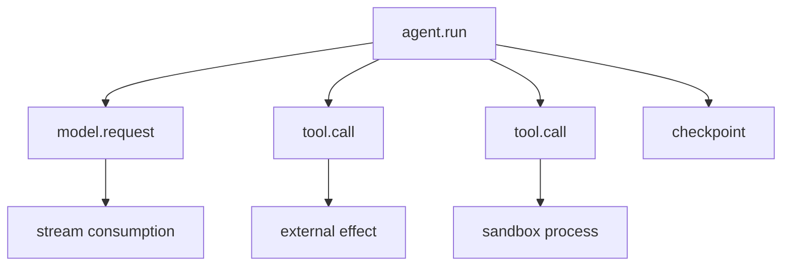

# Rust Observability, Profiling, and Concurrency Verification

> **Last researched:** 2026-08-31
> **Telemetry maturity:** OpenTelemetry Rust traces, metrics, and logs are Beta
> **Related:** [Observability and tracing](../../evaluation/observability-and-tracing.md), [trajectory evaluation](../../evaluation/trajectory-and-reliability-evaluation.md)

Agent runtime observability must connect business/run state to Tokio scheduler behavior, provider requests, tool effects, and resource saturation. Rust's tooling is strong, but ordinary thread-local span techniques can produce incorrect async traces.

## Build a stable semantic envelope

Every run/model/tool span should carry bounded, low-cardinality identifiers:

- run ID and attempt;
- tenant/account only if allowed and cardinality-controlled;
- model provider and model snapshot;
- operation kind;
- tool name/version and effect ID;
- queue/permit wait;
- timeout/cancel/retry class;
- input/output token and byte counts;
- outcome class;
- provider request ID;
- schema/prompt/tool profile versions.

Do not record prompts, secrets, raw tool arguments, full URLs with credentials, or enormous error bodies by default. Use protected artifact storage for sampled diagnostic payloads.



## Instrument async Rust correctly

`tracing::Span::enter` returns a thread-local RAII guard. Holding it across `.await` keeps the span entered while another task runs on that thread, producing incorrect parentage.

Use:

```rust
use tracing::Instrument;

let result = run_model(request)
    .instrument(tracing::info_span!(
        "model.request",
        run_id = %run_id,
        provider = provider_name,
    ))
    .await;
```

Or annotate async functions with `#[tracing::instrument]` while skipping/redacting large or sensitive arguments. Use `Span::in_scope` only around synchronous work that completes before the next `.await`.

Initialize the subscriber/export pipeline once at process startup. Flush/shut down telemetry in the supervisor's bounded shutdown phase. Never let a telemetry exporter block core task shutdown indefinitely.

## Separate application and runtime signals

| Signal | Example questions |
|---|---|
| Run/business | Are runs succeeding, cancelling, or stuck by state? |
| Provider | Latency, time-to-first-event, tokens, rate limits, request IDs |
| Tool/effect | Authorization denials, duration, retries, ambiguous outcomes |
| Queue/admission | Wait duration, depth/bytes, rejections, tenant fairness |
| Tokio | Task count, poll time, schedule latency, worker saturation |
| Process | RSS, CPU, FDs/handles, threads, allocator behavior |
| Durable/store | Lease conflicts, replay failures, history growth, pool waits |

OpenTelemetry Rust currently labels traces, metrics, and logs Beta. The specification signal may be stable while the Rust implementation remains Beta. Pin the crate family together and integration-test exporter backpressure, shutdown, and semantic changes.

## Use Tokio Console and profiles for scheduler failures

Tokio Console can expose tasks, poll durations, busy time, wakes, and synchronization resources when Tokio tracing instrumentation is enabled. Use it in controlled environments to diagnose:

- tasks that do not yield;
- wake storms/self-wakes;
- mutex/semaphore contention;
- long poll times;
- tasks that remain alive after cancellation;
- scheduler starvation.

Do not expose its diagnostic endpoint broadly in production. Instrumentation has overhead and can reveal internals.

Complement it with:

- CPU profiles for parsing, validation, crypto, compression, and local inference;
- heap/allocation profiles for prompts, JSON, event buffers, and artifacts;
- OS process/RSS and file-descriptor metrics;
- blocking-pool queue and duration;
- distributed traces for causal request/effect flow.

An async trace shows causality, not necessarily why a future spent time waiting. Scheduler/resource diagnostics show waiting, not business correctness. Use both.

## Test time and cancellation deterministically

Tokio's test utilities can start time paused and auto-advance when the runtime has no work. They affect Tokio `Instant`, not `std::time::Instant`. Use them for:

- deadlines and idle timeouts;
- retry/backoff schedules;
- lease renewal;
- cancellation races;
- stream heartbeat timers;
- shutdown drain timers.

Avoid wall-clock sleeps in unit tests. Keep real network, process, database, and OS-signal integration tests because paused time cannot prove those resources clean up.

## Use multiple concurrency verification tools

| Tool | Best evidence | Important limit |
|---|---|---|
| Ordinary async tests | State transitions and known schedules | One/few schedules |
| Property tests | Invariants across generated sequences | Model quality determines coverage |
| Loom | Permutes modeled concurrent executions | Not full C11 model; model size explodes |
| Miri | Detects classes of undefined behavior in exercised code | Slow; not a production workload simulator |
| cargo-fuzz/libFuzzer | Crashes/panics on parsers and stateful inputs | Needs meaningful targets/corpus |
| Sanitizers | Native memory/thread issues in exercised paths | Toolchain/target constraints |
| Load/fault tests | Pools, queues, latency, leaks, downstream behavior | Harder to make deterministic |

Loom's own repository documents limitations: `SeqCst` is modeled as weaker `AcqRel` in some cases, and some load-buffering executions are not explored. A passing Loom test is evidence for the model, not proof of all concurrency behavior.

High-value fuzz targets:

- provider/MCP/SSE frame parsers;
- Serde wire-to-domain conversion;
- path/URL/tool argument validators;
- state-machine event sequences;
- schema transforms;
- redaction and artifact metadata;
- retry/error classifiers.

Structure-aware fuzzing reaches deeper state than random bytes for typed events. Commit minimized regressions to the normal test suite.

## Build an agent-specific test pyramid

1. **Pure tests:** validation, error classes, state transitions, budgets.
2. **Paused-time async tests:** deadlines, cancellation, retry, shutdown.
3. **Contract tests:** provider events, SDK behavior, MCP conformance, schema goldens.
4. **Integration tests:** database, process tree, Wasm, network limits.
5. **Trajectory/eval tests:** model/tool decision quality.
6. **Load/fault tests:** slow consumer, saturation, provider failures, restart/replay.
7. **Soak tests:** task/FD/RSS/queue return to baseline.

Model eval success cannot replace runtime correctness tests, and runtime tests cannot prove agent decision quality.

## Observability and test checklist

- [ ] Async spans use `Instrument`/`#[instrument]`; no enter guard crosses `.await`.
- [ ] Identifiers and outcome fields are stable, bounded, and redacted.
- [ ] Queue wait, permit wait, first event, stream gaps, and cleanup are visible.
- [ ] Task panics/cancellations are recorded from joined handles.
- [ ] OpenTelemetry Beta upgrades are pinned and integration-tested.
- [ ] Tokio Console/profile access is protected and overhead measured.
- [ ] Paused-time tests cover deadlines, retries, and shutdown.
- [ ] Loom models the smallest critical synchronization components.
- [ ] Fuzzers cover parsers, schema boundaries, and state sequences.
- [ ] Load/soak tests prove tasks, memory, FDs, pools, and permits recover.

## Selected primary sources

- [tracing async span guidance](https://docs.rs/tracing/latest/tracing/struct.Span.html)
- [OpenTelemetry Rust status](https://opentelemetry.io/docs/languages/rust/)
- [Tokio Console](https://tokio.rs/tokio/topics/tracing-next-steps)
- [Tokio paused time](https://docs.rs/tokio/latest/tokio/time/fn.pause.html)
- [Loom](https://github.com/tokio-rs/loom)
- [Rust Fuzz Book](https://rust-fuzz.github.io/book/cargo-fuzz/tutorial.html)
