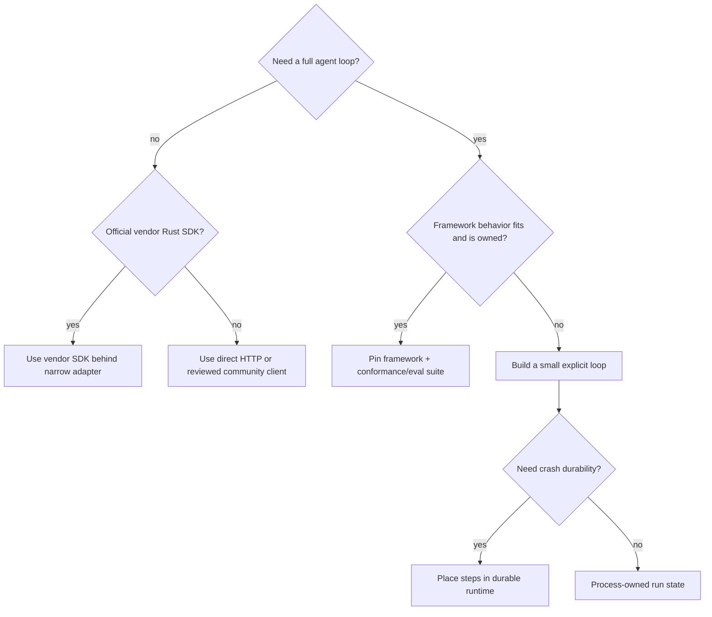
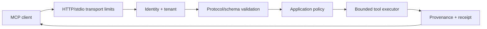

# Rust Providers, Agent Frameworks, and MCP

> **Last researched:** 2026-08-31
> **Volatility:** High; re-check before adoption
> **Related:** [Custom loop vs framework vs workflow engine](../../comparisons/custom-loop-vs-framework-vs-workflow-engine.md), [MCP](../../protocols/model-context-protocol.md)

Rust can call any model API over HTTP. The production decision is whether an official vendor SDK, a community client, a framework, or a custom adapter owns schema drift, streaming, retries, tools, telemetry, and agent-loop behavior. Those are different products and maturity claims.

## Start from the minimum layer you need

Do not adopt a framework merely to avoid writing an HTTP request. Do not build a custom loop merely to avoid learning a framework that already satisfies the exact requirements. Compare source, release policy, migration burden, and operational evidence.

## Current provider boundary

| Provider/surface | Rust position at snapshot | Correct interpretation |
|---|---|---|
| OpenAI API | OpenAI's official libraries page lists `async-openai` under **community libraries** | Useful candidate, not an OpenAI-maintained Rust SDK; direct REST is supported |
| OpenAI Agents SDK | Official SDKs listed for Python and TypeScript | No official Rust Agents SDK parity |
| AWS Bedrock Runtime | AWS SDK for Rust includes official Bedrock Runtime APIs/examples | Official service client, not a complete agent framework |
| Other REST providers | Community crates, generated clients, or reqwest adapters | Verify streaming, tool schemas, auth, retries, request IDs, and feature lag per provider |
| OpenAI-compatible endpoints | Often reachable through a shared client | “Compatible” does not guarantee Responses/tool/event/schema parity |

Keep provider types at the edge. Normalize into application-owned request, event, usage, error, and receipt types so a provider upgrade does not become a durable-state migration.

## Rig: useful community framework, evolving contract

Rig's official repository describes a Rust library for modular LLM applications with many provider and vector-store integrations, tool calling, streaming, and agent workflows. Its architecture uses provider-agnostic traits such as completion, embedding, vector index, and tool abstractions.

At the snapshot, Rig is a serious community candidate but not a vendor SDK:

- the repository explicitly warns that future updates will contain breaking changes;
- 0.41 split portable `rig-core` contracts from the `rig-agent` runtime behind a `rig` facade;
- provider support is broad but capability parity is provider-specific;
- its interactive coding-agent roadmap still tracks lifecycle, nested execution, cancellation, resume, hosted tools, and code-mode work;
- production-user lists are useful evidence of adoption, not proof for a particular failure mode or workload.

Before adoption, pin and test:

- exact facade/core/agent crate versions and feature flags;
- provider request/event coverage;
- tool argument/result types and failure semantics;
- streaming versus non-streaming loop parity;
- cancellation and timeout propagation;
- memory/context compaction behavior;
- hooks and telemetry cardinality/redaction;
- provider cassette/live integration tests;
- migration of persisted application-owned state.

Do not persist Rig's private runtime state as the canonical run record.

## MCP Rust: stable crate, fast-changing maturity label

The official `modelcontextprotocol/rust-sdk` publishes `rmcp` 3.0.x stable releases for the 2026-07-28 protocol. Its repository roadmap says all SEP-1730 Tier 1 requirements are met and reports full dated conformance. However, the 2026-07-28 GA announcement originally described Rust support as beta, while the roadmap presents a later self-assessment.

The safe statement at this research date is:

- `rmcp` 3.0.1 is a stable, non-prerelease official SDK release;
- the repository reports dated conformance and says Tier 1 requirements are met;
- the public announcement/registry wording changed during the release window;
- verify the current approved SDK tier page before making a contractual “Tier 1” claim.

This distinguishes package stability from ecosystem tier approval.

The 2026-07-28 protocol itself materially changed:

- retired initialization/session-ID transport state;
- introduced optional `server/discover`;
- added stateless request metadata and standard headers;
- replaced server-initiated flows with multi-round-trip requests;
- moved Tasks to an extension;
- deprecated roots, sampling, logging, and legacy HTTP+SSE with migration windows;
- hardened authorization and issuer/credential binding.

MCP conformance proves wire behavior, not application authorization, tool safety, tenant isolation, sandboxing, result truthfulness, or resource budgets.

## Build MCP servers as ordinary secure services

For Streamable HTTP:

- validate protocol headers and version;
- bind authenticated subject, resource, and tenant;
- isolate credentials by issuer/resource;
- enforce method/tool-specific rate and concurrency limits;
- cap request/response/event bytes;
- do not trust client-provided identity metadata as authentication;
- maintain application state through explicit handles if required;
- verify cache scope/TTL before sharing discovery results;
- test load balancer/stateless behavior.

For stdio:

- treat the launched server as a local child process with explicit environment;
- never mix protocol frames with logs on stdout;
- limit stderr and process lifetime;
- do not assume local means trusted.

## A framework adoption scorecard

| Dimension | Evidence required |
|---|---|
| Release compatibility | SemVer/versioning policy and migration notes |
| Provider coverage | Contract tests for exact models/events/tools used |
| Cancellation | Tests at model, stream, tool, hook, and shutdown boundaries |
| State | Application-owned export/checkpoint contract |
| Durability | Explicit engine integration, not “async task” marketing |
| Errors/retries | Typed categories and visible retry ownership |
| Security | Tool authorization, redaction, sandbox boundaries |
| Observability | Stable semantic fields, bounded cardinality, exporter lifecycle |
| Operations | Load, shutdown, leak, and upgrade tests |
| Escape hatch | Ability to use direct provider calls without forking the world |

## Refresh triggers

Re-check when:

- OpenAI or another vendor adds an official Rust SDK/Agents SDK;
- Rig publishes a stable compatibility promise or major run-loop rewrite;
- `rmcp` tier registry/status or MCP protocol revision changes;
- the selected provider adds new response event types or structured-output rules;
- a community client changes ownership, release cadence, or security posture.

## Selected primary sources

- [Official OpenAI SDK and community-library list](https://developers.openai.com/api/docs/libraries)
- [AWS SDK for Rust](https://docs.aws.amazon.com/sdk-for-rust/latest/dg/welcome.html)
- [AWS Bedrock Runtime Rust examples](https://docs.aws.amazon.com/sdk-for-rust/latest/dg/aws-sdk-rust-developer-guide.pdf)
- [Rig repository](https://github.com/0xplaygrounds/rig)
- [Rig 0.41 architecture change](https://github.com/0xPlaygrounds/rig/discussions/2225)
- [Rig interactive-agent roadmap](https://github.com/0xPlaygrounds/rig/issues/2118)
- [MCP Rust SDK releases](https://github.com/modelcontextprotocol/rust-sdk/releases)
- [MCP Rust SDK roadmap](https://github.com/modelcontextprotocol/rust-sdk/blob/main/ROADMAP.md)
- [MCP 2026-07-28 release](https://blog.modelcontextprotocol.io/posts/2026-07-28/)
- [MCP SDK tier definitions](https://modelcontextprotocol.io/community/sdk-tiers)
